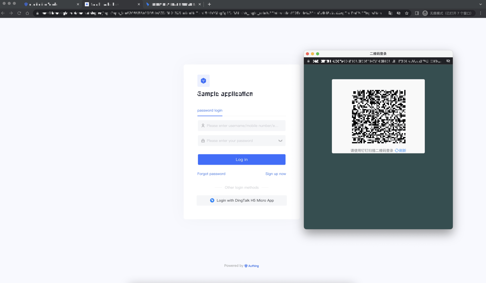
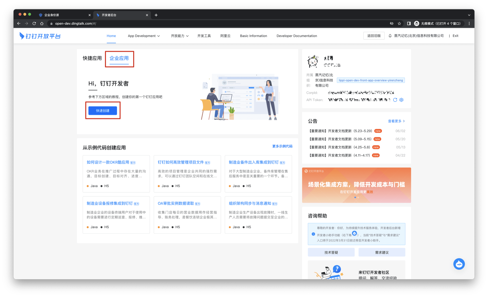
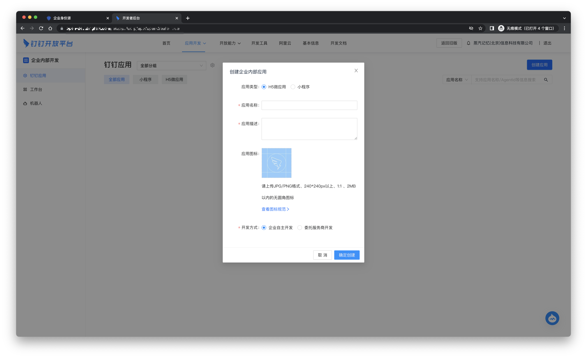
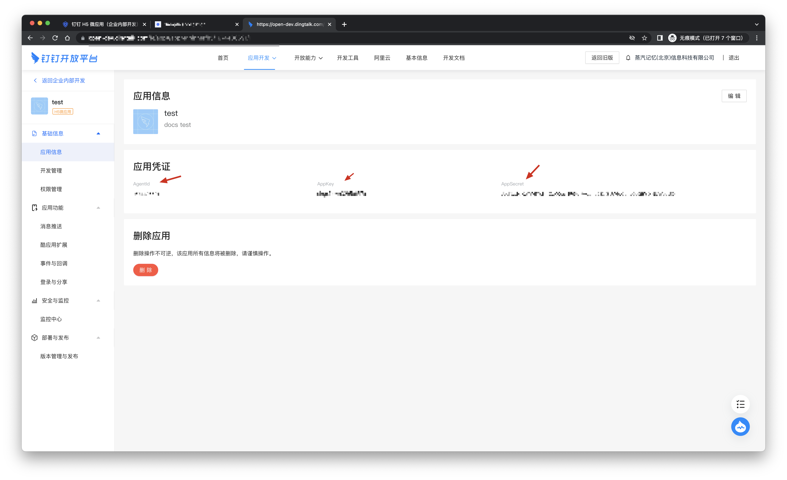
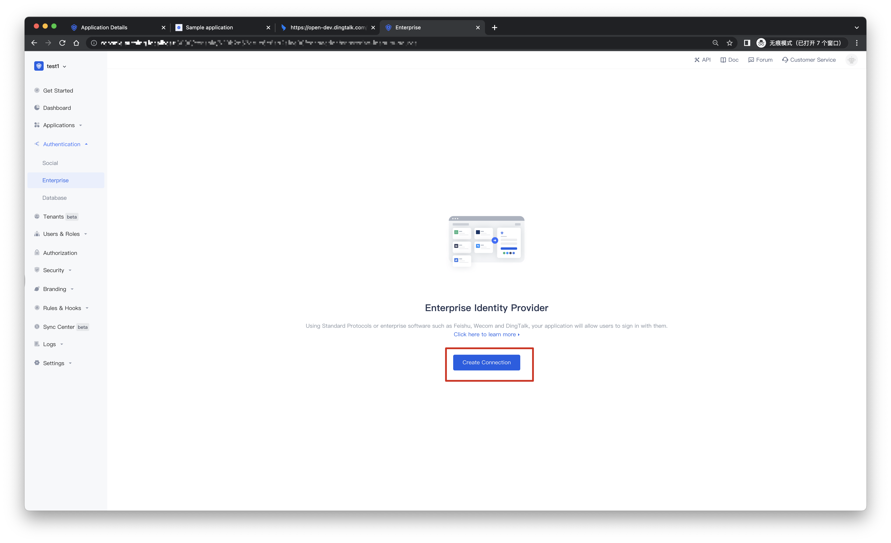
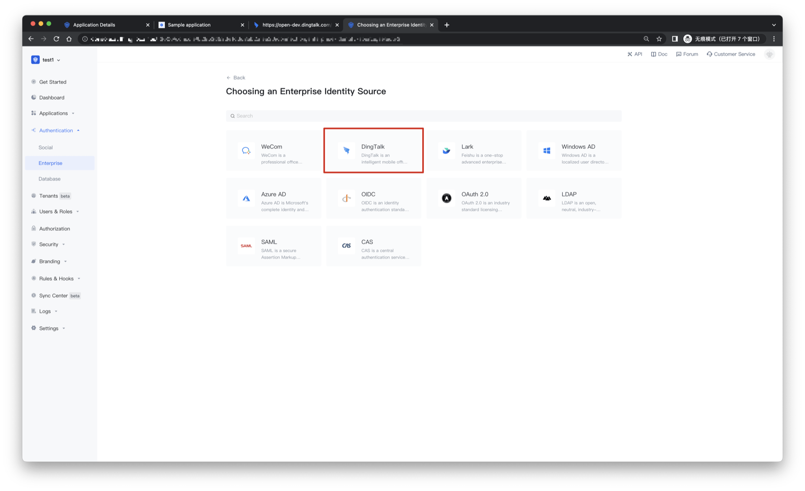
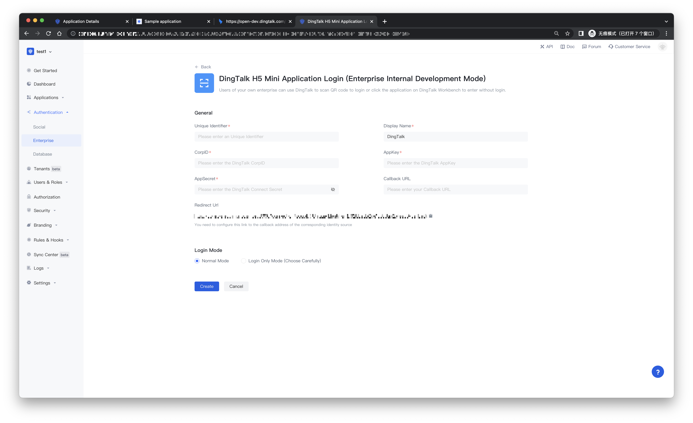
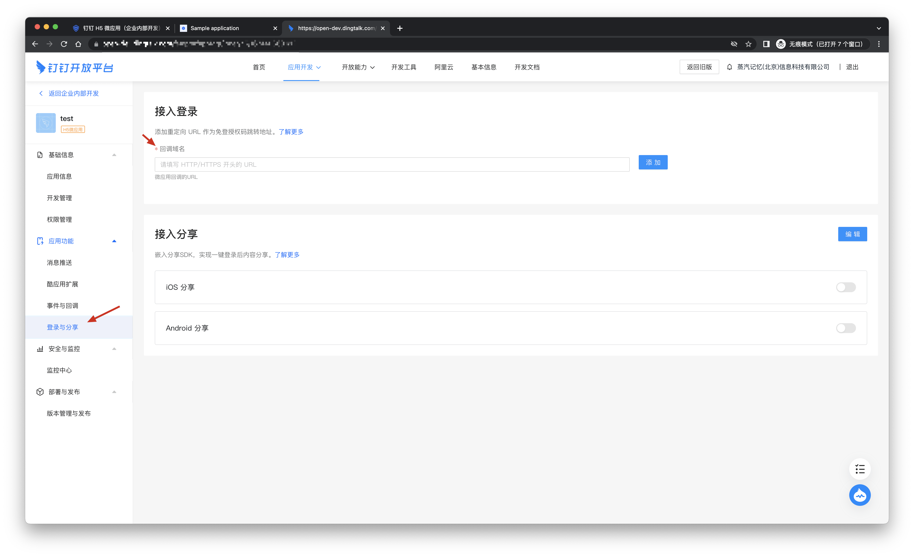
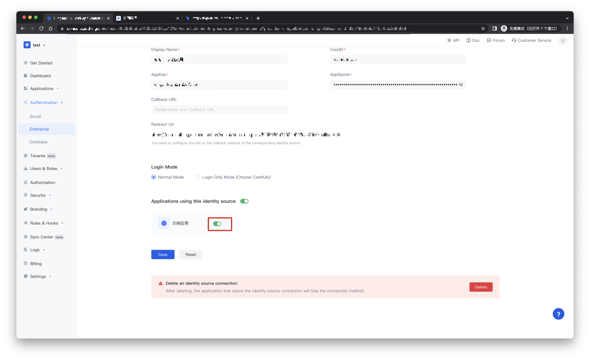
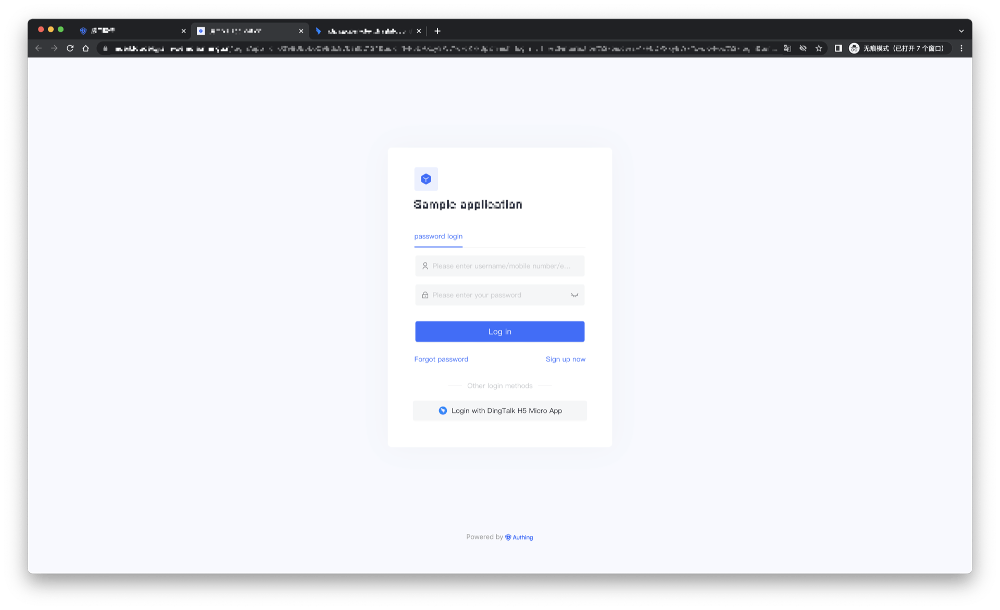

# DingTalk H5 micro application (internal development) enterprise login

<LastUpdated/>

## Scene introduction

- **Overview**: DingTalk H5 micro-app (internal development) enterprise login is a secure login for users to third-party applications or websites using DingTalk H5 micro-app (internal development) as the identity source. Configure and enable the enterprise login of DingTalk H5 micro application (internal development) in {{$localeConfig.brandName}}, you can quickly obtain DingTalk H5 micro application (internal enterprise development) through {{$localeConfig.brandName}} development) basic open information and help users achieve password-free login function.
- **Application Scenario**: Create a website application
- **End User Preview**:

## Precautions:

- If you do not have an account on DingTalk Open Platform, please go to [DingTalk Open Platform](https://open-dev.dingtalk.com/#/) to register an account.
- If you do not have a {{$localeConfig.brandName}} console account, please go to the [{{$localeConfig.brandName}} console](https://authing.cn/) to register a developer account.

## Step 1: Create a website application in the DingTalk Open Platform Developer Console

- Open the [DingTalk Open Platform](https://open-dev.dingtalk.com/#/), click on the enterprise application to create it quickly.

- Create an internal enterprise application and record the AgentId, AppKey, and AppSecret.

- In login and sharing, fill in the callback domain name as：https://core.authing.cn/connection/social/dingtalk/:userPoolId/callback

> Please replace :userPoolId with your user pool ID

## Step 2: Configure DingTalk H5 micro-apps in the {{$localeConfig.brandName}} console (internal development)

2.1 Please click the "Create Connection" button on the "Enterprise" page of the {{$localeConfig.brandName}} console to enter the "Choosing an Enterprise Identity Source" page

2.2 Please go to the "Enterprise" - "Choosing an Enterprise Identity Source" page of the {{$localeConfig.brandName}} console, click the "DingTalk" identity source button to enter the "DingTalk H5 Micro Application (Internal Development) Login Mode" page.

2.3 Please configure the relevant field information on the "Enterprise" - "DingTalk H5 Micro Application (Internal Development)" page of the {{$localeConfig.brandName}} console.

| Field/function    | describe                                                     |
| ----- | ------------ | ------------------------------------------------------------ |
| Unique Identifier | a. The unique ID consists of lowercase letters, numbers, and -, and the length is less than 32 bits. b. This is the unique identifier of this connection and cannot be modified after setting. |
| Display Name | This name will be displayed on buttons on the end user's login screen. |
| Enterprise ID | Enterprise ID, which needs to be obtained on the DingTalk open platform. |
| AppKey | DingTalk number, which needs to be obtained on the DingTalk open platform. |
| AppSecret | DingTalk key, which needs to be obtained on the DingTalk open platform. |
| Callback URL | You can fill in your business callback address. After the user completes the login, the browser will jump to this address. |
| Scopes | By default, {{$localeConfig.brandName}} will only apply to the user for authorization of basic user information (such as avatar, nickname, etc.), if you need more advanced permissions, you can check the corresponding options. |
| Callback address | Dingding valid redirect URI. This URL needs to be configured on the DingTalk open platform. |
| Login Mode | After "Login Only Mode" is enabled, you can only log in to an existing account and cannot create a new account. Please choose carefully. |
| Account Identity Association | When "Account Identity Association" is not enabled, a new user is created by default when a user logs in through an identity source. After enabling "Account Identity Association", you can allow users to log in to existing accounts directly through "Field Matching" or "Asking for Binding". a. Association method: select |

After the configuration is complete, click the "Create" or "Save" button to complete the creation.

After creating the DingTalk identity source on the {{$localeConfig.brandName}} console, you need to configure the callback address to the callback domain name on the DingTalk open platform.

## Step 3: Development Access

- **Recommended development access method**: use the hosted login page

- **Description of advantages and disadvantages**: Simple operation and maintenance, and {{$localeConfig.brandName}} is responsible for operation and maintenance. Each user pool has an independent second-level domain name; if you need to embed it into your application, you need to use the pop-up mode to log in, that is: after clicking the login button, a window will pop up with the content of {{$localeConfig.brandName}} hosting login page, or redirect the browser to the login page hosted by {{$localeConfig.brandName}}.

- **详细接入方法**：

- **Detailed access method**:

3.1 Create an app in the {{$localeConfig.brandName}} console. For details, see: [How to create an app in {{$localeConfig.brandName}}](https://docs.authing.cn/v2/guides/app/create-app.html)

3.2 On the created DingTalk H5 micro-app (internal development) identity source connection details page, open and associate an application created in the {{$localeConfig.brandName}} console

3.3 Experience the third-party login of DingTalk H5 micro-app (internal development) on the login page

