# Feishu Custom App

<LastUpdated/>

## Introduction

- **Overview**: Feishu Custom App is suitable for your own enterprise PC website sweep login and Feishu Workbench no-login scenario. For enterprises to achieve secure login to third-party applications or websites with Feishu as the identity source. In {{$localeconfig.brandName}}, you can configure and turn on the enterprise login of Feishu Enterprise custom Application to quickly get the basic open information of Feishu and help users to achieve password-free login through {{$localeconfig.brandName}}.
- **Application Scenario**: PC website, Feishu workbench, mobile application
- **End-user preview image**.

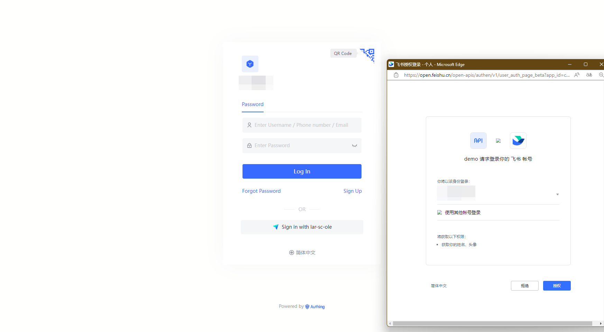

## Caution.

- If you do not have a Feishu developer account, please go to [Feishu Open Platform](https://open.feishu.cn/app) to register first.
- If you do not have a {{$localeconfig.brandName}} Console account, please go to [{{$localeconfig.brandName}} Console](https://authing.cn/) to register your developer account first.

## Step 1: Create Enterprise custom Application

Go to [Feishu Developer Console](https://open.feishu.cn/app), click **Create Enterprise custom App**, fill in the appropriate content and create the app.

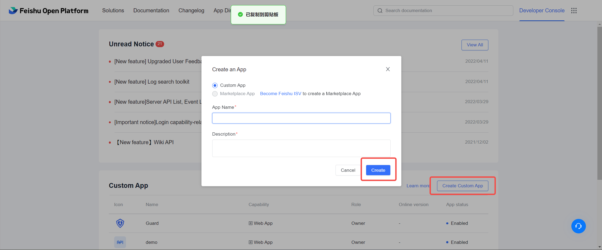

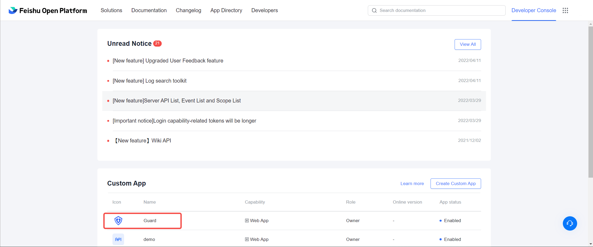

Go to the created app, click **Application Features**, select **Web App** and turn on the **Enable web app** feature.
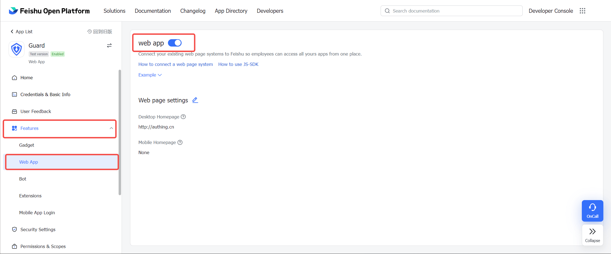

Click **Credentials and Basic Info** to view the App ID and App Secret and open the {{localeconfig.brandName}} console.

If you need **Mobile App Login**, click **Features**, select **Mobile App Login**, turn on the **Feishu Login** feature, and in the Feishu login configuration below, user login protocol option **OAuth 2.0**, and fill in the mobile app configuration.

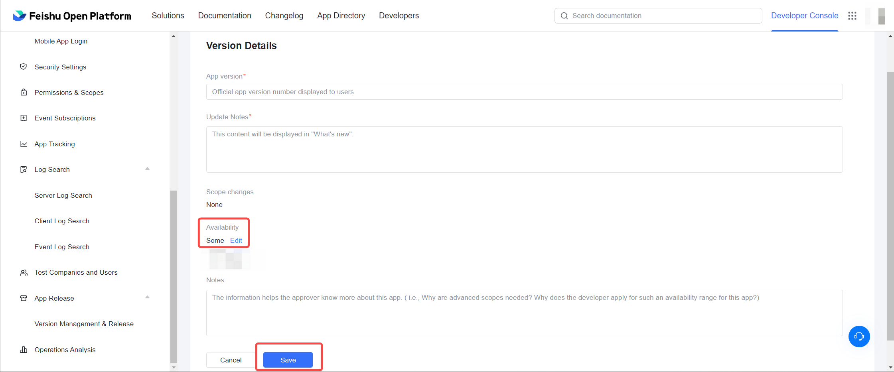

In order to normally obtain the user information of the feishu and complete the authentication process, you need to complete **Permissions & Scopes** page, search the following permissions, and open:

- Read contacts as app
- Get basic user information
- Get user ID through mobile number or email
- Get user mobile number
- Get user mailbox information
- Query the user's enterprise mailbox

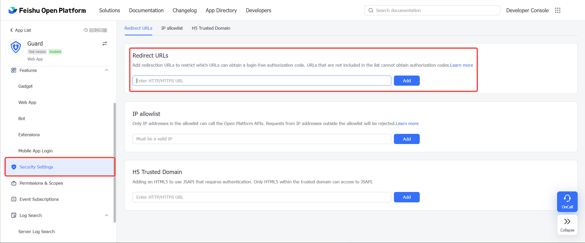

##Step 2: configure the feishu custom application on the {{$localeconfig.brandName}} console

2.1 please click the "create enterprise identity source" button on the "enterprise identity source" page of the {{$localeconfig.brandName}} console to enter the "select enterprise identity source" page and click the "feishu" identity source button

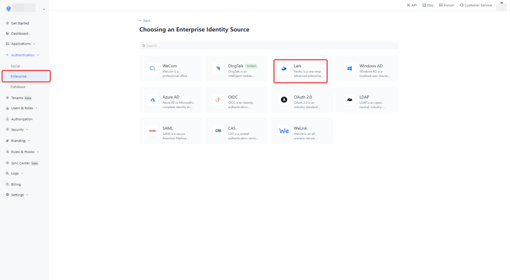

2.2 select "feishu custom app".

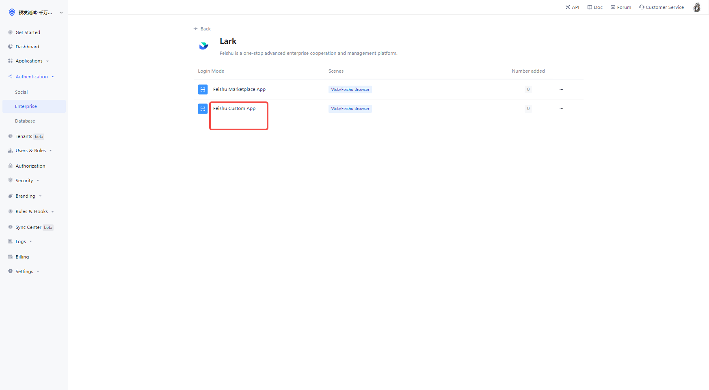

2.3 please fill in the relevant field information on the "feishu custom app" page.

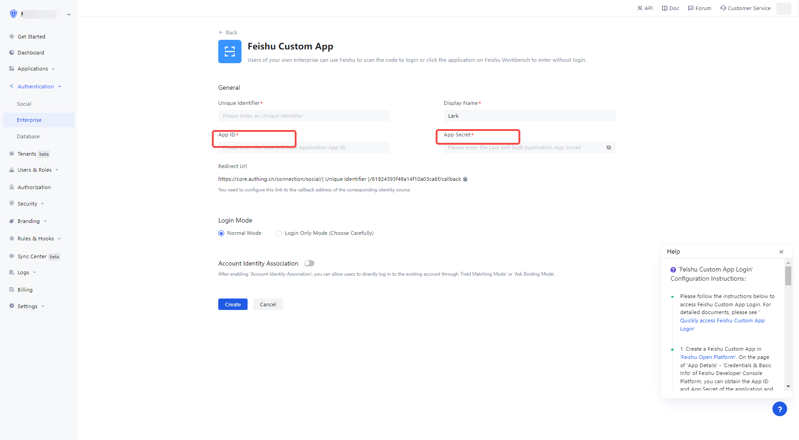

| Field                        | description                                                                                                                                                                                                                                                                             |
| ---------------------------- | --------------------------------------------------------------------------------------------------------------------------------------------------------------------------------------------------------------------------------------------------------------------------------------- |
| Unique identifier            | a. the unique identifier is composed of lowercase letters, numbers, -, and the length is less than 32 bits< Br />b. this is the unique identifier of this connection and cannot be modified after setting                                                                               |
| Display name                 | this name will be displayed on the button of the terminal user's login interface                                                                                                                                                                                                        |
| App ID                       | The App ID and App Secret can be found in the backend of the FeiShu app, under **Credentials and Basic Info**.                                                                                                                                                                   | App Secret |
| App Secret                   | The App ID and App Secret can be found in the backend of the Feishu application, **Credentials and Basic Info**.                                                                                                                                                                 | Login Mode |
| Login Mode                   | After you turn on "Login Only Mode", you can only login to your existing account, you cannot create a new account.                                                                                                                                                                      | Sign In Mode |
| Account Identity Association | When "Account Identity Association" is not enabled, users can create new users by default when they log in through the identity source. If "Account Identity Association" is enabled, you can allow users to log in to existing accounts directly by "Field Matching" or "Ask to Bind". | App ID |

App ID and App Secret, fill in the App ID and App Secret in **Credentials and Basic Info** in the backend of Feishu app.

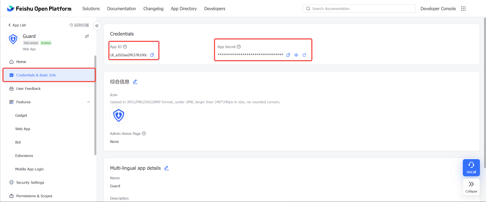

2.4 Once the configuration is done, click the "Create" or "Save" button to complete the creation.

In the Feishu Open Platform, open the app management page, select **Security Settings**, add the {{$localeconfig.brandName}} backend callback address to the **Redirect URL**

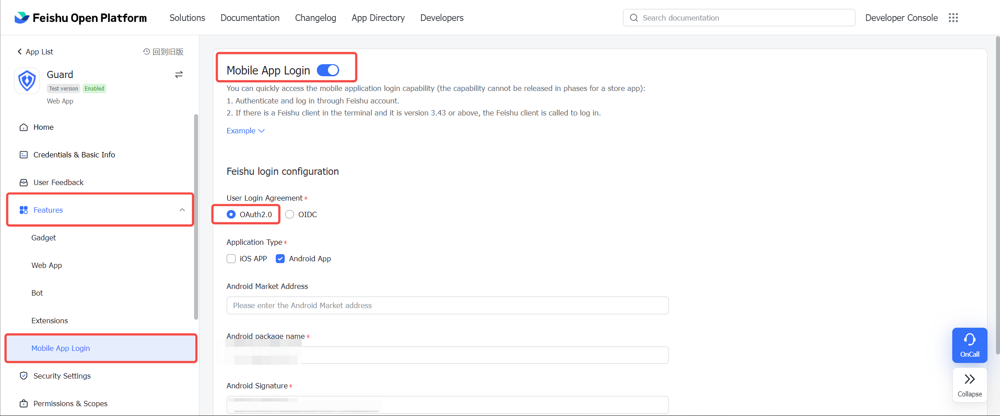

## Step 3: Go live with Feishu's custom app in Feishu Open Platform

3.1 In the Feishu Open Platform, select app publishing, and in **Version Management & Release**, click **Create a version**, and publish the created app

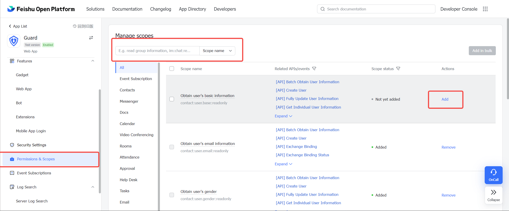

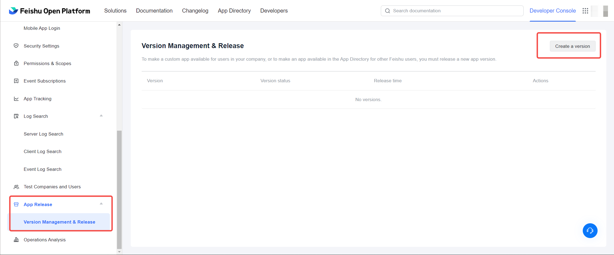

3.2 After submitting the application, your business administrator will review it and the review result will be sent to you via FeiBook and developer backend. For more details, please refer to [Feishu Documentation - Developing Enterprise custom Applications](https://open.feishu.cn/document/uQjL04CN/ukzM04SOzQjL5MDN)

## Step 3: Development Access

- **Recommended development access method**: Use hosted login page

- **Description of advantages and disadvantages**: Simple operation and maintenance, by {{$localeconfig.brandName}} is responsible for operation and maintenance. Each user pool has a separate secondary domain; if you need to embed it in your application, you need to use the popup mode login, i.e.: after clicking the login button, a window will pop up with {{$localeconfig.brandName}} hosted login page, or redirect the browser to {{$localeConfig.brandName }} to the hosted login page.

- **Detailed access method**.

  3.1 Create an app in the {{$localeconfig.brandName}} console, for details see: [How to create an app in {{$localeconfig.brandName}}](https://docs.authing.cn/v2/guides/app/create-app.html)

  3.2 In the created FeiShu enterprise app identity source connection details page, open and associate an app created in the {{$localeconfig.brandName}} console

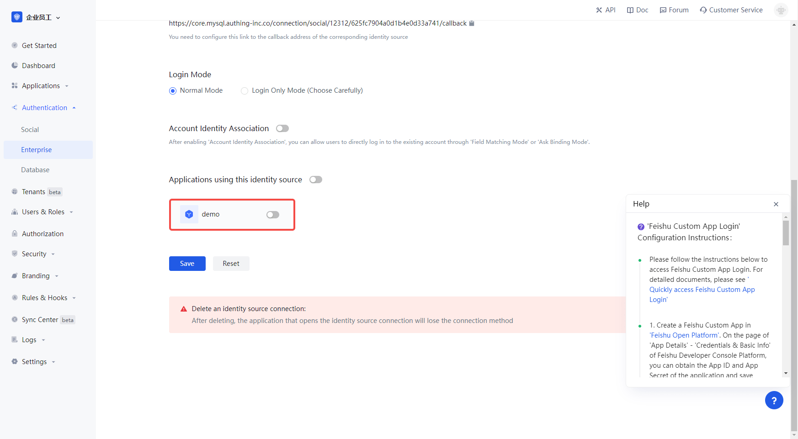

3.3 Experience the Feishu enterprise built app on the login page Third-party login

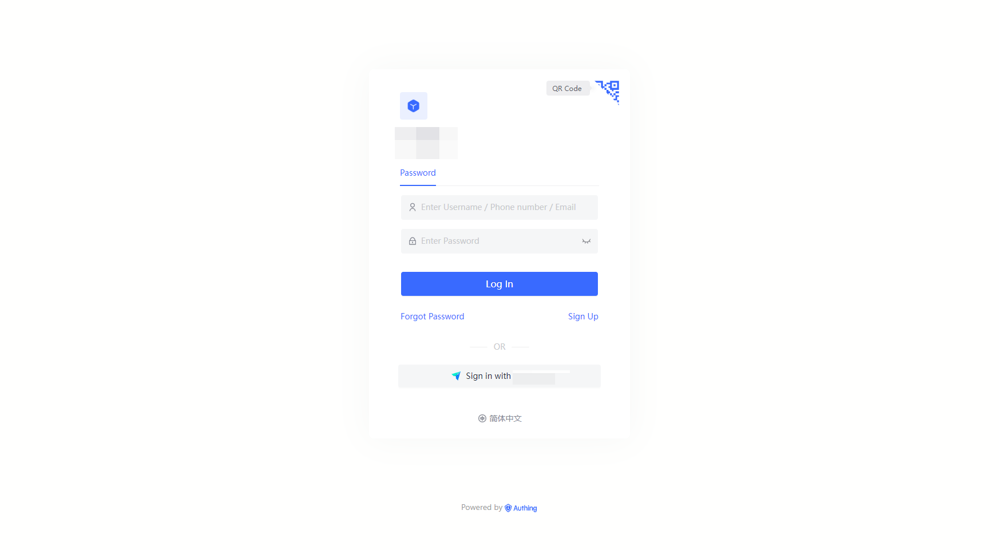
