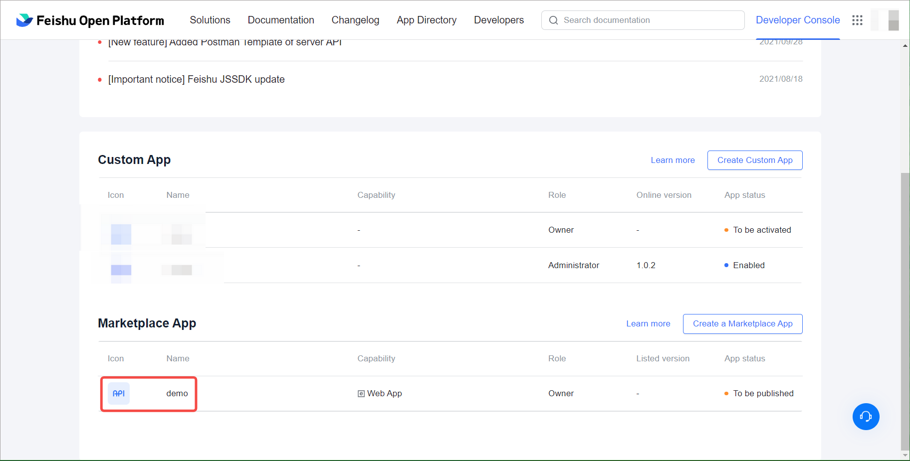
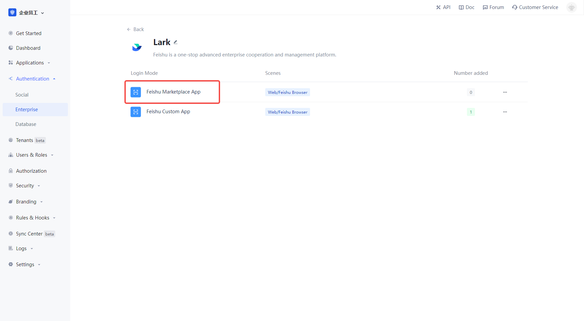
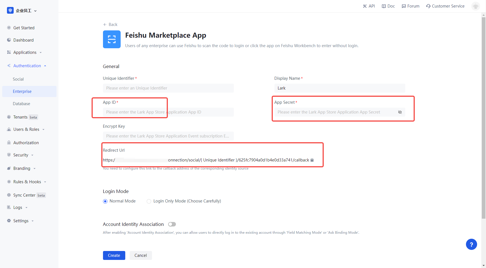
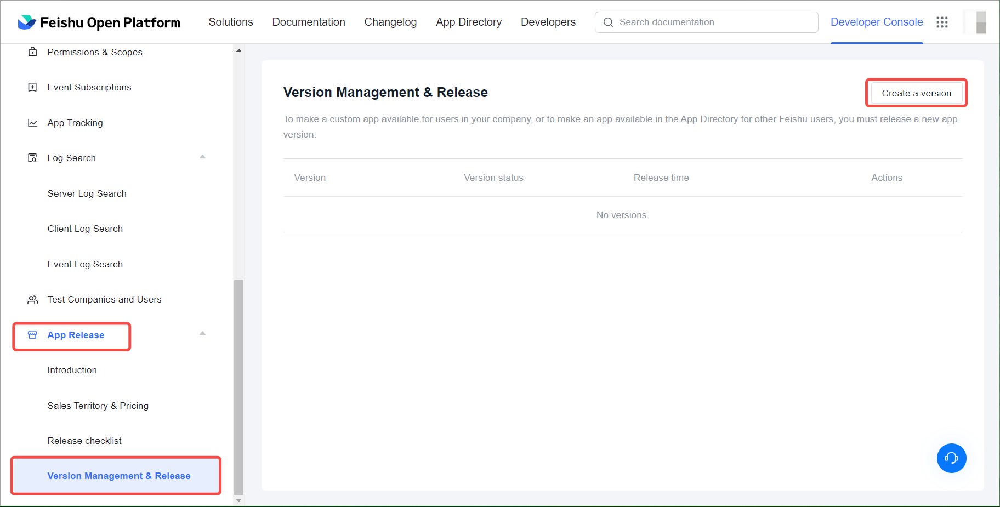

# Feishu Marketplace App

<LastUpdated/>

## Introduction

- **Overview**: Feishu Marketplace App is suitable for your own enterprise PC website sweep login and Feishu Workbench no-login scenario. For enterprises to achieve secure login to third-party applications or websites with Feishu as the identity source. Configure and enable the enterprise login of Feishu enterprise application in {{$localeConfig.brandName}}, you can quickly get the basic open information of Feishu and help users to achieve the no-sign-in function by {{$localeConfig.brandName}}.
- **Application Scenario**: PC website, Feishu workbench, mobile application
- **End-user preview image**.

## Caution.

- If you do not have a Feishu developer account, please go to [Feishu Open Platform](https://open.feishu.cn/app) to register first.
- If you do not have a {{$localeConfig.brandName}} console account, please go to [{{$localeConfig.brandName}} Console](https://authing.cn/) to register for a developer account first.

## Step 1: Create an enterprise business app

Go to [Feishu Developer Console](https://open.feishu.cn/app), click **Create Enterprise Enterprise App**, fill in the appropriate content and create the app.

Go to the created app, click **Application Features**, select **Web Pages** and turn on the **Enable Web Pages** feature.

Click **Credentials and Basic Info** to view the App ID and App Secret and open the {{$localeConfig.brandName}} console.

If you need **access to mobile app login capabilities**, click **App Features**, select **Mobile App Login**, turn on the **FlyBook Login** feature, and in the FlyBook login configuration below, user login protocol option ** OAuth 2.0**, and fill in the mobile app configuration.

In order to get the user information of Feishu properly and complete the authentication process, you need to complete the **Permissions Configuration** on the **Permissions Management** page, search for the following permissions, and turn on.

- Read address book as an application

- Get the basic information of users

- Get user ID by cell phone number or email

- Get the user's cell phone number

- Get user's mailbox information

- Query the user's corporate email address

## Step 2: Configure the FeiBook Enterprise app in the {{$localeConfig.brandName}} console

2.1 On the "Enterprise Identity Source" page of {{$localeConfig.brandName}} Console, click the "Create Enterprise Identity Source" button, go to the "Select Enterprise Identity Source" page, and click the "Feishu" identity source button.

2.2 Select "Feishu Enterprise Enterprise App".

2.3 Please fill in the relevant field information on the "Feishu Enterprise Apps" page.

| Field                        | description                                                                                                                                                                                                                                                                             |
| ---------------------------- | --------------------------------------------------------------------------------------------------------------------------------------------------------------------------------------------------------------------------------------------------------------------------------------- |
| Unique identifier            | a. the unique identifier is composed of lowercase letters, numbers, -, and the length is less than 32 bits< Br />b. this is the unique identifier of this connection and cannot be modified after setting                                                                               |
| Display name                 | this name will be displayed on the button of the terminal user's login interface.                                                                                                                                                                                                       |
| App ID                       | The App ID and App Secret can be found in the backend of the FeiShu app, under **Credentials and Basic Info**.                                                                                                                                                                   | App Secret |
| App Secret                   | The App ID and App Secret can be found in the backend of the Feishu application, **Credentials and Basic Info**.                                                                                                                                                                 | Login Mode |
| Login Mode                   | After you turn on "Login Only Mode", you can only login to your existing account, you cannot create a new account.                                                                                                                                                                      | Sign In Mode |
| Account Identity Association | When "Account Identity Association" is not enabled, users can create new users by default when they log in through the identity source. If "Account Identity Association" is enabled, you can allow users to log in to existing accounts directly by "Field Matching" or "Ask to Bind". | App ID |

App ID and App Secret, fill in the App ID and App Secret in **Credentials and Basic Info** in the backend of Feishu app.

2.4 After the configuration is finished, click "Create" or "Save" button to complete the creation.

In Feishu Open Platform, open the application management page, select **Security Settings**, add the callback address of {{$localeConfig.brandName}} backend to **Redirect URL**.

## Step 3: Configure event subscriptions in Feishu backend

Configure event subscriptions in the event subscriptions page of the FeiBook application details.

Determine whether to enable Encrypt Key, if you have a high security requirement for the message content, you can encrypt the message by agreeing the key with Feishu Open Platform; Feishu Open Platform will use the key to encrypt the message content symmetrically when pushing events, please refer to Feishu documentation - Overview of subscribing to events (opens new window) for details. If you don't need to enable it, you can skip this step; if you need it, please continue reading the following steps.

Copy the Encrypt Key and fill in the {{$localeConfig.brandName}} console's configuration form.

Set the Request URL URL to.

https://core.authing.cn/connection/social/{unique_id }/{USERPOOL_ID}/events

You need to replace the {unique } with the unique ID from the identity source you are creating in {{$localeConfig.brandName}} and the USERPOOL_ID with your user pool ID.

Finally, click Save.

## Step 3: Go live with Feishu Marketplace App in Feishu backend

3.1 In Feishu Open Platform, select app publishing, in **Version Management & Release**, click **Create a version**, and publish the created app

3.2 After submitting the application, your business administrator will review it and the review result will be sent to you via FeiBook and developer backend. For more details, please refer to [Feishu Documentation - Developing Enterprise Corporate Applications](https://open.feishu.cn/document/uQjL04CN/ukzM04SOzQjL5MDN)

## Step 3: Development Access

- **Recommended development access method**: Use hosted login page

- **Description of advantages and disadvantages**: Simple operation and maintenance, by {{$localeConfig.brandName}} is responsible for operation and maintenance. Each user pool has a separate secondary domain; if you need to embed it in your application, you need to use the popup mode login, i.e.: after clicking the login button, a window will pop up with {{$localeConfig.brandName}} hosted login page, or redirect the browser to {{$localeConfig.brandName }} to the hosted login page.

- **Detailed access method**.

  3.1 Create an app in the {{$localeConfig.brandName}} console, for details see: [How to create an app in {{$localeConfig.brandName}}](https://docs.authing.cn/v2/guides/app/create-app.html)

  3.2 In the created Feishu Marketplace App identity source connection details page, open and associate an app created in {{$localeConfig.brandName}} console

3.3 Experience the Feishu Marketplace App third-party login on the login page

