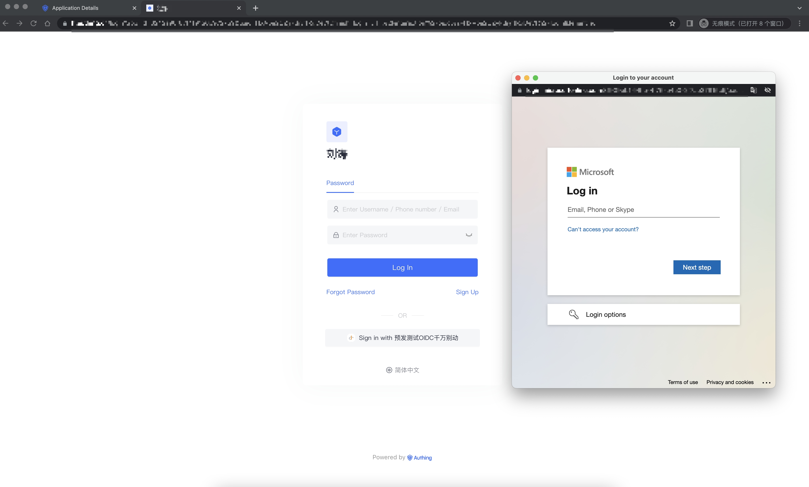
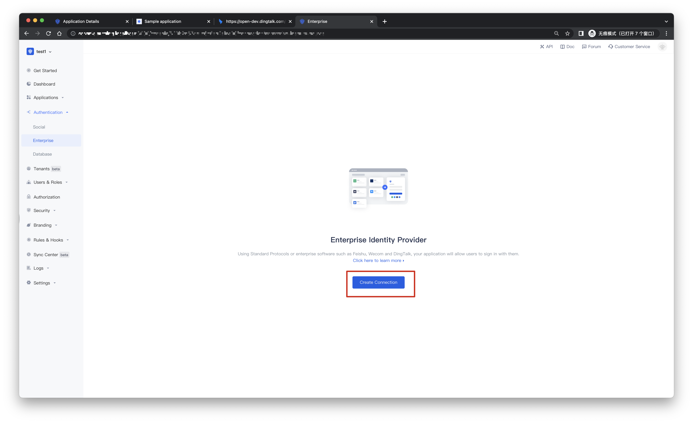
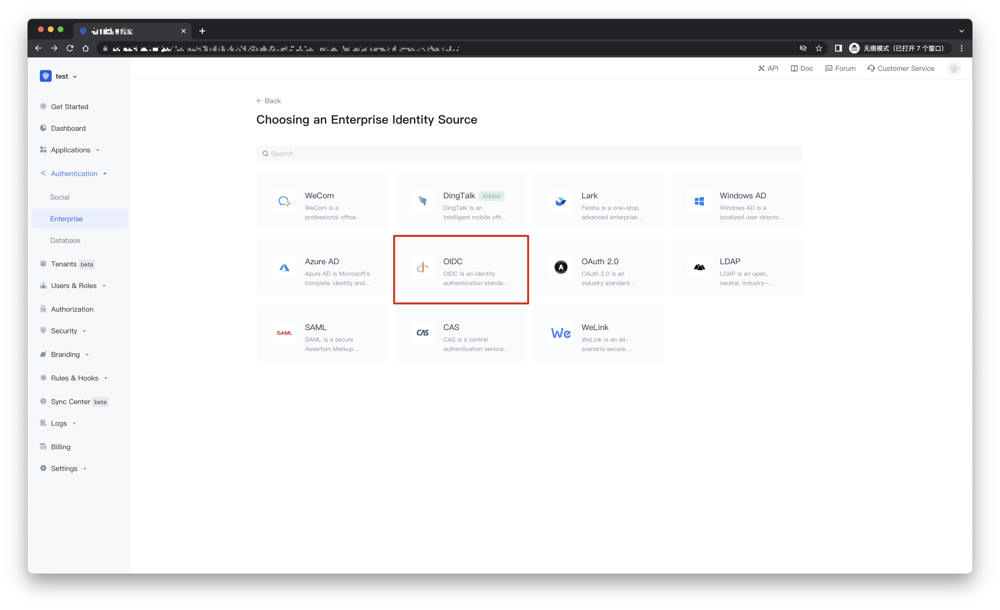
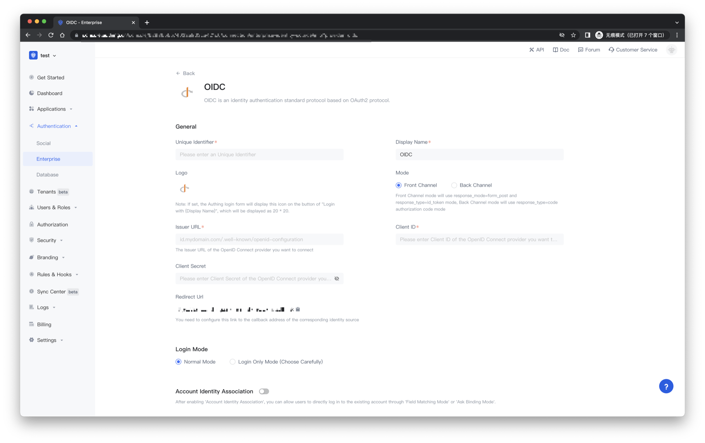
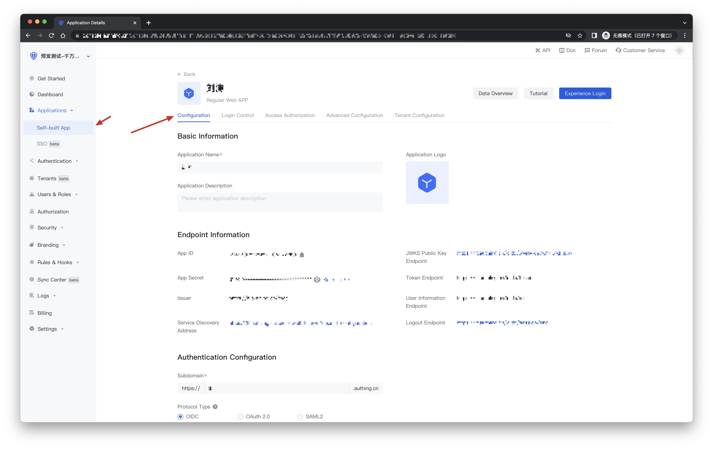
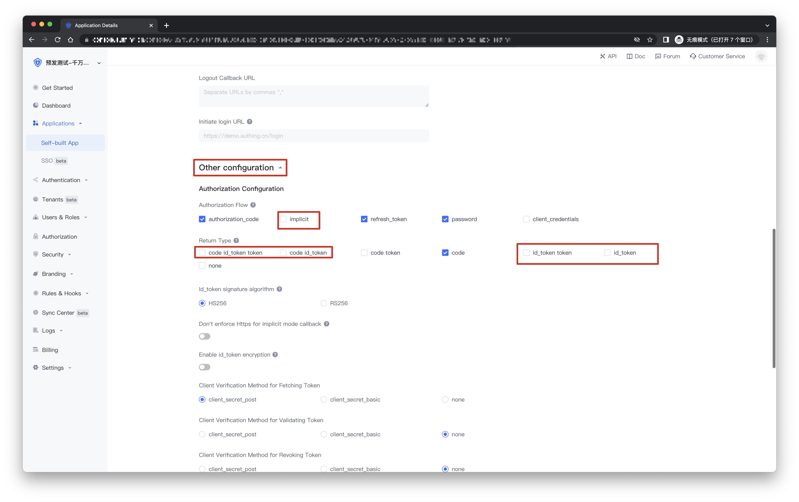
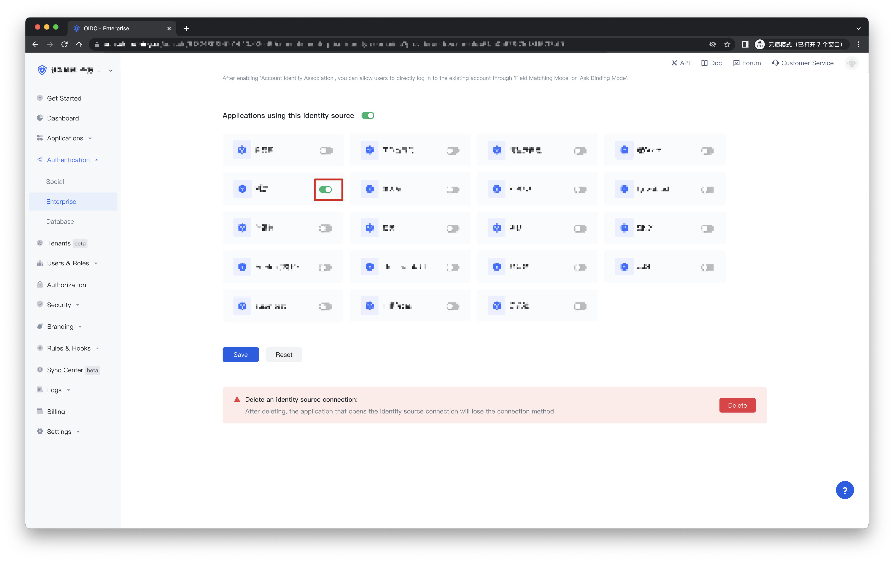
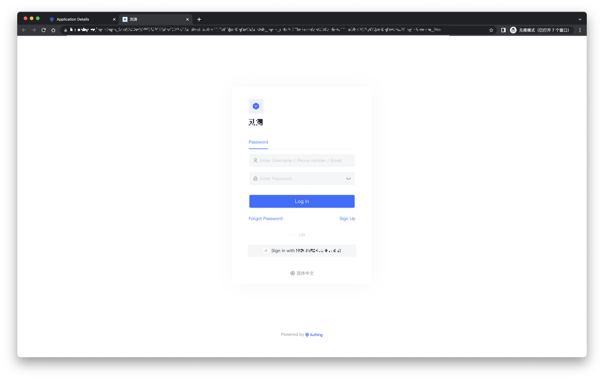

# OIDC Enterprise Login

<LastUpdated/>

## Scene introduction

- **Overview**: The process of creating OIDC Client may be different for different OIDC identity service providers. You need to refer to the documentation guidelines of your OIDC identity service provider to create OIDC Client. OIDC is an authentication standard protocol based on the OAuth2 protocol.
- **Application Scenario**: Create OIDC Client
- **End User Preview**:

## Precautions:

- If you do not have a {{$localeConfig.brandName}} console account, please go to the [{{$localeConfig.brandName}} console](https://authing.cn/) to register a developer account.

## Step 1: Create an OIDC Client in the OIDC Identity Service Provider

The process of creating OIDC Client may be different for different OIDC identity service providers. You need to refer to the documentation guidelines of your OIDC identity service provider to create OIDC Client.

You need to configure the callback link of OIDC Client in the appropriate place. The callback link specified when the OIDC client initiates the login request must match the callback link configured at the OIDC Identity Provider, otherwise an error will be reported.

The OIDC callback url for Authing is：https://core.authing.cn/connections/oidc/callback。

## Step 2：Configure OIDC Client in {{$localeConfig.brandName}} console

2.1 Please click the "Create Connection" button on the "Enterprise" page of the {{$localeConfig.brandName}} console to enter the "Choosing an Enterprise Identity Source" page

2.2 Please go to the "Enterprise" - "Choosing an Enterprise Identity Source" page of the {{$localeConfig.brandName}} console, click the "OIDC" identity source button to enter the "OIDC Login Mode" page.

2.3 Please configure the relevant field information on the "Enterprise" - "OIDC" page of the {{$localeConfig.brandName}} console.

| Field/function    | Describe                                                     |
| ----- | ------------ | ------------------------------------------------------------ |
| Unique Identifier | a. Unique identifier consists of lowercase letters, numbers, -, and the length is less than 32 bits. b. This is the unique identifier of this connection and cannot be modified after setting. |
| Display Name | This name will be displayed on the button on the end user's login screen. |
| App Logo | The {{$localeConfig.brandName}} login form will display this icon on the "Sign in with {Display Name}" button, which will be displayed as 20 * 20. |
| Mode | Front-end mode will use response_mode=form_post and response_type=id_token mode, and back-end mode will use response_type=code authorization code mode. |
| Issuer URL | Issuer URL of the OpenID Connect provider you want to connect to. |
| Client ID | Client ID provided by OIDC identity service provider. |
| Client Secret | Client Secret provided by OIDC identity service provider. |
| Callback address | Valid redirect URI. This URL needs to be configured on the OIDC identity service provider. |
| Login Mode | After "Login Only Mode" is enabled, you can only log in to an existing account and cannot create a new account. Please choose carefully. |
| Account Identity Association | When "Account Identity Association" is not enabled, a new user is created by default when a user logs in through an identity source. After enabling "Account Identity Association", you can allow users to directly log in to existing accounts through "Field Matching" or "Asking for Binding". a. Association method: select |

After the configuration is complete, click the "Create" or "Save" button to complete the creation。

## Two modes of connecting to OIDC
- Front-end mode: In this mode, the exchange of user information will be completed on the front-end of the browser, and the response_mode=form_post and response_type=id_token modes will be used. Please make sure that your OIDC application has enabled the implicit mode and the return type is checked. id_token
- Back-end mode: In this mode, the exchange of user information will be performed on the Authing server, and the response_type=code authorization code mode will be used, so you need to provide the key of your OIDC application.

## Step 3: Development Access

- **Recommended development access method**: use the hosted login page

- **Description of advantages and disadvantages**: Simple operation and maintenance, and {{$localeConfig.brandName}} is responsible for operation and maintenance. Each user pool has an independent second-level domain name; if you need to embed it into your application, you need to use the pop-up mode to log in, that is: after clicking the login button, a window will pop up with the content of {{$localeConfig.brandName}} hosting , or redirect the browser to the login page hosted by {{$localeConfig.brandName}}.

- **Detailed access method**:

3.1 Create an OIDC Client in the {{$localeConfig.brandName}} console. For details, see: [How to create an application in {{$localeConfig.brandName}}](/guides/app-new/create-app/create-app.md)

3.2 On the created OIDC Client identity source connection details page, open and associate an application created in the {{$localeConfig.brandName}} console

3.3 Experience OIDC third-party login on the login page

