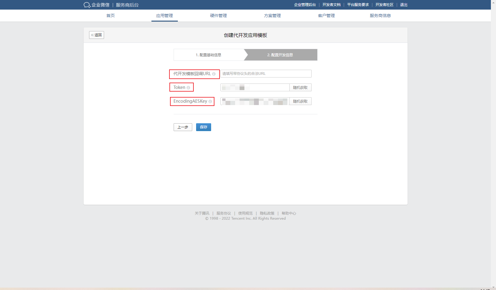
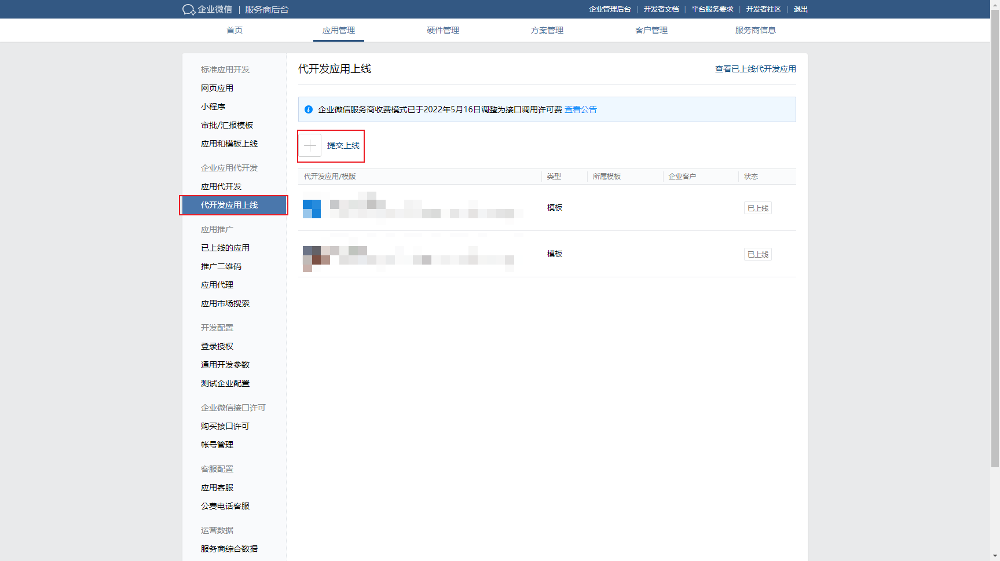
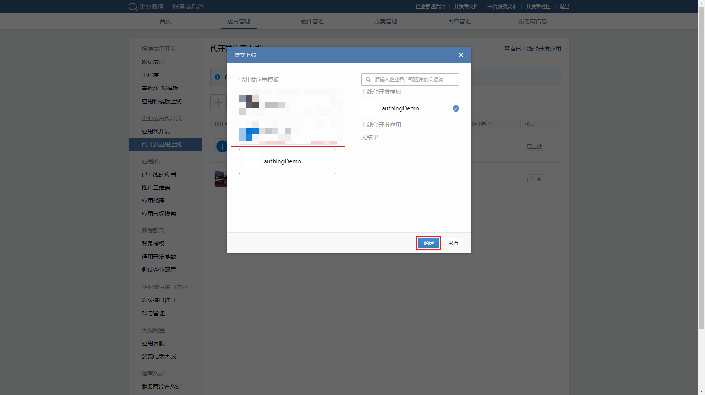
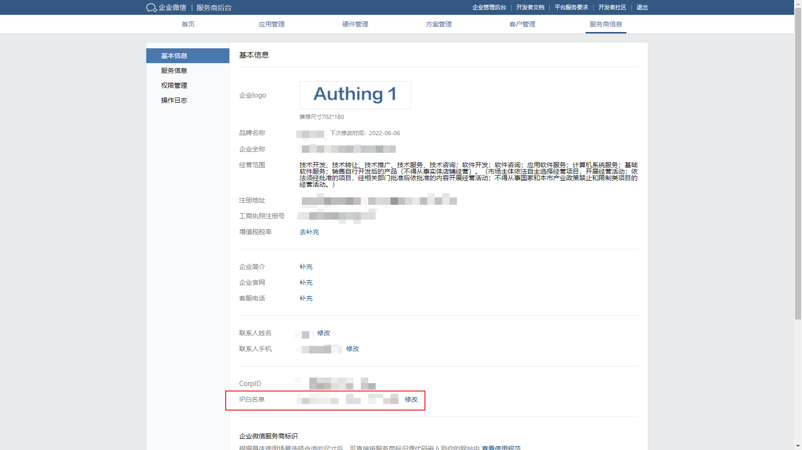
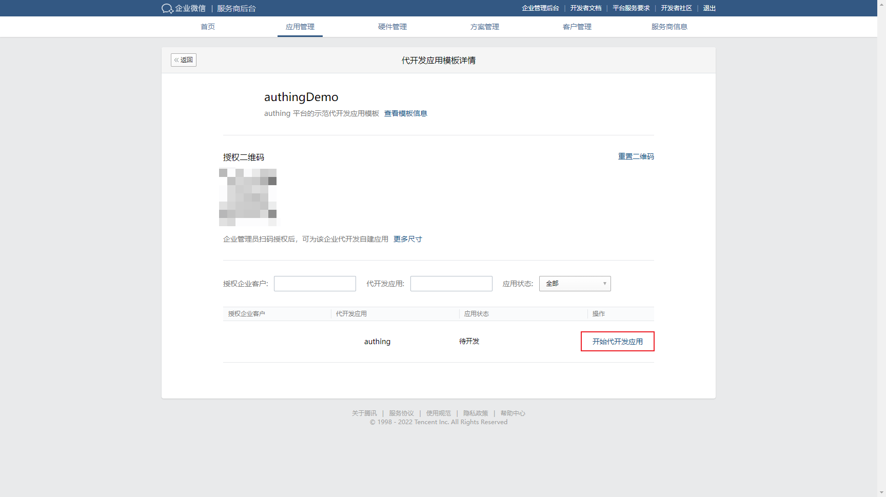
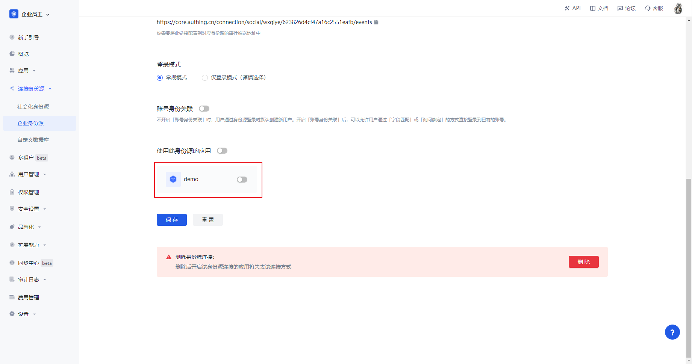

# Enterprise WeChat internal app code sweep login (proxy development mode) Enterprise login

<LastUpdated/>

## Scenario Introduction

- **Overview**: Enterprise WeChat internal application code login (proxy development mode) is to provide proxy development application by the service provider, and third-party enterprise code authorization form, for the third enterprise to achieve the enterprise WeChat as the identity source to securely login to third-party applications or websites. By configuring {{$localeConfig.brandName}} and enabling the enterprise login in {{$localeConfig.brandName}}, you can quickly get the basic open information of enterprise WeChat and help users to realize the password-free login function.
- **Application Scenario**: PC website
- **End-user preview image**.

## Caution.

- If you do not have an Enterprise Wechat Service Provider account, please go to [Enterprise Wechat Service Provider website](https://open.work.weixin.qq.com/) and click on Become a **Enterprise Wechat Service Provider** first.
- During the development process, you also need an Enterprise Wechat enterprise administrator account to authorize the operation of the application template developed on your behalf, you can modify the administrator rights at [Enterprise Wechat rights management page](https://work.weixin.qq.com/wework_admin/frame#profile/role).
- If you do not have a {{$localeConfig.brandName}} console account, please go to [{{$localeConfig.brandName}} Console console](https://authing.cn/) to register a developer account first.

## Step 1: Create a surrogate application

Go to [Enterprise WeChat Service Provider Backend](https://open.work.weixin.qq.com/wwopen/developer#/index), click **Application Generation Development**, select **Create Generation Development Application Template**, and fill in the corresponding content. Go to the Configure Development Information page

On the Configure Development Information page, click **Random Get** to generate the Token and EncodingAESKey; the callback URL for the development template needs to be generated after the app is created in the {{$localeConfig.brandName}} console and verified by the WeChat server, so let's keep the page here first and open the {{$ localeConfig.brandName}} console.

## Step 2: Configure Enterprise WeChat internal app sweep login (proxy development mode) in {{$localeConfig.brandName}} console

2.1 In the {{$localeConfig.brandName}} Console, on the "Enterprise Identity Source" page, click the "Create Enterprise Identity Source" button, go to the "Select Enterprise Identity Source" page, and click the "Enterprise WeChat" identity source button

2.2 Select "Enterprise WeChat Internal App Sweep Login (Surrogate Development Mode)".

2.3 Please fill in the Token and EncodingAESKey obtained from **Enterprise WeChat service provider backend configuration development information page** on the "Enterprise WeChat internal app code login (proxy development mode)" page.

Click Save and the {{$localeConfig.brandName}} console will automatically jump to the identity source details page, copying the URL displayed in the **event address** at the bottom of the page. note that **must click Save and follow up**, otherwise the WeChat callback verification will not pass.

Fill in the URL of the **event address** obtained from the {{$localeConfig.brandName}} console into the **generation development template callback URL** in the enterprise WeChat service provider backend, configuration development information, and then click Save

## Step 3: Go live with the Enterprise WeChat Generation Development Application Template

3.1 In the Enterprise WeChat service provider backend, select Application Management, and in **Online Application Development**, click the **Submit Online button** to submit the development template you just created

3.2 Enterprise Wechat will review the development templates, after the review, click on the template, enter the development template review details, and select **Submit to go live**

3.3 On the Enterprise WeChat **App Development** page, select **App Development**, select the app template that needs to be authorized, and click **View Template Information**

3.4 Fill the template ID and template Secret into the {{$localeConfig.brandName}} console's identity source information separately

3.5 In the backend of Enterprise WeChat service provider, **Service provider information page**, select basic information, **IP whitelist** you need to add the server IP address of {{$localeConfig.brandName}}, click [{{$localeConfig.brandName}} server IP list](core. authing.cn/api/v2/system/public-ips) to get it

## Step 4: Enterprise license surrogate development template and develop the surrogate application

4.1 On the app development page, click on the app development template you just created and the enterprise administrator scans the authorization QR code.

Refresh the page

Under the Modern Application Development page, click **Start Application Development**

After confirming the base information, configure the development information and fill in core.authing.cn in the trusted domain

## Step 5: Configure and bring the surrogate app online

After clicking Finish, go back to the surrogate app template details page and click **View**

Edit the usage configuration

Click **Verify Trusted Domain Attribution**

In the pop-up window, select **Download File**

Fill in the **Txt Filename** and **Txt Content** of {{$localeConfig.brandName}} with the filename and content, and click Save

Click the Save button on the **Use Configuration** on the WeChat platform to save.

Set up Enterprise WeChat Authorized Login

Fill in core.authing.cn in the authorization callback field in the web page

After the configuration is complete, the app is submitted live and reviewed on behalf of the developer

After the review, the app status changes to Pending

Click into the pending app and submit it to go live

In the Enterprise Admin backend, My Enterprise View Enterprise ID

Fill in the Enterprise ID in {{$localeConfig.brandName}} with the Enterprise ID

Fill in the AgentId in {{$localeConfig.brandName}} in the self-built application in the enterprise admin backend

Click the edit button to add a visible scope so that only members of the selected organization can log in using {{$localeConfig.brandName}}

Click Authorization Information, select Custom Permissions, and add sensitive information about the allowed members

## Step 3: Development Access

- **Recommended Development Access Method**: Using a hosted login page

- **Description of advantages and disadvantages**: Simple operation and maintenance by {{$localeConfig.brandName}}. Each user pool has a separate secondary domain; if you need to embed it in your application, you need to use the popup mode login, i.e.: after clicking the login button, a window will pop up with {{$localeConfig.brandName}} hosted login page, or redirect the browser to {{$localeConfig.brandName }} to the hosted login page.

- **Detailed access method**.

  3.1 Create an app in the {{$localeConfig.brandName}} console, for details see: [How to create an app in {{$localeConfig.brandName}}](https://docs.authing.cn/v2/guides/app/create- app.html)

  3.2 In the created Enterprise WeChat internal app sweep login (proxy development mode) identity source connection details page, open and associate an app created in the {{$localeConfig.brandName}} console

3.3 Experience the Enterprise WeChat internal app swipe login on the login page (proxy development mode) Third-party login

