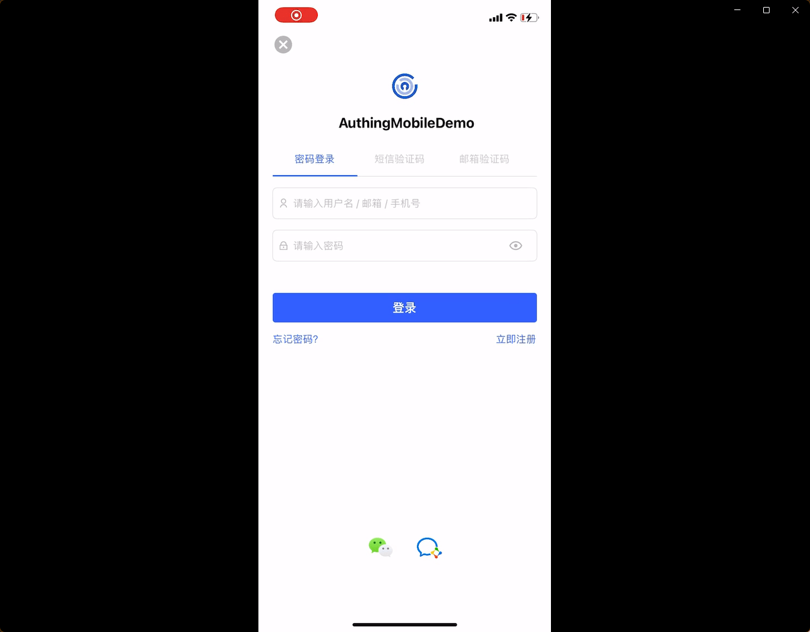
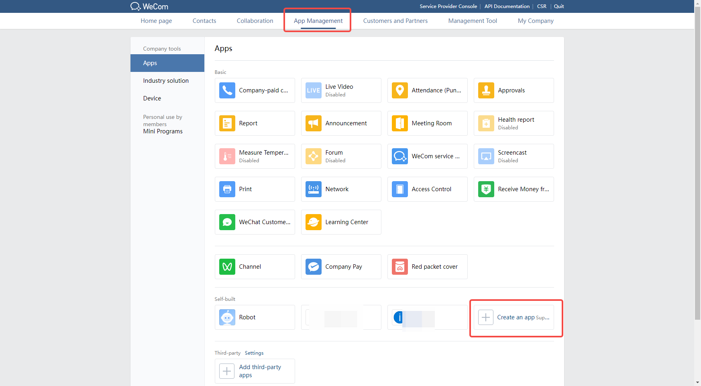
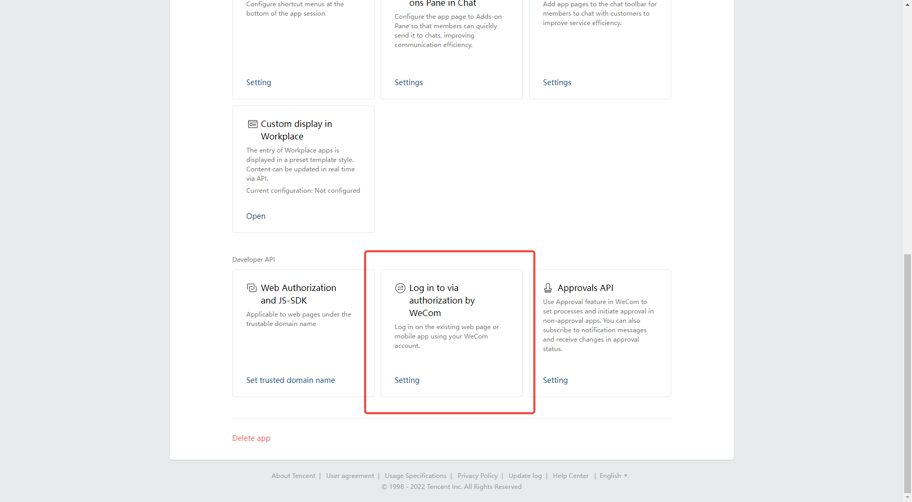
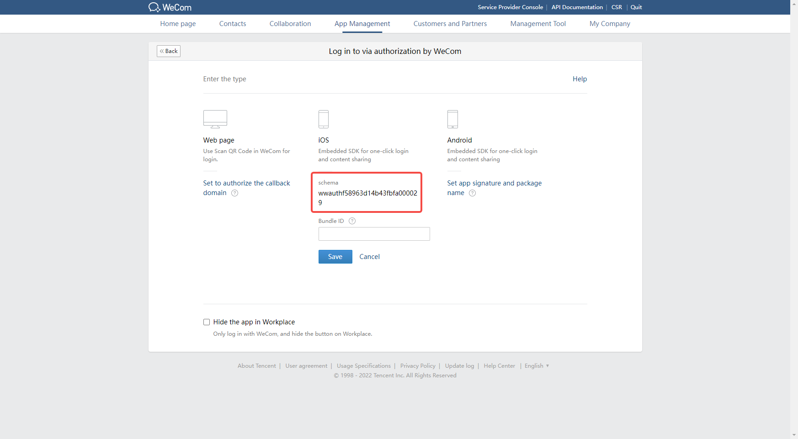
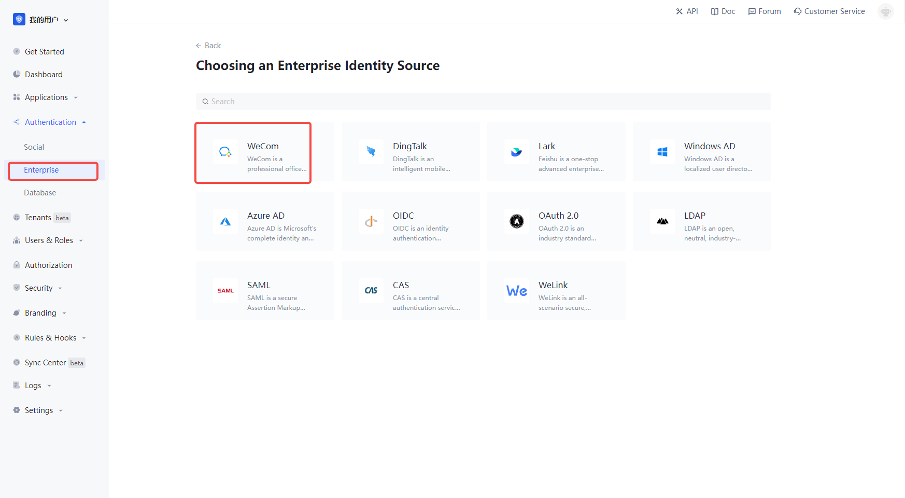
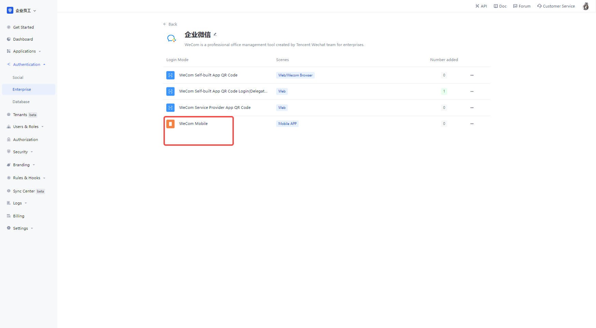
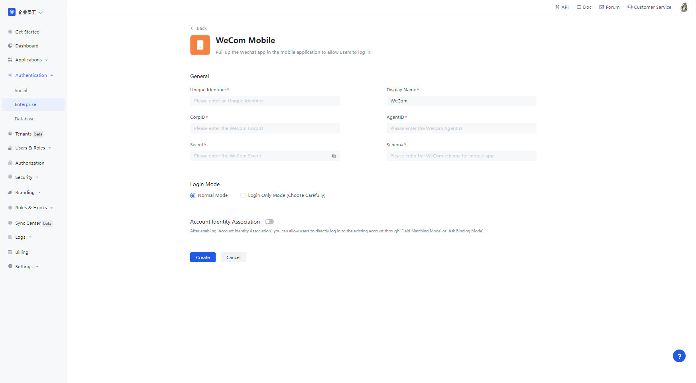
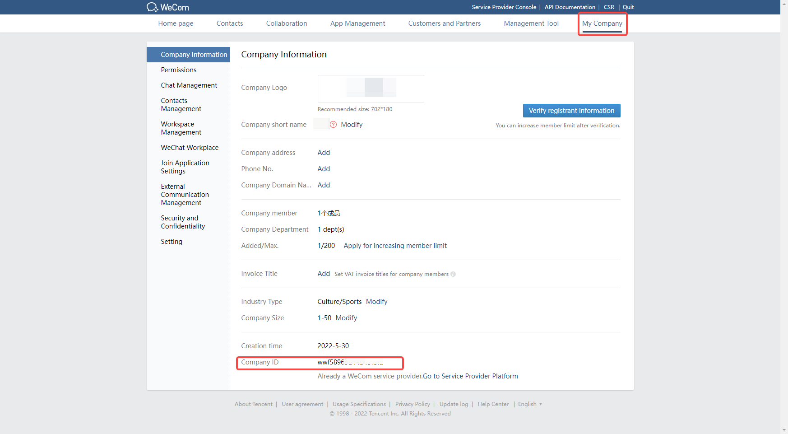
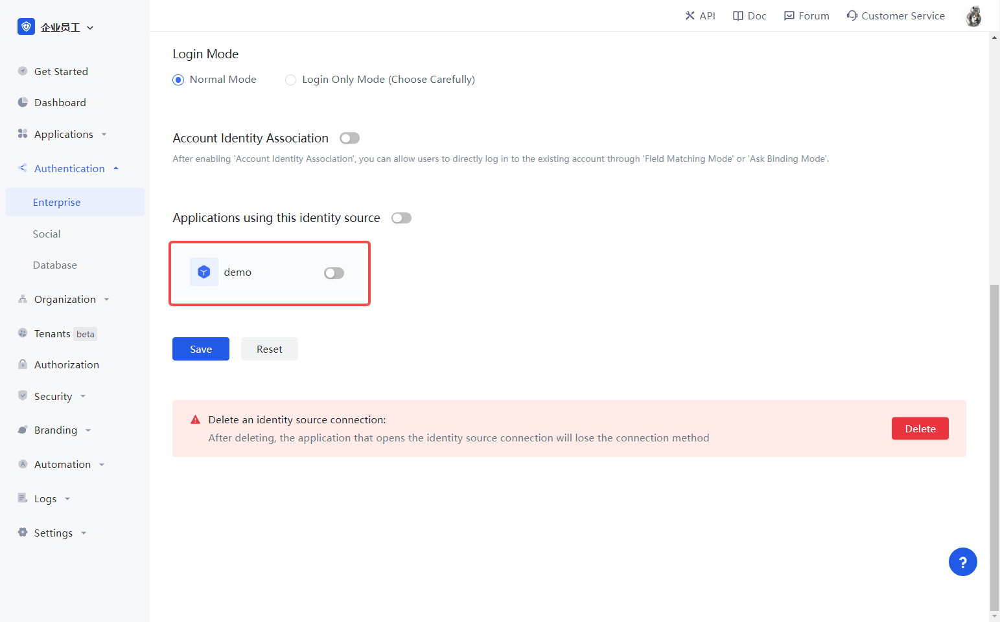

# WeCom Mobile

<LastUpdated/>

## Introduction

- **Overview**: Pull up WeCom APP in mobile applications to allow users to perform login-free scenarios. Enables secure login to third-party applications or websites using WeCom as the identity source for enterprises. Configure and enable enterprise login in {{$localeConfig.brandName}} to quickly get the basic open information of WeCom and help users to achieve the no-sign-in function through {{$localeConfig.brandName}}.
- **Application Scenario**: Mobile application
- **End-user preview image**.

## Caution.

- If you do not have an WeCom Developer account, please go to [WeCom Developer Backend](https://work.weixin.qq.com/) to register first.
- If you do not have a {{$localeConfig.brandName}} console account, please go to [{{$localeConfig.brandName}} Console](https://{{$localeConfig.brandName}}.cn/) to register for a developer account.

## Step 1: Create Enterprise Self-Built App

Go to [WeCom Developer Backend](https://work.weixin.qq.com/wework_admin/frame#profile) and

In the **App Management** - **App** page, create a self-built app

On the app details page, click Set WeCom Authorized Login:.

Click on the IOS or Android option, get the schema and fill in the application signature and package name of the application

## Step 2: Configure WeCom Mobile in {{$localeConfig.brandName}} Console

2.1 In the {{$localeConfig.brandName}} Console, on the "Enterprise Identity Source" page, click the "Create Enterprise Identity Source" button, go to the "Select Enterprise Identity Source" page, and click the "WeCom" identity source button

2.2 Select "WeCom Mobile".

2.3 Please fill in the relevant fields on the "WeCom Mobile" page.

| Field                        | Description                                                                                                                                                                                                                                                                             |
| ---------------------------- | --------------------------------------------------------------------------------------------------------------------------------------------------------------------------------------------------------------------------------------------------------------------------------------- |
| Unique identifier            | a. The unique identifier consists of lowercase letters, numbers, -, and is less than 32 bits long.  b. This is a unique identifier for this connection and cannot be modified after it is set.                                                                                     |
| Show name                    | This name is displayed on the button on the end-user's login screen.                                                                                                                                                                                                                    | Enterprise ID |
| Enterprise ID                | The App ID and App Secret can be found in the backend of the WeCom application, under **Credentials and Basic Information**.                                                                                                                                                            | The |
| AgentID                      | You can see AgentID and App Secret in **Credentials and Basic Information** in the backend of WeCom application. 。                                                                                                                                                                     | AgentID |
| Secret                       | You can see AgentID and App Secret in **Credentials and Basic Information** in the backend of WeCom application. 。                                                                                                                                                                     |
| Schema                       | The App ID and App Secret can be found in **Credentials and Basic Information** in the backend of the WeCom application.                                                                                                                                                                | Schema |
| Login Mode                   | After you turn on "Login Only Mode", you can only login to your existing account, you cannot create new account, please choose carefully.                                                                                                                                               | Sign In Mode |
| Account Identity Association | When "Account Identity Association" is not enabled, users can create new users by default when they log in through the identity source. If "Account Identity Association" is enabled, you can allow users to log in to existing accounts directly by "Field Matching" or "Ask to Bind". |

You can get the Enterprise ID on the My Enterprise - Enterprise Information page.

On the app details page, you can get the **AgentId** and **Secret** for the app at.

! 

## Step 3: Development Access

- **Recommended development access method**: SDK 
- **Description of advantages and disadvantages**: Simple access, only a few lines of code required. The highest degree of customizability.
- **Detailed access method**.
 
 3.1 Please access your Android application according to [WeCom Login SDK Access Document (Android)](https://docs.authing.cn/v2/en/reference/sdk-for-android/social/wecom.html); Please access your Android application according to [WeCom Login SDK Access Document (IOS)](https://docs.authing.cn/v2/en/reference/sdk-for-android/social/wecom.html) (https://docs.authing.cn/v2/reference/sdk-for-ios/social/wecom.html) to access your IOS application.
 
 3.2 Create a mobile app in the {{$localeConfig.brandName}} console, see: [How to create an app in {{$localeConfig.brandName}}](/guides/app/create-app.md)

 3.3 Open and associate a mobile app created in {{$localeConfig.brandName}} console in the created "WeCom Mobile" identity source connection details page.
 

 3.4 Go to the associated mobile APP and experience the APP login function.

  !
