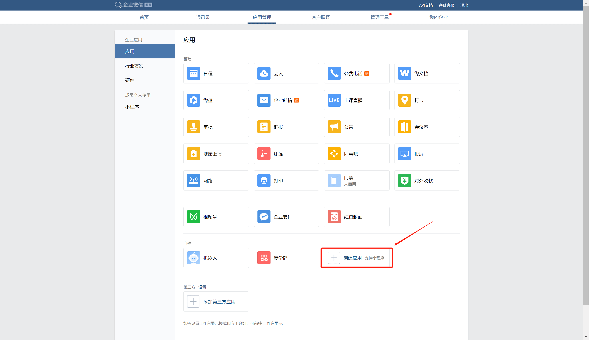
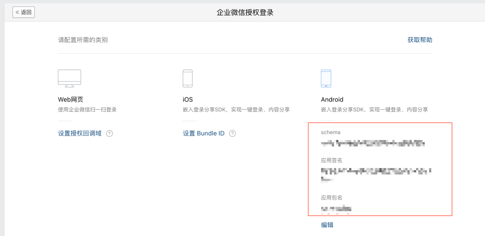
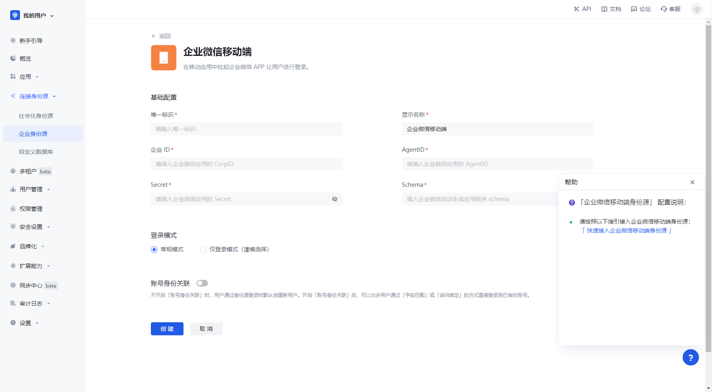

# Enterprise WeChat Mobile

<LastUpdated/>

## Introduction to the scene

- **Overview**: Pull up enterprise WeChat APP in mobile applications to allow users to perform login-free scenarios. Enables secure login to third-party applications or websites using Enterprise WeChat as the identity source for enterprises. Configure and enable enterprise login in {{$localeConfig.brandName}} to quickly get the basic open information of enterprise WeChat and help users to achieve the no-sign-in function through {{$localeConfig.brandName}}.
- **Application Scenario**: Mobile application
- **End-user preview image**.

## Caution.

- If you do not have an Enterprise WeChat Developer account, please go to [Enterprise WeChat Developer Backend](https://work.weixin.qq.com/) to register first.
- If you do not have a {{$localeConfig.brandName}} console account, please go to [{{$localeConfig.brandName}} Console](https://{{$localeConfig.brandName}}.cn/) to register for a developer account.

## Step 1: Create Enterprise Self-Built App

Go to [Enterprise WeChat Developer Backend](https://work.weixin.qq.com/wework_admin/frame#profile) and

In the **App Management** - **App** page, create a self-built app

On the app details page, click Set Enterprise Wechat Authorized Login:.

Click on the IOS or Android option, get the schema and fill in the application signature and package name of the application

## Step 2: Configure Enterprise WeChat Mobile in {{$localeConfig.brandName}} Console

2.1 In the {{$localeConfig.brandName}} Console, on the "Enterprise Identity Source" page, click the "Create Enterprise Identity Source" button, go to the "Select Enterprise Identity Source" page, and click the "Enterprise WeChat" identity source button

2.2 Select "Enterprise WeChat Mobile".

2.3 Please fill in the relevant fields on the "Enterprise WeChat Mobile" page.

| Field | Description |
| ------------- | ------------------------------------------------------------------------------------------------------------------- ----------------------------------------- |
| Unique identifier | a. The unique identifier consists of lowercase letters, numbers, -, and is less than 32 bits long.  b. This is a unique identifier for this connection and cannot be modified after it is set.                                                    |
| Show name | This name is displayed on the button on the end-user's login screen.                                                                                                                | Enterprise ID
| Enterprise ID | The App ID and App Secret can be found in the backend of the Enterprise Wechat application, under **Credentials and Basic Information**.                                                                                                                            |The
| AgentID | You can see AgentID and App Secret in **Credentials and Basic Information** in the backend of Enterprise Wechat application. 。                                                                                                                       |AgentID
| Secret | You can see AgentID and App Secret in **Credentials and Basic Information** in the backend of Enterprise Wechat application. 。                                                                                                                        |
| Schema | The App ID and App Secret can be found in **Credentials and Basic Information** in the backend of the Enterprise Wechat application.                                                                                                                         |Schema
| Login Mode | After you turn on "Login Only Mode", you can only login to your existing account, you cannot create new account, please choose carefully.                                                                                         |Sign In Mode
| Account Identity Association | When "Account Identity Association" is not enabled, users can create new users by default when they log in through the identity source. If "Account Identity Association" is enabled, you can allow users to log in to existing accounts directly by "Field Matching" or "Ask to Bind". |

You can get the Enterprise ID on the My Enterprise - Enterprise Information page.

On the app details page, you can get the **AgentId** and **Secret** for the app at.

! 

## Step 3: Development Access

- **Recommended development access**: Use hosted login page

- **Description of advantages and disadvantages**: Simple operation and maintenance by {{$localeConfig.brandName}}. Each user pool has a separate secondary domain; if you need to embed it in your application, you need to use the popup mode login, i.e.: after clicking the login button, a window will pop up with {{$localeConfig.brandName}} hosted login page, or redirect the browser to {{$localeConfig.brandName }} to the hosted login page.

- **Detailed access method**.

## Mobile access sdk
