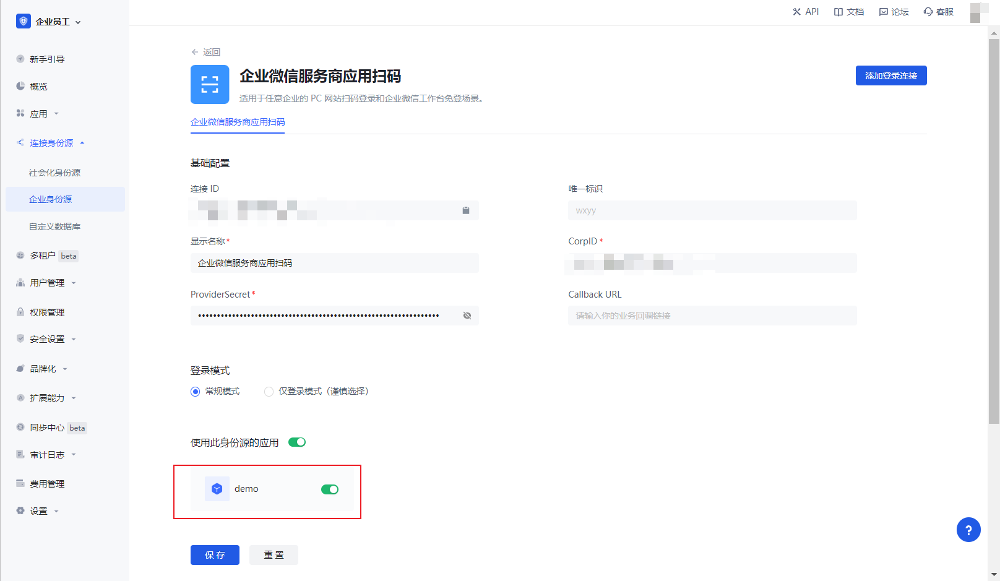

# Enterprise WeChat service provider application sweep code

<LastUpdated/>

## 场景介绍

- **概述**：Enterprise WeChat Service Provider Application Sweep is a form of third-party enterprise sweep service provider's application authorization for third-party enterprises to achieve secure login to third-party applications or websites with Enterprise WeChat as the identity source. By configuring and enabling the enterprise login of Enterprise WeChat Service Provider Application Code in Authing, you can quickly get the basic open information of Enterprise WeChat and help users to realize the function of password-free login.
- **应用场景**：PC website login and enterprise WeChat workbench no-login scenario for any enterprise
- **终端用户预览图**：

## Precautions:

- If you do not have an Enterprise Wechat Service Provider account, please go to [Enterprise Wechat Service Provider website](https://open.work.weixin.qq.com/) and click to become a **Enterprise Wechat Service Provider**.
- If you do not have an Authing Console account, please go to [Authing Console Console](https://authing.cn/) to register for a developer account.

## Step 1: Configure Enterprise WeChat Service Provider Application Sweep in Authing Console

2.1 On the "Enterprise Identity Source" page of Authing Console, click the "Create Enterprise Identity Source" button, enter the "Select Enterprise Identity Source" page, select the "Enterprise WeChat" identity source button, click "Enterprise WeChat Service Provider Application Code", and enter the "Enterprise WeChat Service Provider Application Code Login Mode" page.

2.3 Please configure the relevant field information in the "Enterprise Identity Source" - "Enterprise WeChat Service Provider Application Sweep" page of Authing Console console.

| Fields / Functions | Description                                                                                                                                                                                                                                                                                                                                                                                                                                                                                                                                                                                               |
| ------------------ | --------------------------------------------------------------------------------------------------------------------------------------------------------------------------------------------------------------------------------------------------------------------------------------------------------------------------------------------------------------------------------------------------------------------------------------------------------------------------------------------------------------------------------------------------------------------------------------------------------- |
| 唯一标识           | a. The unique identifier consists of lowercase letters, numbers, -, and is less than 32 bits in length. b. This is the unique identifier for this connection and cannot be modified after it is set.                                                                                                                                                                                                                                                                                                                                                                                                      |
| 显示名称           | This name is displayed on the button on the end user's login screen.                                                                                                                                                                                                                                                                                                                                                                                                                                                                                                                                      |
| CorpID             | Parameters in generic development on enterprise WeChat platform Corp ID                                                                                                                                                                                                                                                                                                                                                                                                                                                                                                                                   |
| ProviderSecret     | Parameters ProviderSecret in generic development on enterprise WeChat platform                                                                                                                                                                                                                                                                                                                                                                                                                                                                                                                            |
| Callback URL       | This is your business callback domain name, which is not the same concept as the callback link configured in the self-built application, nor is it related to the callback address configuration of the third-party social login console. For example, if your website domain name is https://example.com and the url for handling Authing callback requests is /auth/callback, then you should fill in https://example.com/auth/callback. This parameter is no longer recommended and it is recommended to configure the callback link separately in the application You can fill in # for this address. | login mode |
| Login Mode         | When "Login Only Mode" is enabled, you can only log in to existing accounts, not create new ones, so please choose carefully.                                                                                                                                                                                                                                                                                                                                                                                                                                                                             |

In the backend of Enterprise WeChat service provider, select **Application Management**, click **General Development Parameters**, copy CorpID and ProviderSecret to Authing Console

Once the configuration is complete, click the "Create" or "Save" button to complete the creation.

## Step 2: Add enterprise WeChat IP whitelist

2.1 Enterprise WeChat service provider background, **service provider information page**, select **basic information**, add Authing's server IP address to the **IP whitelist**, click [Authing server IP list](core.authing.cn/api/v2/system/public-ips) to get it.

## Step 3: Perform login authorization

- Enterprise WeChat needs to verify the authorization of the address that initiates the login. The following is an example of how to add login authorization by **hosted login page** login

  3.1 Create an application in Authing Console, see [How to create an application in Authing](https://docs.authing.cn/v2/guides/app/create-app.html)

  3.2 Open and associate an application created in Authing console in the created Enterprise WeChat Service Provider application sweep code source connection details page.

3.3 In the **Applications**, **Self-Built Applications** section, click on the application you just opened, go to the application details, and copy the **Authentication Address**

3.4 Fill in the authentication address in the application details to the WeChat service provider background **application management**, **login authorization** in the **login authorization launch domain**, **authorization completion callback domain** fill in core.authing.cn

