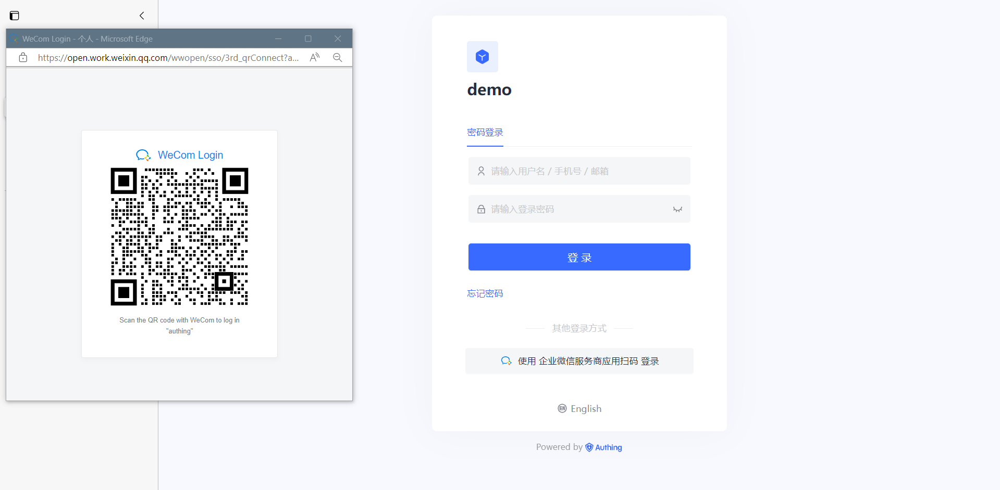
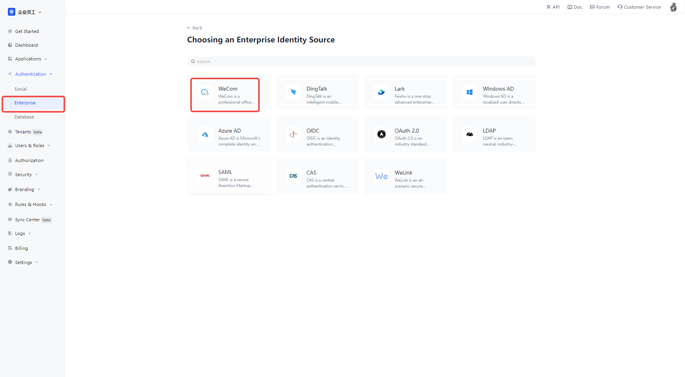
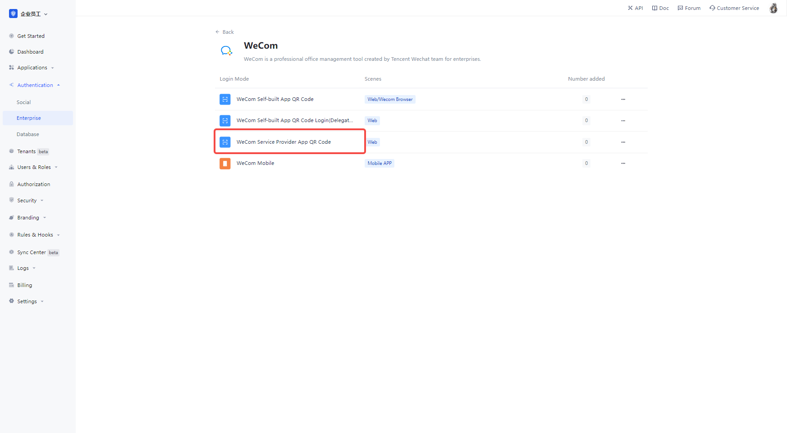
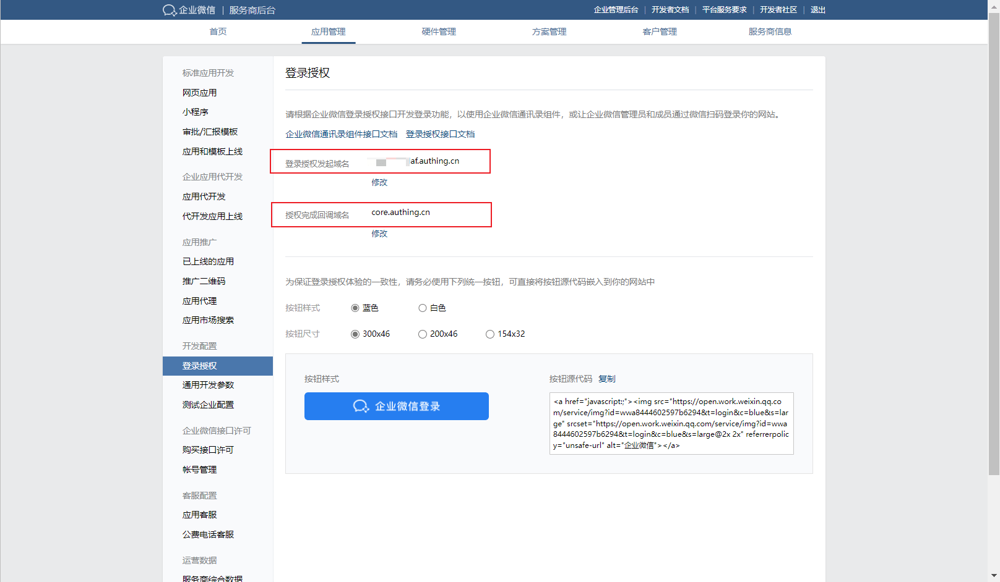
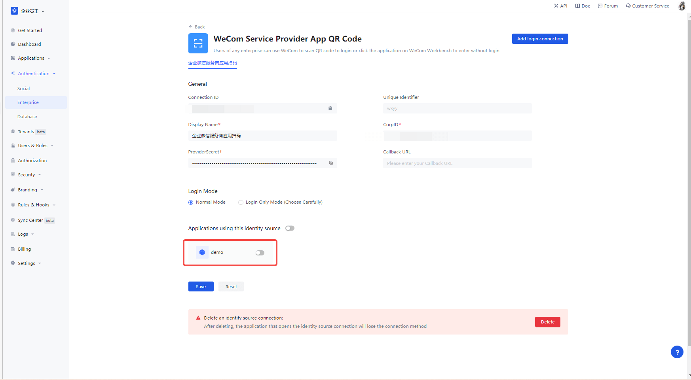
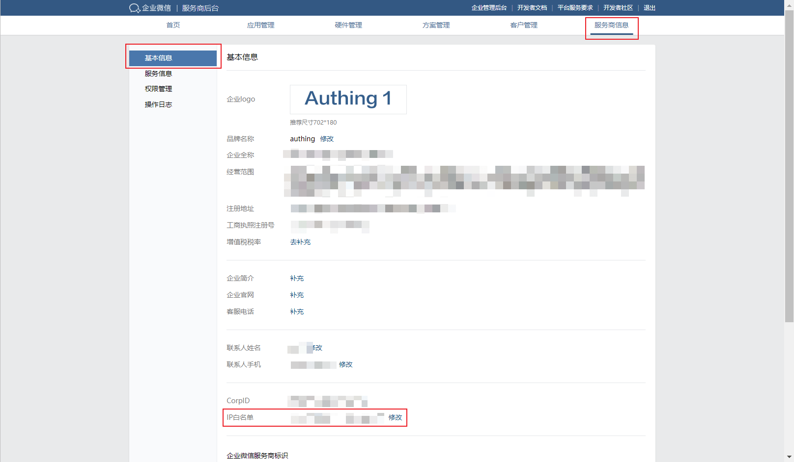
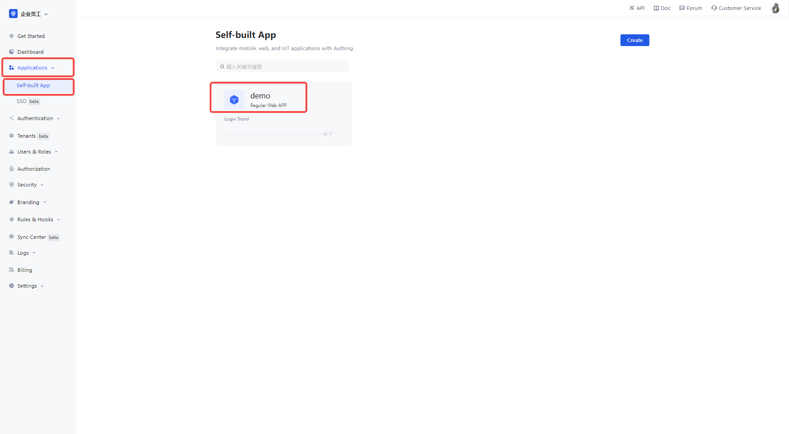
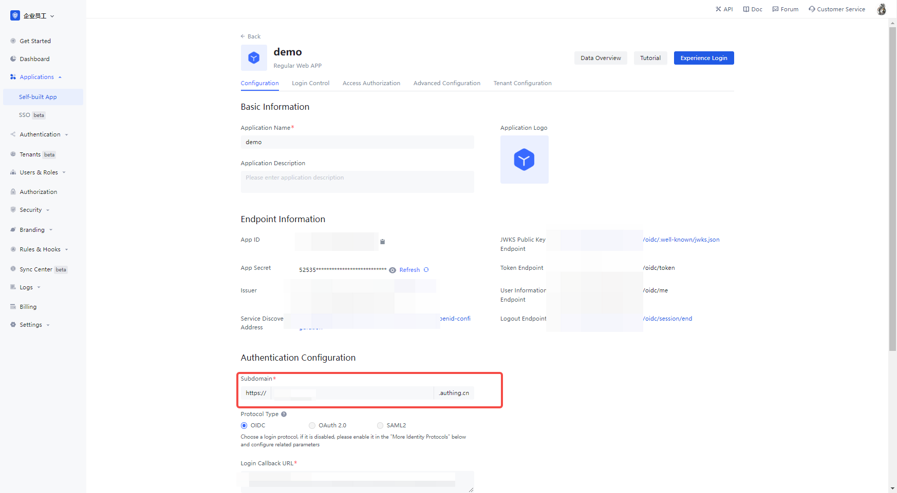
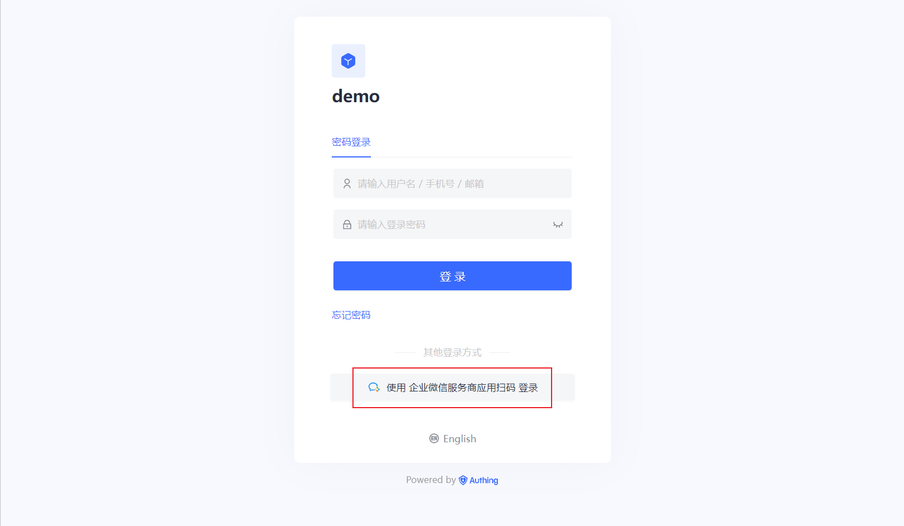

# WeCom Service Provider App QR Code

<LastUpdated/>

## Introduction

- **Overview**: WeCom Service Provider App QR Code is a form of application authorization by a third-party enterprise sweep service provider to enable secure login to third-party applications or websites using WeCom as the identity source for third enterprises. In {{$localeConfig.brandName}}, you can configure and enable the enterprise login of WeCom service provider application sweep code to quickly get the basic open information of WeCom and help users to realize the function of password-free login through {{$localeConfig.brandName}}.
- **Application Scenario**: PC website and WeCom Workbench no-login scenario for any enterprise
- **End-user preview image**.

## Caution.

- If you do not have an WeCom Service Provider account, please go to the [WeCom Service Provider website](https://open.work.weixin.qq.com/) and click on Become a **WeCom Service Provider**.
- If you do not have a {{$localeConfig.brandName}} Console account, please go to [{{$localeConfig.brandName}} Console](https://authing.cn/) to register a developer account first.

## Step 1: Configure WeCom Service Provider App QR Code in {{$localeConfig.brandName}} Console

2.1 Please click the "Create Enterprise Identity Source" button on the "Enterprise Identity Source" page of {{$localeConfig.brandName}} Console, enter the "Select Enterprise Identity Source" page, select the "WeCom" identity source button, and click "WeCom Service Provider App QR Code" to enter the "WeCom Service Provider App QR Code Login Mode" page. page.

2.3 Please configure the relevant field information on the "Enterprise Identity Source" - "WeCom Service Provider App QR Code" page in {{$localeConfig.brandName}} Console console.

| Field/Function    | Description                                                                                                                                                                                                                                                                                                                                                                                                                                                                                                                                                                                                                                                   |
| ----------------- | ------------------------------------------------------------------------------------------------------------------------------------------------------------------------------------------------------------------------------------------------------------------------------------------------------------------------------------------------------------------------------------------------------------------------------------------------------------------------------------------------------------------------------------------------------------------------------------------------------------------------------------------------------------- |
| Unique identifier | a. The unique identifier consists of lowercase letters, numbers, and -, and is less than 32 bits long. b. This is the unique identifier for this connection and cannot be modified after it is set.                                                                                                                                                                                                                                                                                                                                                                                                                                                           |
| Display name      | This name is displayed on the button in the end-user's login screen.                                                                                                                                                                                                                                                                                                                                                                                                                                                                                                                                                                                          | This is a unique identifier for this connection. |
| CorpID            | The parameter Corp ID in the generic development on the WeCom platform                                                                                                                                                                                                                                                                                                                                                                                                                                                                                                                                                                                        |
| ProviderSecret    | The parameter ProviderSecret in the WeCom Platform generic development.                                                                                                                                                                                                                                                                                                                                                                                                                                                                                                                                                                                       |
| Callback URL      | This is your business callback domain name, which is not the same concept as the callback link configured by the self-built application, nor is it related to the callback address configuration of the third-party social login console. For example, if your website domain name is https://example.com and the url for handling {{$localeConfig.brandName}} callback requests is /auth/callback, then you should fill in https://example.com/auth/callback. This parameter has been It is not recommended to use this parameter, and it is recommended to configure the callback link separately in the application, where the address can be filled in #. | The |
| Login mode        | When "Login only mode" is enabled, only existing accounts can be logged in, no new accounts can be created, please choose carefully.                                                                                                                                                                                                                                                                                                                                                                                                                                                                                                                          | Please choose carefully. |

In the WeCom service provider backend, select **Application Management**, click **General Development Parameters**, and copy the CorpID and ProviderSecret to the {{$localeConfig.brandName}} console

Once the configuration is done, click the "Create" or "Save" button to complete the creation.

## Step 2: Add WeCom IP Whitelist

2.1 In the background of WeCom service provider, **Service provider information page**, select **Basic information**, add the server IP address of {{$localeConfig.brandName}} to the **IP whitelist**, click [{{$localeConfig.brandName}} server IP list](https://core.authing.cn/api/v2/system/public-ips) to get it

## Step 3: Perform login authorization

- WeCom needs to verify the authorization of the address that initiates the login. The following is an example of how to add login authorization by **hosting login page** login

  3.1 Create an app in the {{$localeConfig.brandName}} console, for details see: [How to create an app in {{$localeConfig.brandName}}](https://docs.authing.cn/v2/guides/app/create- app.html)

  3.2 In the created WeCom Service Provider App QR Code Source Connection details page, open and associate an app created in the {{$localeConfig.brandName}} console

3.3 In the **Apps**, **Build your own app** section, click on the app you just opened, go to the app details, and copy the **Authentication address**

3.4 Fill in the authentication address from the app details to the WeChat service provider backend **application management**, **login authorization** in **login authorization launch domain**, **authorization completion callback domain** fill in core.authing.cn

## Step 3: Development Access

- **Recommended development access**: Use hosted login page

- **Description of advantages and disadvantages**: Simple O&M, with {{$localeConfig.brandName}} in charge of O&M. Each user pool has a separate secondary domain; if you need to embed it in your application, you need to use the popup mode login, i.e.: after clicking the login button, a window will pop up with {{$localeConfig.brandName}} hosted login page, or redirect the browser to {{$localeConfig.brandName }} to the hosted login page.

- **Detailed access method**.

  3.1 Create an app in the {{$localeConfig.brandName}} console, for details see: [How to create an app in {{$localeConfig.brandName}}](https://docs.authing.cn/v2/guides/app/create- app.html)

  3.2 In the created WeCom Service Provider App QR Code Source Connection details page, open and associate an app created in the {{$localeConfig.brandName}} console

3.3 Experience the WeCom Service Provider app sweep on the login page

