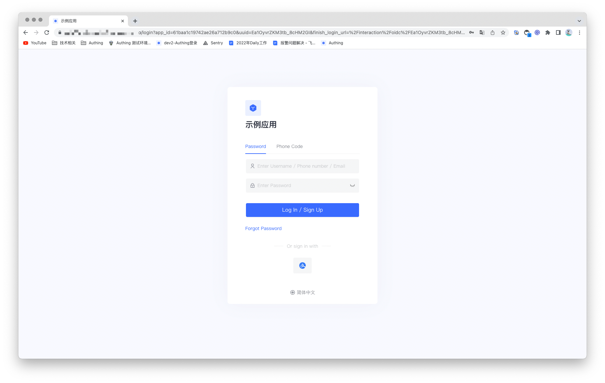
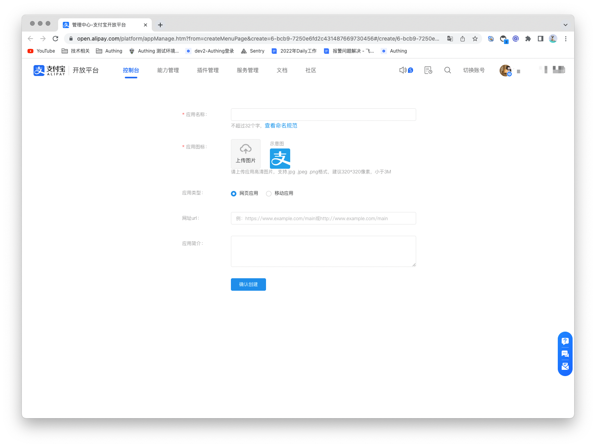
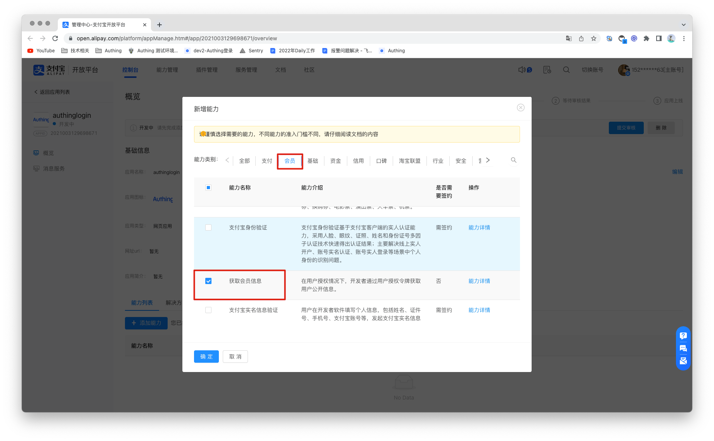
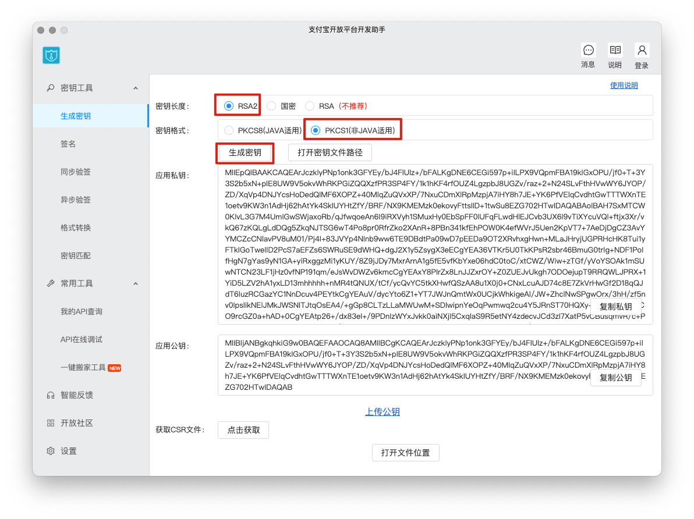
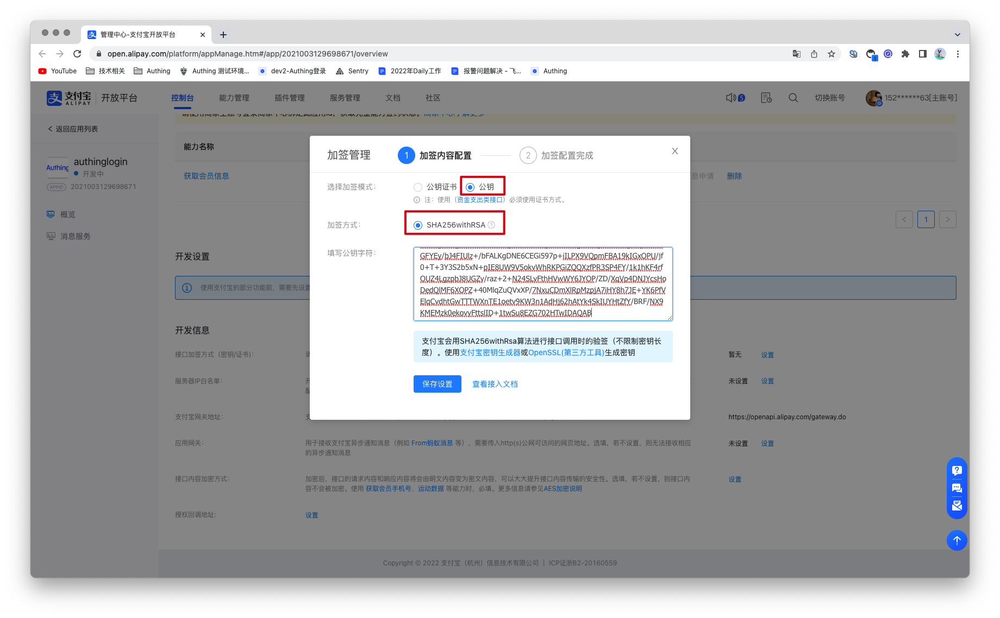
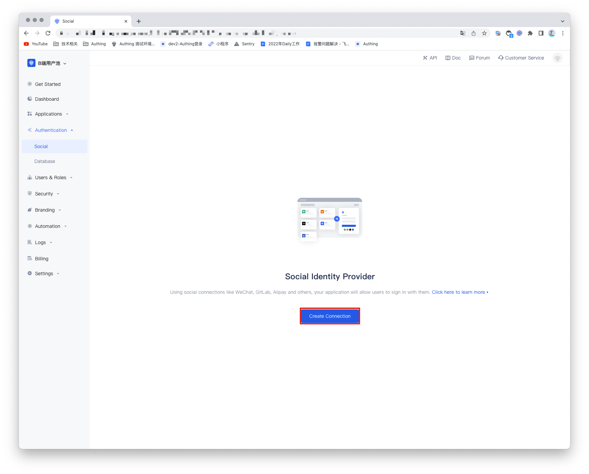
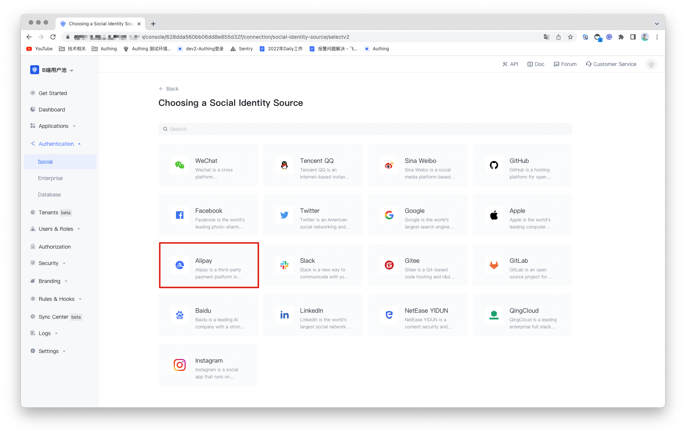
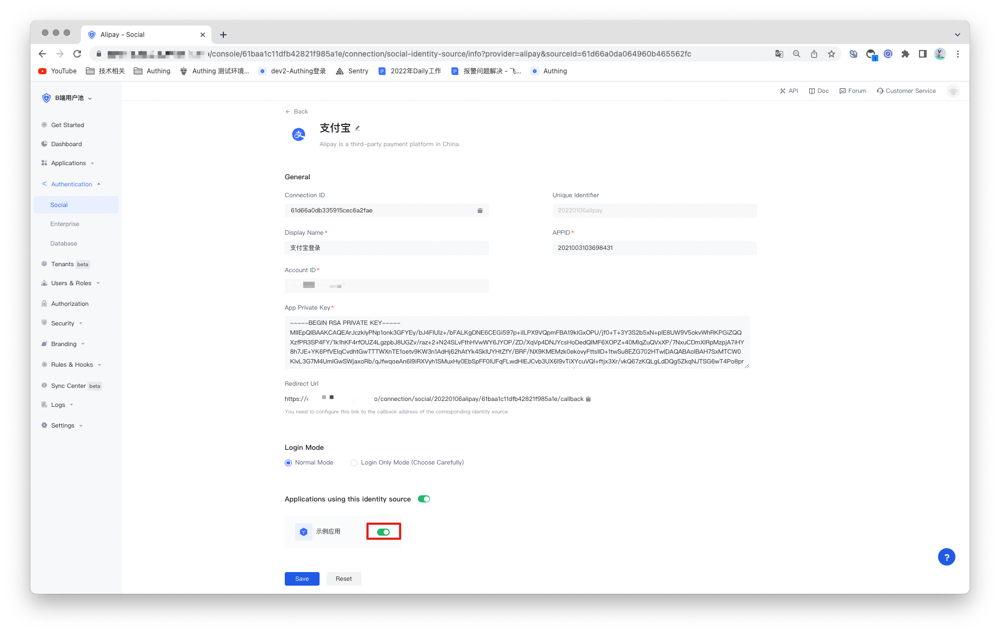

## Alipay Social Login

<LastUpdated/>

## Introduction

- **Overview**：Alipay social login means that users can securely log in to third-party applications or websites with Alipay as the identity source. By configuring and enabling Alipay's social login in Authing, you can quickly obtain basic open information of Alipay through Authing and help users achieve password-free login.
- **Application scenarios**：PC Website
- **End-User Preview**：

## Precautions：

- Go to [Alipay Open Platform](https://open.alipay.com/) to register an Alipay open account;

2. Go to the [Developer Center Console](https://open.alipay.com/dev/workspace) and follow the instructions to create a **web application**. Please make sure that your app has the ability to **get member information**, otherwise you will not be able to log in with Alipay;
3. If you do not have an Authing console account, please go to the [Authing Console](https://authing.cn/) to register a developer account;

##

## Step 1：Create a Alipay app

1.1 Log in to the Alipay Open Platform, enter the console, and click the **Create Application** button in My Applications > Web & Mobile Applications to create a new application.

1.2 Enter the console of the application after creation, under the ability list, add the ability, you need to add the ability of "obtaining member information".

1.3 Configure the development settings of the application, in the development information under the development settings, set the interface signing method (key/method). According to Alipay's [Alipay Key Generator](https://docs.open.alipay.com/291/106097/) or [OpenSSL (third-party tool)](https://docs.open.alipay. com/291/106130) to generate the key. For details on how to obtain the key, please refer to [Alipay Key Generation Instructions](https://opendocs.alipay.com/common/02khjo). Among them, the key length must be RSA2, and the key format must be PKCS1.

You need to save the application private key and application public key, configure the application public key in Alipay, and configure the application private key in the identity source of the Authing console.

The interface signing method (key/method), select the signing mode "public key", enter the application public key and save, and then click Save settings.

## Step 2: Configure Alipay in the Authing console

2.1 On the "Social Identity Source" page of the Authing Console, click the "Create Social Identity Source" button to enter the "Select Social Identity Source" page.

2.2 On the "Social Identity Source" - "Select Social Identity Source" page of the Authing Console, click the "Alipay" identity source button to enter the "Alipay Login Mode" page.

2.3 Please configure the relevant field information on the "Social Identity Source" - "Alipay" page of the Authing console.

| Code  | Field/Function    | Description                                                                                                                                                                                              |
| ----- | ----------------- | -------------------------------------------------------------------------------------------------------------------------------------------------------------------------------------------------------- |
| 2.3.1 | Unique Identifier | a. The unique identifier consists of lowercase letters, numbers, and -, and the length is less than 32 digits. b. This is the unique identifier of this connection and cannot be modified after setting. |
| 2.3.2 | Display Name      | This name will be displayed on the button on the end user's login screen.                                                                                                                                |
| 2.3.3 | APPID             | APPID, Alipay application ID.                                                                                                                                                                            |
| 2.3.4 | Account ID        | Account ID, Alipay main account ID, usually a number starting with 2088.                                                                                                                                 |
| 2.3.5 | App Private Key   | App Private Key，The application private key is generated when the Alipay application interface is signed and set.                                                                                       |
| 2.3.5 | Redirect Url      | Alipay valid OAuth redirect URI. This URL needs to be configured to the Alipay application authorization callback address.                                                                               |
| 2.3.6 | Login Mode        | After enabling 「Login Only Mode」, you can only log in to an existing account and cannot create a new account. Please choose carefully.                                                                 |

After the configuration is complete, click the "Create" or "Save" button to complete the creation.

2.4 The final step After creating the Alipay identity source on the Authing console, you need to configure the callback address to the authorization callback address of the application on Alipay's open platform.

## Step 3: Development Access

- **Recommended development access method**: use the hosted login page
- **Description of advantages and disadvantages**: Simple operation and maintenance, Authing is responsible for operation and maintenance. Each user pool has an independent second-level domain name; if you need to embed it into your application, you need to use the pop-up mode to log in, that is: after clicking the login button, a window will pop up, the content is the login page hosted by Authing, or the browser The server redirects to the login page hosted by Authing.
- **Detailed access method**:

  3.1 Create an app in the Authing console. For details, see: [How to create an app in Authing](https://docs.authing.cn/v2/guides/app/create-app.html).

  3.2 On the created Alipay identity source connection details page, open and associate an application created in the Authing console.

3.3 Experience Alipay third-party login on the login page.

