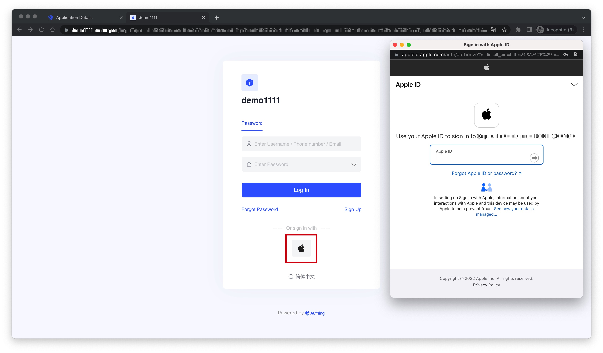
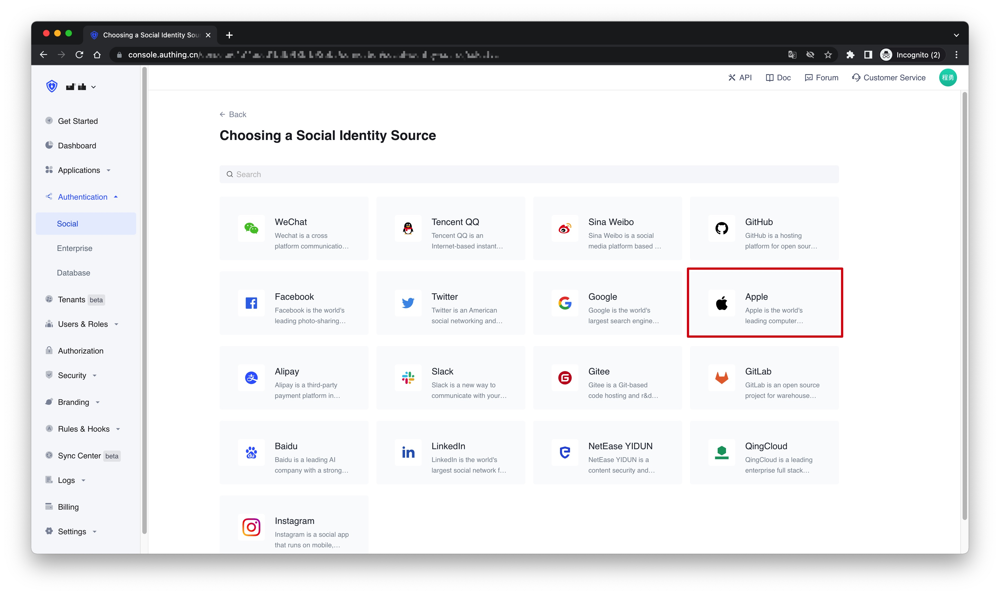
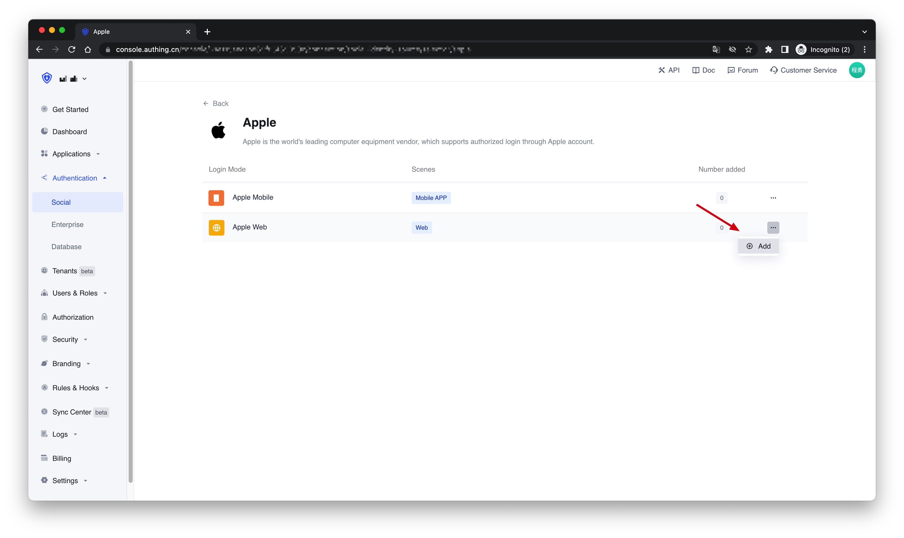
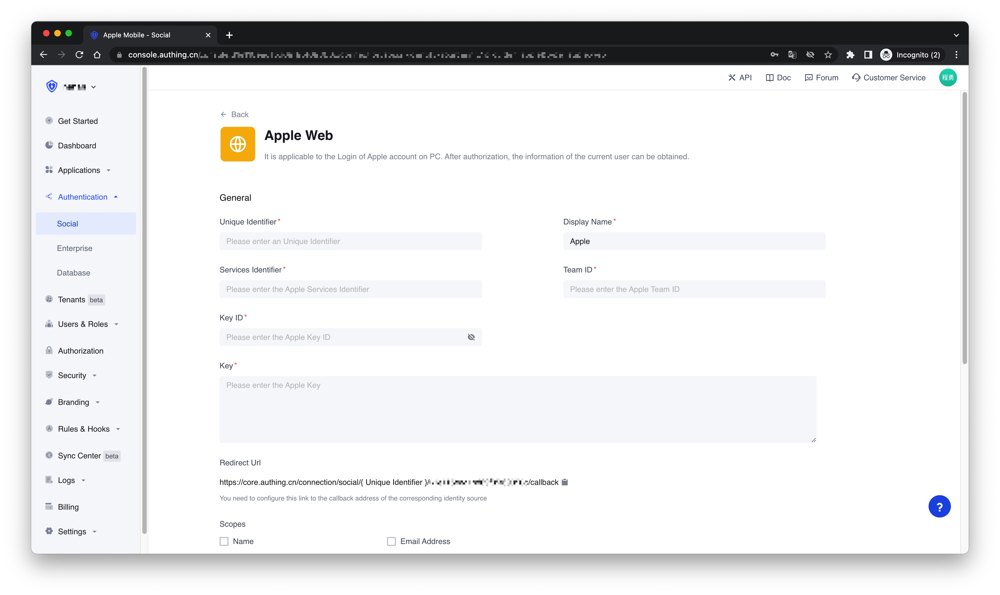
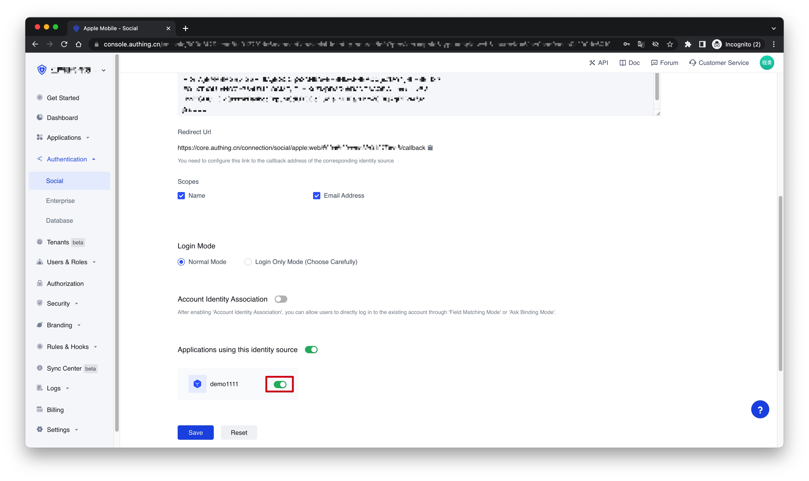
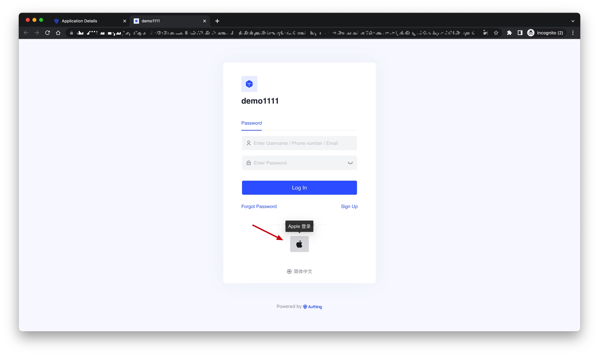

# Apple Web Social Login

<LastUpdated />

## Introduction

- **Overview**: Apple social login is a user who uses Apple as the identity provider to securely log in to a third-party application or website. By configuring and enabling Apple's social login in {{$localeConfig.brandName}}, you can quickly obtain basic open information of Apple through {{$localeConfig.brandName}} and help users achieve password-free login.
- **Application scenarios**: PC website
- **End-User Preview**:

## Precautions

- Please make sure that you have applied for an Apple developer account, otherwise the following operations cannot be performed. The address for applying for personal and company accounts: [https://developer.apple.com/programs/](https://developer.apple.com/programs/), and the address for applying for enterprise accounts: [https://developer.apple.com/programs/enterprise/](https://developer.apple.com/programs/enterprise/)
- If you do not have an {{$localeConfig.brandName}} Console account, please go to the [{{$localeConfig.brandName}} Console](https://authing.cn/) to register a developer account.

## Step 1: Configure in the Apple Developer Center

### Get Team ID

Go to the [Membership page](https://developer.apple.com/account/#/membership) of the [Apple Developer Portal](https://developer.apple.com/account/#) and record the `Team ID`:

### Create an App ID

1. On the Apple Developer Portal, **Certificates, Identifiers & Profiles** > **Identifiers** page, click the ➕ icon to create an app:

2. Select **App IDs** and click the **Continue** button to continue:

3. Select the application type and click the **Continue** button to continue:

4. To complete the application **Description** and **Bundle ID**, record the **Bundle ID**:

5. Finally, click the **Continue** button, confirm the information in the opened page, and click the **Register** button to create the application.

### Create a Service ID

1. Go back to **Certificates, Identifiers & Profiles** > **Identifiers**, and click the ➕ icon, select **Services IDs** and click the **Continue** button to continue:

2. Fill in the **Description** and **Identifier**, then click the **Continue** button, and click the **Register** button on the confirmation page that opens to create the Service:

3. Locate the service you just created, check **Sign In with Apple**, click **Configure**:

4. Fill in **Domains and Subdomains** and **Return URLs**:

- **Domains and Subdomains**: Please fill in `core.authing.cn`
- **Return URLs**: Please fill in `https://core.authing.cn/connection/social/{Unique Identifier}/{YOUR_USER_POOL_ID}/callback`, and replace `{Unique Identifier}` with the `Unique Identifier` of the identity provider you are creating by {{$localeConfig.brandName}}, `{ YOUR_USER_POOL_ID}` with your [UserPool ID](/en/guides/faqs/get-userpool-id-and-secret.md)

5. Click **Save**, **Continue**, and finally **Register**, and record the **Service ID**.

### Configure Signing Key

1. Go back to the **Certificates, Identifiers & Profiles** page, switch to the **Keys** Tab, and click the ➕ icon:

2. Enter a name and check **Sign in with Apple**, click **Configure** to make sure the **Primary App ID** you selected is the one you just created:

3. Click **Save**, **Continue**, and finally **Register**.

4. Once created, record the **Key ID** and click **Download** to download the key:

## Step 2: Configure Apple in the {{$localeConfig.brandName}} Console

2.1 On the "**Social**" page of the {{$localeConfig.brandName}} Console, click the "**Create Connection**" button to enter the "**Choosing a Social Identity Source**" page.

2.2 On the "**Choosing a Social Identity Source**" page, click the "**Apple**" card.

2.3 Continue to click the "**Apple Web**" login mode, or click "**... Add**".

2.4 On the "**Apple Web**" configuration page, fill in the relevant field information.

| Field                        | Description                                                                                                                                                                                                                                                                                                       |
| ---------------------------- | ----------------------------------------------------------------------------------------------------------------------------------------------------------------------------------------------------------------------------------------------------------------------------------------------------------------- |
| Unique Identifier            | a. The unique identifier consists of lowercase letters, numbers, and -, and the length is less than 32 digits.  b. This is the unique identifier of this connection and cannot be modified after setting.                                                                                                    |
| Display Name                 | This name will be displayed on the button on the end user's login screen.                                                                                                                                                                                                                                         |
| Services Identifier          | Apple Service ID                                                                                                                                                                                                                                                                                                  |
| Team ID                      | Apple Team ID.                                                                                                                                                                                                                                                                                                    |
| Key ID                       | Apple Signing Key ID.                                                                                                                                                                                                                                                                                             |
| Key                          | Contents of the Apple Signing Key.                                                                                                                                                                                                                                                                                |
| Scopes                       | Name and Email Address can be checked.                                                                                                                                                                                                                                                                            |
| Login Mode                   | After enabling the "**Login Only Mode**", you can only log in to an existing account and cannot create a new account. Please choose carefully.                                                                                                                                                                    |
| Account Identity Association | When "**Account Identity Association**" is not enabled, a new user is created by default when a user logs in through an identity provider. After enabling "**Account Identity Association**", you can allow users to directly log in to existing accounts through "**Field Matching**" or "**Ask Binding Mode**". |

2.5 After the configuration is complete, click the "Create" or "Save" button to complete the creation.

## Step 3: Development access

- **Recommended development access method**: Use a hosted login page
- **Description of advantages and disadvantages**: The operation and maintenance are simple, and {{$localeConfig.brandName}} is responsible for the operation and maintenance. Each user pool has an independent second-level domain name; if you need to embed it into your application, you need to use the pop-up mode to log in, that is: after clicking the login button, a window will pop up, the content is the login page hosted by {{$localeConfig.brandName}}, or the browser The server redirects to the login page hosted by {{$localeConfig.brandName}}.
- **Detailed access method**:

  3.1 Create an application in the {{$localeConfig.brandName}} Console. For details, see: [How to create an application in {{$localeConfig.brandName}}](/en/guides/app/create-app.md)

  3.2 On the created "**Apple Web**" identity provider connection details page, open and associate an application created in the {{$localeConfig.brandName}} Console
  

  3.3 Click the "**Experience Login**" button of the app in the {{$localeConfig.brandName}} Console, and experience the "**Apple Web**" login in the pop-up login window
  

