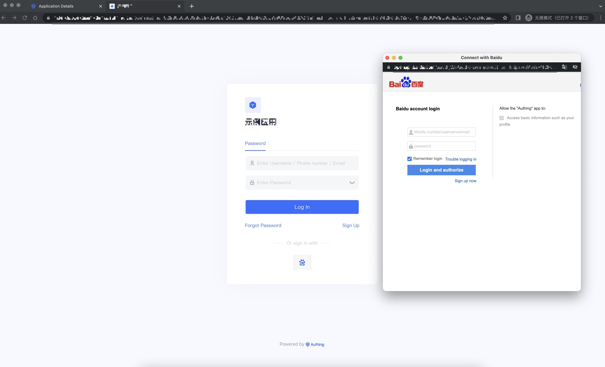
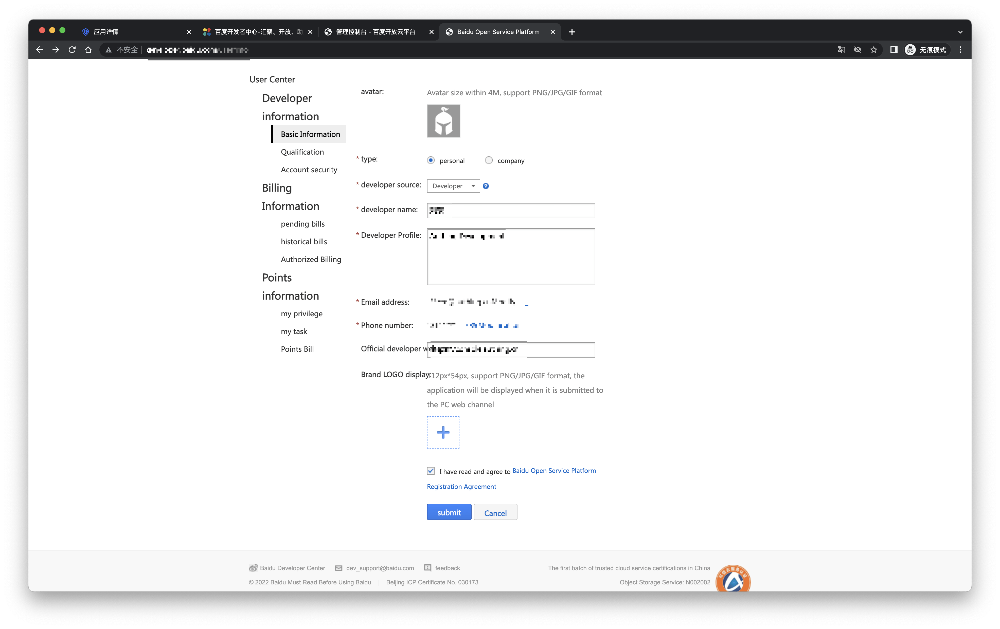
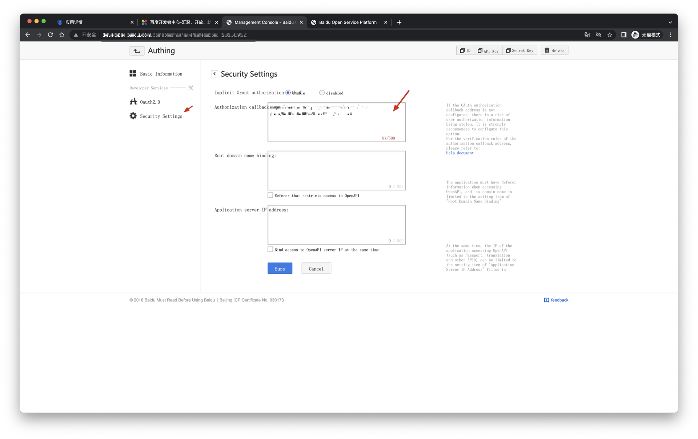
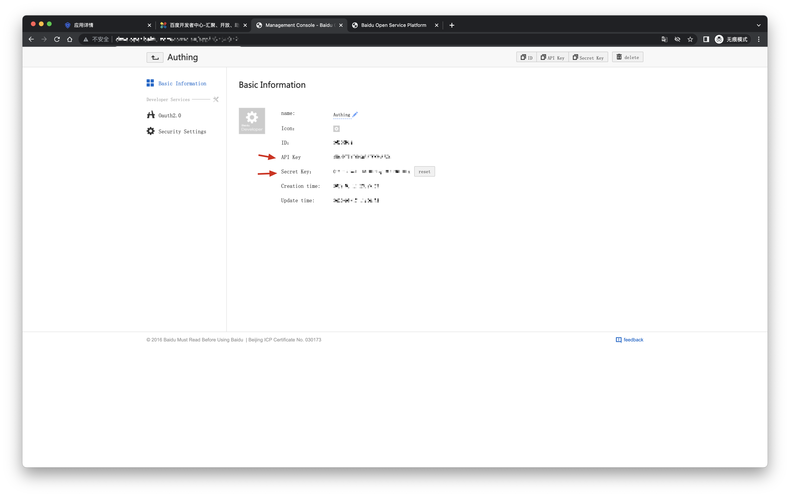
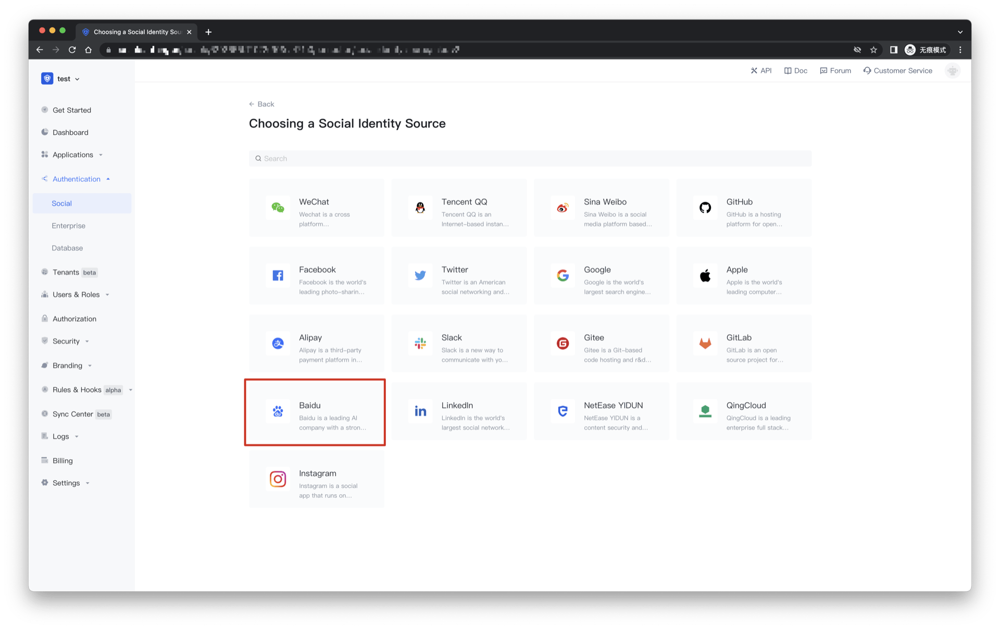
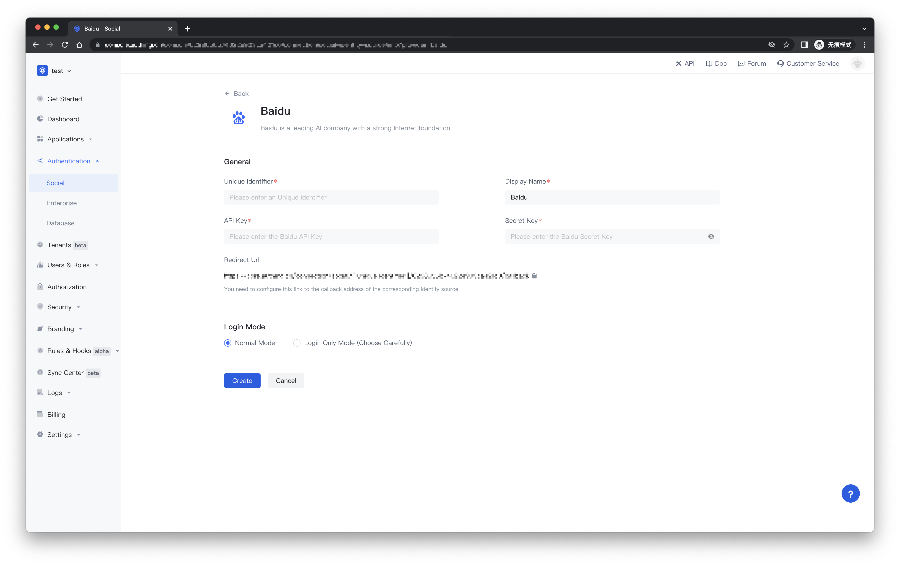
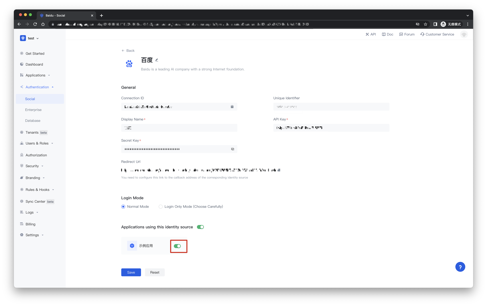
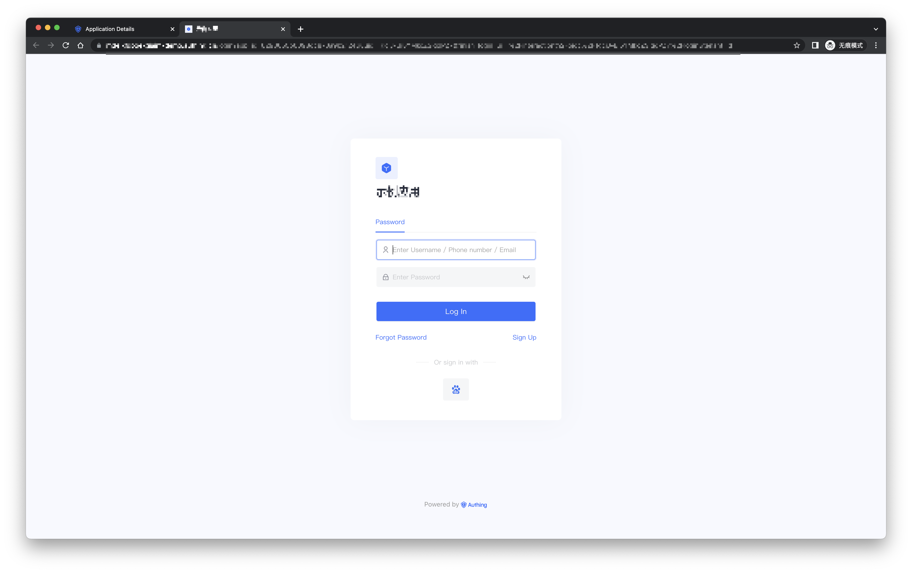

# Baidu social login

<LastUpdated/>

## Scene introduction

- **Overview**: Baidu social login is a secure login for users to third-party applications or websites using Baidu as their identity source. By configuring and enabling Baidu's social login in {{$localeConfig.brandName}}, you can quickly obtain Baidu's basic open information and help users achieve password-free login through {{$localeConfig.brandName}}.
- **Application scenario**: Baidu OAuth application
- **End User Preview**:

## Precautions:

- If you have not registered a Baidu developer account, please go to [Baidu Developer Center](https://developer.baidu.com/) to register a developer account.
- If you do not have a {{$localeConfig.brandName}} console account, please go to the [{{$localeConfig.brandName}} console](https://authing.cn/) to register a developer account.

## Step 1: Create a website application on Baidu Open Platform

- Register [Baidu Developer Center](https://developer.baidu.com/), log in and go to [Baidu Developer Service Management Console](http://developer.baidu.com/console#app/project), Fill in the developer information and create a project (application):

- After the creation is complete, you need to record the API Key (ie Client ID) and Secret Key (ie Client Secret) of the application, which will be used later. 

On the security settings page, set the authorization callback page address to: https://core.authing.cn/connection/social/baidu/<YOUR_USERPOOL_ID>/callback

> Replace <YOUR_USERPOOL_ID> in it with your user pool ID.

## Step 2: Configure Baidu in the {{$localeConfig.brandName}} console

2.1 Please click the "Create Connection" button on the "Social" page of the {{$localeConfig.brandName}} console to enter the "Choosing a Social Identity Source" page.

2.2 Please click the "Baidu" identity source button on the "Create Connection" - "Choosing a Social Identity Source" page of the {{$localeConfig.brandName}} console to enter the "Baidu Login Mode" page.

2.3 Please configure the relevant field information on the "Social" - "Baidu" page of the {{$localeConfig.brandName}} console.

| Field/function    | describe                                                     |
| ----- | ------------ | ------------------------------------------------------------ |
| Unique Identifier | a. The unique identifier consists of lowercase letters, numbers, and -, and the length is less than 32 bits. b. This is the unique identifier of this connection and cannot be modified after setting. |
| Display Name | This name will be displayed on buttons on the end user's login screen. |
| API Key | Baidu App ID, which needs to be obtained from the Baidu Developer Center. |
| Secret Key | Baidu application key, which needs to be obtained on the Baidu Developer Center. |
| Callback Address |Baidu Developer Center Valid Jump URI. This URL needs to be configured on the Baidu Developer Center. |
| Login Mode | After "Login Only Mode" is enabled, you can only log in to an existing account and cannot create a new account. Please choose carefully. |

After the configuration is complete, click the "Create" or "Save" button to complete the creation.

After creating the Baidu identity source on the {{$localeConfig.brandName}} console, you need to configure the callback address to the authorization callback page on the Baidu Open Platform.

## Step 3: Development Access

- **Recommended development access method**: use the hosted login page

- **Description of advantages and disadvantages**: Simple operation and maintenance, and {{$localeConfig.brandName}} is responsible for operation and maintenance. Each user pool has an independent second-level domain name; if you need to embed it into your application, you need to use the pop-up mode to log in, that is: after clicking the login button, a window will pop up with the content of {{$localeConfig.brandName}} hosting login page, or redirect the browser to the login page hosted by {{$localeConfig.brandName}}.

- **Detailed access method**:

3.1 Create an app in the {{$localeConfig.brandName}} console. For details, see: [How to create an app in {{$localeConfig.brandName}}](https://docs.authing.cn/v2/guides/app/create-app.html)

3.2 On the created Baidu identity source connection details page, open and associate an application created in the {{$localeConfig.brandName}} console

3.3 Experience Baidu third-party login on the login page

