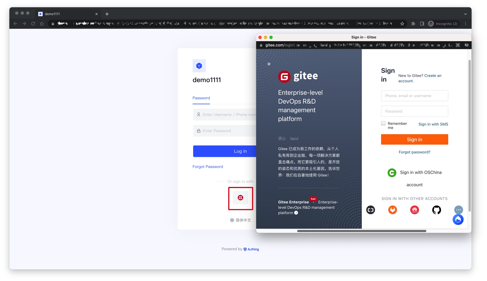
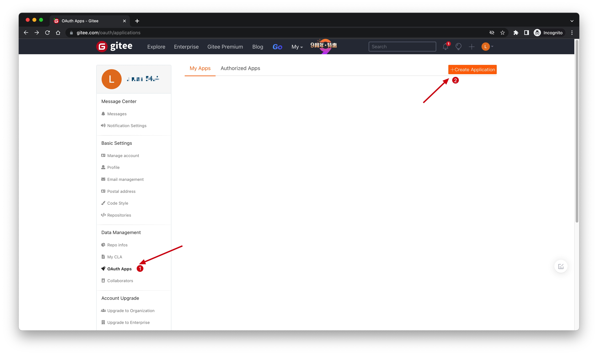
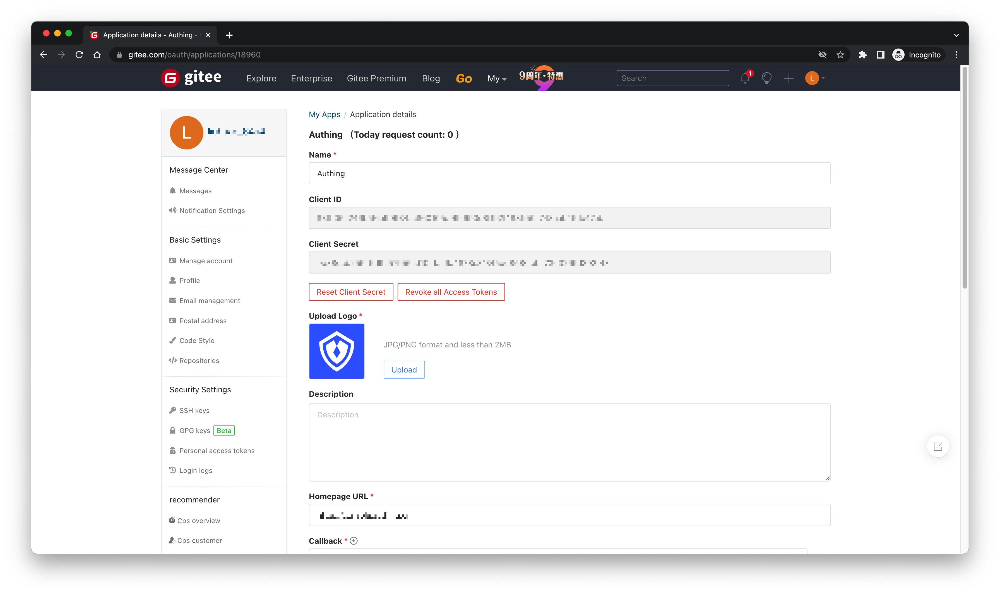
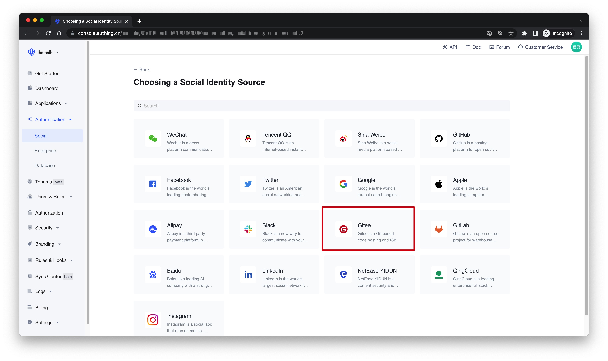
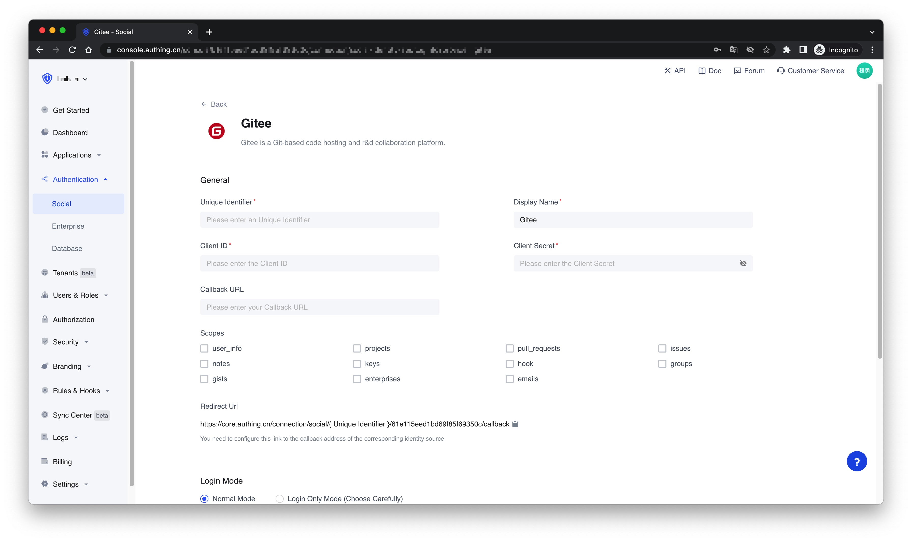
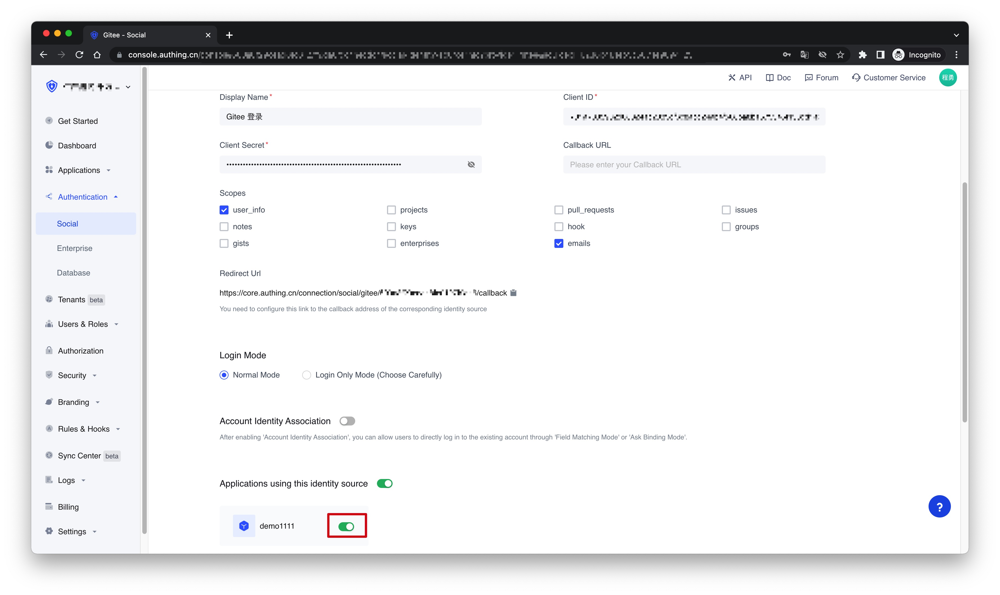
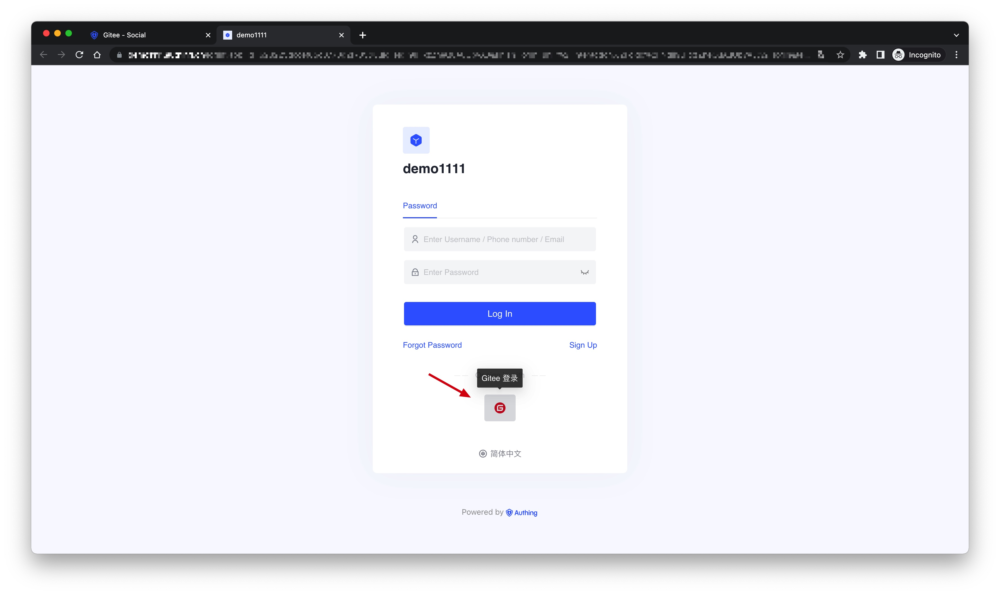

# Gitee Social Login

<LastUpdated />

## Introduction

- **Overview**: Gitee social login is a user who uses Gitee as the identity provider to securely log in to a third-party application or website. By configuring and enabling Gitee's social login in {{$localeConfig.brandName}}, you can quickly obtain basic open information of Gitee through {{$localeConfig.brandName}} and help users achieve password-free login.
- **Application scenarios**: PC website
- **End-User Preview**:

## Precautions

- If you don't have a Gitee account, please go to [gitee.com](https://gitee.com/signup) to register an account
- If you do not have an {{$localeConfig.brandName}} Console account, please go to the [{{$localeConfig.brandName}} Console](https://authing.cn/) to register a developer account.

## Step 1: Create an OAuth application in Gitee

Go to Gitee's application management page and click "**Create Application**":

On the Create Application page, configure the following information:

- Redirect: Fill in `https://core.authing.cn/connection/social/{Unique Identifier}/{YOUR_USER_POOL_ID}/callback`, you need to replace `{Unique Identifier}` with your {{$localeConfig .brandName}} The `Unique Identifier` filled in the identity provider created, `{YOUR_USER_POOL_ID}` is replaced with your [UserPool ID](/en/guides/faqs/get-userpool-id-and-secret.md)
  

Finally, click "**Create Application**". After the creation is complete, you need to record the `Client ID` and `Client Secret`, which will be used in the next step.

## Step 2: Configure Gitee in the {{$localeConfig.brandName}} Console

2.1 On the "**Social**" page of the {{$localeConfig.brandName}} Console, click the "**Create Connection**" button to enter the "**Choosing a Social Identity Source**" page.

2.2 On the "**Choosing a Social Identity Source**" page, click the "**Gitee**" card.

2.3 On the "**Gitee**" configuration page, fill in the relevant field information obtained in the step 1.

| Field                        | Description                                                                                                                                                                                                                                                                                                       |
| ---------------------------- | ----------------------------------------------------------------------------------------------------------------------------------------------------------------------------------------------------------------------------------------------------------------------------------------------------------------- |
| Unique Identifier            | a. The unique identifier consists of lowercase letters, numbers, and -, and the length is less than 32 digits.  b. This is the unique identifier of this connection and cannot be modified after setting.                                                                                                    |
| Display Name                 | This name will be displayed on the button on the end user's login screen.                                                                                                                                                                                                                                         |
| Client ID                    | The Gitee application ID obtained in the previous step.                                                                                                                                                                                                                                                           |
| Client Secret                | The Gitee application Secret obtained in the previous step.                                                                                                                                                                                                                                                       |
| Callback URL                 | You can fill in your business callback address. After the user completes the login, the browser will redirect to this address.                                                                                                                                                                                    |
| Scopes                       | By default, {{$localeConfig.brandName}} will only apply for authorization of basic user information (such as avatar, nickname, etc.) from the user. If you need more advanced permissions, you can check the corresponding options.                                                                               |
| Login Mode                   | After enabling the "**Login Only Mode**", you can only log in to an existing account and cannot create a new account. Please choose carefully.                                                                                                                                                                    |
| Account Identity Association | When "**Account Identity Association**" is not enabled, a new user is created by default when a user logs in through an identity provider. After enabling "**Account Identity Association**", you can allow users to directly log in to existing accounts through "**Field Matching**" or "**Ask Binding Mode**". |

2.4 After the configuration is complete, click the "Create" or "Save" button to complete the creation.

## Step 3: Development access

- **Recommended development access method**: Use a hosted login page
- **Description of advantages and disadvantages**: The operation and maintenance are simple, and {{$localeConfig.brandName}} is responsible for the operation and maintenance. Each user pool has an independent second-level domain name; if you need to embed it into your application, you need to use the pop-up mode to log in, that is: after clicking the login button, a window will pop up, the content is the login page hosted by {{$localeConfig.brandName}}, or the browser The server redirects to the login page hosted by {{$localeConfig.brandName}}.
- **Detailed access method**:

  3.1 Create an application in the {{$localeConfig.brandName}} Console. For details, see: [How to create an application in {{$localeConfig.brandName}}](/en/guides/app/create-app.md)

  3.2 On the created "**Gitee**" identity provider connection details page, open and associate an application created in the {{$localeConfig.brandName}} Console
  

  3.3 Click the "**Experience Login**" button of the app in the {{$localeConfig.brandName}} Console, and experience the "**Gitee**" login in the pop-up login window
  

