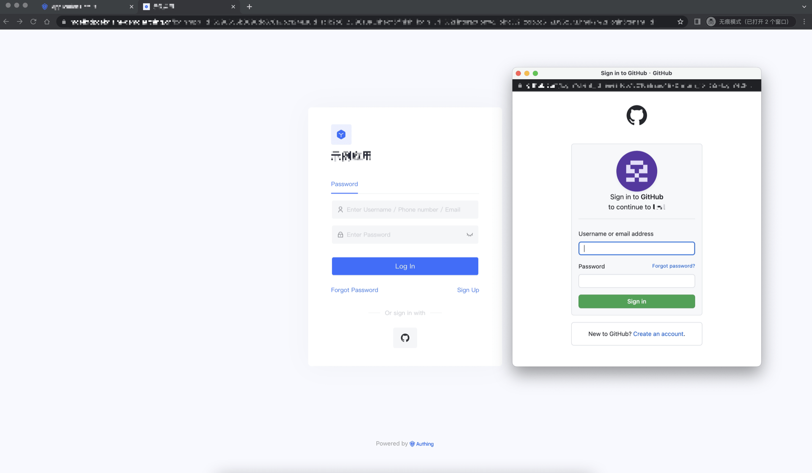
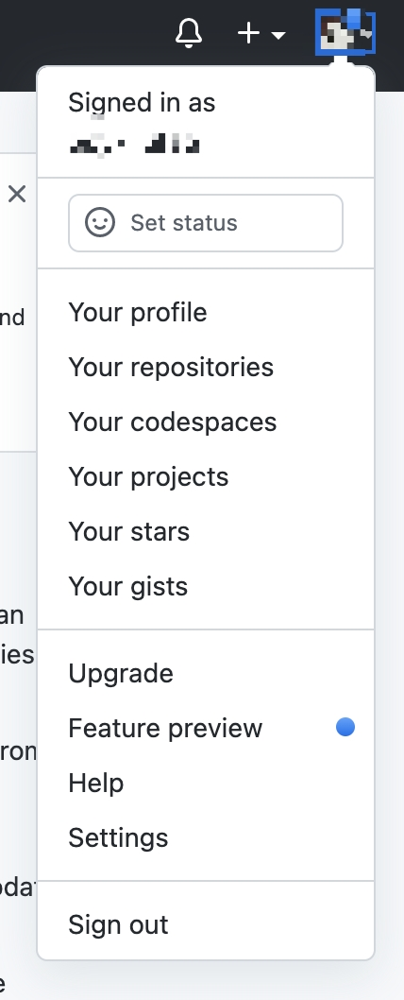
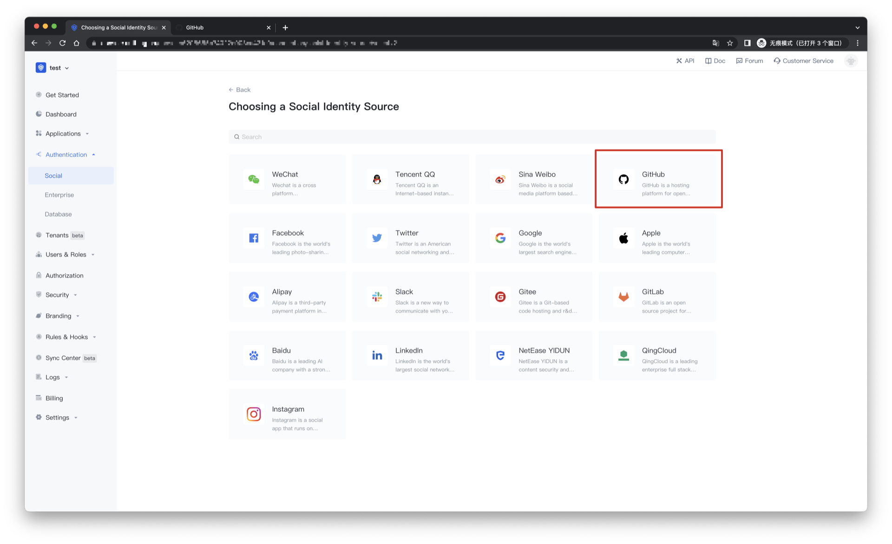
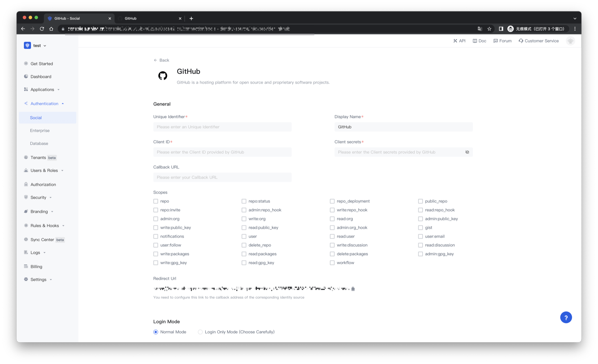
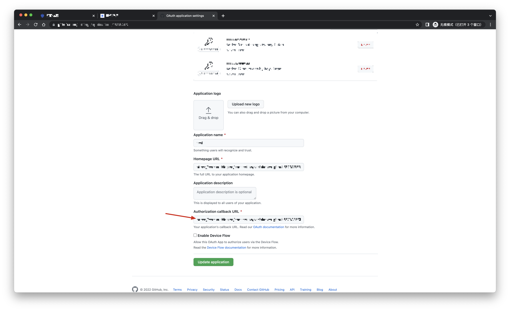
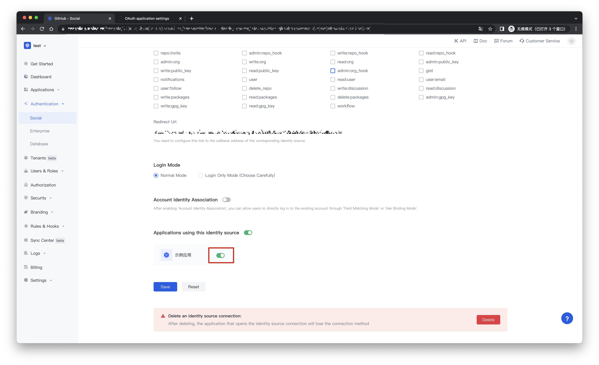
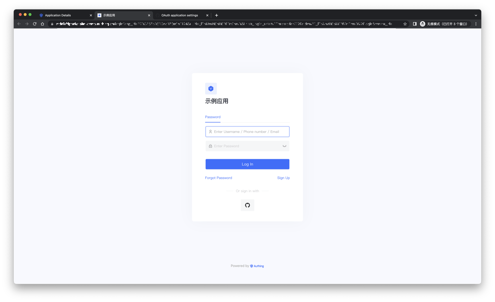

# Github social login

<LastUpdated/>

## Scene introduction

- **Overview**: Github social login is a secure login for users to third-party applications or websites using Github as their identity source. By configuring and enabling Github's social login in {{$localeConfig.brandName}}, you can quickly obtain basic open information on Github through {{$localeConfig.brandName}} and help users achieve password-free login.
- **Scenario**: Create an OAuth application
- **End User Preview**:

## Precautions:

- If you do not have a Github account, please go to [GitHub](https://www.github.com) to register a developer account.
- Please follow the [GitHub documentation](https://docs.github.com/cn/developers/apps/building-oauth-apps/creating-an-oauth-app) guide to create a GitHub OAuth application and record the client ID of the application and Client Secret.
- If you do not have a {{$localeConfig.brandName}} console account, please go to the [{{$localeConfig.brandName}} console](https://authing.cn/) to register a developer account.

## Step 1: Create an OAuth application on Github

- In the upper right corner of any Github page, click your profile photo, then click Settings.

- In the left column, click <> Developer Settings.

- In the left sidebar, click OAuth Applications.

- Click New OAuth App.

- In "Application name", enter the name of the application.

- In "Homepage URL", enter the full URL of the application website.

- In Authorization callback URL, enter the callback URL for the application.

During the application creation process, you need to configure the allowed callback addresses, please use the following settings: https://core.authing.cn/connection/social/github/:userPoolId/callback

> Please replace :userPoolId with the user pool ID of your {{$localeConfig.brandName}} console

## Step 2: Configure Github in the {{$localeConfig.brandName}} console

2.1 Please click the "Create Connection" button on the "Social" page of the {{$localeConfig.brandName}} console to enter the "Choosing a Social Identity Source" page.

2.2 Please click the "Github" identity source button on the "Create Connection" - "Choosing a Social Identity Source" page of the {{$localeConfig.brandName}} console to enter the "Github Login Mode" page.

2.3 Please configure the relevant field information on the "Social" - "Github" page of the {{$localeConfig.brandName}} console.

| Field/function    | describe                                                     |
| ----- | ------------ | ------------------------------------------------------------ |
| Unique Identifier | a. The unique identifier consists of lowercase letters, numbers, and -, and the length is less than 32 bits. b. This is the unique identifier of this connection and cannot be modified after setting. |
| Display Name | This name will be displayed on buttons on the end user's login screen. |
| Client ID  | Github application number, which needs to be obtained on the Github. |
| Client secrets | Github application key, which needs to be obtained on the Github.                  |
| Callback URL | You can fill in your business callback address. After the user completes the login, the browser will jump to this address. |
| Scopes | By default, {{$localeConfig.brandName}} will only apply to the user for authorization of basic user information (such as avatar, nickname, etc.), if you need more advanced permissions, you can check the corresponding options. |
| Redirect Url | Github valid redirect URI. This URL needs to be configured on the Github. |
| Login Mode | After "Login Only Mode" is enabled, you can only log in to an existing account and cannot create a new account. Please choose carefully. |
| Account Identity Association | When "Account Identity Association" is not enabled, a new user is created by default when a user logs in through an identity source. After enabling "Account Identity Association", you can allow users to directly log in to existing accounts through "Field Matching" or "Asking for Binding". a. Association method: select |

After the configuration is complete, click the "Create" or "Save" button to complete the creation.

After creating the Github identity source on the {{$localeConfig.brandName}} console, you need to configure the callback address to the Authorization callback URL on Github.

## Step 3: Development Access

- **Recommended development access method**: use the hosted login page

- **Description of advantages and disadvantages**: Simple operation and maintenance, and {{$localeConfig.brandName}} is responsible for operation and maintenance. Each user pool has an independent second-level domain name; if you need to embed it into your application, you need to use the pop-up mode to log in, that is: after clicking the login button, a window will pop up with the content of {{$localeConfig.brandName}} hosting login page, or redirect the browser to the login page hosted by {{$localeConfig.brandName}}.

- **Detailed access method**:

3.1 Create an application in the {{$localeConfig.brandName}} console. For details, see: [How to create an application in {{$localeConfig.brandName}}](https://docs.authing.cn/v2/en/guides/app/create-app.html)

3.2 On the created Github source connection details page, open and associate an application created in the {{$localeConfig.brandName}} console

3.3 Experience Github third-party login on the login page

