# Google Social Login

<LastUpdated/>

## Scene introduction

- **Overview**: Google Social Login is a user's secure login to third-party applications or websites using Google as the source. By configuring and enabling Google's social login in {{$localeConfig.brandName}}, you can quickly obtain basic open Google information and help users achieve password-free login through {{$localeConfig.brandName}}.
- **Scenario**: Create an OAuth application
- **End User Preview**:

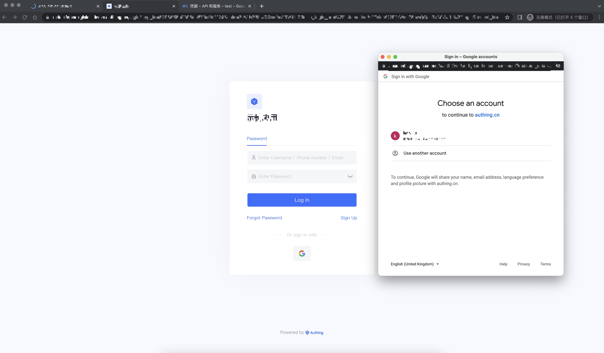

## Precautions:

- If you do not have a Google account, please go to the [Google Developer Console](https://accounts.google.com/signin/v2/identifier?hl=en&continue=https%3A%2F%2Fwww.google.com%2F&ec=GAlAmgQ&flowName=GlifWebSignIn&flowEntry=AddSession) registered email.
- If you do not have a {{$localeConfig.brandName}} console account, please go to the [{{$localeConfig.brandName}} console](https://authing.cn/) to register a developer account.

## Step 1: Create an OAuth application in the Google Developer Console

- Open the [Google API Console Credentials](https://console.cloud.google.com/apis/credentials) console.

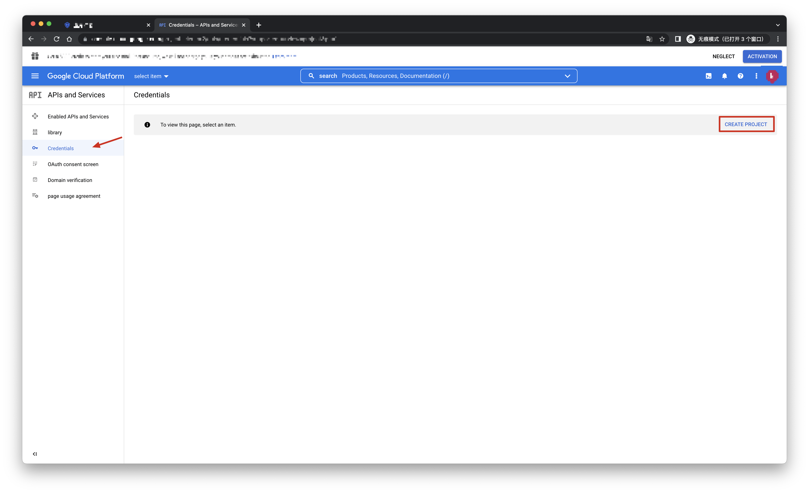
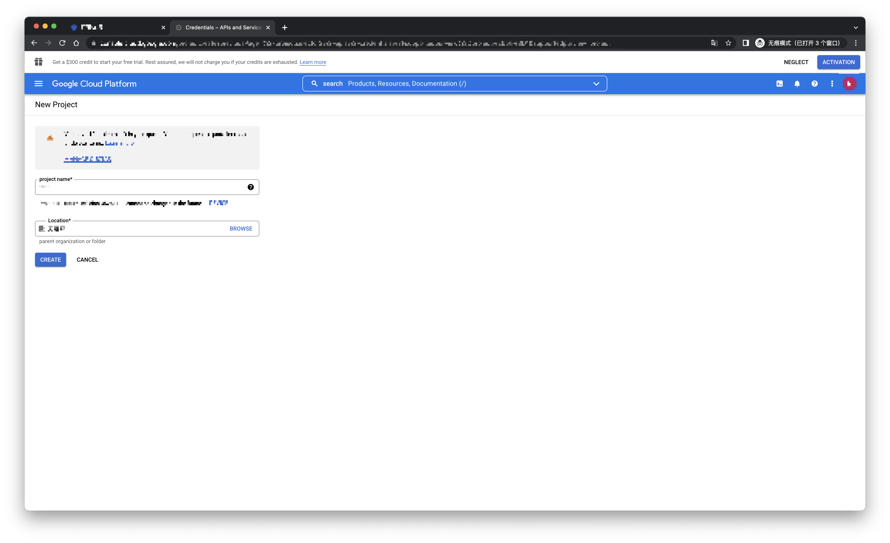

- On the Credentials page, click Create credentials, then select OAuth client ID.

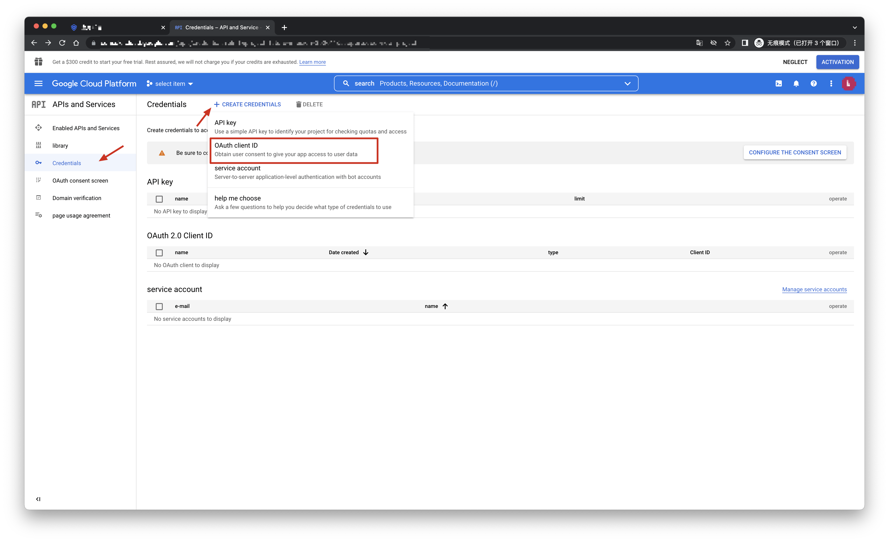

- Select the application type as Web Application and fill in Authorized redirect URIs.

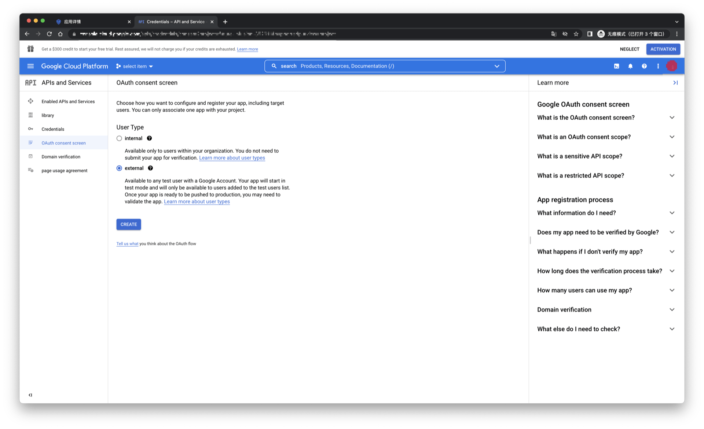

- Click the [Create] button;
- After the creation is successful, on the next page you can get the Client ID and Client Secret of this application, which you need to record.

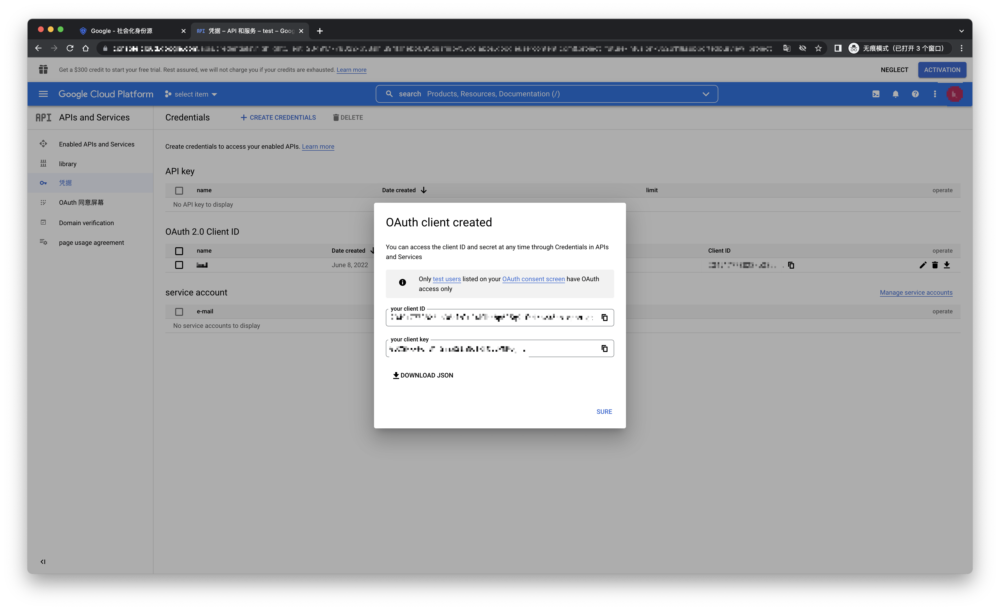

## Step 2: Configure Google in the {{$localeConfig.brandName}} console

2.1 Please click the "Create Connection" button on the "Social" page of the {{$localeConfig.brandName}} console to enter the "Choosing a Social Identity Source" page.

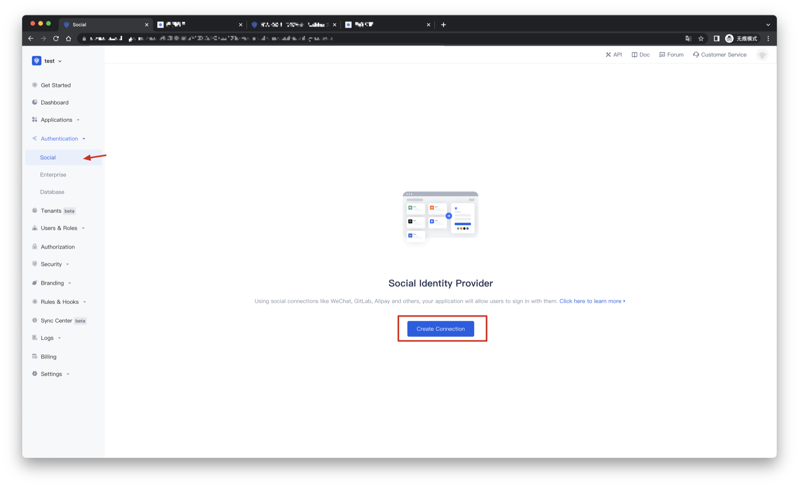

2.2 Please click the "Google" identity source button on the "Create Connection" - "Choosing a Social Identity Source" page of the {{$localeConfig.brandName}} console to enter the "Google Login Mode" page.

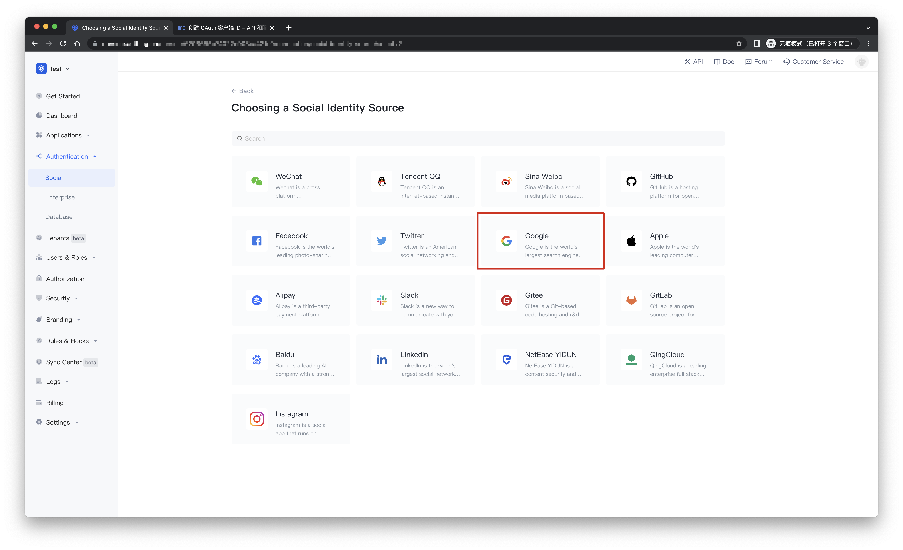

2.3 Please configure the relevant field information on the "Social" - "Google" page of the {{$localeConfig.brandName}} console.

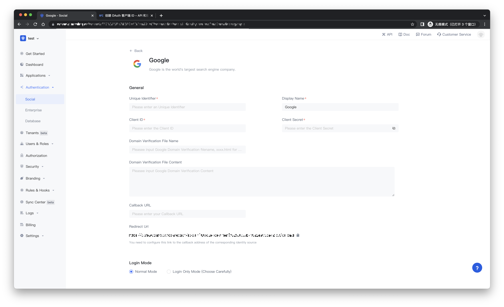

| Field/function    | describe                                                     |
| ----- | ------------ | ------------------------------------------------------------ |
| Unique ID | a. The unique ID consists of lowercase letters, numbers, and -, and the length is less than 32 bits. b. This is the unique identifier of this connection and cannot be modified after setting. |
| Display Name | This name will be displayed on buttons on the end user's login screen. |
| Client ID | Google ID, which needs to be obtained on the Google Open Platform. |
| Client secrets | Google secrets, which need to be obtained on the Google Open Platform. |
|Domain Verification File Name| Google domain verification HTML file name, such as xxxx.html |
|Domain Verification File Content| Google Domain Verification HTML File Content |
| Callback URL | You can fill in your business callback address. After the user completes the login, the browser will jump to this address. |
| Scopes | By default, {{$localeConfig.brandName}} will only apply to the user for authorization of basic user information (such as avatar, nickname, etc.), if you need more advanced permissions, you can check the corresponding options. |
| Callback address | Google valid redirect URI. This URL needs to be configured on the Google Open Platform. |
| Login Mode | After "Login Only Mode" is enabled, you can only log in to an existing account and cannot create a new account. Please choose carefully. |
| Account Identity Association | When "Account Identity Association" is not enabled, a new user is created by default when a user logs in through an identity source. After enabling "Account Identity Association", you can allow users to log in to existing accounts directly through "Field Matching" or "Asking for Binding". a. Association method: select |

After the configuration is complete, click the "Create" or "Save" button to complete the creation.

After creating the Google identity source on the {{$localeConfig.brandName}} console, you need to configure the callback address to the Authorized redirect URI on the Google Open Platform.

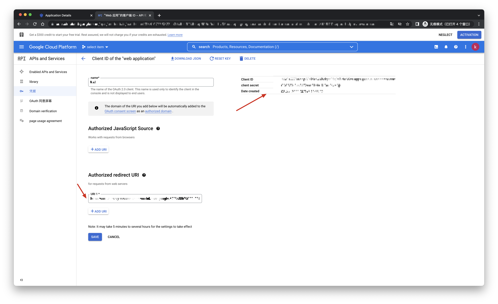

## Step 3: Development Access

- **Recommended development access method**: use the hosted login page

- **Description of advantages and disadvantages**: Simple operation and maintenance, and {{$localeConfig.brandName}} is responsible for operation and maintenance. Each user pool has an independent second-level domain name; if you need to embed it into your application, you need to use the pop-up mode to log in, that is: after clicking the login button, a window will pop up with the content of {{$localeConfig.brandName}} hosting login page, or redirect the browser to the login page hosted by {{$localeConfig.brandName}}.

- **Detailed access method**:

3.1 Create an app in the {{$localeConfig.brandName}} console. For details, see: [How to create an app in {{$localeConfig.brandName}}](https://docs.authing.cn/v2/guides/app/create-app.html)

3.2 On the created Google identity source connection details page, open and associate an application created in the {{$localeConfig.brandName}} console

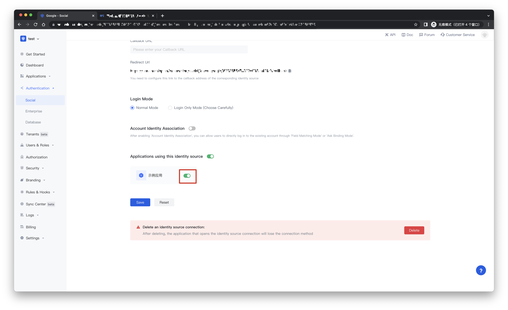

3.3 Experience Google third-party login on the login page

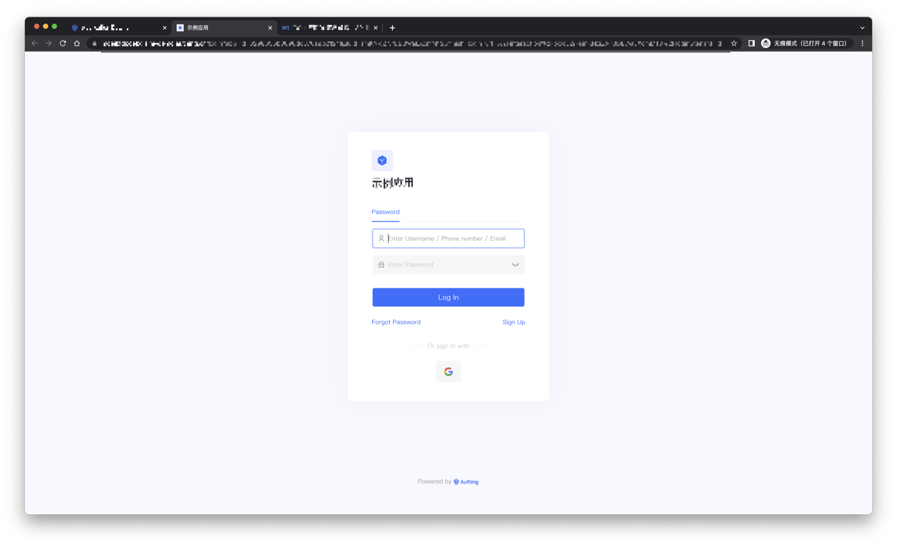

