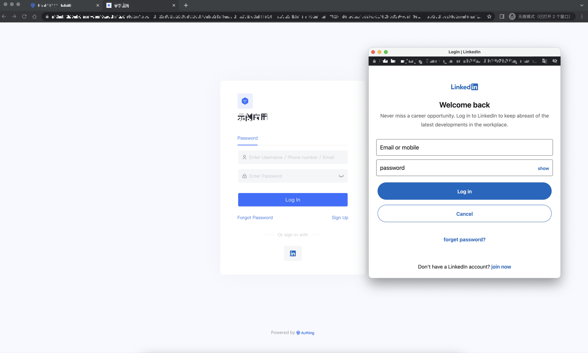
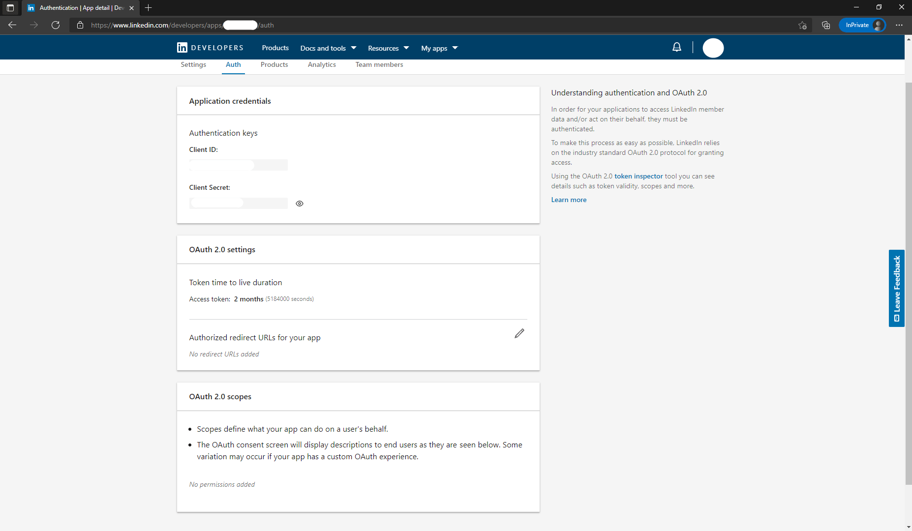
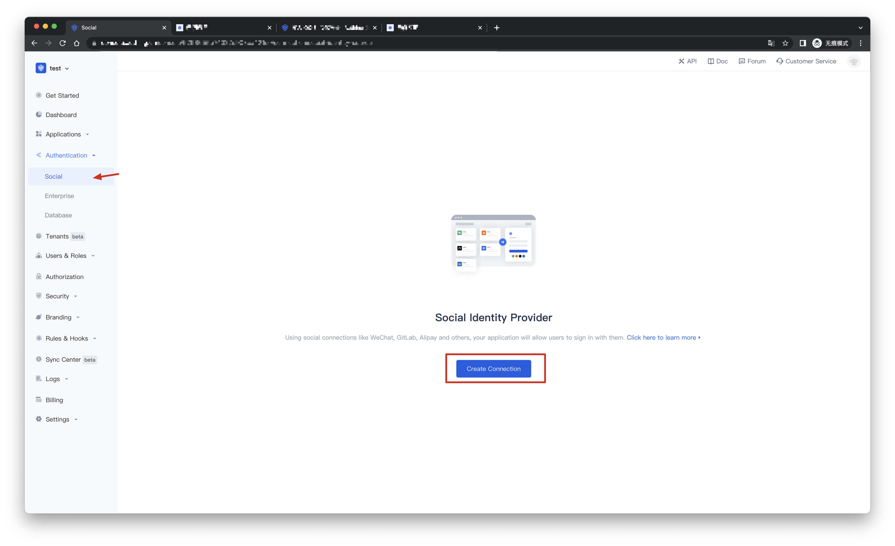
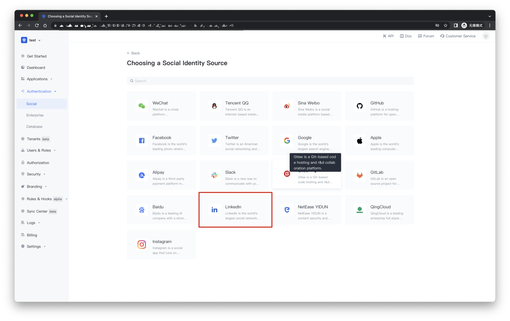
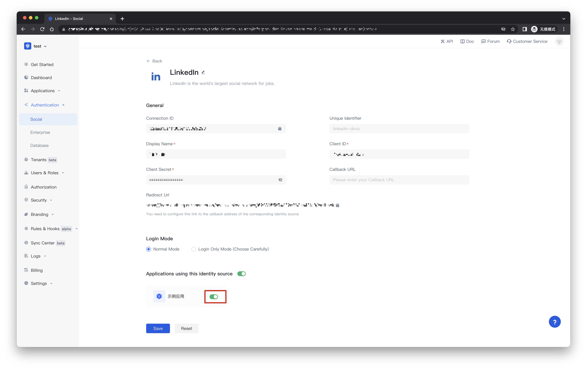
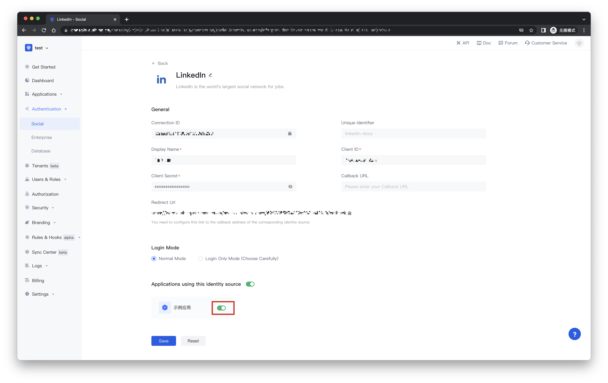
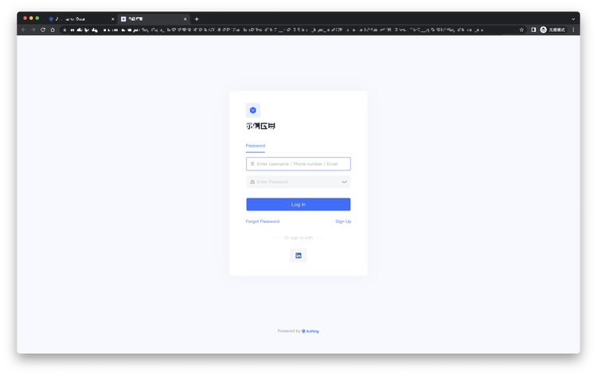

# LinkedIn Social Login

<LastUpdated/>

## Scene introduction

- **Overview**: LinkedIn social login is a secure login for users to third-party applications or websites using LinkedIn as their identity source. By configuring and enabling LinkedIn's social login in {{$localeConfig.brandName}}, you can quickly obtain basic open information on LinkedIn and help users achieve password-free login through {{$localeConfig.brandName}}.
- **Application Scenario**: Create an application
- **End User Preview**:

## Precautions:

- Follow the [Microsoft documentation](https://docs.microsoft.com/en-us/linkedin/consumer/integrations/self-serve/sign-in-with-linkedin#getting-started) guidelines to create an app.
- If you do not have a {{$localeConfig.brandName}} console account, please go to the [{{$localeConfig.brandName}} console](https://authing.cn/) to register a developer account.

## Step 1: Create an app on LinkedIn

- On [LinkedIn Developers](https://developer.linkedin.com/), click Create app to start creating your app.

- Enter the relevant information of your app and click Create app to complete the creation.

- After the creation is complete, view the app information under the Settings, Auth, Products, etc. tabs, and set the callback address by editing Authorized redirect URLs for your app. The callback address is set to: https://core.authing.cn/connection/social/{unique ID}/{YOUR_USERPOOL_ID}/callback.

- As shown in the image below, under the Products tab on this page, you will see all the products available for this app. Click the Select button to the right of Sign In with LinkedIn to select this feature and follow the prompts that follow to complete it. Typically, LinkedIn will approve your app for Sign In with LinkedIn after a few minutes.

- Please use the following settings for the callback address:https://core.authing.cn/connection/social/{ 唯一标识 }/{YOUR_USERPOOL_ID}/callback

> Replace {unique ID} with the unique ID of the identity source you are creating by Authing, and replace {YOUR_USERPOOL_ID} with your user pool ID

## Step 2: Configure LinkedIn in the {{$localeConfig.brandName}} console

2.1 Please click the "Create Connection" button on the "Social" page of the {{$localeConfig.brandName}} console to enter the "Choosing a Social Identity Source" page.

2.2 Please click the "Linkedin" identity source button on the "Create Connection" - "Choosing a Social Identity Source" page of the {{$localeConfig.brandName}} console to enter the "Linkedin Login Mode" page.

2.3 Please configure the relevant field information on the "Social" - "Linkedin" page of the {{$localeConfig.brandName}} console.

| Field/function    | describe                                                     |
| ----- | ------------ | 
| Unique Identifier | a. The unique identifier consists of lowercase letters, numbers, and -, and the length is less than 32 bits. b. This is the unique identifier of this connection and cannot be modified after setting. |
| Display Name | This name will be displayed on buttons on the end user's login screen. |
| Client ID | LinkedIn app ID, which needs to be obtained on linkedIn developers. |
| Client secrets | LinkedIn app secrets, which need to be obtained on linkedIn developers. |
| Callback URL | You can fill in your business callback address. After the user completes the login, the browser will jump to this address. |
| Callback address | LinkedIn valid redirect URI. This URL needs to be configured on linkedIn developers. |
| Login Mode | After "Login Only Mode" is enabled, you can only log in to an existing account and cannot create a new account. Please choose carefully. |

After the configuration is complete, click the "Create" or "Save" button to complete the creation.

After you've created your LinkedIn identity source on the {{$localeConfig.brandName}} console, you need to configure the callback address to the Authorized redirect URLs for your app on linkedIn developers.

## Step 3: Development Access

- **Recommended development access method**: use the hosted login page

- **Description of advantages and disadvantages**: Simple operation and maintenance, and {{$localeConfig.brandName}} is responsible for operation and maintenance. Each user pool has an independent second-level domain name; if you need to embed it into your application, you need to use the pop-up mode to log in, that is: after clicking the login button, a window will pop up with the content of {{$localeConfig.brandName}} hosting , or redirect the browser to the login page hosted by {{$localeConfig.brandName}}.

- **Detailed access method**:

3.1 Create an app in the {{$localeConfig.brandName}} console. For details, see: [How to create an app in {{$localeConfig.brandName}}](/guides/app-new/create-app/create-app.md)

3.2 On the LinkedIn identity source connection details page, open and associate an application created in the {{$localeConfig.brandName}} console

3.3 Experience LinkedIn third-party login on the login page

