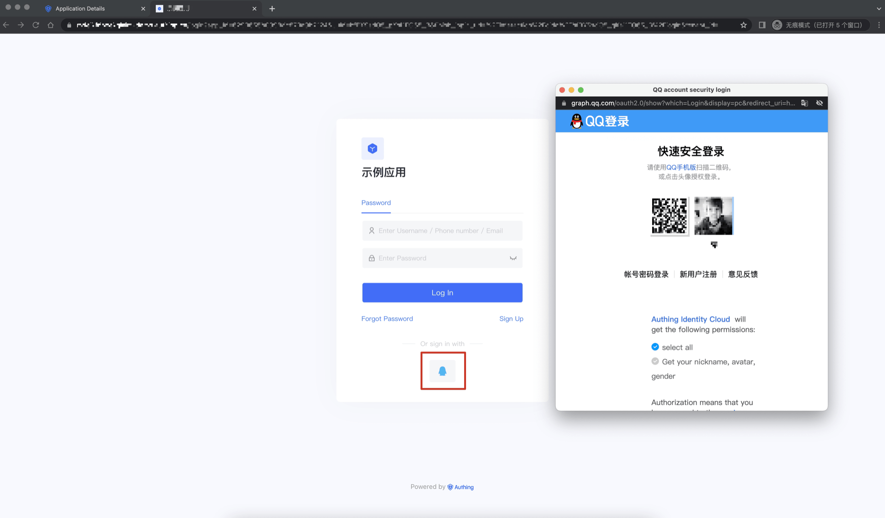
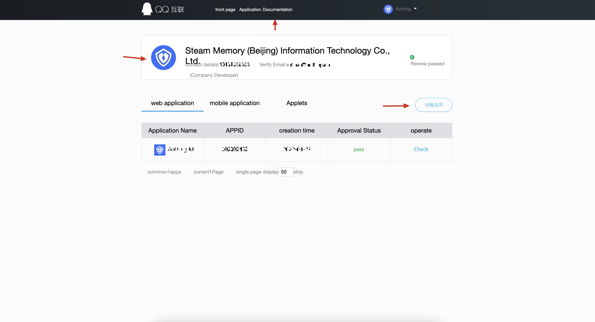
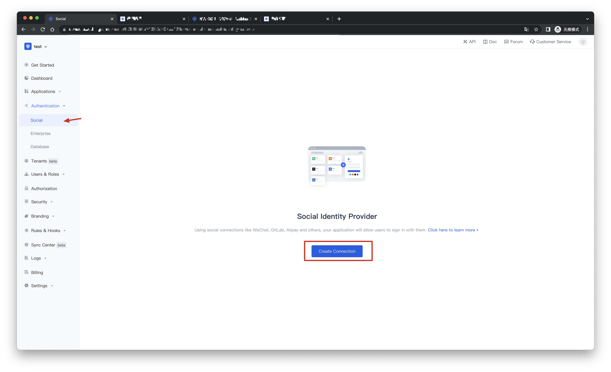
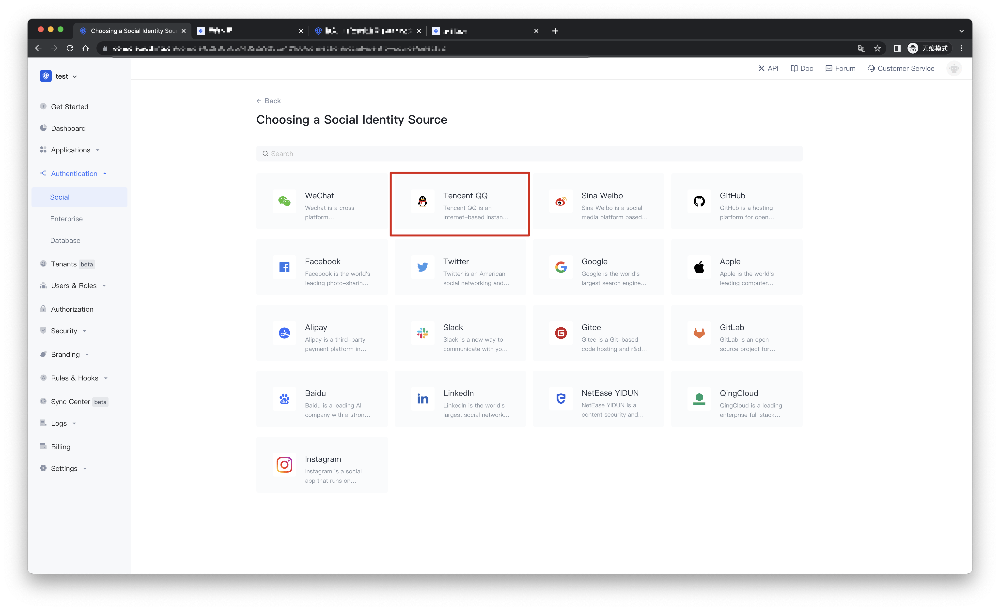
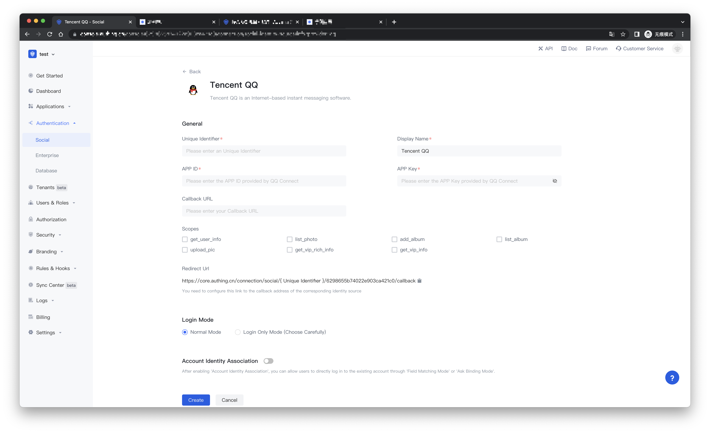
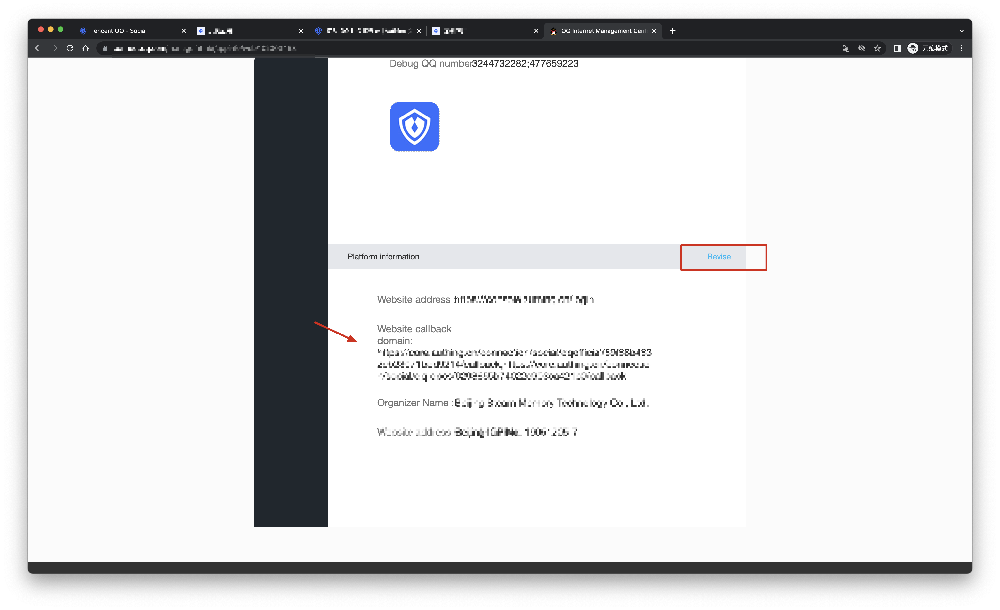
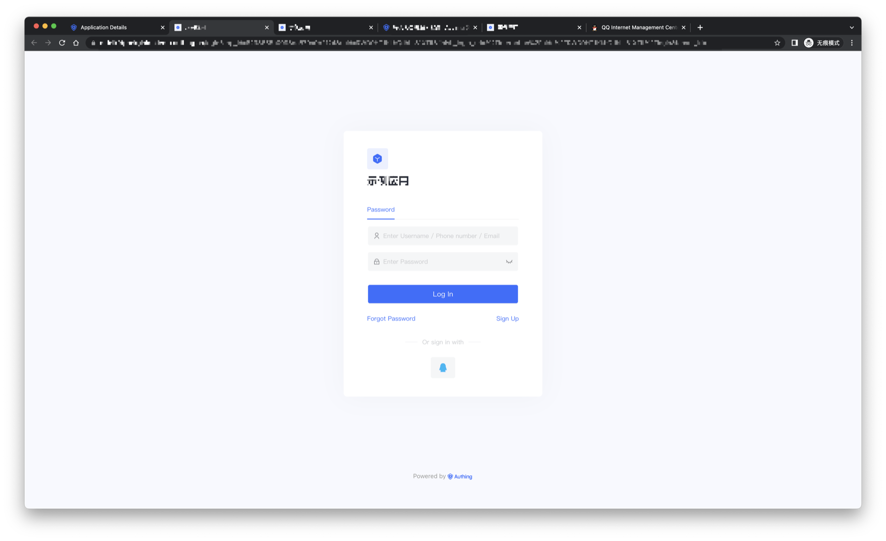

# Tencent QQ Social Login

<LastUpdated/>

## Scene introduction

- **Overview**: Tencent QQ social login is a user who uses Tencent QQ as the identity source to securely log in to third-party applications or websites. By configuring and enabling Tencent QQ's social login in {{$localeConfig.brandName}}, you can quickly obtain basic open information of Tencent QQ through {{$localeConfig.brandName}} and help users achieve password-free login.
- **Application scenarios**: create website applications, create mobile applications
- **End User Preview**:

## Precautions:

- If you do not have an account on the QQ Internet platform, please go to the [QQ Internet Center](https://connect.qq.com/manage.html#/) to register a developer account.
- Applications can only be created after approval.
- If you do not have a {{$localeConfig.brandName}} console account, please go to the [{{$localeConfig.brandName}} console](https://authing.cn/) to register a developer account.

## Step 1: Create a website application on the QQ open platform

Go to [QQ Connect Center](https://connect.qq.com/manage.html#/) to create a website application.

Click your personal QQ avatar at the top left of the page to complete the registration and initiate an audit, and then click "Website Application" and "Create Application" to create a website application that uses QQ to log in. If you encounter any problems during the process, please refer to the official QQ "Documentation" at the top of the page.

During the application creation process, you need to configure the allowed callback addresses, please use the following settings: https://core.authing.cn/connection/social/qq/:userPoolId/callback

> Please replace :userPoolId with the user pool ID of your {{$localeConfig.brandName}} console

## Step 2: Configure Tencent QQ in the {{$localeConfig.brandName}} console

2.1 Please click the "Create Connection" button on the "Social" page of the {{$localeConfig.brandName}} console to enter the "Choosing a Social Identity Source" page.

2.2 Please click the "Tencent QQ" identity source button on the "Create Connection" - "Choosing a Social Identity Source" page of the {{$localeConfig.brandName}} console to enter the "Tencent QQ Login Mode" page.

2.3 Please configure the relevant field information on the "Social" - "Tencent QQ" page of the {{$localeConfig.brandName}} console.

| Field/function    | describe                                                     |
| ----- | ------------ | ------------------------------------------------------------ |
| Unique Identifier | a. The unique identifier consists of lowercase letters, numbers, and -, and the length is less than 32 bits. b. This is the unique identifier of this connection and cannot be modified after setting. |
| Display Name | This name will be displayed on buttons on the end user's login screen. |
| APP ID | QQ application number, which needs to be obtained on the QQ open platform. |
| APP Key | QQ application key, which needs to be obtained on the QQ open platform.                  |
| Callback URL | You can fill in your business callback address. After the user completes the login, the browser will jump to this address. |
| Scopes | By default, {{$localeConfig.brandName}} will only apply to the user for authorization of basic user information (such as avatar, nickname, etc.), if you need more advanced permissions, you can check the corresponding options. |
| Redirect Url | QQ valid redirect URI. This URL needs to be configured on the QQ open platform. |
| Login Mode | After "Login Only Mode" is enabled, you can only log in to an existing account and cannot create a new account. Please choose carefully. |
| Account Identity Association | When "Account Identity Association" is not enabled, a new user is created by default when a user logs in through an identity source. After enabling "Account Identity Association", you can allow users to directly log in to existing accounts through "Field Matching" or "Asking for Binding". a. Association method: select |

After the configuration is complete, click the "Create" or "Save" button to complete the creation.

After creating the Tencent QQ identity source on the {{$localeConfig.brandName}} console, you need to configure the callback address to the website callback domain in the platform information on the QQ Internet open platform.

## Step 3: Development Access

- **Recommended development access method**: use the hosted login page

- **Description of advantages and disadvantages**: Simple operation and maintenance, and {{$localeConfig.brandName}} is responsible for operation and maintenance. Each user pool has an independent second-level domain name; if you need to embed it into your application, you need to use the pop-up mode to log in, that is: after clicking the login button, a window will pop up with the content of {{$localeConfig.brandName}} hosting login page, or redirect the browser to the login page hosted by {{$localeConfig.brandName}}.

- **Detailed access method**:

3.1 Create an application in the {{$localeConfig.brandName}} console. For details, see: [How to create an application in {{$localeConfig.brandName}}](https://docs.authing.cn/v2/en/guides/app/create-app.html)

3.2 On the created QQ identity source connection details page, open and associate an application created in the {{$localeConfig.brandName}} console

3.3 Experience QQ third-party login on the login page

