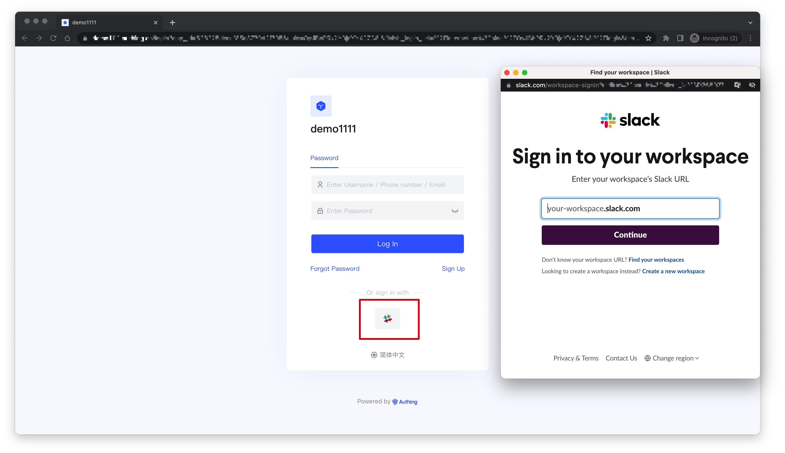
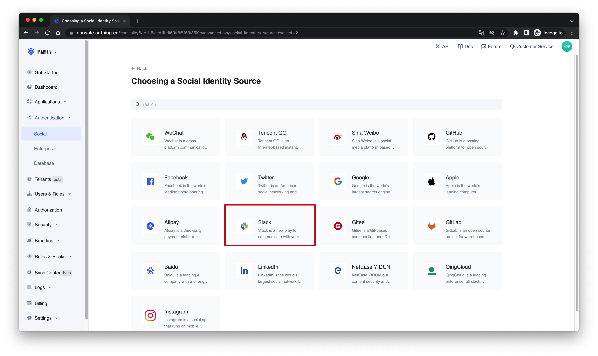
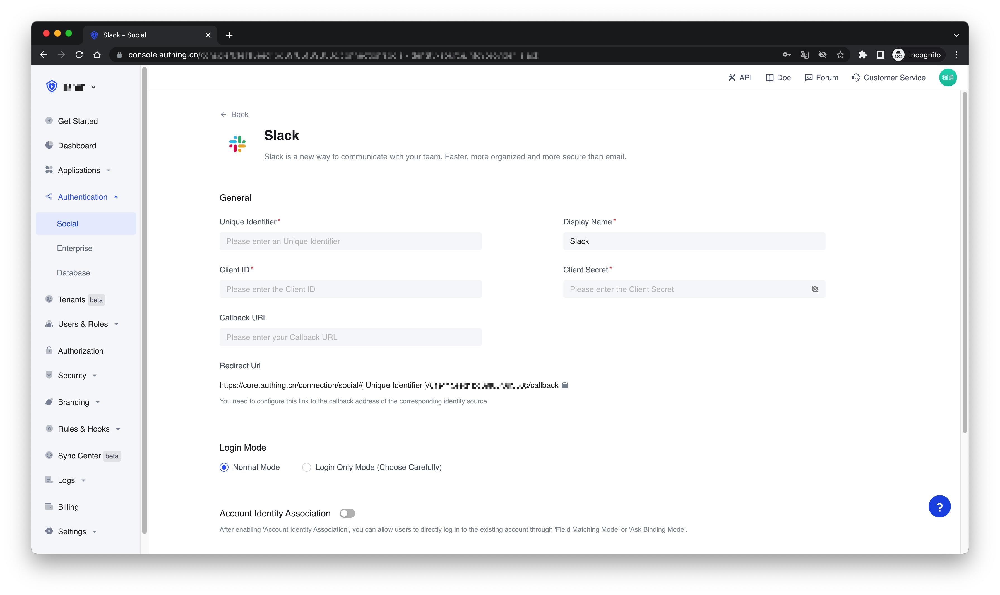
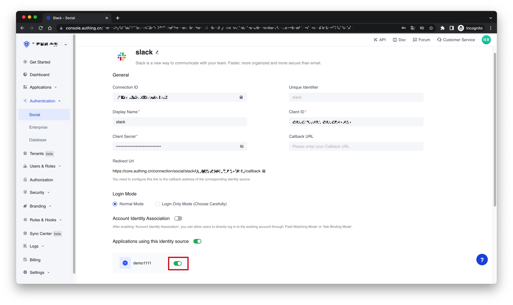
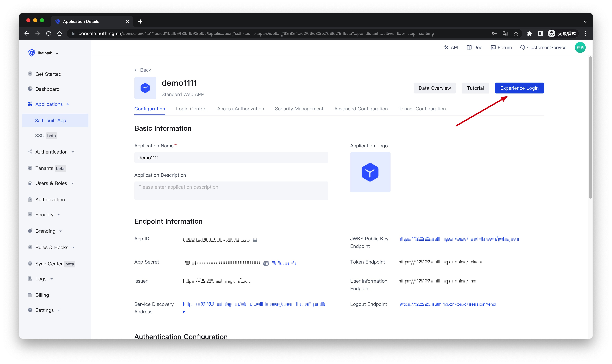
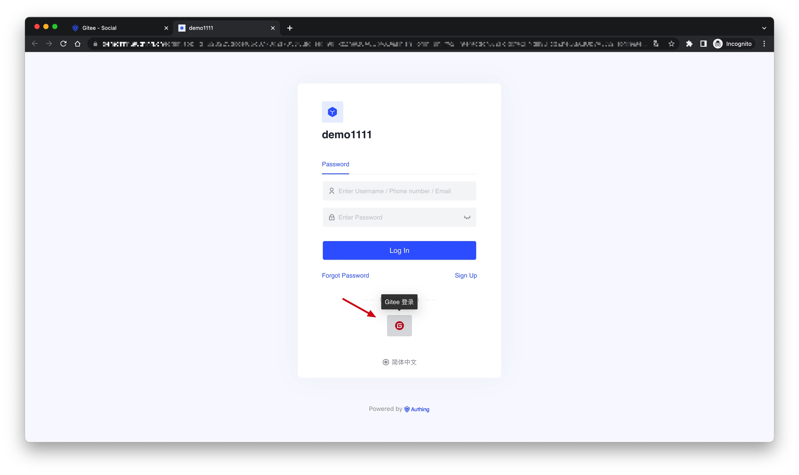

# Slack Social Login

<LastUpdated />

## Introduction

- **Overview**: Slack social login is a user who uses Slack as the identity provider to securely log in to a third-party application or website. By configuring and enabling Slack's social login in {{$localeConfig.brandName}}, you can quickly obtain basic open information of Slack through {{$localeConfig.brandName}} and help users achieve password-free login.
- **Application scenarios**: PC website
- **End-User Preview**:

## Precautions

- If you don't have a Slack account, please go to [slack.com](https://slack.com/get-started#/createnew) to register an account
- If you do not have an {{$localeConfig.brandName}} Console account, please go to the [{{$localeConfig.brandName}} Console](https://authing.cn/) to register a developer account.

## Step 1: Create an app on the Slack API platform

Please follow the [Slack API documentation](https://api.slack.com/authentication/sign-in-with-slack#implementation) to create an application. You need to record the **App ID**, **Client ID**, **Client Secret** and **Signing Secret** of the application, which will be used later. You can refer to the following process.

First, create an app via [Slack API: Your Apps](https://api.slack.com/apps) by clicking Create New App.

If you have never used Slack before, you may need to create a workspace first: click Create Another Workplace and complete the creation.

Once you have the Workspace, go back to [Slack API: Your Apps](https://api.slack.com/apps) and click Create New App to continue app creation. If prompted to choose a creation method, choose From scratch. After entering the App Name and selecting Workspace, click Create App to complete the creation.

After completing the creation, you will see the basic information about the app (Basic Information). Scroll down to App Credentials, where the **App ID**, **Client ID**, **Client Secret** and **Signing Secret** are recorded, you may need them later.

Finally, click OAuth & Permissions in the sidebar, find the Redirect URLs setting area on the page, and click Add New Redirect URL to add the following callback address: `https://core.authing.cn/connection/social/{Unique Identifier}/{YOUR_USERPOOL_ID}/callback`. You need to replace `{Unique Identifier}` with the `Unique Identifier` filled in by the identity provider you are creating by {{$localeConfig.brandName}}, and replace `{YOUR_USERPOOL_ID}` with your [UserPool ID](/en/guides/faqs/get-userpool-id-and-secret.md). After adding, click "Save URLs" to save the settings. After adding, click Save URLs to save the settings.

## Step 2: Configure Slack in the {{$localeConfig.brandName}} Console

2.1 On the "**Social**" page of the {{$localeConfig.brandName}} Console, click the "**Create Connection**" button to enter the "**Choosing a Social Identity Source**" page.

2.2 On the "**Choosing a Social Identity Source**" page, click the "**Slack**" card.

2.3 On the "**Slack**" configuration page, fill in the relevant field information obtained in the step 1.

| Field                        | Description                                                                                                                                                                                                                                                                                                       |
| ---------------------------- | ----------------------------------------------------------------------------------------------------------------------------------------------------------------------------------------------------------------------------------------------------------------------------------------------------------------- |
| Unique Identifier            | a. The unique identifier consists of lowercase letters, numbers, and -, and the length is less than 32 digits.  b. This is the unique identifier of this connection and cannot be modified after setting.                                                                                                    |
| Display Name                 | This name will be displayed on the button on the end user's login screen.                                                                                                                                                                                                                                         |
| Client ID                    | The Slack API application ID obtained in the previous step.                                                                                                                                                                                                                                                       |
| Client Secret                | The Slack API application Secret obtained in the previous step.                                                                                                                                                                                                                                                   |
| Callback URL                 | You can fill in your business callback address. After the user completes the login, the browser will redirect to this address.                                                                                                                                                                                    |
| Login Mode                   | After enabling the "**Login Only Mode**", you can only log in to an existing account and cannot create a new account. Please choose carefully.                                                                                                                                                                    |
| Account Identity Association | When "**Account Identity Association**" is not enabled, a new user is created by default when a user logs in through an identity provider. After enabling "**Account Identity Association**", you can allow users to directly log in to existing accounts through "**Field Matching**" or "**Ask Binding Mode**". |

2.4 After the configuration is complete, click the "Create" or "Save" button to complete the creation.

## Step 3：Development access

- **Recommended development access method**: Use a hosted login page
- **Description of advantages and disadvantages**: The operation and maintenance are simple, and {{$localeConfig.brandName}} is responsible for the operation and maintenance. Each user pool has an independent second-level domain name; if you need to embed it into your application, you need to use the pop-up mode to log in, that is: after clicking the login button, a window will pop up, the content is the login page hosted by {{$localeConfig.brandName}}, or the browser The server redirects to the login page hosted by {{$localeConfig.brandName}}.
- **Detailed access method**:

  3.1 Create an application in the {{$localeConfig.brandName}} Console. For details, see: [How to create an application in {{$localeConfig.brandName}}](/en/guides/app/create-app.md)

  3.2 On the created "**Slack**" identity provider connection details page, open and associate an application created in the {{$localeConfig.brandName}} Console
  

  3.3 Click the "**Experience Login**" button of the app in the {{$localeConfig.brandName}} Console, and experience the "**Slack**" login in the pop-up login window
  

