# Twitter Social Login

<LastUpdated/>

## Scenario Description

- **Overview** Twitter social login is a secure login to a third-party application or website using Twitter as the user's identity source. Configure and enable Twitter social login in {{$localeConfig.brandName}} to enable quick access to basic open Twitter information and help users to achieve password-free login via {{$localeConfig.brandName}}.
- **Application Scenario**: PC website
- **End-user preview image**.

## Caution.

- If you do not have a Twitter account, please go to [Twitter Platform](https://twitter.com/) to register for an account.
- Go to the [Twitter Developer Platform](https://developer.twitter.com/en/portal/) to complete your account information and [request Elevated access](https://developer.twitter.com/en/portal) for your account./petition/standard/basic-info).
- If you do not have a {{$localeConfig.brandName}} console account, go to the [{{$localeConfig.brandName}} Console console](https://authing.cn/) to register for a developer account.

## Step 1: Create a Twitter app

1.1 To create a project, in the sidebar **Projects & Apps**, select **Overview**, and under the **Elevated** directory, click **+New Project**.

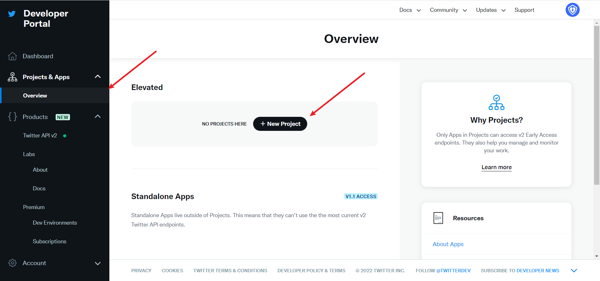

Fill in **Project Name**, **Usage Scenario**, **Project Description** in order to start the app creation.

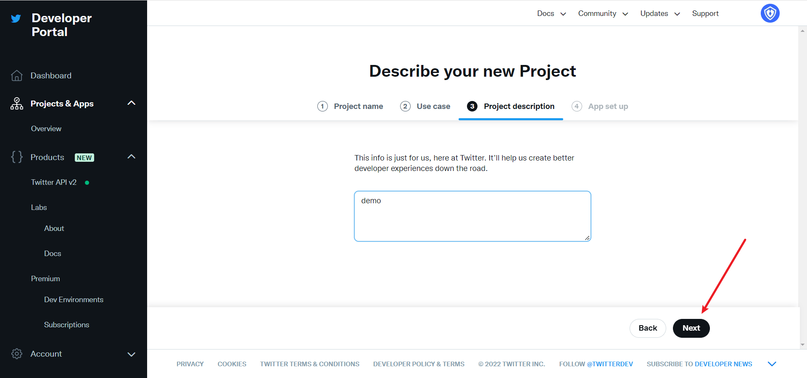

During the development phase, the application environment is first selected as **Development** and switched to **Production** after debugging is complete

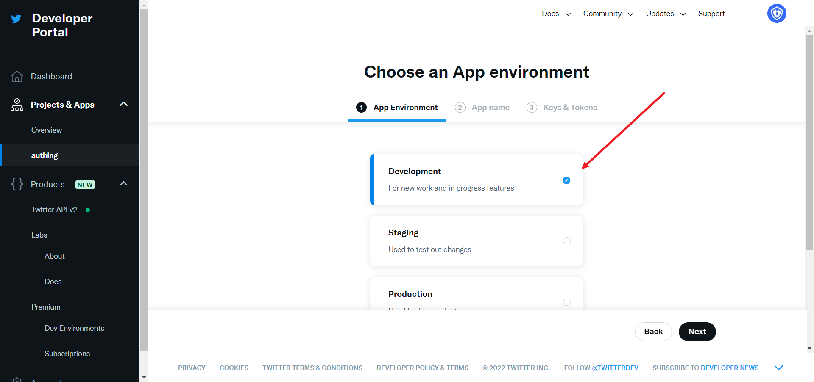

After filling in the name, you will see **APP Key** and **APP Key Secret**, which will be recorded first and used in the {{$localeConfig.brandName}} console configuration

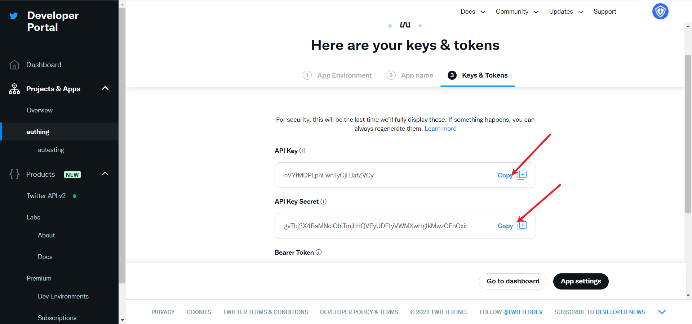

## Step 2: Configure Twitter in the {{$localeConfig.brandName}} console

2.1 In the {{$localeConfig.brandName}} Console, click the "Create Social Identity" button on the "Social Identity" page, go to the "Select Social Identity" page, select the "Twitter" identity button, and go to the "Twitter Login Mode" page.

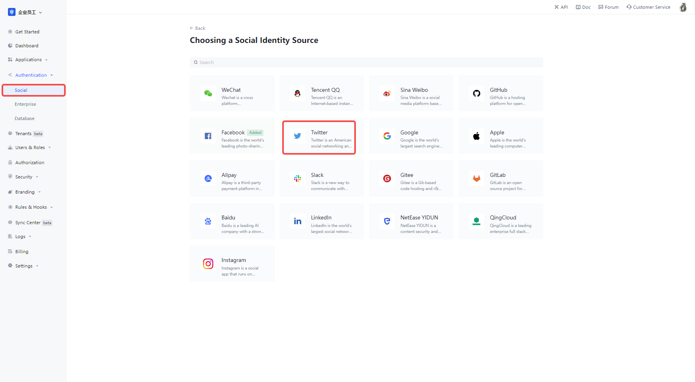

2.3 Please configure the relevant field information on the Social Identity Source - Twitter page in the {{$localeConfig.brandName}} Console.

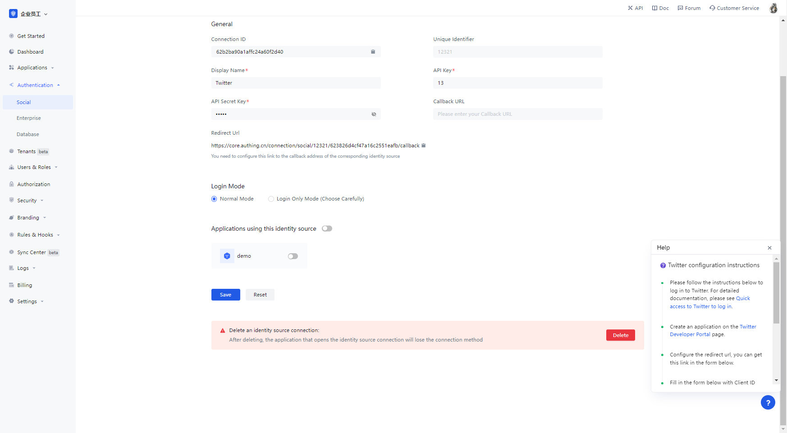

| 字段/功能         | 描述                                                                                                                                                                                                                                                                                                                                                                                                                                                                                                                                                                                                                                         |
| ----------------- | -------------------------------------------------------------------------------------------------------------------------------------------------------------------------------------------------------------------------------------------------------------------------------------------------------------------------------------------------------------------------------------------------------------------------------------------------------------------------------------------------------------------------------------------------------------------------------------------------------------------------------------------- |
| Unique identifier | a. The unique identifier consists of lowercase letters, numbers, -, and is less than 32 bits long. b. This is the unique identifier for this connection and cannot be modified after it is set.                                                                                                                                                                                                                                                                                                                                                                                                                                              |
| Display name      | This name is displayed on the button on the end-user's login screen.                                                                                                                                                                                                                                                                                                                                                                                                                                                                                                                                                                         | API Key |
| API Key           | The application number, which needs to be obtained on the Twitter platform.                                                                                                                                                                                                                                                                                                                                                                                                                                                                                                                                                                  |
| API Secret Key    | The application key to be obtained on the Twitter platform.                                                                                                                                                                                                                                                                                                                                                                                                                                                                                                                                                                                  |
| Callback URL      | This is your business callback domain name, which is not the same concept as the callback link configured in the self-built application, nor is it related to the callback address configured in the third-party social login console. For example, if your website domain name is https://example.com and the url for handling {{$localeConfig.brandName}} callback requests is /auth/callback, then you should fill in https://example.com. That parameter has been It is not recommended to use this parameter, and it is recommended to configure the callback link separately in the application, where the address can be filled in #. | The |
| Callback Address  | Twitter's redirect URI. You need to configure this URL to the callback address of the application created on the Twitter platform.                                                                                                                                                                                                                                                                                                                                                                                                                                                                                                           | Login Mode |
| Login Mode        | When "Login Only Mode" is enabled, you can only login to your existing account and cannot create a new account, so please choose carefully.                                                                                                                                                                                                                                                                                                                                                                                                                                                                                                  |

Once the configuration is complete, click the "Create" or "Save" button to finish the creation.

In the Twitter created project, select the app you just created, scroll down to the bottom and under the **User authentication settings** section, click the **Set Up** button to enter the authentication settings page
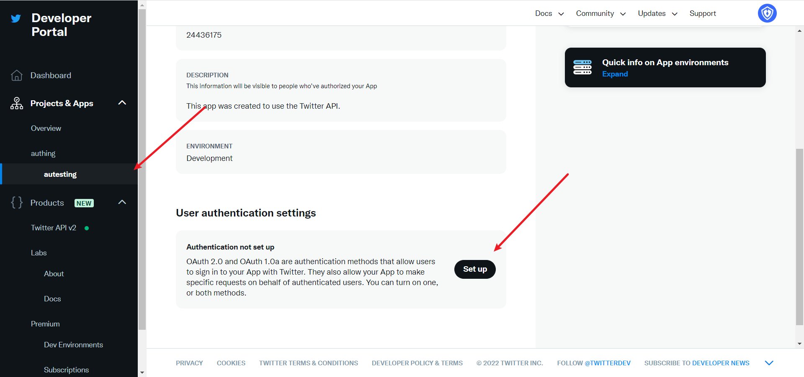

Turn on OAuth 1.0a
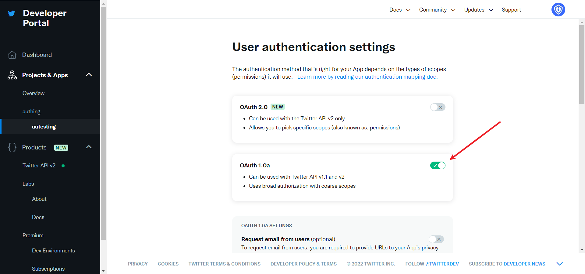

Select App permissions as needed, by default **Read** is sufficient for authentication, **Callback URI / Redirect URL** fills in the callback address displayed after the Twitter identity feed is created on the {{$localeConfig.brandName}} console.
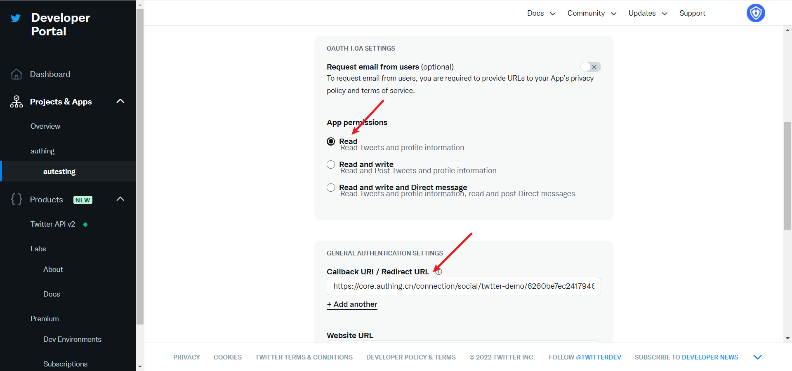

**Website URL** Just fill in your site's homepage and click Save
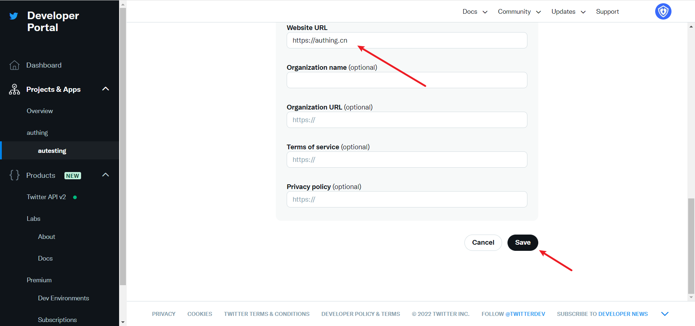

If you forget the application key, you can click **Keys and tokens** on the application page and select **Regenerate** to regenerate it.

When you're done configuring the app, go back to the app settings page and click **Edit** to switch the app environment to **Production**.
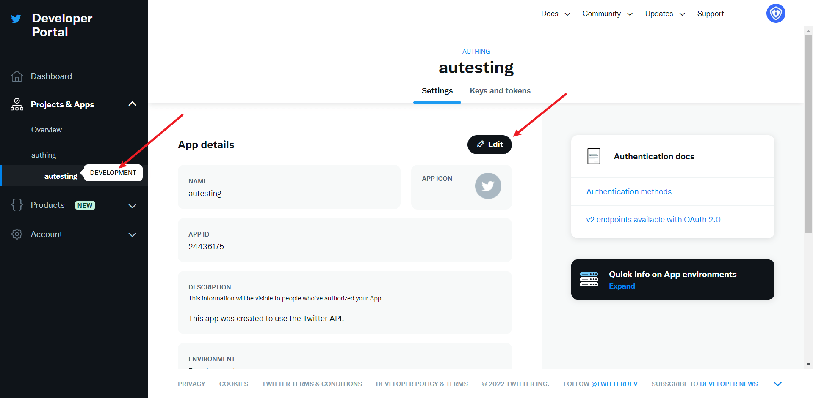

## Step 3: Development Access

- **Recommended development access**: Use a hosted login page

- **Description of advantages and disadvantages**: Simple to run and maintain, run by {{$localeConfig.brandName}}. Each user pool has a separate secondary domain; if you need to embed it in your application, you need to use the popup mode login, i.e.: after clicking the login button, a window will pop up with {{$localeConfig.brandName}} hosted login page, or redirect the browser to {{$localeConfig.brandName }} to the hosted login page.

- **Detailed access method**.

  3.1 Create an app in the {{$localeConfig.brandName}} console, for details see: [How to create an app in {{$localeConfig.brandName}}](./guides/app/create-app.md)

  3.2 On the created Twitter identity connection details page, open and associate an app created in the {{$localeConfig.brandName}} console

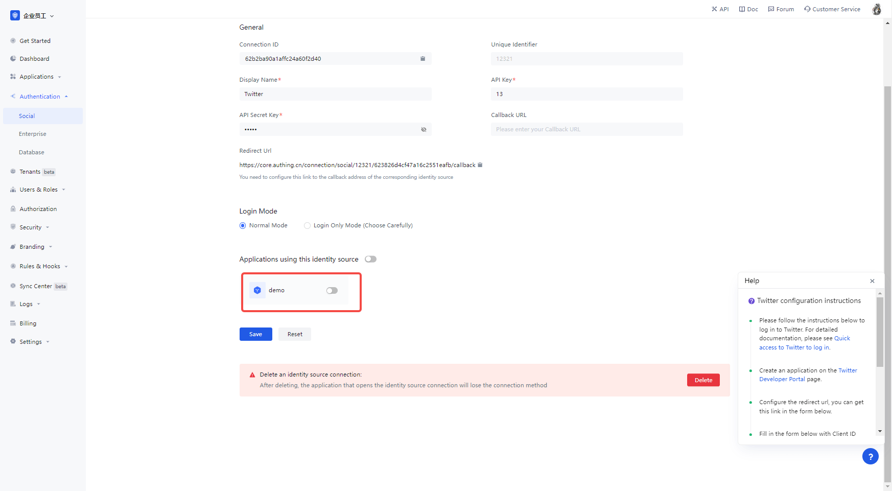

3.3 Experience Twitter third-party login on the login page

