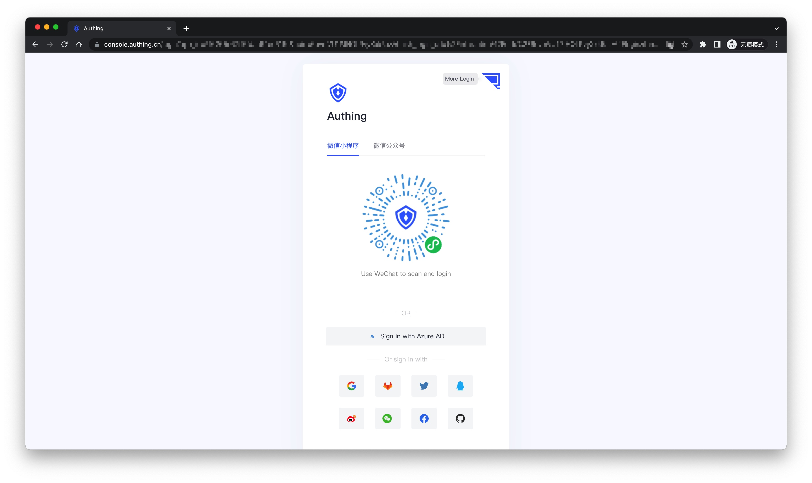
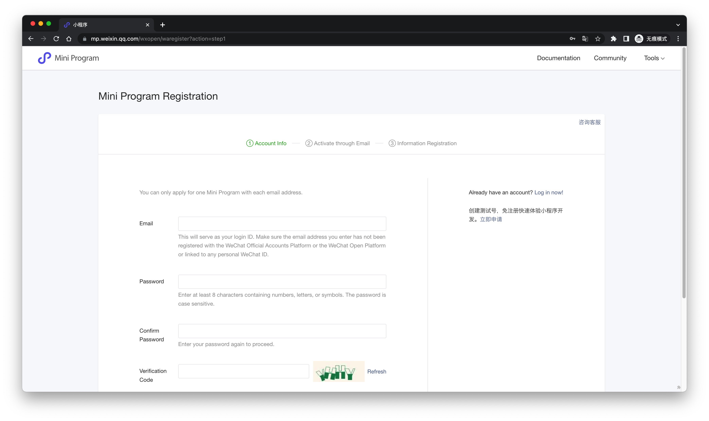
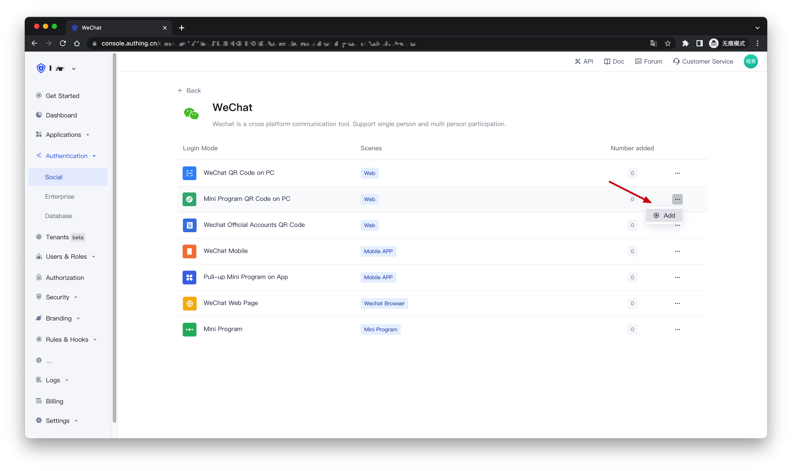
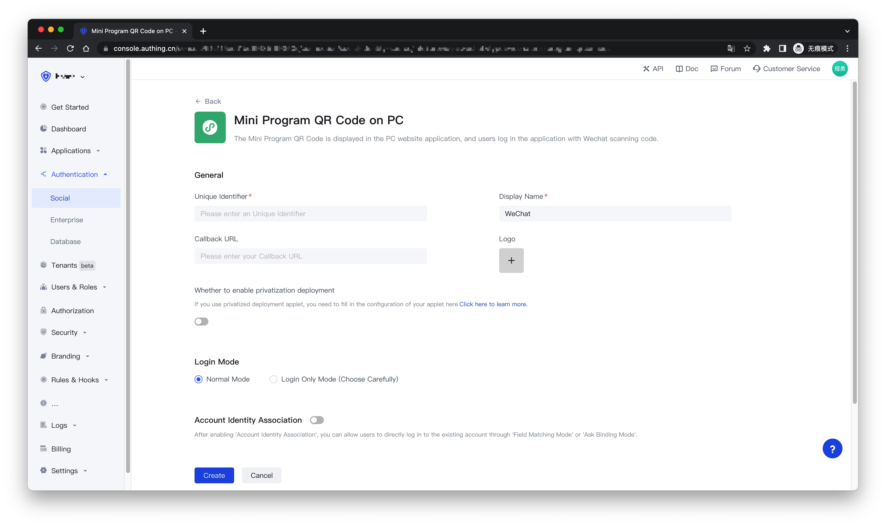
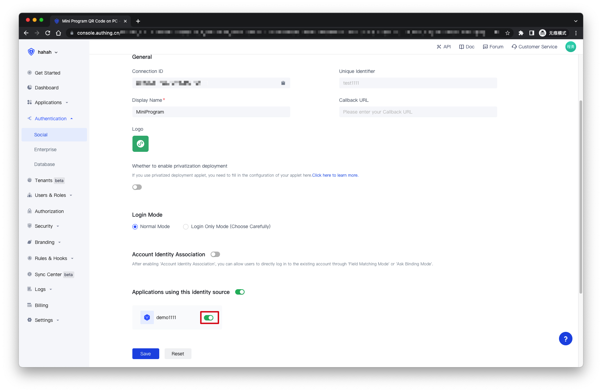
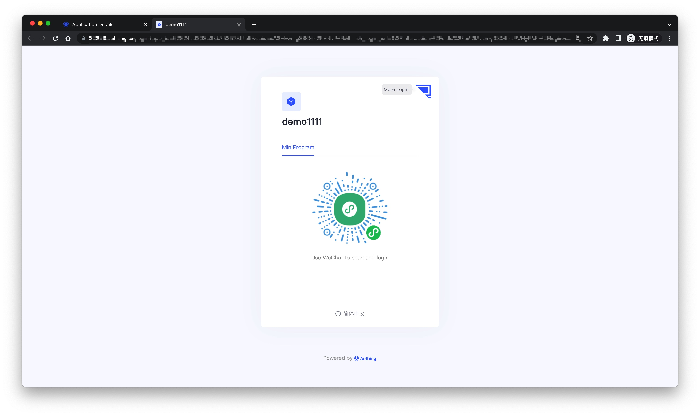

# Wechat Mini Program QR Code on PC

<LastUpdated />

## Introduction

- **Overview**: This is a pioneering design of {{$localeConfig.brandName}}. After opening the scan small login QR code in {{$localeConfig.brandName}}, the official real-name user information of WeChat can be obtained. The user can complete the registration or login with the real number with one-click authorization, and establish a mobile phone for developers. Number-based account system.
- **Application scenarios**: PC website
- **End-User Preview**:

## Precautions

- If you do not have an account on the WeChat public platform, please go to the [WeChat public platform](https://mp.weixin.qq.com/wxopen/waregister?action=step1) to register and log in.
- If you do not have an {{$localeConfig.brandName}} Console account, please go to the [{{$localeConfig.brandName}} Console](https://authing.cn/) to register a developer account.

## Step 1: Create a mini program on the WeChat public platform (optional)

By default, the Mini Program scan code login will use the default Mini Program provided by {{$localeConfig.brandName}}. If you need stronger brand customization capabilities, or want to connect the WeChat account of the user who logs in through the Mini Program scan code with your other WeChat public platforms , you need to apply for your own applet.

If you fall into one of these two scenarios,Please go to [WeChat public platform](https://mp.weixin.qq.com/wxopen/waregister?action=step1) Guide to create a WeChat applet, you need to record the `App ID` and `App Secre`t of the application , which will be used later.

At the same time, you need to contact us to obtain the source code of the small login. For details, please consult: +86 176-0250-2507.

## Step 2: Configure the WeChat Mini Program in the {{$localeConfig.brandName}} Console

2.1 On the "**Social**" page of the {{$localeConfig.brandName}} Console, click the "**Create Connection**" button to enter the "**Choosing a Social Identity Source**" page.

2.2 On the "**Choosing a Social Identity Source**" page, click the "**WeChat**" card.

2.3 Continue to click the "**Mini Program QR Code on PC**" login mode, or click "**... Add**".

2.4 On the "**Mini Program QR Code on PC**" configuration page, fill in the relevant field information.

| Field                                      | Description                                                                                                                                                                                                                                                                                                     |
| ------------------------------------------ | --------------------------------------------------------------------------------------------------------------------------------------------------------------------------------------------------------------------------------------------------------------------------------------------------------------- |
| Unique Identifier                          | a. The unique identifier consists of lowercase letters, numbers, and -, and the length is less than 32 digits.  b. This is the unique identifier of this connection and cannot be modified after setting.                                                                                                  |
| Display Name                               | This name will be displayed on the button on the end user's login screen.                                                                                                                                                                                                                                       |
| Callback URL                               | The service callback address after the identity provider is authenticated.                                                                                                                                                                                                                                      |
| Logo                                       | The uploaded logo will be used as the logo in the center of the QR code of the Mini Program.                                                                                                                                                                                                                    |
| Whether to enable privatization deployment | If you want to use your main WeChat or customize the page style of the mini-login applet, you can contact us to obtain the source code of the mini-login applet. If you enable this option, you must deploy your own small login applet and fill in the `AppID` and `AppSecret` of the WeChat Mini Program.     |
| AppID                                      | AppID of the Mini Program, filled in by users who choose to privatize the Mini Program.                                                                                                                                                                                                                         |
| AppSecret                                  | The AppSecret of the Mini Program is filled in by the user who chooses to privatize the Mini Program.                                                                                                                                                                                                           |
| Login Mode                                 | After enabling the "**Login Only Mode**", you can only log in to an existing account and cannot create a new account. Please choose carefully.                                                                                                                                                                  |
| Account Identity Association               | When "**Account Identity Association**" is not enabled, a new user is created by default when a user logs in through an identity provider. After enabling "**Account Identity Association**", you can allow users to directly log in to existing accounts through "**Field Matching**" or "**Ask Binding Mode**". |

2.5 After the configuration is complete, click the "**Create**" or "**Save**" button to complete the creation.

## Step 3：Development access

- **Recommended development access method**: Use a hosted login page
- **Description of advantages and disadvantages**: The operation and maintenance are simple, and Authing is responsible for the operation and maintenance. Each user pool has an independent second-level domain name; if you need to embed it into your application, you need to use the pop-up mode to log in, that is: after clicking the login button, a window will pop up, the content is the login page hosted by Authing, or the browser The server redirects to the login page hosted by Authing.
- **Detailed access method**:

  3.1 Create an application in the {{$localeConfig.brandName}} Console. For details, see: [How to create an application in {{$localeConfig.brandName}}](/en/guides/app/create-app)

  3.2 On the created "**Mini Program QR Code on PC**" identity provider connection details page, open and associate an application created in the {{$localeConfig.brandName}} Console
  

  3.3 Click the "**Experience Login**" button of the app in the {{$localeConfig.brandName}} Console, and experience the "**Mini Program QR Code on PC**" login in the pop-up login window
  

