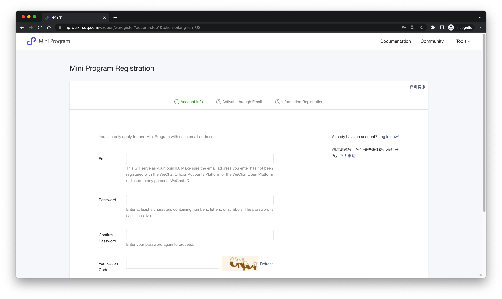
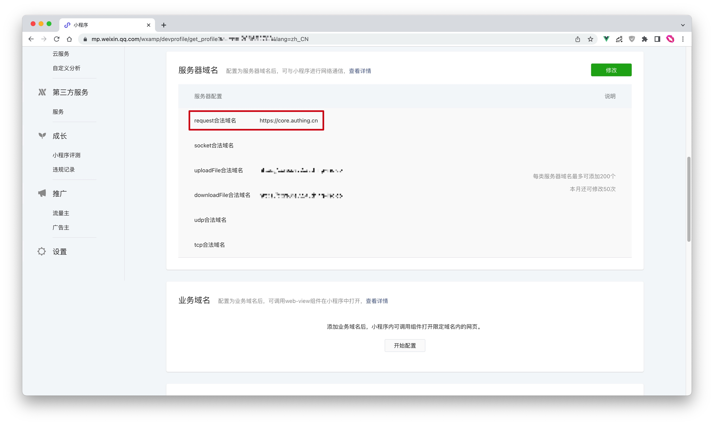
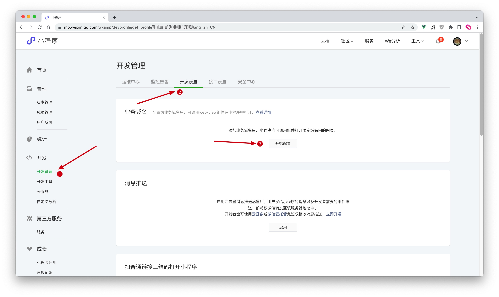
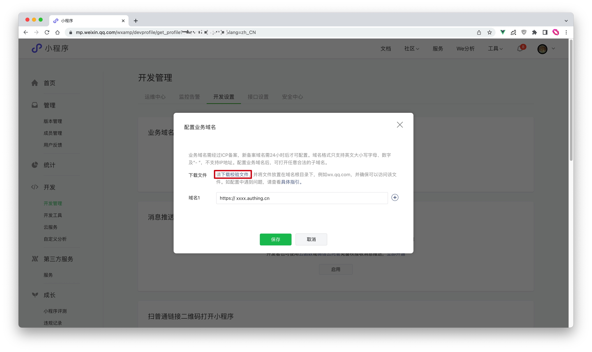
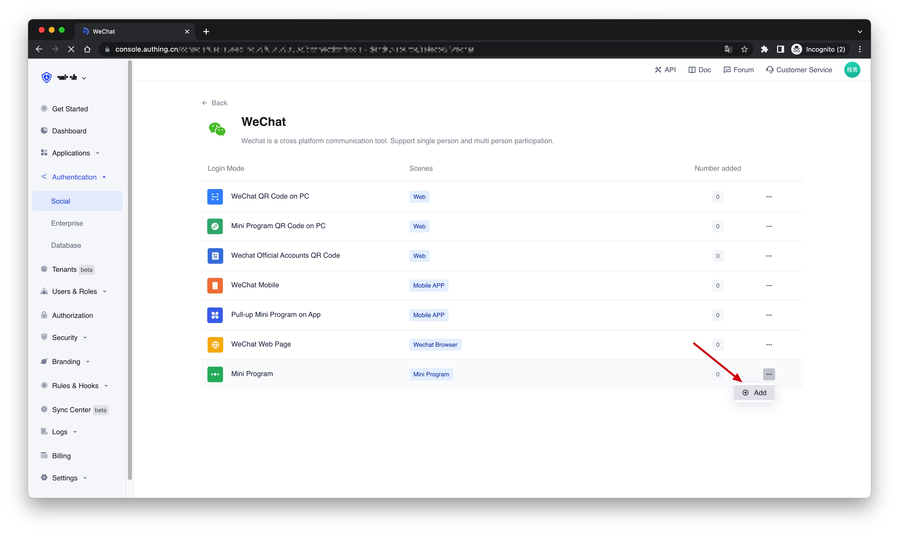
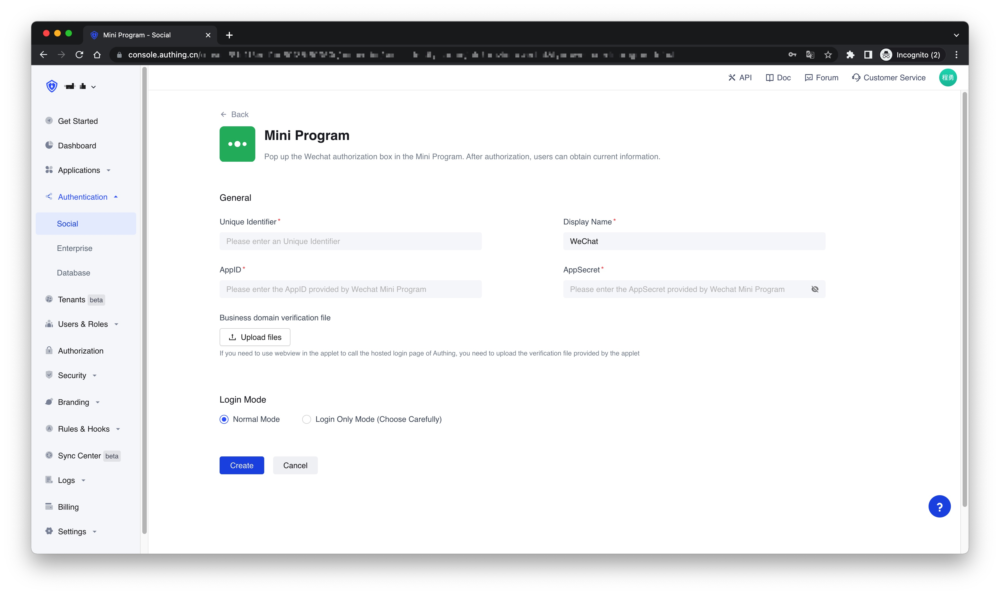

# Wechat Mini Program

<LastUpdated />

## Introduction

- **Overview**: {{$localeConfig.brandName}} provides developers with a way to quickly obtain user information and complete the login in the Mini Program through the SDK. Through Authing's SDK, you can easily obtain the user identity provided by WeChat, and quickly establish an account system based on mobile phone numbers.
- **Application scenarios**: Mini Program
- **End-User Preview**:


## Precautions

- If you do not have an {{$localeConfig.brandName}} Console account, please go to the [{{$localeConfig.brandName}} Console](https://authing.cn/) to register a developer account.

## Step 1: Create a Mini Program on the WeChat public platform

### Create WeChat Mini Program

Go to the [WeChat public platform](https://mp.weixin.qq.com/wxopen/waregister?action=step1&token=&lang=en_US) to create a WeChat Mini Program.


After the creation is complete, you need to record the `AppID` and `AppSecret` of the application, which will be used later.


### Configure the server domain name

After that, you need to set the **request legal domain name** in the **server domain name** to `core.authing.cn` in the **Development -> Development Management -> Development Settings** page of the WeChat Mini Program management background.


### Configure a business domain name (optional)

:::hint-info
If you need to use the webview to call the {{$localeConfig.brandName}} hosted login page in the WeChat Mini Program, you need to configure the business domain name.
:::

On the **Development -> Development Management -> Development Settings** page of the WeChat Mini Program management background, find the **Business Domain Name** configuration, and click **Start Configuration**


After scanning the code to log in, fill in your application authentication address in the business domain name configuration, and download the verification file for backup


## Step 2: Configure the WeChat Mini Program in the {{$localeConfig.brandName}} Console

2.1 On the "**Social**" page of the {{$localeConfig.brandName}} Console, click the "**Create Connection**" button to enter the "**Choosing a Social Identity Source**" page.


2.2 On the "**Choosing a Social Identity Source**" page, click the "**WeChat**" card.


2.3 Continue to click the "**Mini Program**" login mode, or click "**... Add**".


2.4 On the "**Mini Program**" configuration page, fill in the relevant field information obtained in the step 1.


| Field                             | Description                                                                                                                                                                                                    |
| --------------------------------- | -------------------------------------------------------------------------------------------------------------------------------------------------------------------------------------------------------------- |
| Unique Identifier                 | a. The unique identifier consists of lowercase letters, numbers, and -, and the length is less than 32 digits. <br />b. This is the unique identifier of this connection and cannot be modified after setting. |
| Display Name                      | This name will be displayed on the button on the end user's login screen.                                                                                                                                      |
| AppID                             | AppID obtained in step 1.                                                                                                                                                                                      |
| AppSecret                         | AppSecret obtained in step 1.                                                                                                                                                                                  |
| Business domain verification file | If you need to use the webview to call {{$localeConfig.brandName}}'s managed login page in the Mini Program, you need to upload the verification file provided by the Mini Program downloaded in step 1        |
| Login Mode                        | After enabling the "**Login Only Mode**", you can only log in to an existing account and cannot create a new account. Please choose carefully.                                                                 |

2.5 After the configuration is complete, click the "Create" or "Save" button to complete the creation.

## Step 3：Development access

Starting from the Mini Program base library version 2.2.1 or above, and the developer tools 1.02.1808300 or above, the Mini Program supports Use npm to install third-party packages. For details, see: [npm support | WeChat Open Document](https://developers.weixin.qq.com/miniprogram/en/dev/devtools/npm.html)

### Install NPM Package

```bash
$ yarn add authing-wxapp-sdk --save

# OR

$ npm install authing-wxapp-sdk --save
```

Click on the menu bar in the developer tools: **Tools --> Build npm**:


Check the `Use NPM module` option (if there is this option, Stable 1.05.2204250 for MacOS does not have this option):


### Initialize SDK

Initializing the `AuthenticationClient` requires passing in the `AppId`:

> You can view your list of apps in **Apps** in the console.

```javascript
const { AuthenticationClient } = require("authing-wxapp-sdk");

const authing = new AuthenticationClient({
  userPoolId: "YOUR_USERPOOL_ID"
});
```

### Call Login Method

`AuthenticationClient` provides the `loginByCode` method, which can complete silent login through WeChat authorization:

```javascript
const { code } = await wx.login();
// No user authorization required
const user = await authing.loginByCode(code); // Successful login, write token to WeChat Storage

// You can do this after logging in
await authing.updateProfile({
  nickname: "Bob"
});
```

After the user completes the login, the SDK will write the user's token into WeChat's Storage, and subsequent requests will automatically carry the token for access.


Subsequent users open the Mini Program again. If the user's token is saved in the storage of the Mini Program, the request to access authing will automatically bring the token.

```javascript
// The request can succeed because the user is logged in.
await authing.updateProfile((nickname: "Mick"));
```

For details, please check the documentation: [Mini Program SDK](/en/reference/sdk-for-wxapp.md).

### Next

!!!include(en/common/what-to-do-when-you-get-userinfo.md)!!!
