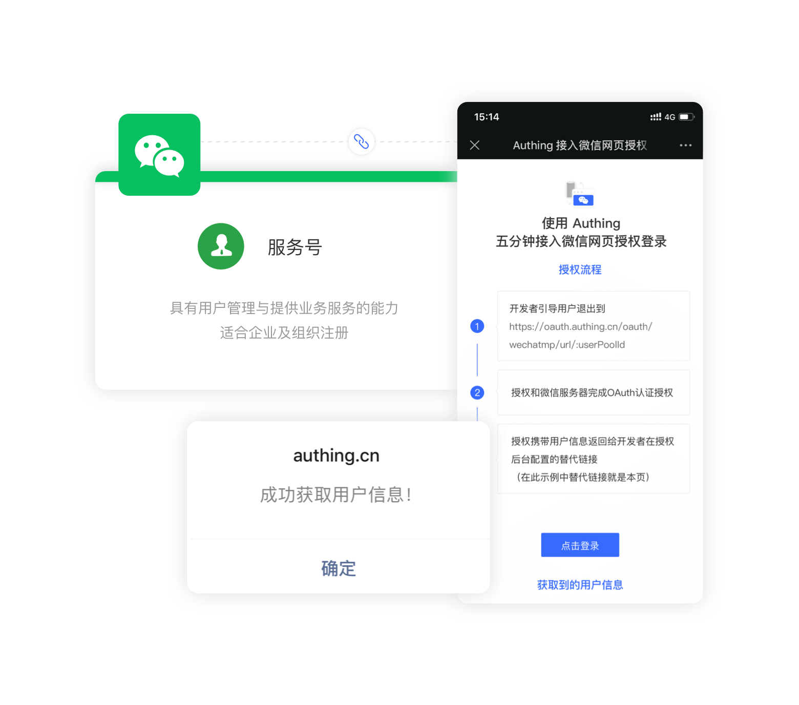
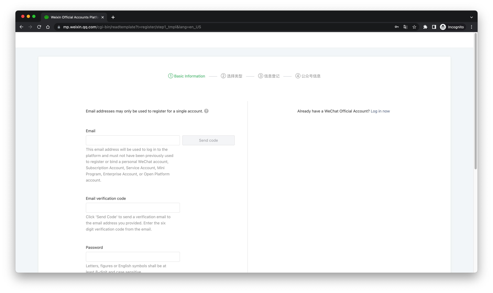
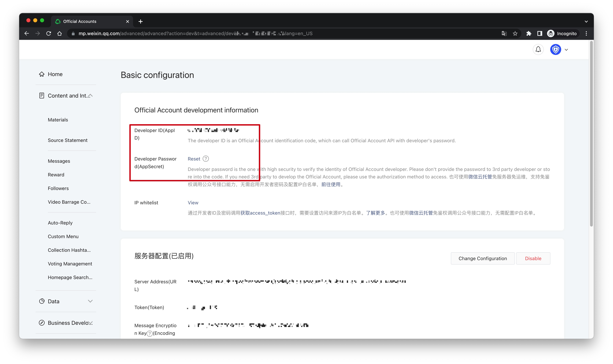
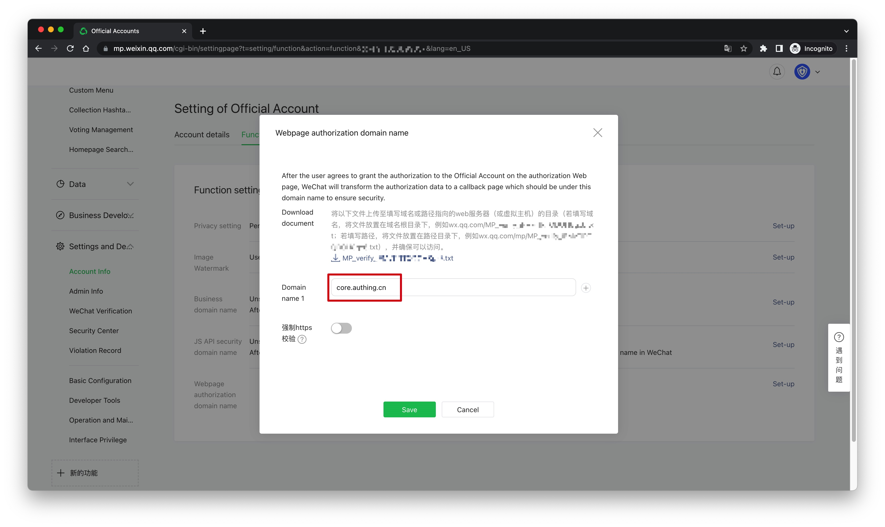
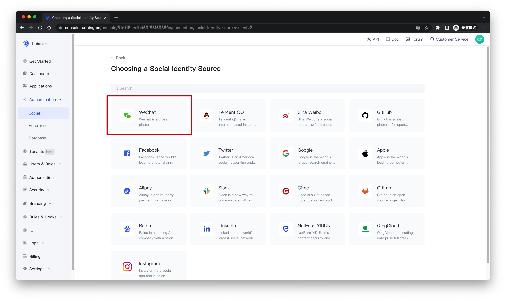
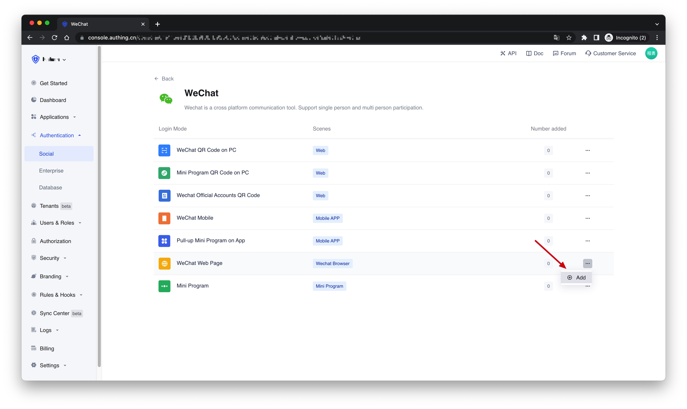
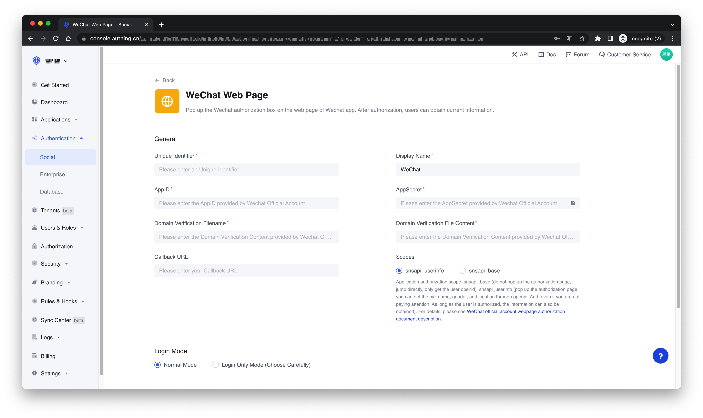

# WeChat Web Page

<LastUpdated />

## Introduction

- **Overview**: {{$localeConfig.brandName}} provides developers with a way to quickly obtain user information in WeChat webpages and complete the login through the SDK. If users access third-party web pages and official accounts in the WeChat client, they can obtain basic user information through the WeChat web page authorization mechanism, and then implement business logic.
- **Application scenarios**: Wechat Browser
- **End-User Preview**:



## Precautions

- If you do not have an {{$localeConfig.brandName}} Console account, please go to the [{{$localeConfig.brandName}} Console](https://authing.cn/) to register a developer account.

## Step 1: Create a WeChat service account on the WeChat public platform

Go to the [WeChat public platform](https://mp.weixin.qq.com/cgi-bin/readtemplate?t=register/step1_tmpl&lang=en_US) to create a **WeChat service account**.


After the creation is complete, you need to record the `AppID` and `AppSecret` of the application, which will be used later.


After that, in the **Settings and Development -> Account Info -> Function Settings** page of the WeChat public platform backend, set the **Webpage authorization domain name** to `core.authing.cn`. For the sake of security verification, the WeChat server needs to perform a request verification with the {{$localeConfig.brandName}} server, and the developer needs to download the txt file and record the **file name** and **text content**.


## Step 2: Configure the WeChat web page authorization application in the {{$localeConfig.brandName}} Console

2.1 On the "**Social**" page of the {{$localeConfig.brandName}} Console, click the "**Create Connection**" button to enter the "**Choosing a Social Identity Source**" page.


2.2 On the "**Choosing a Social Identity Source**" page, click the "**WeChat**" card.


2.3 Continue to click the "**WeChat Web Page**" login mode, or click "**... Add**".


2.4 On the "**WeChat Web Page**" configuration page, fill in the relevant field information obtained in the step 1.


| Field                            | Description                                                                                                                                                                                                                                                                                                                                                                                                                                                                                                                                                        |
| -------------------------------- | ------------------------------------------------------------------------------------------------------------------------------------------------------------------------------------------------------------------------------------------------------------------------------------------------------------------------------------------------------------------------------------------------------------------------------------------------------------------------------------------------------------------------------------------------------------------ |
| Unique Identifier                | a. The unique identifier consists of lowercase letters, numbers, and -, and the length is less than 32 digits. <br />b. This is the unique identifier of this connection and cannot be modified after setting.                                                                                                                                                                                                                                                                                                                                                     |
| Display Name                     | This name will be displayed on the button on the end user's login screen.                                                                                                                                                                                                                                                                                                                                                                                                                                                                                          |
| AppID                            | AppID obtained in step 1.                                                                                                                                                                                                                                                                                                                                                                                                                                                                                                                                          |
| AppSecret                        | AppSecret obtained in step 1.                                                                                                                                                                                                                                                                                                                                                                                                                                                                                                                                      |
| Domain Verification Filename     | The domain name verification file name obtained in step 1, for example: MP_verify_t1op33AC5w4rNIwE.txt                                                                                                                                                                                                                                                                                                                                                                                                                                                             |
| Domain Verification File Content | The content of the domain name verification file obtained in step 1, for example: E1op22BD7w1rMItt                                                                                                                                                                                                                                                                                                                                                                                                                                                                 |
| Callback URL                     | Your business callback link                                                                                                                                                                                                                                                                                                                                                                                                                                                                                                                                        |
| Scopes                           | Application authorization scope, snsapi_base (do not pop up the authorization page, jump directly, only get the user openid), snsapi_userinfo (pop up the authorization page, you can get the nickname, gender, and location through openid. And, even if you are not paying attention, As long as the user is authorized, the information can also be obtained). For details, please see [WeChat official account webpage authorization document description](https://developers.weixin.qq.com/doc/offiaccount/en/OA_Web_Apps/Wechat_webpage_authorization.html). |
| Login Mode                       | After enabling the "**Login Only Mode**", you can only log in to an existing account and cannot create a new account. Please choose carefully.                                                                                                                                                                                                                                                                                                                                                                                                                     |
| Account Identity Association     | When "**Account Identity Association**" is not enabled, a new user is created by default when a user logs in through an identity provider. After enabling "**Account Identity Association**", you can allow users to directly log in to existing accounts through "**Field Matching**" or "**Ask Binding Mode**".                                                                                                                                                                                                                                                    |

2.5 After the configuration is complete, click the "Create" or "Save" button to complete the creation.


## Step 3：Development access

> You can get the sample code here: [https://github.com/authing/wechat-eco-solution](https://github.com/authing/wechat-eco-solution), and visit the online [sample application](https://www.authing.cn/sample-wx.html).

### Access using SDK

First use CDN to introduce `authing-wxmp-sdk`

```html
<script src="https://cdn.authing.co/packages/authing-wxmp-sdk/<latest-version>/authing-wxmp-sdk.min.js"></script>
```

:::hint-info

Please replace `<latest-version>` with the latest version. The latest version can be viewed at [https://www.npmjs.com/package/@authing/wxmp](https://www.npmjs.com/package/@authing/wxmp).

For the detailed documentation of authing-wxmp-sdk, please refer to: [Wechat Webpage Authorization Login SDK](/en/reference/sdk-for-wxmp.md).

:::

#### Initialize SDK

Initialize the SDK with the UserPool ID:

```javascript
const authingWx = new AuthingWxmp({
  userPoolId: "YOUR_USERPOOL_ID"
});
```

#### Initiate WeChat authorization

Call the `getAuthorizationUrl` method to obtain the WeChat authorization login link, and modify `window.location` to redirect to the WeChat login authorization page:

```javascript
window.location = authingWx.getAuthorizationUrl();
```

#### Get UserInfo

After redirecting to the business callback link, obtain user information through the `getUserInfo` method:

```javascript

// If `authingWx` is not initialized on the callback page, it needs to be initialized first.
// For the specific initialization method, please refer to the above.
const { ok, userinfo, message } = authingWx.getUserInfo();
if (ok) {
  console.log(userinfo);
} else if (message) {
  // The message object contains the error message
  alert(message);
}
```

### Access using the embedded login component

Take `React` for example.

#### Install `@authing/react-ui-components`

```bash

$ yarn add @authing/react-ui-components

# OR

$ npm install @authing/react-ui-components --save

```

#### Initiate

```js
import React from "react";
import ReactDOM from "react-dom";
import { AuthingGuard } from "@authing/react-ui-components";
// import css
import "@authing/react-ui-components/lib/index.min.css";

const App = () => {
  const appId = "AUTHING_APP_ID";
  const onLogin = userInfo => {
    console.log(userInfo);
  };
  return <AuthingGuard appId={appId} onLogin={onLogin} />;
};

ReactDOM.render(<App />, root);
```

#### Use

After the initialization is completed, open the page in WeChat and you will see the following button. Click to authorize. After the authorization is completed, it will jump to the application callback link, and you can use [AuthenticationClient](/en/reference/sdk-for-node/authentication/AuthenticationClient.md) to obtain user information.

