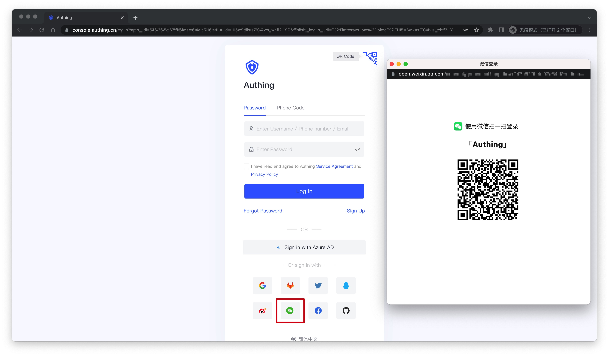
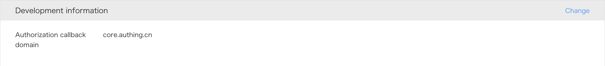
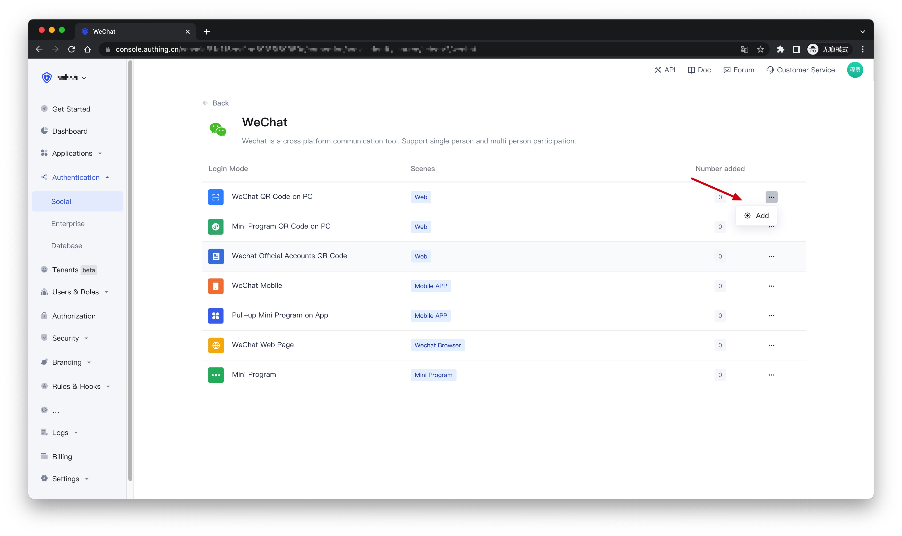
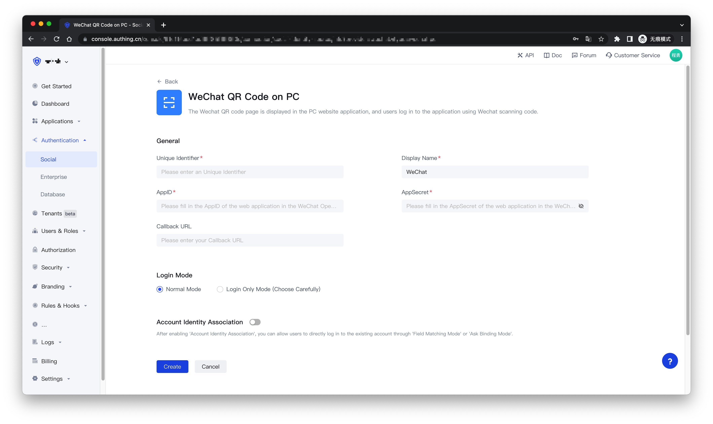
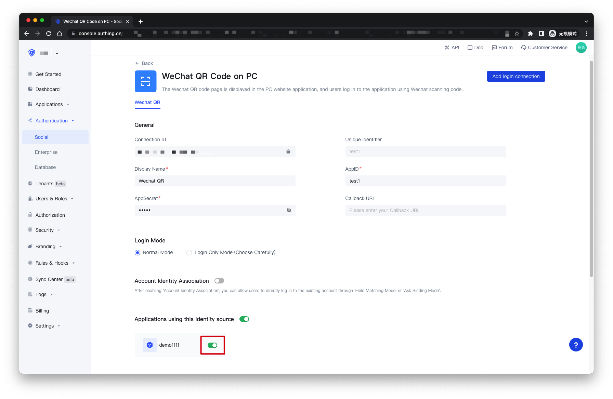
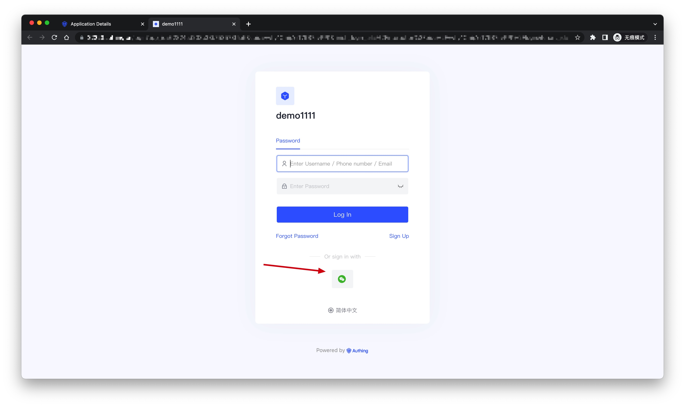

# Access WeChat QR code on PC

<LastUpdated />

## Introduction

- **Overview**: PC WeChat scan code login allows users to safely log in to third-party applications or websites with WeChat identity. After WeChat scan code login is enabled in {{$localeConfig.brandName}}, it can quickly obtain basic open information of WeChat users through {{$localeConfig.brandName}} and help users realize basic open functions.
- **Application scenarios**: PC Website
- **End-User Preview**:

## Precautions

- If you do not have an account on the [WeChat Open Platform](https://open.weixin.qq.com/cgi-bin/frame?t=home/web_tmpl&lang=en_US), please go to the WeChat Open Platform to register and log in.
- If you do not have an {{$localeConfig.brandName}} Console account, please go to the [{{$localeConfig.brandName}} Console](https://authing.cn/) to register a developer account.

## Step 1: Create a website application on the WeChat open platform

Go to [WeChat Open Platform](https://open.weixin.qq.com/cgi-bin/frame?t=home/web_tmpl&lang=en_US) and click **Create an application**. After the creation is complete, you need to record the `AppID` and `AppSecret` of the application, which will be used later.

Please make sure that the app has obtained the permission to **login with WeChat**, and set the authorization callback domain to `core.authing.cn`

## Step 2: Configure the WeChat website application in the {{$localeConfig.brandName}} Console

2.1 On the "**Social**" page of the {{$localeConfig.brandName}} Console, click the "**Create Connection**" button to enter the "**Choosing a Social Identity Source**" page.

2.2 On the "**Choosing a Social Identity Source**" page, click the "**WeChat**" card.

2.3 Continue to click the "**WeChat QR Code on PC**" login mode, or click "**... Add**".

2.4 On the "**WeChat QR Code on PC**" configuration page, fill in the relevant field information.

| Field                        | Description                                                                                                                                                                                                                                                                                                                                                                                                                |
| ---------------------------- | -------------------------------------------------------------------------------------------------------------------------------------------------------------------------------------------------------------------------------------------------------------------------------------------------------------------------------------------------------------------------------------------------------------------------- |
| Unique Identifier            | a. The unique identifier consists of lowercase letters, numbers, and -, and the length is less than 32 digits.  b. This is the unique identifier of this connection and cannot be modified after setting.                                                                                                                                                                                                                                                                                                                   |
| Display Name                 | This name will be displayed on the button on the end user's login screen.                                                                                                                                                                                                                                                                                                                                                                               |
| AppID                        | WeChat application ID.                                                                                                                                                                                                                                                                                                                                                                                                              |
| AppSecret                    | WeChat application key.                                                                                                                                                                                                                                                                                                                                                                                                               |
| Callback URL                 | If you want to jump directly to the social identity provider for authentication without any {{$localeConfig.brandName}} page in the middle, you can configure this parameter as the business callback address after successful authentication, and {{$localeConfig.brandName}} will send the user's ID Token to this URL. For example, your website domain name is https://example.com, and the url for processing Authing callback requests is /auth/callback, then you should fill in https://example.com/auth/callback. **This parameter has nothing to do with the callback link in the application configuration**. |
| Login Mode                   | After enabling the "**Login Only Mode**", you can only log in to an existing account and cannot create a new account. Please choose carefully.                                                                                                                                                                                                                                                                                                                                                       |
| Account Identity Association | When "**Account Identity Association**" is not enabled, a new user is created by default when a user logs in through an identity provider. After enabling "**Account Identity Association**", you can allow users to directly log in to existing accounts through "**Field Matching**" or "**Ask Binding Mode**".                                                                                                                                                                                                                                                               |

2.5 After the configuration is complete, click the "**Create**" or "**Save**" button to complete the creation.

## Step 3：Development access

<!--

!!!include(common/integrate-social-connection.md)!!!

> 详细的开发接入方式请[看这里](/guides/authentication/social/#详细接入方法)。

-->

- **Recommended development access method**: Use a hosted login page

- **Description of advantages and disadvantages**: The operation and maintenance are simple, and Authing is responsible for the operation and maintenance. Each user pool has an independent second-level domain name; if you need to embed it into your application, you need to use the pop-up mode to log in, that is: after clicking the login button, a window will pop up, the content is the login page hosted by Authing, or the browser The server redirects to the login page hosted by Authing.

- **Detailed access method**:

3.1 Create an application in the {{$localeConfig.brandName}} Console. For details, see: [How to create an application in {{$localeConfig.brandName}}](/en/guides/app/create-app)

3.2 On the created "**WeChat QR Code on PC**" identity provider connection details page, open and associate an application created in the {{$localeConfig.brandName}} Console

3.3 Click the "**Experience Login**" button of the app in the {{$localeConfig.brandName}} Console, and experience the "**WeChat QR Code on PC**" login in the pop-up login window

