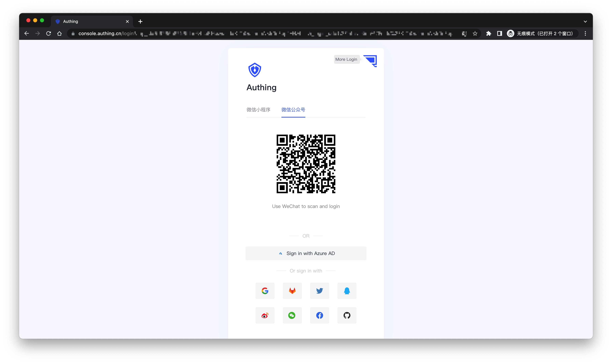
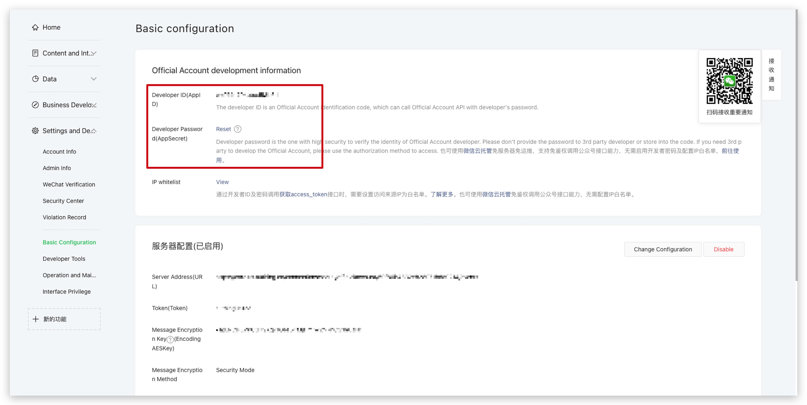
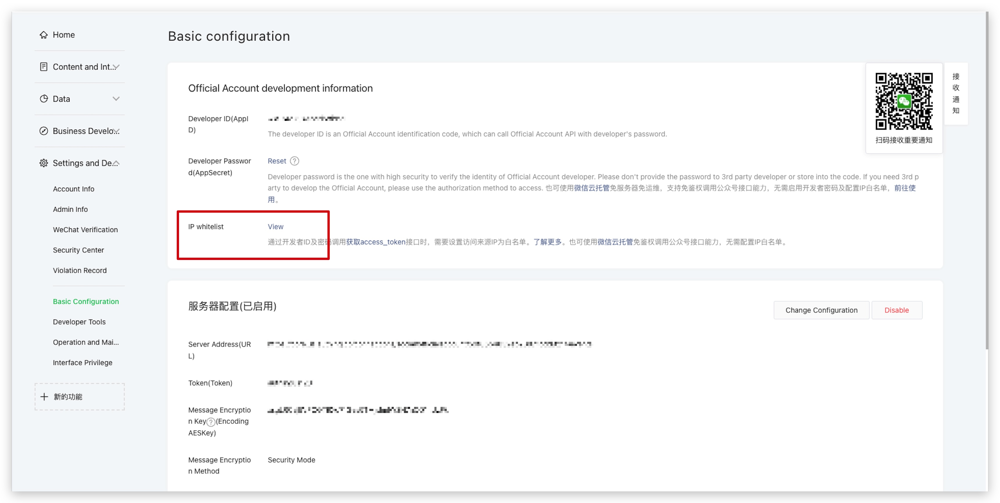
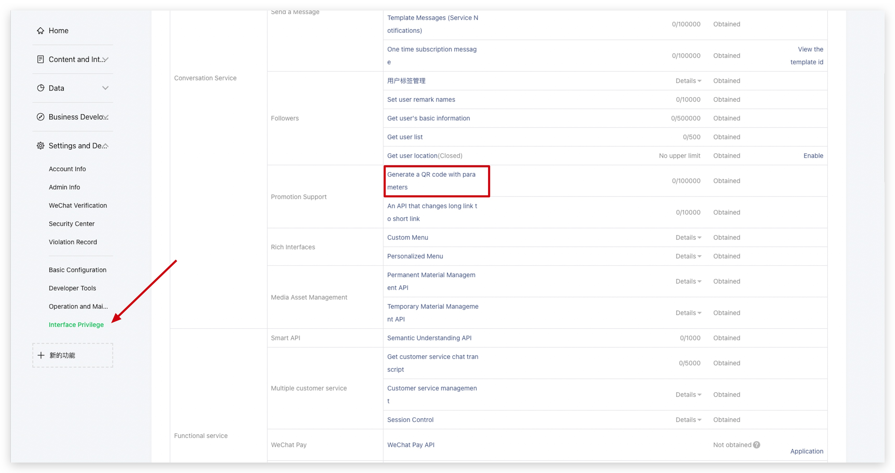
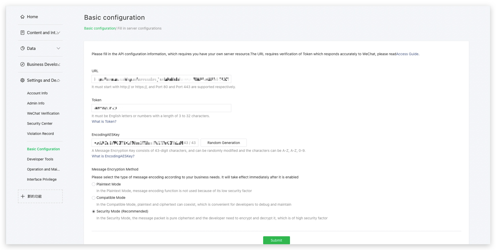
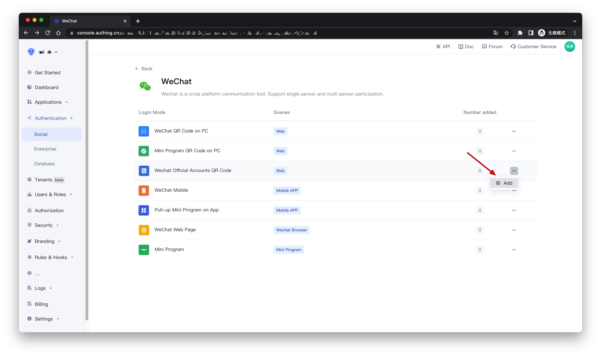
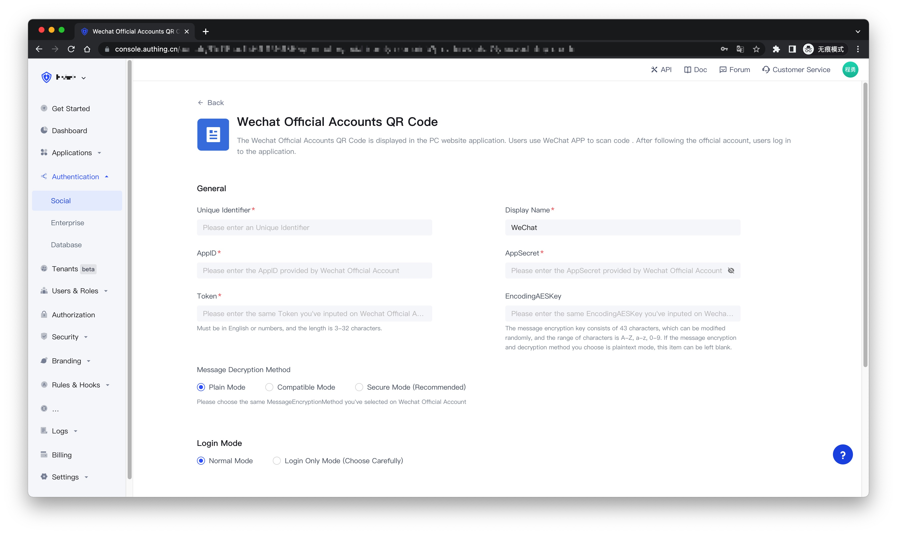
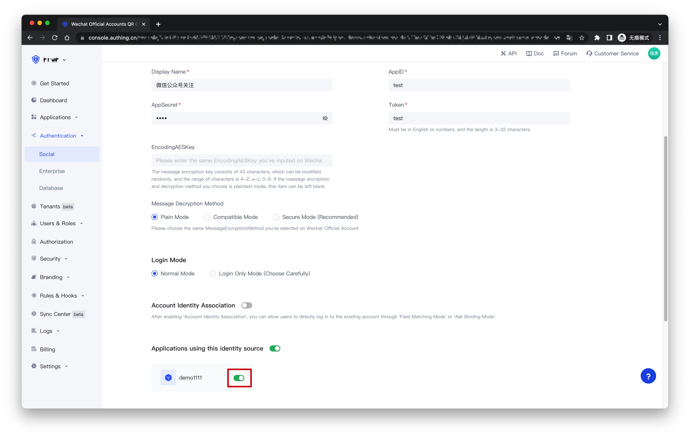
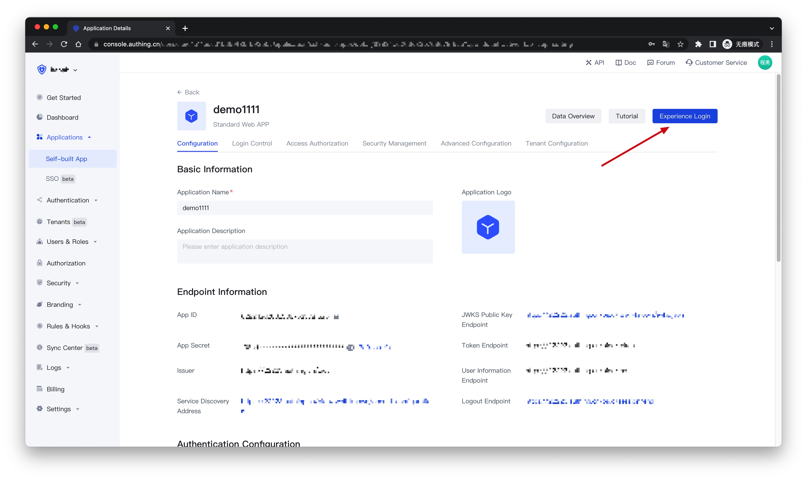
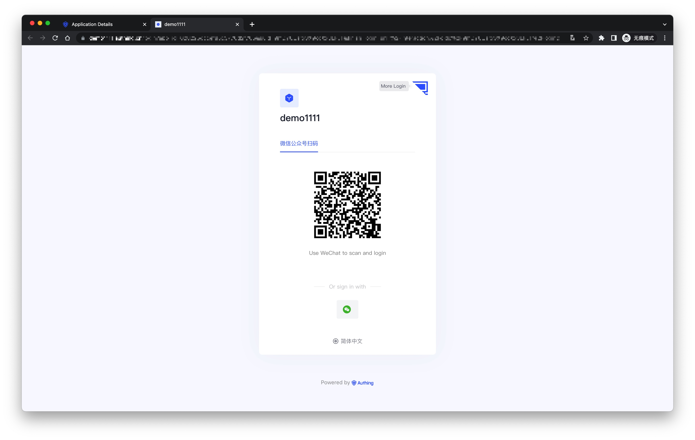

# Wechat Official Accounts QR Code

<LastUpdated />

## Introduction

- **Overview**: "Following the official account login" refers to the process of generating a QR code of the WeChat official account on the PC website. The user scans the code with the WeChat APP and follows the official account to realize the process of automatic login. Using "Follow Official Account Login" can quickly attract traffic to the official account and enhance brand stickiness. With {{$localeConfig.brandName}}'s "Follow Official Account Login", you hardly need to develop any code, just simple configuration and it can be completed in a few minutes.
- **Application scenarios**: PC website
- **End-User Preview**:

## Precautions

- Restricted by the requirements of the WeChat platform, only the service account has the ability to [Generating QR Code with Parameters](https://developers.weixin.qq.com/doc/offiaccount/en/Account_Management/Generating_a_Parametric_QR_Code.html) API. Please make sure that your official account is a service account type.
- If you do not have an {{$localeConfig.brandName}} Console account, please go to the [{{$localeConfig.brandName}} Console](https://authing.cn/) to register a developer account.

## Step 1: Enable server configuration

### Get public account development information

You can get the `AppID` and `AppSecret` on the **Settings and Development -> Basic Configuration** page in the background of the WeChat public platform, which will be used in step 2 later.

### Set up IP whitelist

You need to add the IP of the {{$localeConfig.brandName}} server to the IP whitelist of the WeChat official account. You can [click here](https://core.authing.cn/api/v2/system/public-ips) to get the list of external IPs of the {{$localeConfig.brandName}} server.

### Add API permissions

You need to add the [Generate QR Code with Parameters](https://developers.weixin.qq.com/doc/offiaccount/en/Account_Management/Generating_a_Parametric_QR_Code.html) interface permission on the Settings and Development - Interface Permissions page of the WeChat Official Account Platform:

### Select server configuration mode

You can open the server configuration on the **Settings and Development -> Basic Configuration** page in the background of the WeChat public platform. When the user scans the QR code of the official account and follows the official account, {{$localeConfig.brandName}} can receive the user's scan code and follow events to complete the login.

Since only one WeChat server configuration can be set, you need to choose two different modes according to your specific scenario:

- **Mode 1**: Set the server address as the {{$localeConfig.brandName}} server endpoint. This mode is the easiest, but all the events of the WeChat official account will be pushed to the {{$localeConfig.brandName}} server, and you will lose other events except code scanning and following.
- **Mode 2**: Set the server address to your own server, and then forward the scan code and attention events to the {{$localeConfig.brandName}} server endpoint. This mode requires some development work, but will not lose events, and is conducive to more expansion based on official account events in the future.

#### Mode 1

- **URL**: set to `https://core.authing.cn/connections/social/{Identifier}/{USERPOOL_ID}/events`, replace `{Identifier}` with the unique identifier you entered in the {{$localeConfig.brandName}} Console configuration area, and put it in Replace `{USERPOOL_ID}` with your [UserPool ID](/en/guides/faqs/get-userpool-id-and-secret).
  > If there is no `Identifier`, you can create the identity provider and modify it later.
- **Token**: You can set the Token in the WeChat official account to any string, it must be in English or numbers, the length is 3-32 characters, and make sure that the token you configure in the {{$localeConfig.brandName}} Console and the required access The tokens provided by the official account are the same.
- **EncodingAESKey**: The message encryption key consists of 43 characters, which can be modified randomly. The character range is A-Z, a-z, 0-9.
- **Message Encryption Method**: Please select it according to your business needs, it is recommended to use Security Mode.

Click Submit to save, and finally don't forget to enable this server configuration:

#### Mode 2

The configuration process and mode 1 are exactly the same, just set the `URL` to your own server address. You need to complete interface verification and message forwarding operations on the server endpoint configured by yourself.

For the specific process and sample code, please see this [Demo](https://github.com/Authing/authing-wechat-official-account).

## Step 2: Configure WeChat Official Account in the {{$localeConfig.brandName}} Console

2.1 On the "**Social**" page of the {{$localeConfig.brandName}} Console, click the "**Create Connection**" button to enter the "**Choosing a Social Identity Source**" page.

2.2 On the "**Choosing a Social Identity Source**" page, click the "**WeChat**" card.

2.3 Continue to click the "**Wechat Official Accounts QR Code**" login mode, or click "**... Add**".

2.4 On the "**Wechat Official Accounts QR Code**" configuration page, fill in the relevant field information obtained in the step 1.

| Field                        | Description                                                                                                                                                                                                                                                                                                     |
| ---------------------------- | --------------------------------------------------------------------------------------------------------------------------------------------------------------------------------------------------------------------------------------------------------------------------------------------------------------- |
| Unique Identifier            | a. The unique identifier consists of lowercase letters, numbers, and -, and the length is less than 32 digits.  b. This is the unique identifier of this connection and cannot be modified after setting.                                                                                                  |
| Display Name                 | This name will be displayed on the button on the end user's login screen.                                                                                                                                                                                                                                       |
| AppID                        | The developer ID is the identification code for the development of the official account. With the developer password, the interface capability of the official account can be invoked.                                                                                                                                                                                                                                            |
| AppSecret                    | The developer password is the password to verify the identity of the official account developer.                                                                                                                                                                                                                                                                        |
| Token                        | Must be alphanumeric or 3-32 characters long.                                                                                                                                                                                                                                                                            |
| EncodingAESKey               | The message encryption key consists of 43 characters, which can be modified randomly, and the character range is A-Z, a-z, 0-9. If the message encryption and decryption method you choose is plaintext mode, this item can be left blank.                                                                                                                                                                                        |
| Message Decryption Method    | Please select the same message encryption and decryption method you selected on the WeChat official account.                                                                                                                                                                                                                                                                |
| Login Mode                   | After enabling the "**Login Only Mode**", you can only log in to an existing account and cannot create a new account. Please choose carefully.                                                                                                                                                                  |
| Account Identity Association | When "**Account Identity Association**" is not enabled, a new user is created by default when a user logs in through an identity provider. After enabling "**Account Identity Association**", you can allow users to directly log in to existing accounts through "**Field Matching**" or "**Ask Binding Mode**". |

2.5 After the configuration is complete, click the "Create" or "Save" button to complete the creation.

## Step 3：Development access

- **Recommended development access method**: Use a hosted login page
- **Description of advantages and disadvantages**: The operation and maintenance are simple, and Authing is responsible for the operation and maintenance. Each user pool has an independent second-level domain name; if you need to embed it into your application, you need to use the pop-up mode to log in, that is: after clicking the login button, a window will pop up, the content is the login page hosted by Authing, or the browser The server redirects to the login page hosted by Authing.
- **Detailed access method**:

  3.1 Create an application in the {{$localeConfig.brandName}} Console. For details, see: [How to create an application in {{$localeConfig.brandName}}](/en/guides/app/create-app)

  3.2 On the created "**Wechat Official Accounts QR Code**" identity provider connection details page, open and associate an application created in the {{$localeConfig.brandName}} Console
  

  3.3 Click the "**Experience Login**" button of the app in the {{$localeConfig.brandName}} Console, and experience the "**Wechat Official Accounts QR Code**" login in the pop-up login window
  

