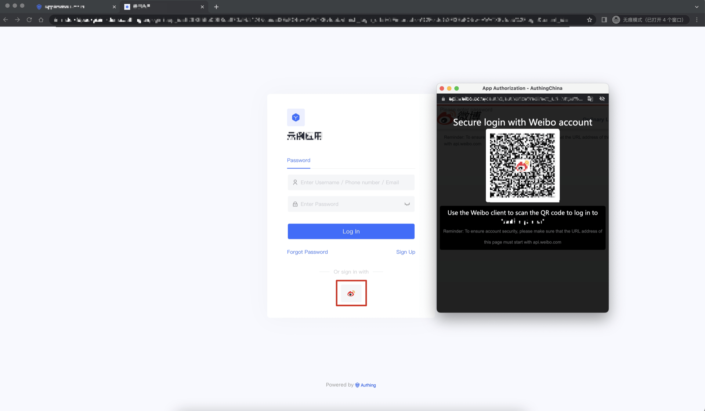
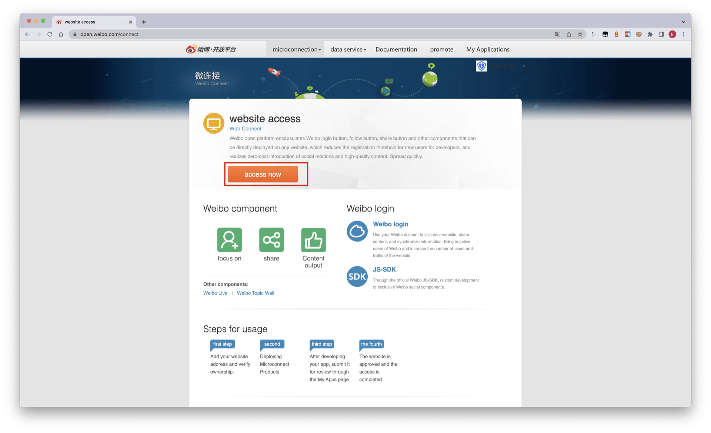
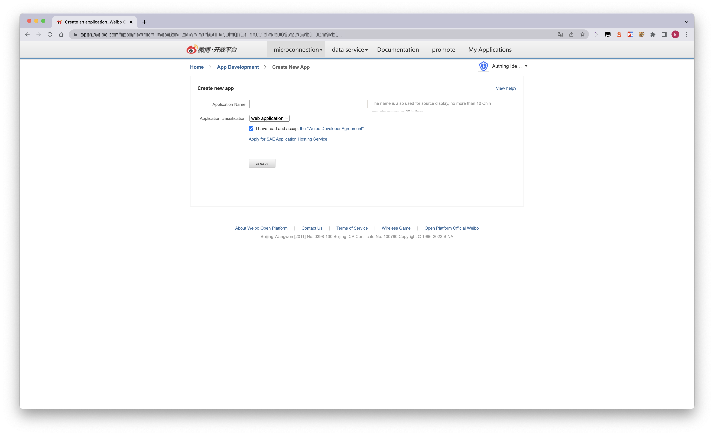
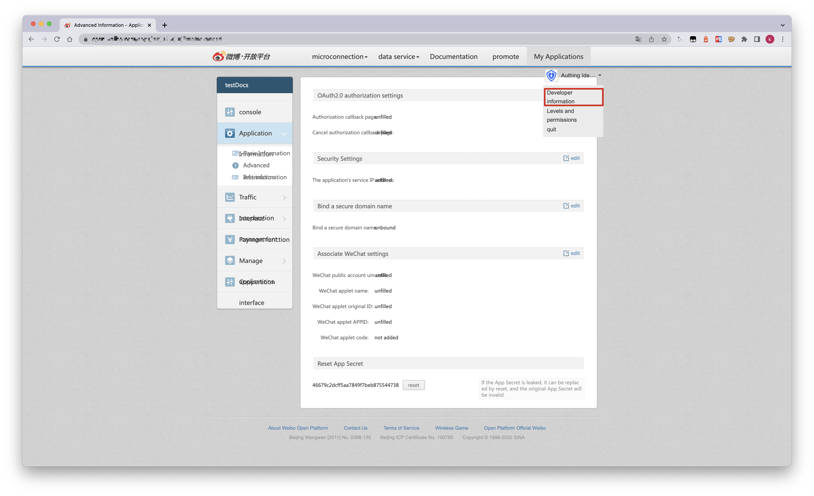
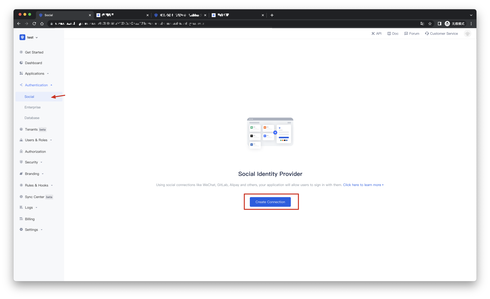
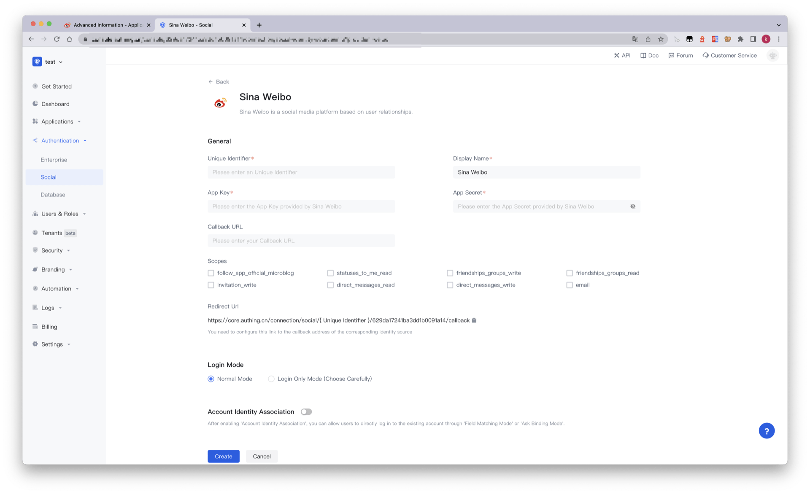
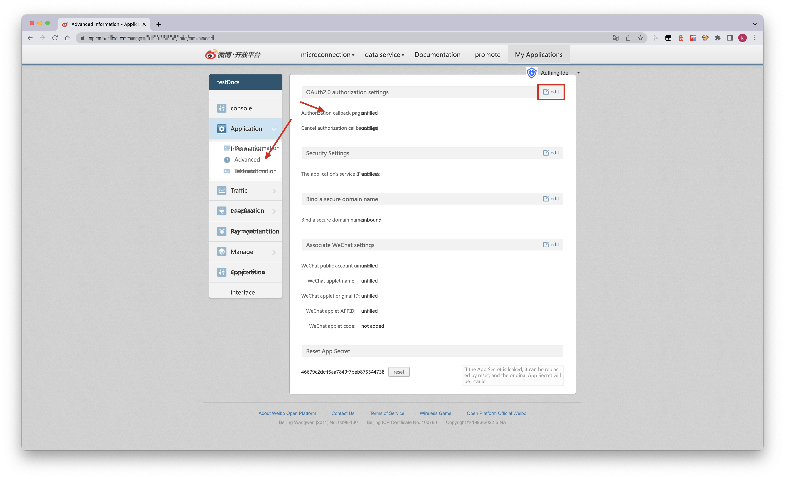
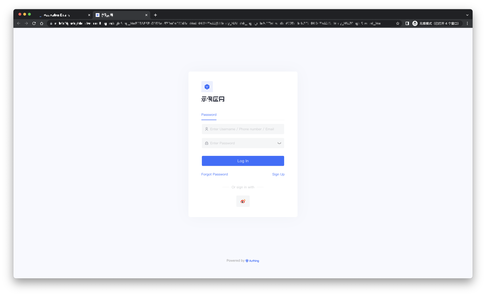

# Sina Weibo Social Login

<LastUpdated/>

## Scene introduction

- **Overview**: Sina Weibo social login is a user who uses Sina Weibo as the identity source to securely log in to a third-party application or website. By configuring and enabling social login of Sina Weibo in {{$localeConfig.brandName}}, you can quickly obtain basic open information of Sina Weibo through {{$localeConfig.brandName}} and help users realize password-free login function .
- **Application scenarios**: website access (PC), mobile application (MOBILE)
- **End User Preview**:

## Precautions:

- If you do not have an account on Weibo Open Platform, please go to [Weibo Open Platform](https://open.weibo.com/connect) to register a developer account.
- You can create an app only after you pass identity authentication.
- If you do not have a {{$localeConfig.brandName}} console account, please go to the [{{$localeConfig.brandName}} console](https://authing.cn/) to register a developer account.

## Step 1: Create an application on the Weibo open platform

Go to [Weibo Open Platform](https://open.weibo.com/connect) and follow the official guidelines to create a website application.

Click the avatar icon at the top right of the page, select the developer information for basic information and identity authentication, and create a website application after the authentication is passed. If there are any problems that cannot be solved, please send a private message to [Weibo Open Platform](https://weibo.com/1904178193) for consultation.

During the application creation process, you need to configure the allowed callback addresses, please use the following settings: https://core.authing.cn/connection/social/weibo/:userPoolId/callback

> Please replace :userPoolId with your user pool ID

## Step 2: Configure Sina Weibo in the {{$localeConfig.brandName}} console

2.1 Please go to the "Social" page of the {{$localeConfig.brandName}} console and click the "Create Connection" button to enter the "Choosing a Social Identity Source" page.

2.2 Please click the "Sina Weibo" identity source button on the "Create Connection" - "Choosing a Social Identity Source" page of the {{$localeConfig.brandName}} console to enter the "Sina Weibo Login Mode" page.

2.3 Please configure the relevant field information on the "Social" - "Sina Weibo" page of the {{$localeConfig.brandName}} console.

| Field/function    | describe                                                       |
| ----- | ------------ | ------------------------------------------------------------ |
| Unique Identifier     | a. The unique identifier consists of lowercase letters, numbers, and -, and the length is less than 32 bits. b. This is the unique identifier of this connection and cannot be modified after setting. |
| Display Name     | This name will be displayed on buttons on the end user's login screen.            |
| APP ID      | Sina Weibo ID, which needs to be obtained on the Weibo open platform.                  |
| App Secret   | Sina Weibo key, which needs to be obtained on the Weibo open platform.                   |
| Callback URL     | You can fill in your business callback address. After the user completes the login, the browser will jump to this address.  |
| Scopes     | By default, {{$localeConfig.brandName}} will only apply to the user for authorization of basic user information (such as avatar, nickname, etc.), if you need more advanced permissions, you can check the corresponding options. |
| Redirect Url    | Sina Weibo is a valid redirect URI. This URL needs to be configured on the Weibo open platform. |
| Login Mode | After "Login Only Mode" is enabled, you can only log in to an existing account and cannot create a new account. Please choose carefully. |
| Account Identity Association | When "Account Identity Association" is not enabled, a new user is created by default when a user logs in through an identity source. After enabling "Account Identity Association", you can allow users to directly log in to existing accounts through "Field Matching" or "Asking for Binding". a. Association method: select |

After the configuration is complete, click the "Create" or "Save" button to complete the creation.

After creating the Sina Weibo identity source on the {{$localeConfig.brandName}} console, you need to configure the callback address to the website callback domain in the platform information on the Weibo open platform.

## Step 3: Development Access

- **Recommended development access method**: use the hosted login page

- **Description of advantages and disadvantages**: Simple operation and maintenance, and {{$localeConfig.brandName}} is responsible for operation and maintenance. Each user pool has an independent second-level domain name; if you need to embed it into your application, you need to use the pop-up mode to log in, that is: after clicking the login button, a window will pop up with the content of {{$localeConfig.brandName}} hosting login page, or redirect the browser to the login page hosted by {{$localeConfig.brandName}}.

- **Detailed access method**:

3.1 Create an application in the {{$localeConfig.brandName}} console. For details, see: [How to create an application in {{$localeConfig.brandName}}](https://docs.authing.cn/v2/en/guides/app/create-app.html)

3.2 On the created Sina Weibo identity source connection details page, open and associate an application created in the {{$localeConfig.brandName}} console

3.3 Experience Sina Weibo third-party login on the login page

