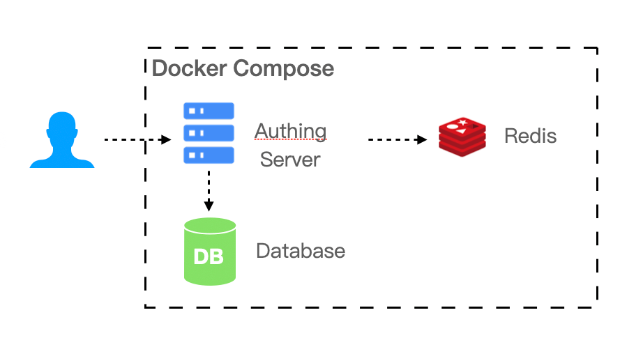

# Private Deployment Plan

::: description
Authing has been providing many famous companies with authentication and user management solutions, as well as public cloud/private cloud/mixed cloud. Private deployment plan can deploy the platform inside client's intranet server, where all data store are encrypted with individual occupation of cloud resources. It's faster, safer and more stable.
:::

### Advantages Of Private Deployment

#### Safe and confidential data

Data privatization isolation; disaster recovery backup mechanism; double insurance of algorithm and key, data safety and reliability; exclusive cloud resources, faster speed and better performance.

#### Enterprise self control

Enterprises can fully control themselves, easily realize member management, authentication configuration, and identity source management; user information and key information are stored locally.

#### High-availability architecture

Supports high-availability architecture, supports horizontal expansion, and can autonomously scale capacity based on your business scenarios.

#### Modification

You can configure independent second-level domain names, corporate logos, brand colors, etc. for your IDaaS services to demonstrate brand characteristics.

### Service details

1. Understand the business scenarios of the enterprise and customize exclusive solutions.
2. Technical experts are responsible for the whole process, provide a complete deployment plan, and complete high-quality delivery.
3. Efficient operation team use support, after-sales service responds in time.

### Supported platform

#### Bare machine or VM

In simple (non-highly available) scenarios can be deployed in the bare machine or VM.

- Required environment: Windows or Linux operating system, Node.js version 12 and above.
- Recommended operating system: CentOS 7.2 and above Ubuntu 18.04 and above.

#### Docker Compose

If your business scenario has a certain scale of 20-2000 people, the IDaaS platform requires multiple components to support your business scenario. You can use Docker Compose to simplify your deployment process.

- Required environment: Linux operating system, Docker 17.04.
- Recommended operating system: CentOS 7.2 and above Ubuntu 18.04 and above.

#### Kubernetes

If your business scenario carries a relatively high number of users, with ammount of 2,000 or more, you need to consider performance and reliability when deploying privatization. We recommend that you use the Kubernetes cloud native model to operate and maintain your IDaaS platform.

- Required environment: Kubernetes 1.16 and above.
- Recommended operating system: CentOS 7.2 and above Ubuntu 18.04 and above.

### Resource planning

| Supported user number | Scenario               | Server                 | DB              | Cache Redis    | Elastic Search                 |
| --------------------- | ---------------------- | ---------------------- | --------------- | -------------- | ------------------------------ |
| <=20                  | Small team and POC     | 4 core 8G memory \* 1  | -               | -              | -                              |
| 20 - 2000             | SMEs                   | 4 core 16G memory \* 1 | 2 co re 8G \* 1 | 1 core 2G \* 1 | 4 core 8G \* 1 + 500G storage  |
| 2000 -20000           | Large-scale enterprise | 4 core 16G memory \* 1 | 4 core 16G \* 1 | 1 core 4G \* 1 | 4 core 8G \* 1 + 500G storage  |
| >20000                | Large company          | 4 core 16G memory \* 3 | 8 core 32G \* 1 | 2 core 8G \* 1 | 8 core 16G \* 1 + 500G storage |

### Notice

1. Servers can access each other through the intranet.
2. Provide a pan-domain name (or a single domain name if it is a small number) and corresponding certificates.
3. Provide internal network domain name resolution server, which needs to resolve internal and external network domain names at the same time. Cluster deployment is recommended.
