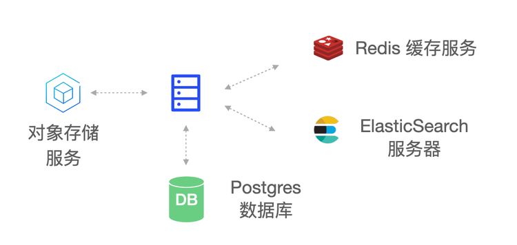

# Basic Deployment

<LastUpdated/>

## Overview

Orchestration-based containerized deployment operation and maintenance has gradually become the current mainstream method. Whether it is an infrastructure environment based on Kubernetes or Docker, business components can be built quickly through orchestration, and efficient operation and maintenance management can also be achieved. Here we It is recommended that you use a container-based deployment scheme.

- [Docker deployment](./docker-compose.md)
- [Kubernetes deployment](./kubernetes.md) 

Of course, we also provide a traditional physical machine-based deployment solution. The advantage of physical machine deployment is that it can make full use of the resources of the physical machine and can finely control the deployment process.
This article will introduce the basic deployment plan of Approw IDaaS platform and specific operation guidance.
## Overall structure

The main components of the Approw IDaaS platform architecture include: object storage service, Redis, ElasticSearch, Postgres and Approw Server.Approw Server, as the main service of the Approw IDaaS platform, receives requests from clients; object storage is used as a service for storing static resources; Redis stores session information, data caching, etc.; Postgres is used to store core business data; ElasticSearch is used for data statistical analysis and logs collection and analyze the work.
## Deployment plan

**1. Component planning**

| server | Component package | Function Description |
| --- | --- | --- |
| ElasticSearch | elasticsearch-7.7.0 | Search engine, log service |
| Approw Server | Approw-server-1.2.0 | Approw main service |
| Redis | redis-4.0.0 | Cache service |
| PostgreSQL | postgres-12.5 | Database service |
| Logstash | logstash-7.7.0 | Log collection and analysis service |
| JDBC-River | jdbc-logstash-river:1.0.0 | Background data service |
| Staticfiles | Approw-staticfiles:1.0.0 | Static resource service |

**2. System environment requirements**

server configuration:

| project | Minimum configuration | Recommended configuration |
| --- | --- | --- |
| CPU | X86 64 bit 8 core | X86 64 bit 16 core |
| RAM | 32 GB | 64 GB and above |
| hard disk | 500 GB | 2 TB |
| Intranet bandwidth | 100 Mbps | 1 Gbps |

Operating system environment requirements:

| project | Minimum configuration | Recommended configuration |
| --- | --- | --- |
| Operating system platform | linux/amd64 | - |
| Kernel version | linux 3.10.0 and above | - |

**3. Related Documents**

| name | Description |
| --- | --- |
| &quot;Approw IDaaS Platform User Guide Version 1.2.0&quot; | Introduce Approw IDaaS platform operation guide |
| &quot;Approw IDaaS Platform Product Documentation Version 1.2.0&quot; | Introduce Approw IDaaS platform product features |

**Note: Please contact the pre-sales staff for the above resources**

**4. Installation package**

| name | Description |
| --- | --- |
| Approw-jdbc-logstash-river-1.0.0.tar.gz | Approw back-end data service installation package |
| Approw-server-1.2.0.tar.gz | Approw service installation package |
| Approw-staticfiles-1.0.0.tar.gz | Static resource service installation package |
| elasticsearch-7.7.0-linux-x86\_64.tar.gz | ElasticSearch service installation package |
| logstash-7.7.0-linux-x86\_64.tar.gz | Logstash service installation package |
| postgres-12.5-linux-x86\_64.tar.gz | PostgreSQL service installation package |
| redis-4.0.0-linux-x86\_64.tar.gz | Redis service installation package |

**Note: Please contact the pre-sales staff for the above resources**
