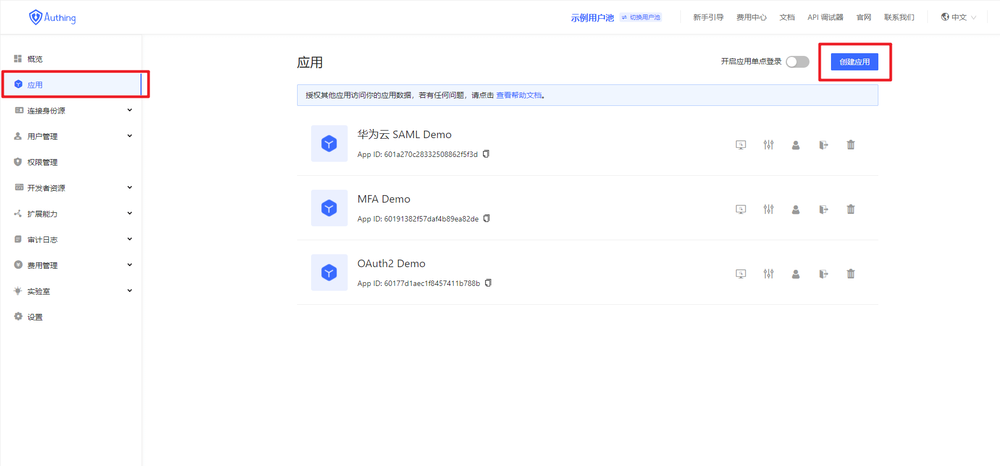
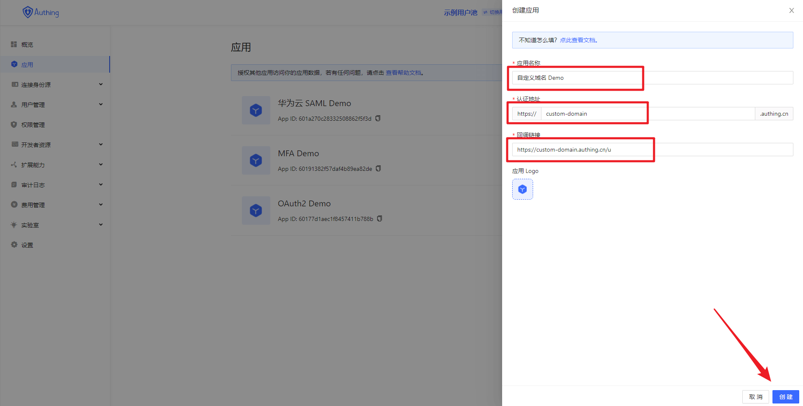
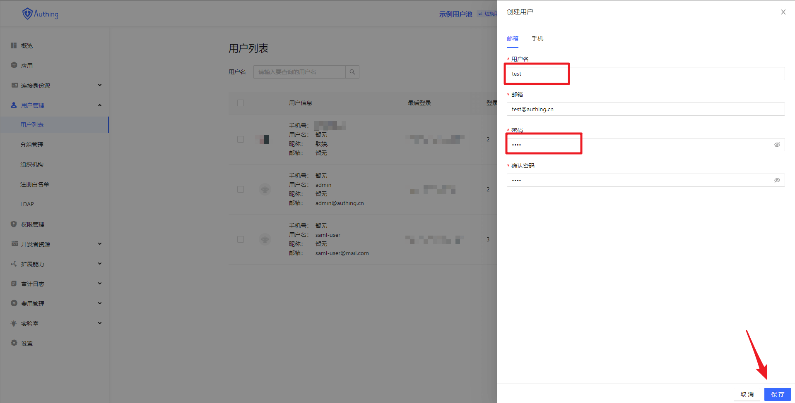
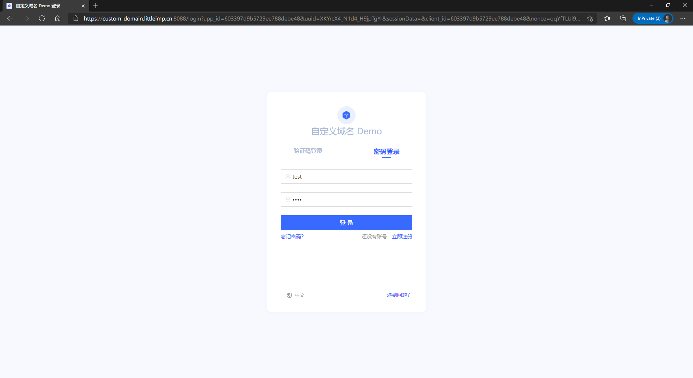
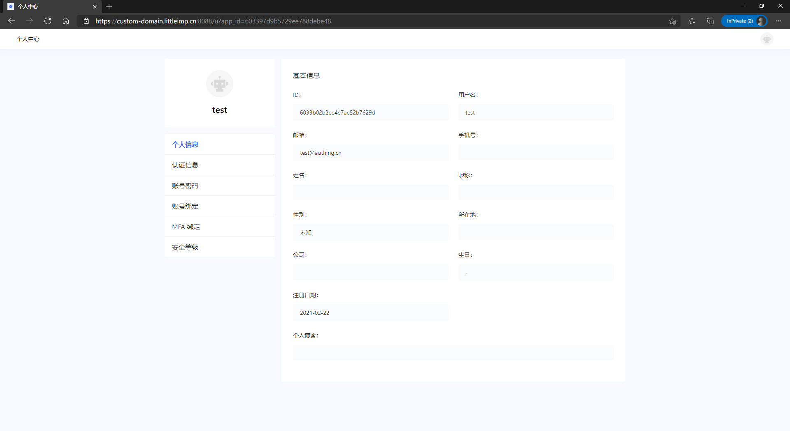

# Customize Domain Name

<LastUpdated/>

## Overview
Approw currently using the **domain name hosted** mode, using Approw secondary domain (eg:https://my-app.Approw.cn).
In the **domain name hosted mode**, the user can log in and access the application through Approw by two domain names, as for users want to use a custom domain name, Approw offers a solution based on Nginx reverse proxy.
This article will describe in detail how users configure a custom domain name, so as to realize Approw login and registration through a custom domain name.

## Preparation
1. The user needs to register the domain name, prepare HTTPS certificate and DNS resolution required for customization;
2. Configure the registered domain name and HTTPS certificate in the Nginx reverse proxy service;
3. Create an Approw application and configure the domain name of the Approw application in the Nginx reverse proxy service.

## Steps

:::hint-success
Before proceeding with this session, please make sure that you have completed the first two items in the preparatory work.
:::

**1. Log in to the Approw console, create a new application, and specify the application domain name**





As shown above, we have created a Approw application and configure the application for the domain name:**https://custom-domain.Approw.cn**.
Next, we will reverse proxy the user's custom domain name **https://custom-domain.Approw.cn**.
This application and domain name are just examples, you can create your own Approw application and domain name.

**2. Create a user to log in to the Approw application**




**3. Configure the Approw application domain name created above in the Nginx reverse proxy**
```nginx
upstream custom_domain {
    # 上述配置的应用域名
    server custom-domain.Approw.cn:443;
    keepalive 64;
}

server {
    listen 443;
    # 示例中的自定义域名
    server_name custom-domain.littleimp.cn;

    ssl                         on;
    # 自定义域名的 HTTPS 证书
    ssl_certificate             /etc/nginx/certificate/fullchain.cer;
    # 自定义域名的 HTTPS 私钥
    ssl_certificate_key         /etc/nginx/certificate/littleimp.cn.key;
    ssl_session_cache           shared:SSL:1m;
    ssl_session_timeout         5m;
    ssl_ciphers                 ECDHE-RSA-AES128-GCM-SHA256:ECDHE:ECDH:AES:HIGH:!NULL:!aNULL:!MD5:!ADH:!RC4;
    ssl_protocols               TLSv1 TLSv1.1 TLSv1.2;
    ssl_prefer_server_ciphers   on;
    proxy_ssl_session_reuse     off;

    location / {
        # 将应用域名重定向到自定义域名
        proxy_redirect https://custom-domain.Approw.cn https://custom-domain.littleimp.cn:8088;
        # 上述配置的应用域名
        proxy_set_header Host custom-domain.Approw.cn;
        proxy_set_header X-Real-IP $remote_addr;
        proxy_set_header User-Agent $http_user_agent;
        proxy_set_header X-Forwarded-For $proxy_add_x_forwarded_for;
        proxy_set_header X-Forwarded-Proto $scheme;
        proxy_set_header X-Forwarded-Host $host;
        proxy_ssl_server_name on;
        # proxy_pass 配置与 upstream 配置保持一直
        proxy_pass https://custom_domain;
        index index.html index.htm;
        client_max_body_size 256m;
        client_body_buffer_size 128k;
        proxy_connect_timeout 7d;
        proxy_send_timeout 7d;
        proxy_read_timeout 7d;
        proxy_buffers 32 4k;
    }
}
```

**4. By custom domain example of `https://custom-domain.littleimp.cn:8088` to access applications Approw**


**5. Enter the user and password created above to log in to the Approw application**


**6. Successfully log in to the Approw application through the custom domain name and visit the personal center**

