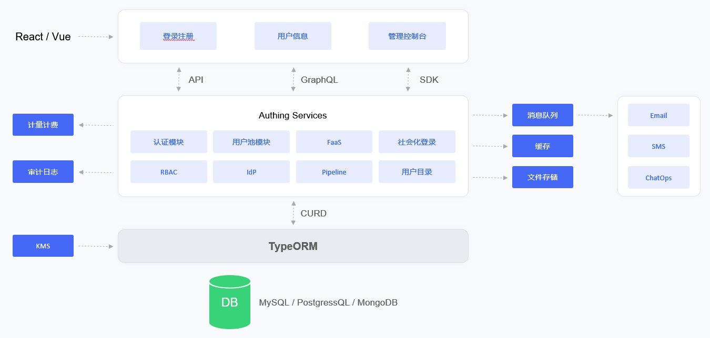

# Docker Deployment

<LastUpdated/>

## Overview

Docker Compose is a set of orchestration tools based on the Docker engine. You can use Docker Compose to quickly deploy the Approw IDaaS platform with one click
Approw under the Docker deployment scheme is a stand-alone deployment. If you want to deploy a highly available version of Approw, please refer to:[Kubernetes Deployment](./kubernetes.md).
This article will introduce the Docker Compose-based deployment plan of the Approw IDaaS platform and specific operation instructions.

## Overall structure

The main components of the Approw IDaaS platform architecture include: object storage service, Redis, ElasticSearch, Postgres and Approw Server.Approw Server, as the main service of the Approw IDaaS platform, receives requests from clients; object storage is used as a service for storing static resources; Redis stores session information, data caching, etc.; Postgres is used to store core business data; ElasticSearch is used for data statistical analysis and logs collection and analyze the work.
Approw IDaaS platform uses the ELK architecture for logging system. The Approw Server writes logs into the Log File. Logstash writes the log information into the ElasticSearch service by reading the Log File. This ensures that multiple IDaaS clusters follow a unified pipeline: Collection -> Transmission -> Storage -> Analysis process, and Kibana is used as a graphical UI management interface for operation and maintenance management, which greatly reduces the complexity and error rate of operation and maintenance work, and improves the work efficiency of operation and maintenance staff.

## Deployment plan

**1. Component planning**

| server | Component package | Function Description |
| --- | --- | --- |
| ElasticSearch | elasticsearch-7.7.0 | Search engine, log service |
| Approw Server | Approw-server-1.2.0 | Approw main service |
| Redis | redis-4.0.0 | Cache service |
| PostgreSQL | postgres-12.5 | Database service |
| Logstash | logstash-7.7.0 | Log collection and analysis service |
| JDBC-River | jdbc-logstash-river:1.0.0 | Background data service |
| Staticfiles | Approw-staticfiles:1.0.0 | Static resource service |

**2. System environment requirements**

Docker version requirements:

| project | version |
| --- | --- |
| Client | 19.03.14 and above |
| Server | 19.03.14 and above |

Operating system environment requirements:

| project | Minimum configuration | Recommended configuration |
| --- | --- | --- |
| Operating system platform | linux/amd64 | - |
| Kernel version | linux 3.10.0 and above | - |

server configuration:

| project | Minimum configuration | Recommended configuration |
| --- | --- | --- |
| CPU | X86 64 bit 8 core | X86 64 bit 16 core |
| RAM | 32 GB | 64 GB and above |
| hard disk | 500 GB | 2 TB |
| Intranet bandwidth | 100 Mbps | 1 Gbps |

**3. Related Documents**

| name | Description |
| --- | --- |
| &quot;Approw IDaaS Platform User Guide Version 1.2.0&quot; | Introduce Approw IDaaS platform operation guide |
| &quot;Approw IDaaS Platform Product Documentation Version 1.2.0&quot; | Introduce Approw IDaaS platform product features |

**Note: Please contact the pre-sales staff for the above resources.**

**4. Installation packages**

| name | Description |
| --- | --- |
| Approw-jdbc-logstash-river-1.0.0-90875fa84d87.tar | Approw back-end data service image package |
| Approw-server-1.2.0-32d8b4130bae.tar | Approw main service image package |
| Approw-staticfiles-1.0.0-a70a58e3c115.tar | Static resource service image package |
| elasticsearch-7.7.0-7ec4f35ab452.tar | Search and data statistics service mirror package |
| logstash-7.7.0-30dcca1db5e9.tar | Log collection and analysis service image package |
| postgres-12.5-386fd8c60839.tar | Database service mirroring package |
| redis-4.0.0-3189e099eb0f.tar | Cache service image package |

**Note: Please contact the pre-sales staff for the above resources.**

**5. Component files**

| name | Description |
| --- | --- |
| docker-compose.yml | Approw Docker Compose One-click file layout |

**Note: Please contact the pre-sales staff for the above resources**