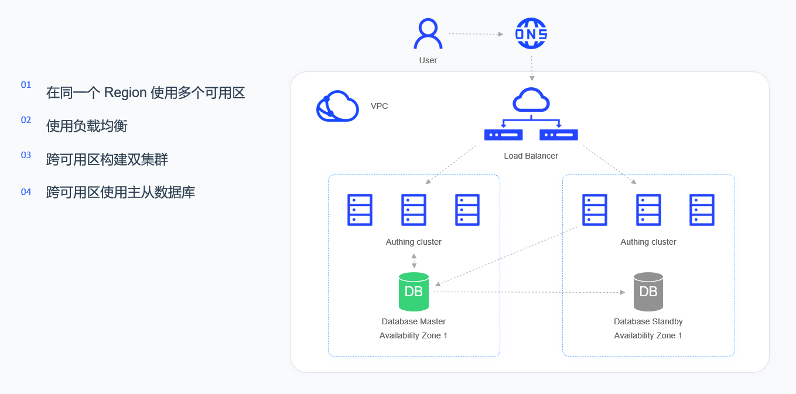

# Kubernetes Deployment 

<LastUpdated/>

## Overview

Approw will not change the user's existing cloud infrastructure, Approw will be as much as  compatible with the user's cloud environment. Therefore, Approw proposed the concepts of "Cloud Neutrality" and "Approw Inside". Approw can maintain it's neutral characteristics in a multi-cloud environment, and it can be deployed in AWS, Tencent Cloud, Alibaba Cloud or private cloud environments.In a hybrid cloud or private cloud environment, Approw will be integrated into the customer's IT system like Intel.
This article will introduce the Kubernetes-based deployment plan and specific operation guidance of the Approw IDaaS platform.
## Overall structure

The high-availability architecture of the Approw IDaaS platform is running in VPC (virtual private cloud), through LB (load balancing), multi-availability server clusters in the same region are virtualized into a high-performance and highly available service pool as a whole. Based on load balancing Rules, the request from the client is distributed to the availability zone in the service pool.

Each availability zone is composed of a set of Kubernetes Nodes, and each availability zone is equipped with a complete set of Approw IDaaS platform. IDaaS cluster is a stateless service, while the database cluster is a stateful master-slave synchronization architecture. If a server appears in a certain availability zone fails or the server is unavailable, LB will transfer the traffic to another available zone, which will also assign the role of master cluster.
Load balancing will detect the health status of each availability zone in real time, and automatically isolate the availability zones with abnormal states, thereby improving the overall service capabilities of the application.

**Deployment plan**

**1. Component planning**

| server | Component package | Function Description |
| --- | --- | --- |
| ElasticSearch | elasticsearch-7.7.0 | Search engine, log service |
| Approw Server | Approw-server-1.2.0 | Approw main service |
| Redis | redis-4.0.0 | Cache service |
| PostgreSQL | postgres-12.5 | Database service |
| Logstash | logstash-7.7.0 | Log collection and analysis service |
| JDBC-River | jdbc-logstash-river:1.0.0 | Background data service |
| Staticfiles | Approw-staticfiles:1.0.0 | Static resource service |

**2. System environment requirements**

During the software installation, configuration, and commissioning process, a Kubernetes cluster needs to be prepared. The cluster requirements are as follows:

Kubernetes version requirements:

| project | version |
| --- | --- |
| Client Version | v1.19.4 and above |
| Server Version | v1.18.3 and above |

Docker version requirements:

| project | version |
| --- | --- |
| Client | 19.03.14 and above |
| Server | 19.03.14 and above |

Operating system environment requirements:

| project | Minimum configuration | Recommended configuration |
| --- | --- | --- |
| Operating system platform | linux/amd64 | - |
| Kernel version | linux 3.10.0 and above | - |

Kubernetes Master node configuration requirements:

| project | Minimum configuration | Recommended configuration |
| --- | --- | --- |
| CPU | X86 64 bit 2 cores | X86 64 bit 4 cores |
| RAM | 8 GB and above | 16 GB and above |
| hard disk | 500 GB | 1 TB |
| Intranet bandwidth | 1 Gbps | 10 Gbps |

Kubernetes Worker node configuration requirements:

| project | Minimum configuration | Recommended configuration |
| --- | --- | --- |
| CPU | X86 64 bit 4 cores | X86 64 bit 8 core |
| RAM | 16 GB and above | 32 GB and above |
| hard disk | 1 TB | 5 TB |
| Intranet bandwidth | 1 Gbps | 10 Gbps |

**3. Related Documents**

| name | Description |
| --- | --- |
| &quot;Approw IDaaS Platform User Guide Version 1.2.0&quot; | Introduce Approw IDaaS platform operation guide |
| &quot;Approw IDaaS Platform Product Documentation Version 1.2.0&quot; | Introduce Approw IDaaS platform product features |

**Note: Please contact the pre-sales staff for the above resources**

**4. Installation package**

| name | Description |
| --- | --- |
| Approw-jdbc-logstash-river-1.0.0-90875fa84d87.tar | Approw back-end data service image package |
| Approw-server-1.2.0-32d8b4130bae.tar | Approw main service image package |
| Approw-staticfiles-1.0.0-a70a58e3c115.tar | Static resource service image package |
| elasticsearch-7.7.0-7ec4f35ab452.tar | Search and data statistics service mirror package |
| logstash-7.7.0-30dcca1db5e9.tar | Log collection and analysis service image package |
| postgres-12.5-386fd8c60839.tar | Database service mirroring package |
| redis-4.0.0-3189e099eb0f.tar | Cache service image package |

**Note: Please contact the pre-sales staff for the above resources**

**5. Compose files**

| name | Description |
| --- | --- |
| namespace.yaml | Namespace orchestration file |
| Approw-jdbc-logstash-river-deployment.yaml | Approw back-end data service orchestration file |
| Approw-server--deployment.yaml | Approw main service orchestration file |
| Approw-staticfiles-deployment.yaml | Static resource service orchestration file |
| elasticsearch-deployment.yaml | Search, data statistics service layout file |
| logstash-deployment.yaml | Log collection, analysis service orchestration file |
| postgres-deployment.yaml | Database Service Orchestration File |
| redis-deployment.yaml | Cache service orchestration file |

**Note: Please contact the pre-sales staff for the above resources**