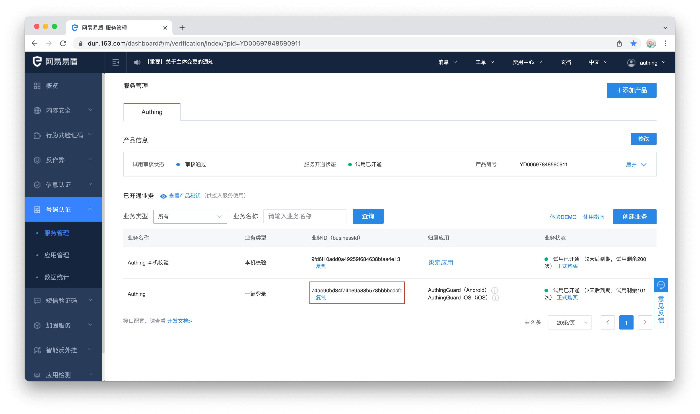
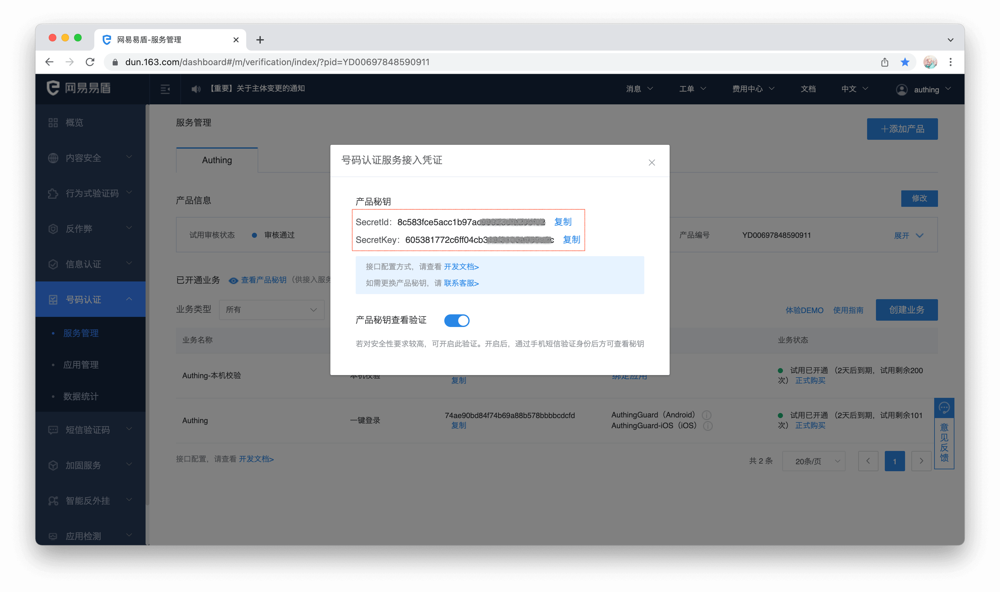
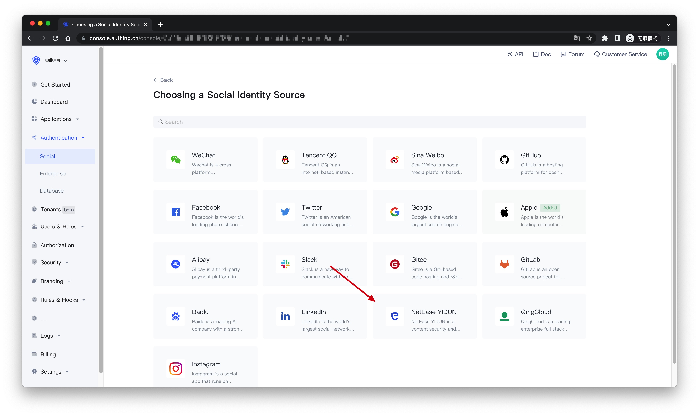
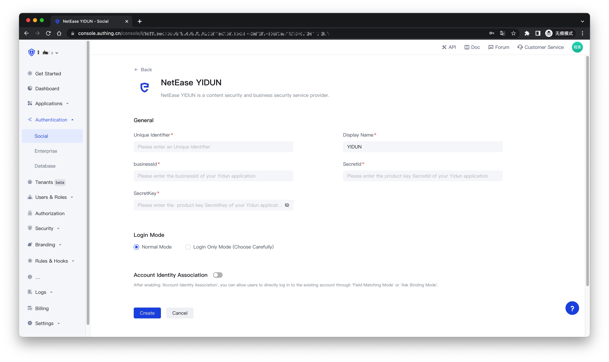
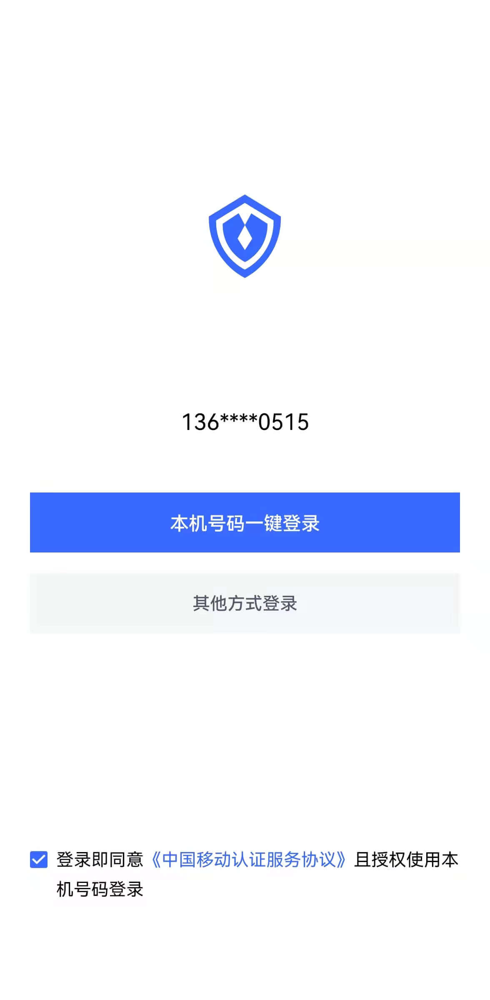

# One-click login with mobile phone number

<LastUpdated/>

Mobile phone number one-click login is an extremely convenient authentication method provided by the three major operators.

Currently, Authing supports access to this capability through NetEase Yidun. Netease Yidun integrates the three major operators' one-click login SDK to provide a unified mobile application interface. You can quickly complete the access through the following three steps.

 

## STEP1: NetEase YIDUN Background configuration

Refer to the [YIDUN documentation](https://support.dun.163.com/documents/287305921855672320?docId=424413790996844544) to create an application, set the package name, upload the signature, and copy the business Id, SecretId, SecretKey

## STEP2: Authing Background configuration

Create a social identity provider

Select YIDUN One-Key Login

Fill in the backend information of Yidun into the Authing console

## STEP3: Mobile integration

With the SDK we provide, developers only need one line of code to integrate the one-click login function. Please refer to:

[Android Integration Guide](https://github.com/Authing/guard-android/blob/master/doc/topics/oneauth.md)

[iOS Integration Guide](https://github.com/Authing/guard-ios/blob/main/doc/topics/oneauth.md)

After successful integration, the effect is as follows

