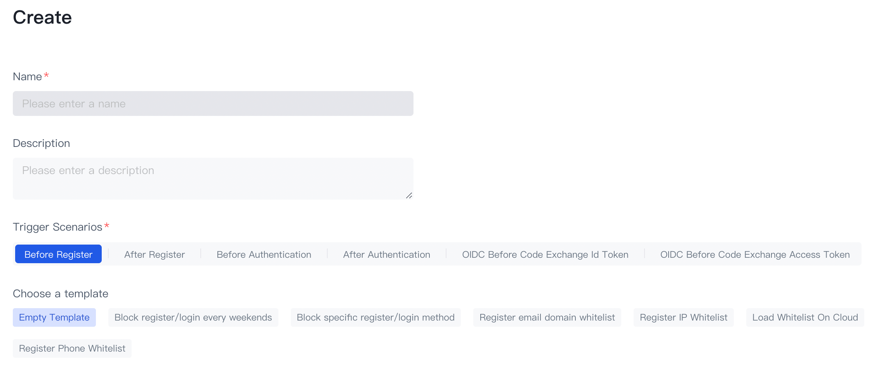
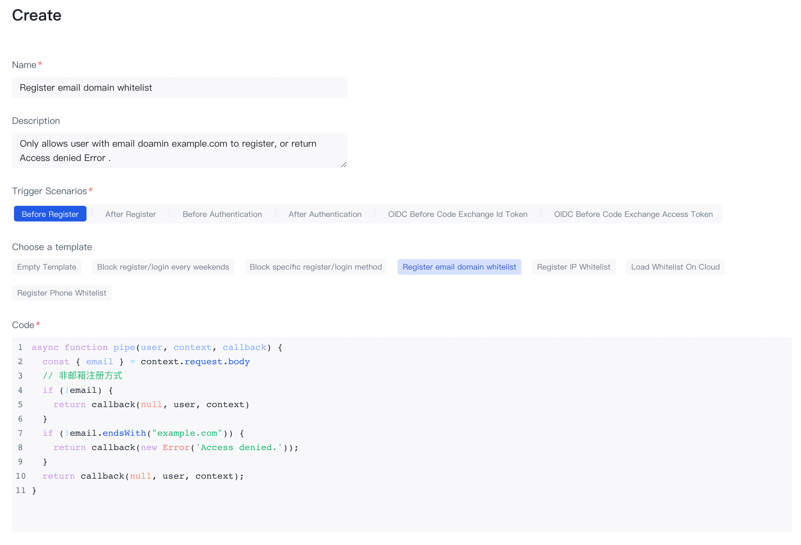

---
meta:
  - name: description
    content: Create your first pipeline function
---

# Create your first pipeline function

<LastUpdated/>

The Pipeline function is a custom JavaScript code executed in the {{$localeConfig.brandName}} authentication process. With the help of Pipeline, developers can easily customize and extend the capabilities of {{$localeConfig.brandName}}.

## Select a pipeline template

{{$localeConfig.brandName}} provides many templates that can be used directly to help you get started quickly.

You can also view the list of Pipeline template functions here：[https://github.com/authing/pipeline](https://github.com/authing/pipeline). At the same time, you are welcome to contribute to us the Pipeline template function.

First, select the Console's**Extention Capabilities** - **Custom Pipeline** page and you will see some tips.

Select a trigger scene and click the 「+」 button. We have more than 20 templates to choose:

Select "Registered Email Suffix White List" in Access Control.

## Create a pipeline function

The domain name whitelist we set here is "example.com", you can also change it to your own.

Click the "Save" button in the lower left corner, we will deploy this function to the cloud, it will take some time, please be patient.

Back to the Pipeline function list page, you can see the function we just added.

::: hint-success
If you have multiple Pipeline functions, you can drag to sort them.
:::

## Verify that the whitelist is valid

First, use the non-`example.com` suffix mailbox and see the "Access Denied." prompt returned, which is the prompt message we specified in the custom Pipeline function.

Then use the email with the suffix of `example.com` to register. The registration is successful!

## Next

- Read the [development documentation of the Pipeline function](pipeline-function-api-doc.md).
- Understand that the request information can be obtained in the pipe function：[user object](user-object.md) and [context object](context-object.md).
- Learn how to [use environment variables in the pipe function](env.md).
- Learn [which Node Modules out of the box ](available-node-modules.md) can be used in the pipe function. You can use [authing-js-sdk ](/reference/sdk-for-node/) directly！
- We provide a lot of rich pipeline function templates, click [here](https://github.com/authing/pipeline).
- We also provide convenient [online debugging methods ](./how-to-debug.md) for developers to debug online.
