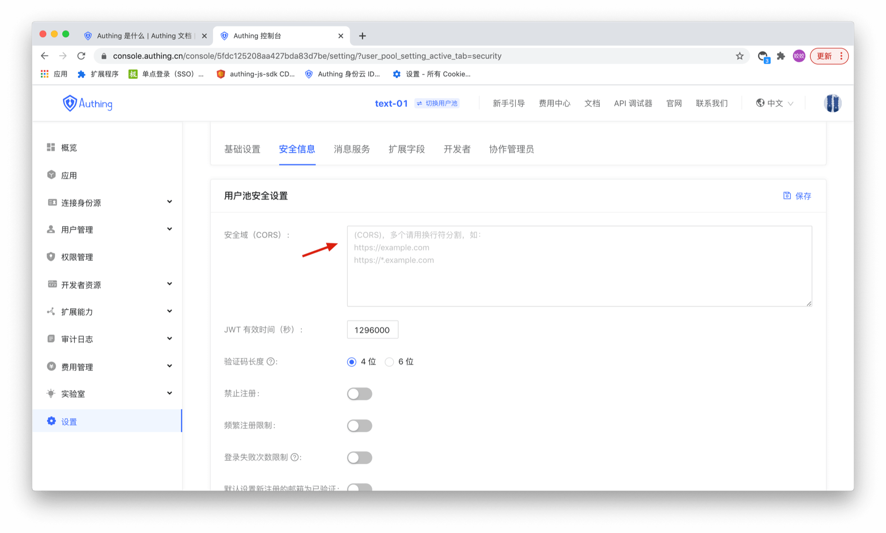

# Configure Web Security Domain

For web applications, there is a risk of userPoolId/secret being stolen, so we need to take some special defense action. The key point is that we must be able to ensure that other people can obtain your userPoolId and cannot directly use your server resources. The Web side can restrict the source of the request through the Web security domain name, which is simply a white list. 

After setting the "Web Security Domain Name", the server resources can only be called through the JavaScript SDK under this domain name. Note: The domain name configuration policy is consistent with the browser domain security policy. The domain name protocol, domain, and port number must be strictly consistent. Subdomains and wildcards are not supported, otherwise access will be prohibited. Give an example to illustrate the difference between domain names:
```
// 跨域
www.a.com:8080
www.a.com

// 跨域
www.a.com:8080
www.a.com:80

// 跨域
a.com
www.a.com

// 跨域
xxx.a.com
www.a.com

// 不同协议，跨域
http:
https:

```

This can prevent others from embezzling your server resources through other addresses on the external network. However, it should be noted that the purpose of the Web security domain name is to prevent malicious deployment, not to prevent forgery of dirty data (malicious users may still access application data by binding the host), so you need to take more specific control over the data, it should be also implemped with ACL.
For usage in WebView, it is recommended to load a deployed Web with a domain name through WebView, and then cache it locally, so that the access can be restricted by the Web security domain name.
If you use the JavaScript SDK on the front end, when you plan to officially release it, be sure to configure the web security domain name by going to the console> settings> security information> security domain (CORS).


