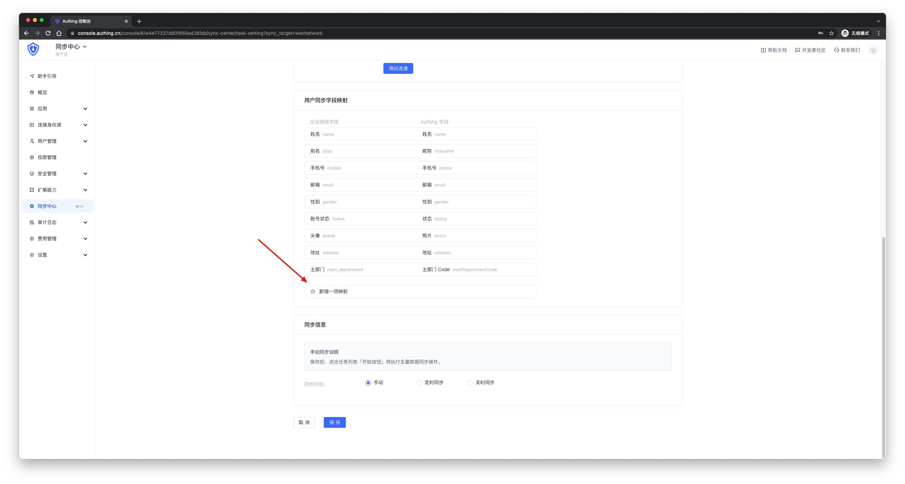
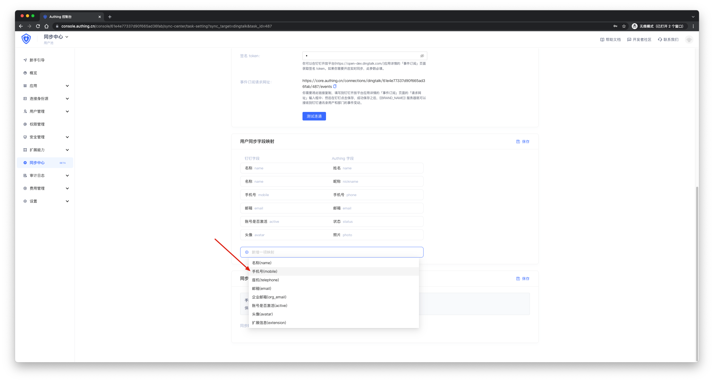
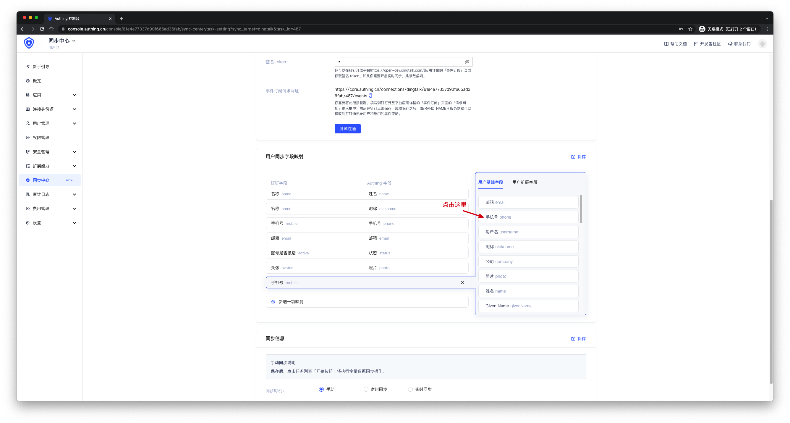
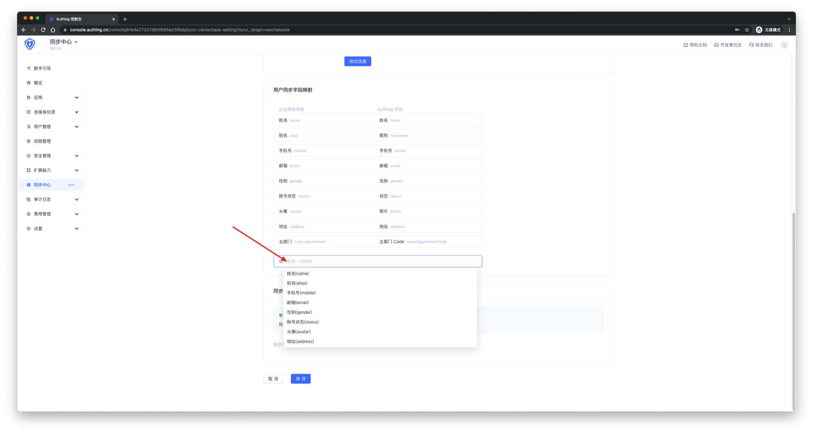
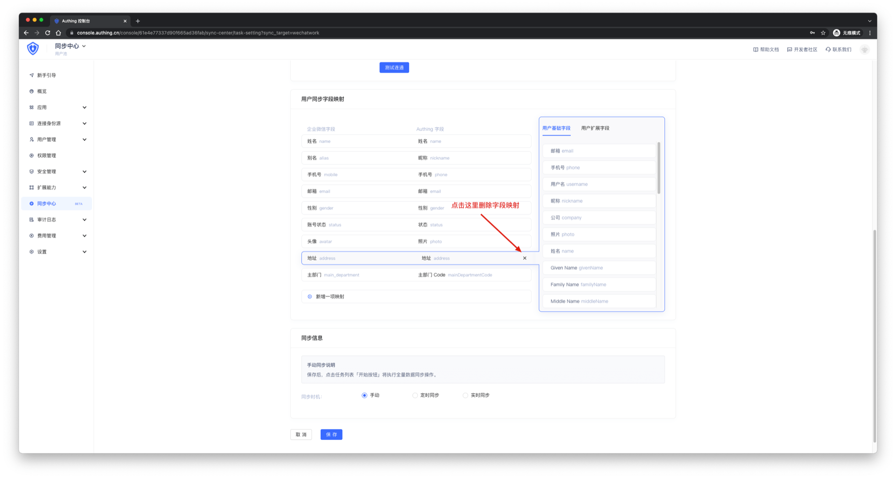
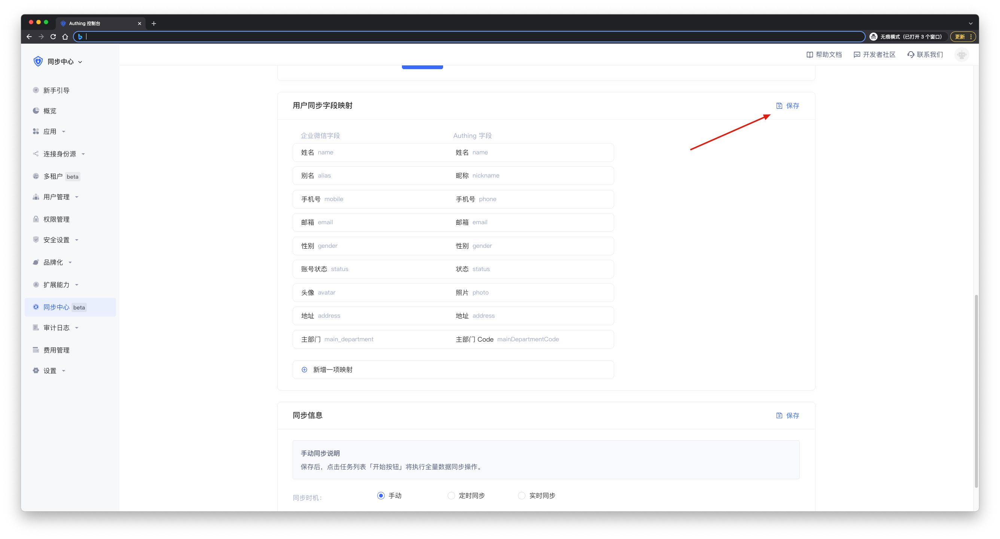

# 自定义字段映射

<LastUpdated/>

自定义字段映射用于用户自主选择需要同步的数据。

## 新增字段映射

点击**新增一项映射**选择您想要映射的字段。

 

比如新增 mobile 字段映射为 phone 字段。

 

 

如果想要再增加其他字段，再次点击**新增一项映射**即可。

 

## 删除字段映射

选中您要删除的字段，点击右侧 '**x**' 号。

 

## 注意

如果是**修改**已创建的同步任务，修改之后要点击保存。如果是新建的同步任务，最后点击保存即可。

 
