# 获取飞书配置项和权限

<LastUpdated/>

1. 进入[飞书开放平台](https://open.feishu.cn/)，打开开发者后台。

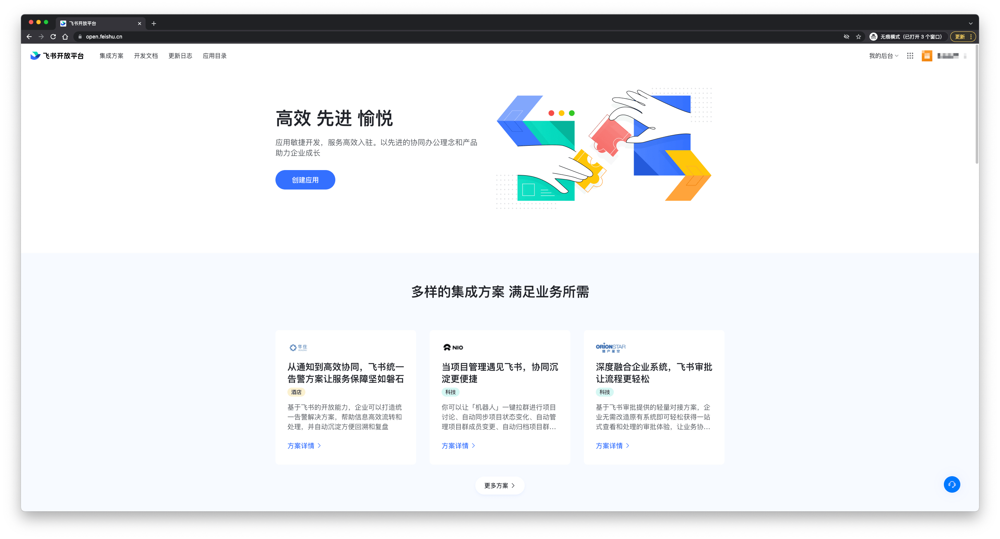

 

2. 创建一个**企业自建应用**。

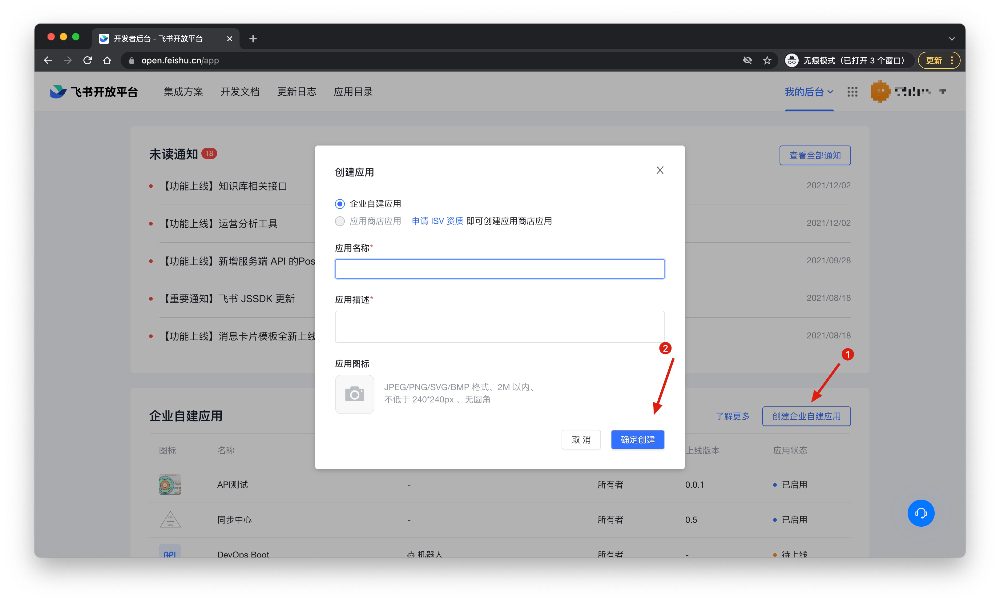

 

3. 获取 App ID、App Secret、Encrypt Key(实时同步必填) 和 Verification Token(实时同步必填)。

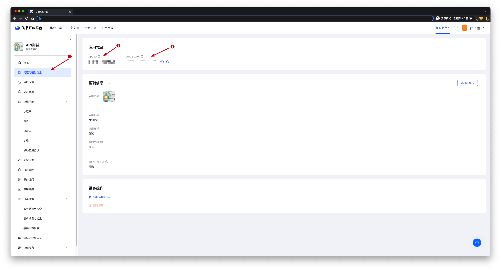

 

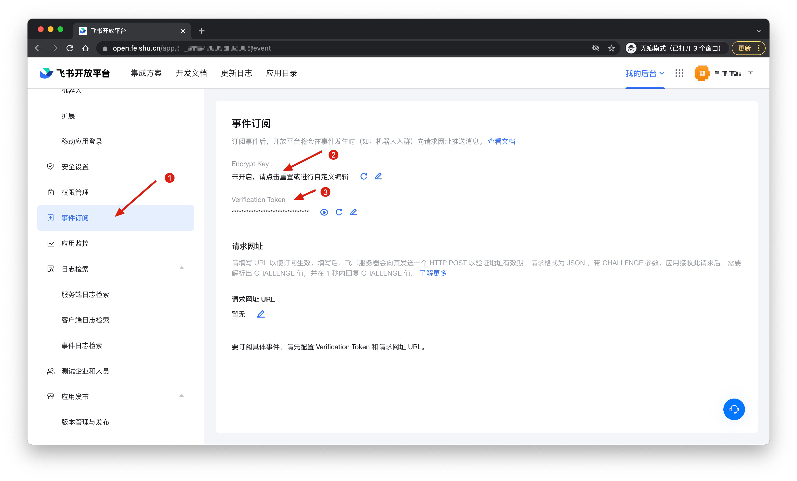

 

4. 如果不需要实时同步，将 App ID 和 App Secret 填入 Authing 并点击保存，然后进入**步骤5**。
   如果需要进行**实时同步**，则必须提供 Encrypt Key 和 Verification Token。
   将所有参数填入 Authing 之后，点击**保存**。然后**重新进入**配置详情页，Authing 会自动生成一个回调地址，该地址用于接收飞书事件。因此需要将该地址填入飞书「事件订阅」页面的「请求网址」中，并添加需要监听的事件。
   你需要勾选以下事件：

- 用户状态变更；
- 部门新建；
- 部门被删除；
- 部门信息变化；
- 通讯录范围权限被更新；
- 员工入职；
- 员工离职；
- 员工信息变化；
- 用户组被创建；
- 用户组被删除；
- 用户组信息变化；

 

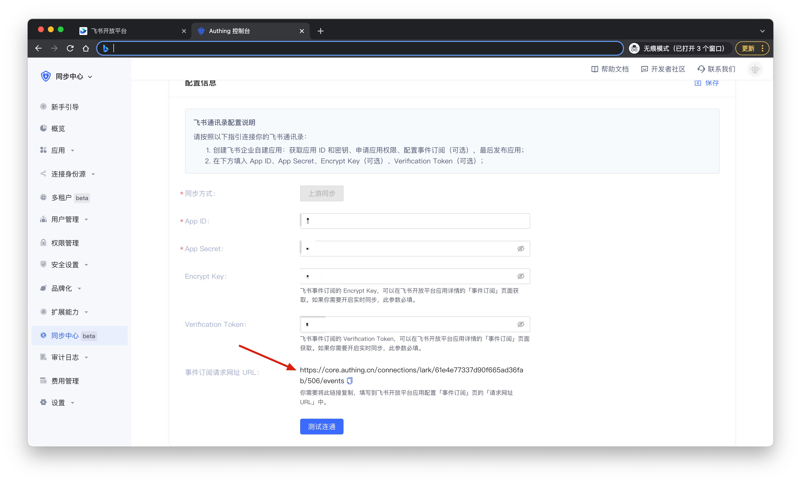
 
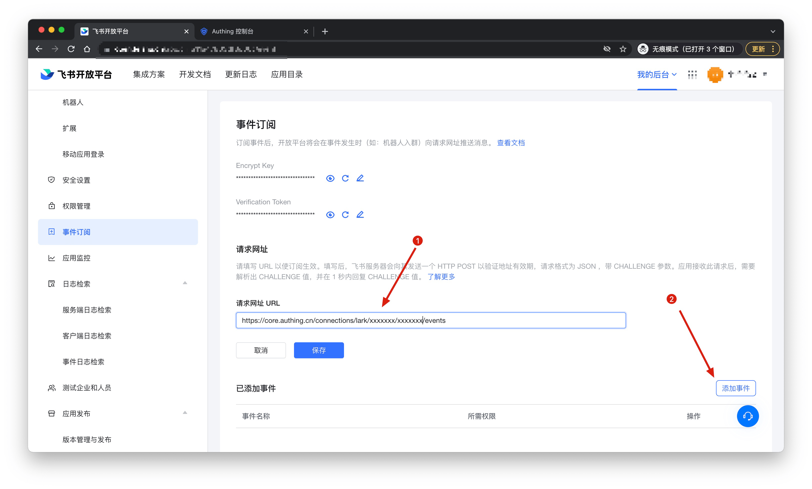

 

5. 在飞书应用详情的**权限管理**页面，选择该应用所需的权限，如：

- 获取用户邮箱；
- 获取用户手机号；
- 获取用户 userid；
- 通过手机号或者邮箱获取用户 ID；
- 获取用户基本信息；
- 获取用户统一 ID；
- 以应用身份访问通讯录；

设置**权限范围**为全部成员

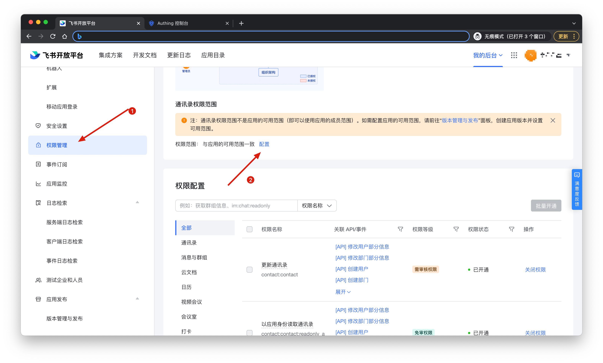

 

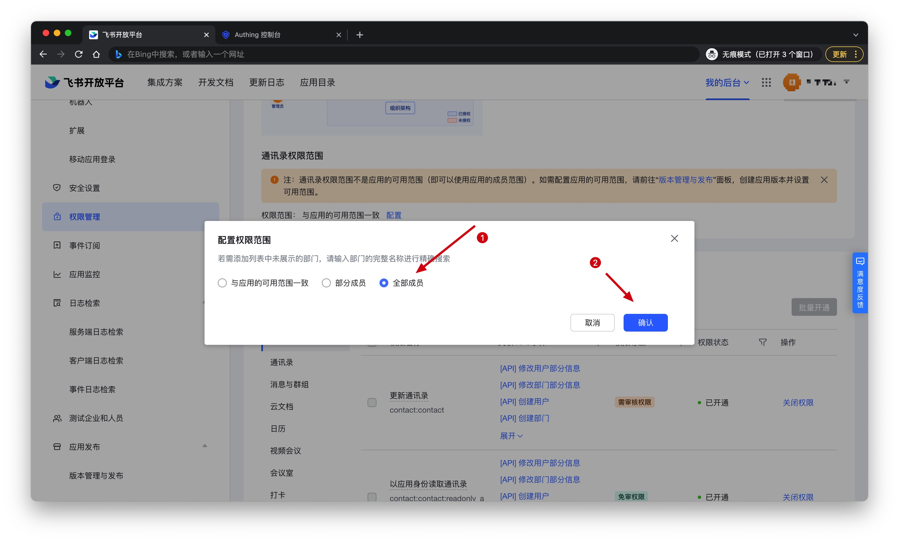

设置权限之后，如果有**需审核权限**，你需要发布最新版本。**免审权限**开通即生效，无需发布版本。

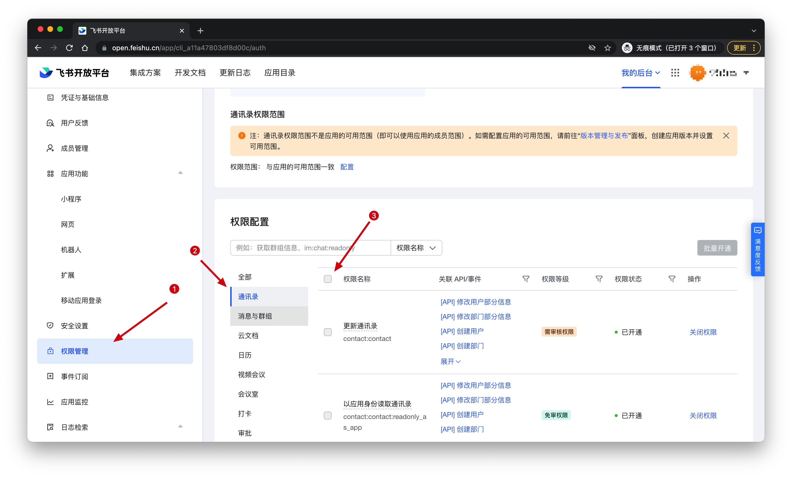

 

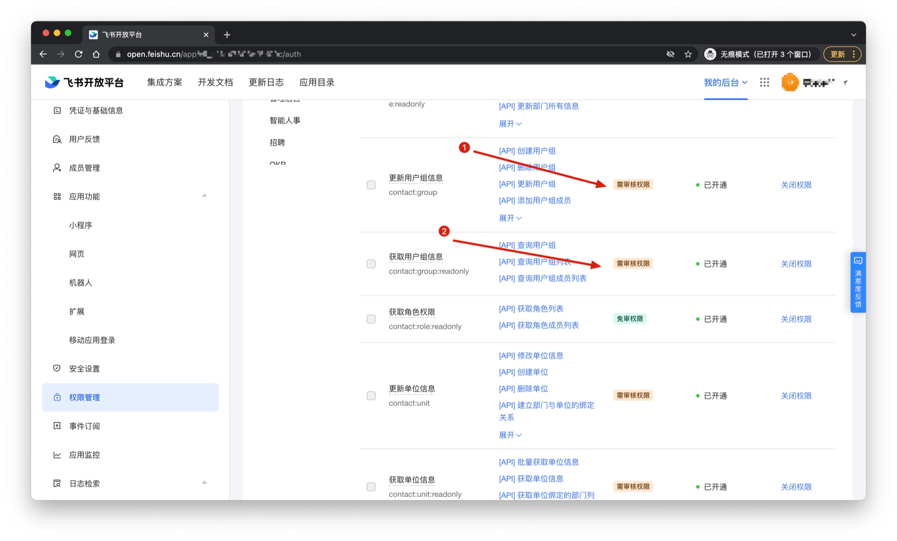

 

创建新版本时，注意**可用范围**选择**所有员工**和通讯录权限保持一致。

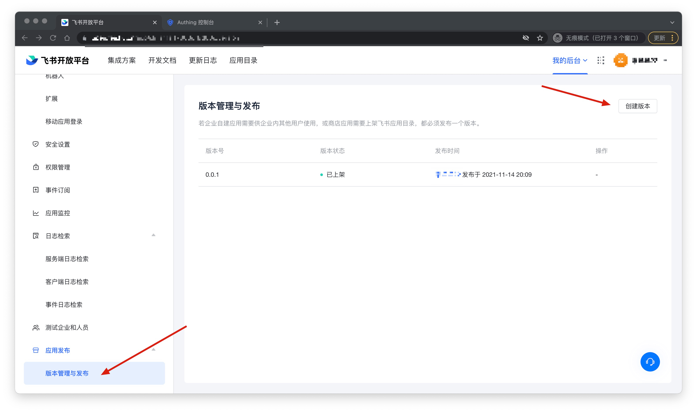

 

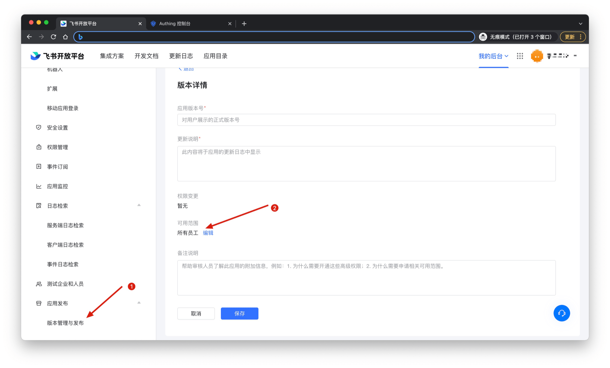
