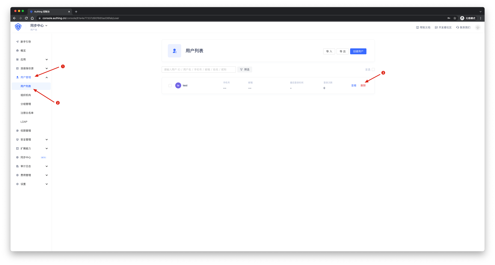
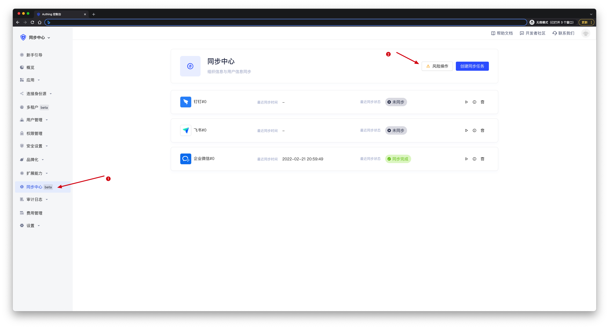
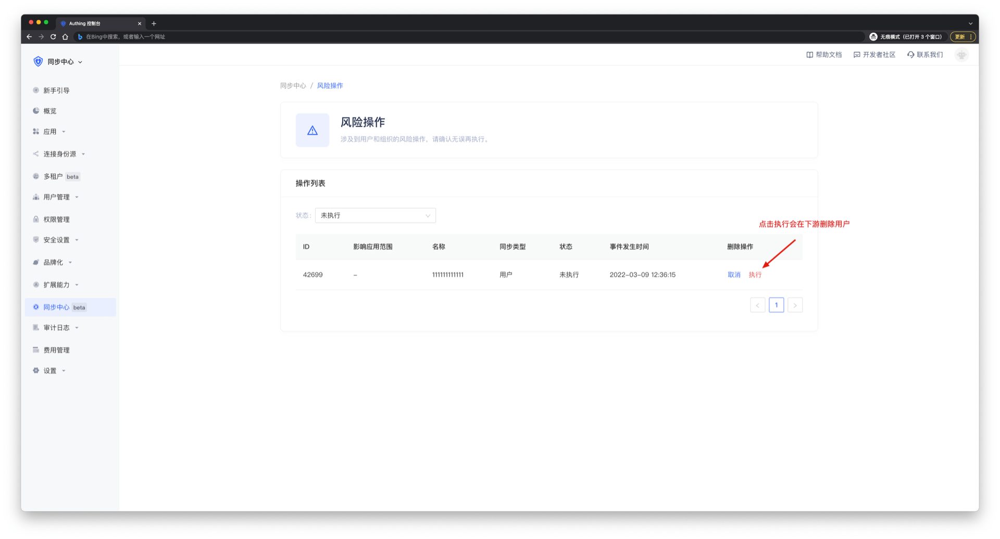

# 处理删除保护

<LastUpdated/>

Authing 认为，删除操作可能由于人为因素或系统因素等造成管理风险，因此将删除操作视为 **删除保护**。
在进行下游同步过程中，在 Authing 控制台用户管理页面删除一个 **用户** 或 **部门** 时，需要在同步中心的 **删除保护** 页面进行 **二次确认**。**手动同步、定时同步、实时同步** 都 **必须** 这样做。

## 删除用户

进入用户管理页面，选中一个用户，点击 **删除**。

 

在 **控制台** 进入同步中心的 **删除保护** 页面。

 

点击 **执行**。

 

这样一个删除操作就完成了。

## 删除部门

删除部门操作同上。

::: hint-info
如果部门中 **存在用户**，可能导致下游删除部门 **失败**。
:::

