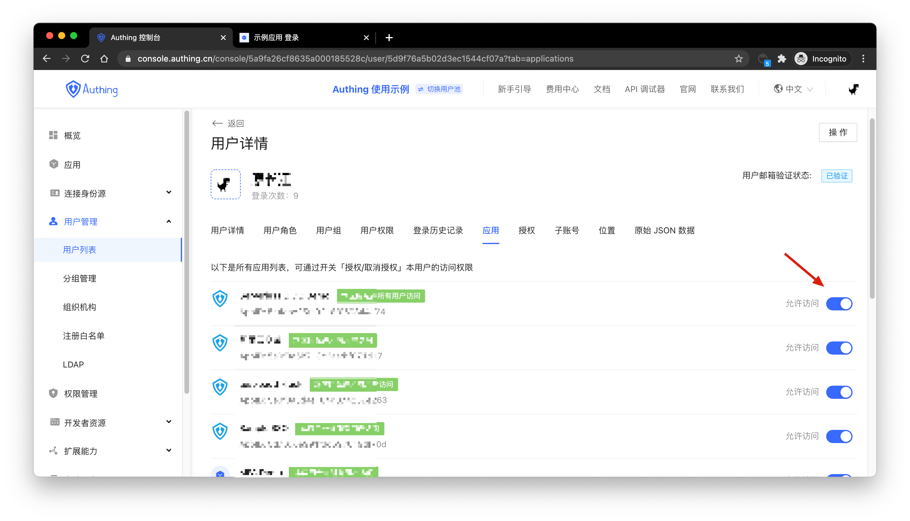

# Control Which Apps Users can Access

<LastUpdated/>

You can check all the applications that the user can currently access in the **application** menu of the **user details**:

You can control whether the user can access an application by enabling or disabling the access button.
