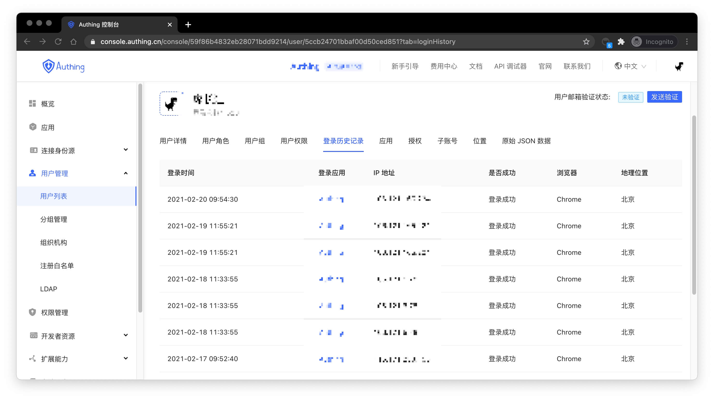

---
meta:
  - name: description
    content: Check user's login history
---

# Check user's login history

<LastUpdated/>

You can check the user's login history record in the **users details** page.

You can check the login time, login application, IP address, whether login is successful or not, browser, geographic location and other information.
