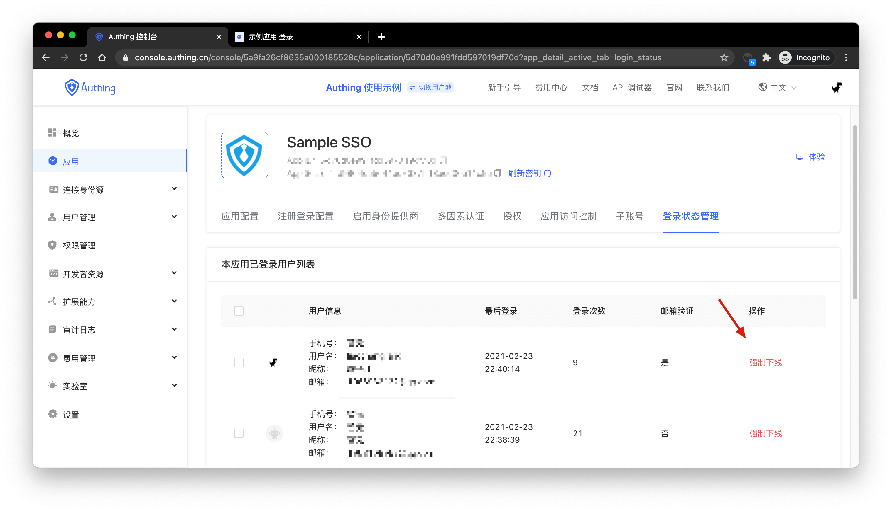
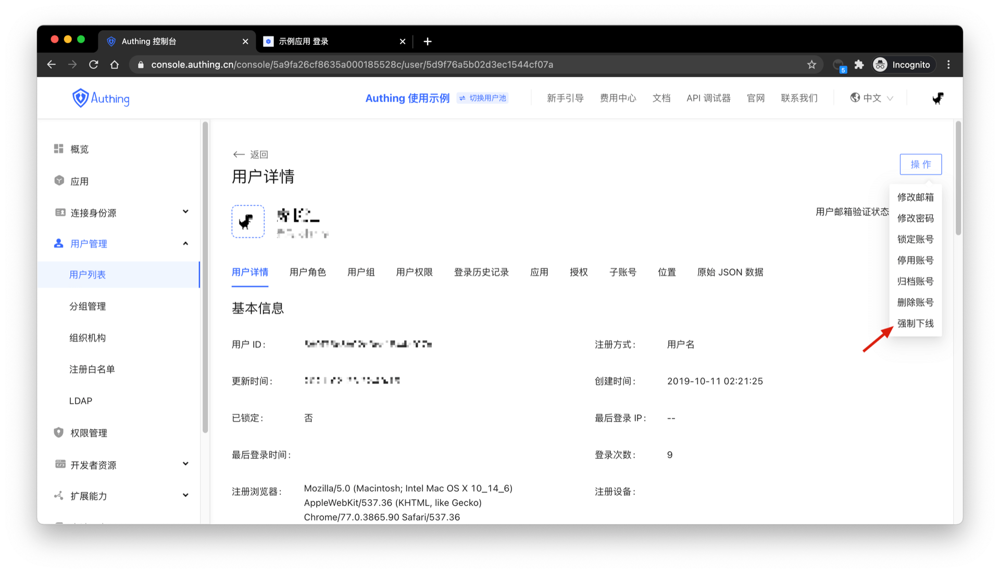

# Manage User Login Status

<LastUpdated/>

You can check all the users who are currently online in the application and their last login time in the **login status management** of the **application details**, and click Force offline to log the user out of the application.

You can also click **Force offline** in the upper right corner of the **user details**, this operation will make the user log out of all applications in the user pool.

