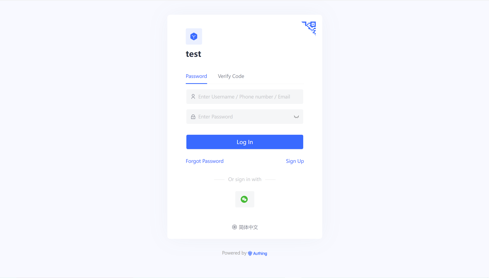
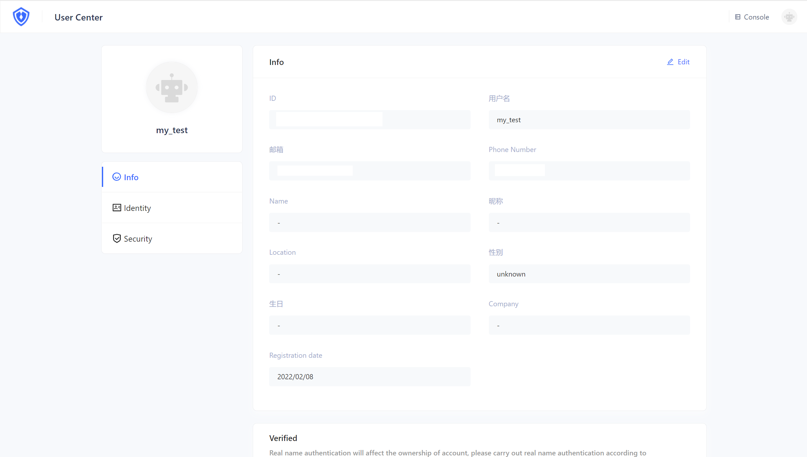
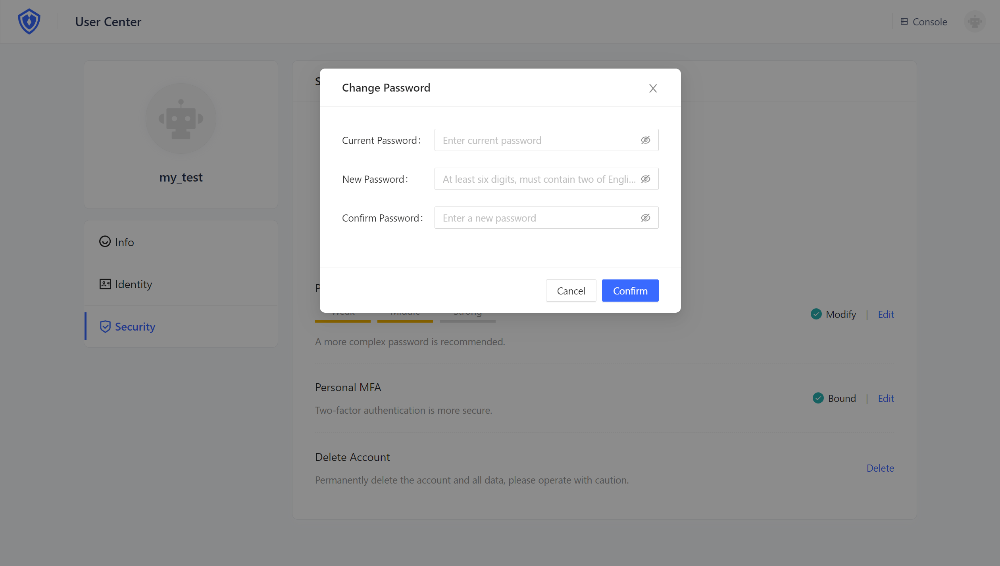
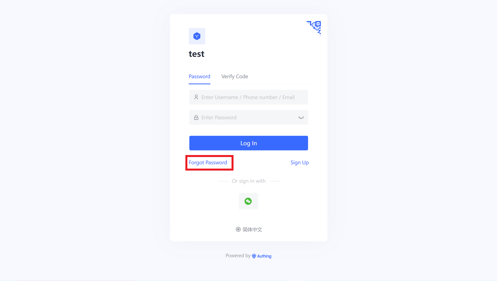
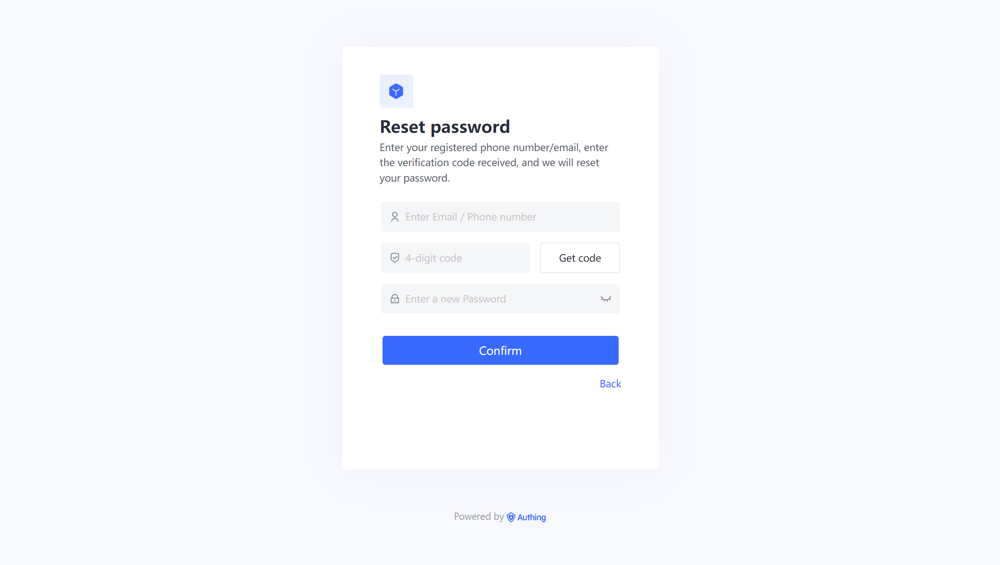
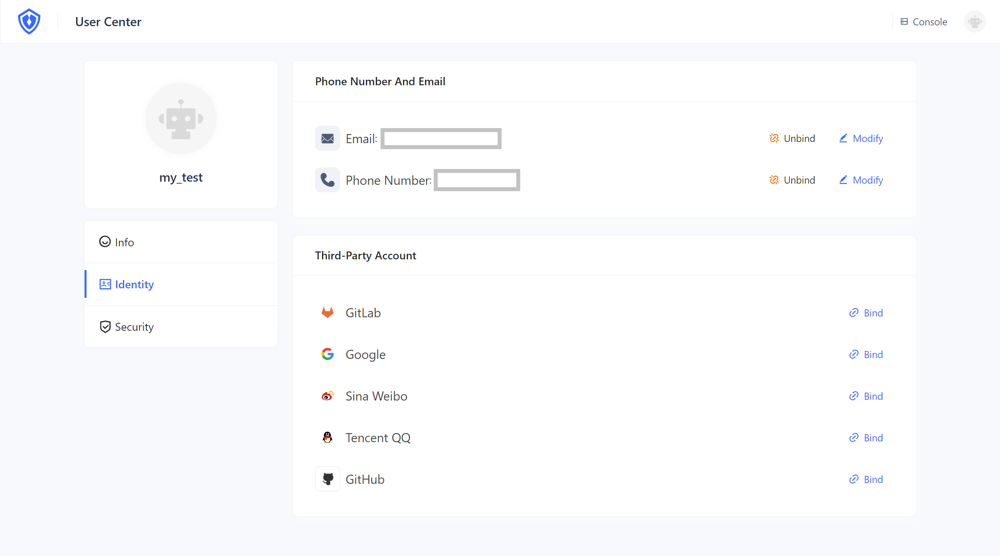
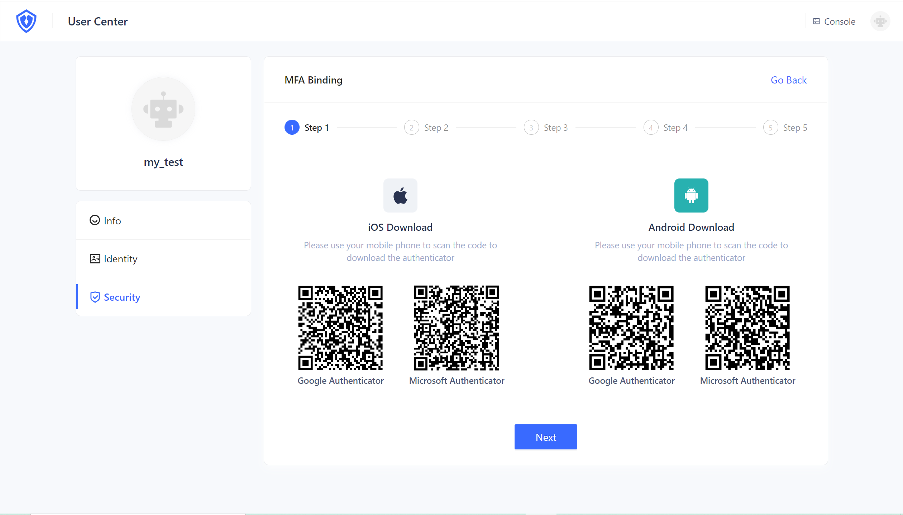
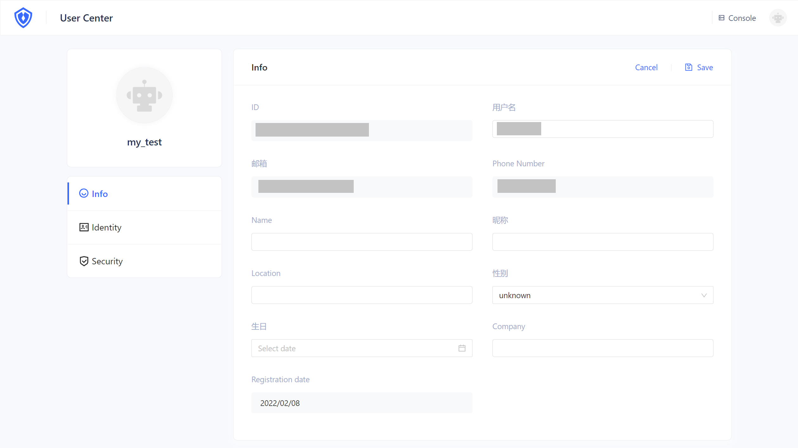
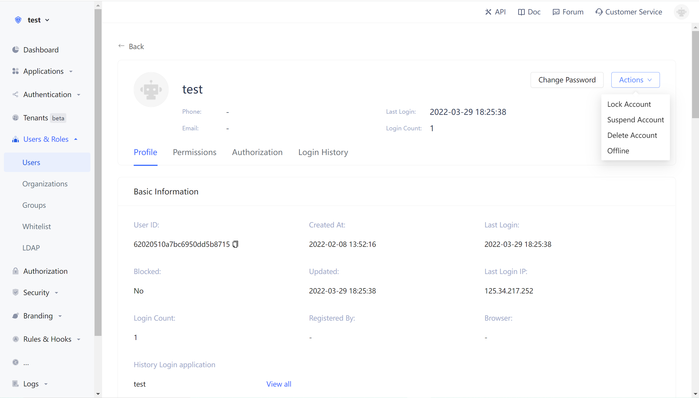
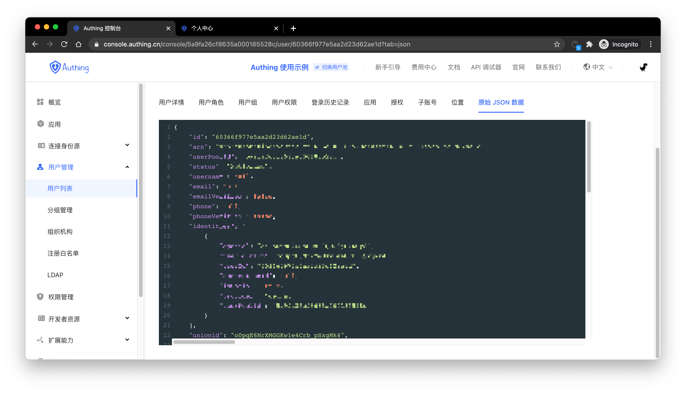

---
meta:
  - name: description
    content: Manage user accounts
---

# Manage User Accounts

Managing user accounts includes completed procedures such as forgetting passwords, verifying email addresses, modifying the bound phone number and email address, multi-factor authentication, disabling user accounts, binding social login, and account merging. If you use Authing, congratulations, these are all built-in functions in Authing, and you only need to spend a very short time to finish them.

## Use Online Login Page and Personal Center

Authing provides developers with a built-in, comprehensive, beautiful, and highly configurable login form. You can feel it by [clicking here](https://sample-sso.authing.cn/) (we will call this login form as `Guard` in the following paragraphs), the address is `https://< YOUR_DOMAIN>.authing.cn/`:

You can have functions such as login and register, forgotten password, reset your email, send SMS verification code, scan code to log in.

There will be a user personal center, you can feel it by clicking [here](https://sample-sso.authing.cn/u), the address is `https://<YOUR_DOMAIN>.authing.cn/u`:

With the help of the hosted login page and personal center, users can complete personal information management by themselves.

### Modify Account Information

Authing provides a built-in user personal center page (address: `https://<YOUR_DOMAIN>.authing.cn/u`), which can modify the basic user information:

### Modify Passwords

When users remember the current password, he/she can modify the password by verifying the current password:

### Forgotten Passwords

When the user forgets the current password, the password can be reset through the following process:

Click forgottten password

You can choose to use your email or phone number for verification:

### Bind Email

End users can bind and unbind mailboxes in the **account binding** tab of the personal center:

### Bind Phone Number

End users can bind and unbind their phone numbers in the **account binding** tab of the personal center:

### Bind MFA

End users can bind MFA in the **MFA binding** tab of the personal center:

## Use Console

Administrators can use the console to manage user accounts visually.

### Edit user profile

### Disable Account

The administrator can disable the account on the user details page, and the disabled account will not be able to log in again:

### View Original User's Information

## Use SDK/API

Authing provides Authentication SDK/API and Management SDK/API. You can use Authentication API and complete user self-service personal account information management and use Management SDK/API to manage user information as an administrator. Operations performed by an administrator are no need to perform verification methods such as phone number verification code, email verification code, and MFA.

!!!include(en/common/sdk-list.md)!!!
