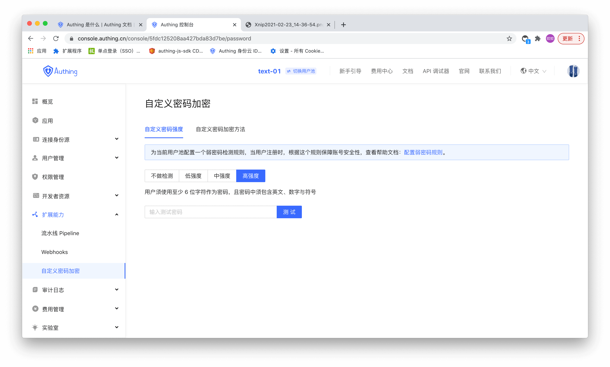
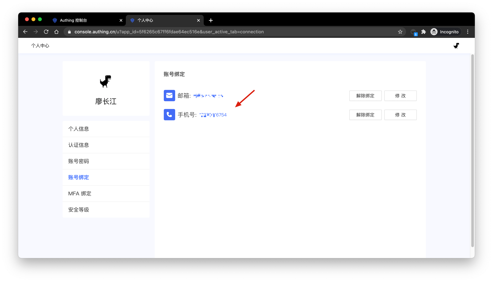
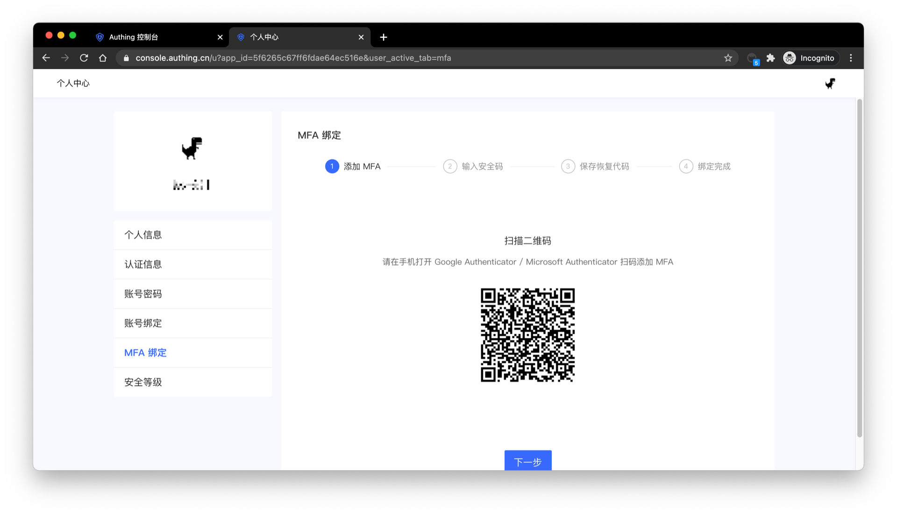

# Enhance Account Security

The security of user accounts is very important. You can enhance the security of user accounts in the following ways.

## Configure Stronger Password

You can configure the password strength on the Extended Capabilities -> Custom Password Encryption page. After the strength is turned on, the system will require all users' password must meet a certain level of complexity when they register and modify their passwords.

A high-security password can make the account more secure. And it is recommended that users change their passwords regularly.

## Bind Phone Number

After the phone number is bound, you can use the phone number verification code to log in and no need to enter the password again, which is more secure and convenient. End users can bind their phone numbers in the personal center of application (address: `https://<YOUR_APP_DOMAIN>.authing.cn/u`), or you can use the [SDK](/en/reference/sdk-for-node/authentication/AuthenticationClient.md) to operate.

## Bind Personal MFA

After binding the personal MFA, the user needs to perform a second verification when logging in, which can protect the user's account security more effectively. End users can bind their phone numbers in the personal center of application (address: `https://<YOUR_APP_DOMAIN>.authing.cn/u`), or you can use the [SDK](/en/reference/sdk-for-node/authentication/MfaAuthenticationClient.md) to operate.

