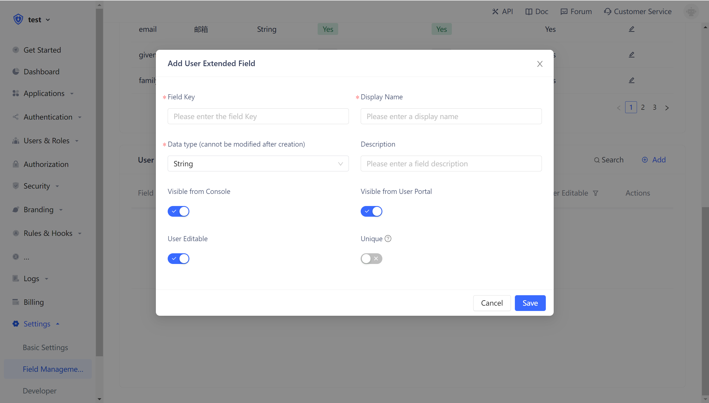
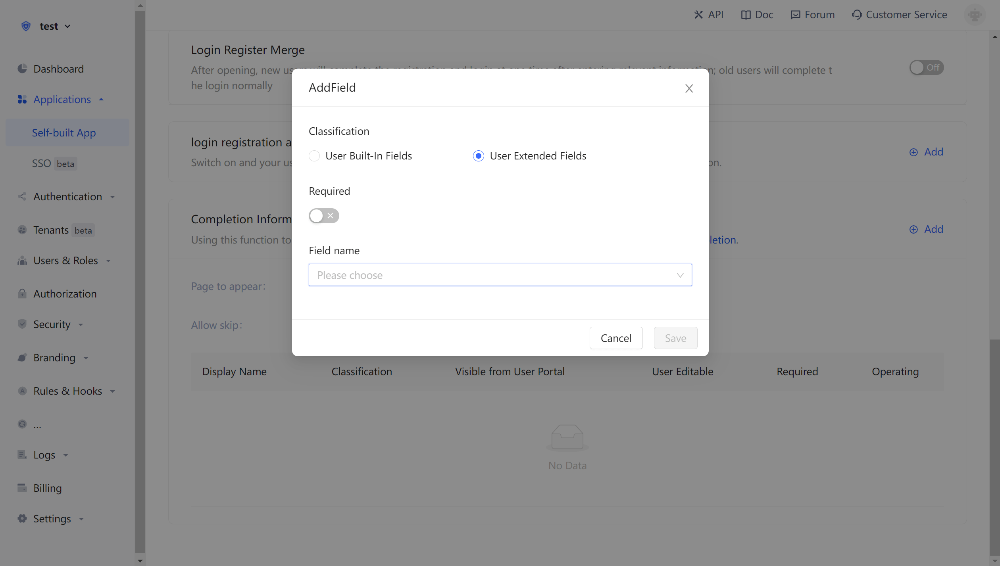
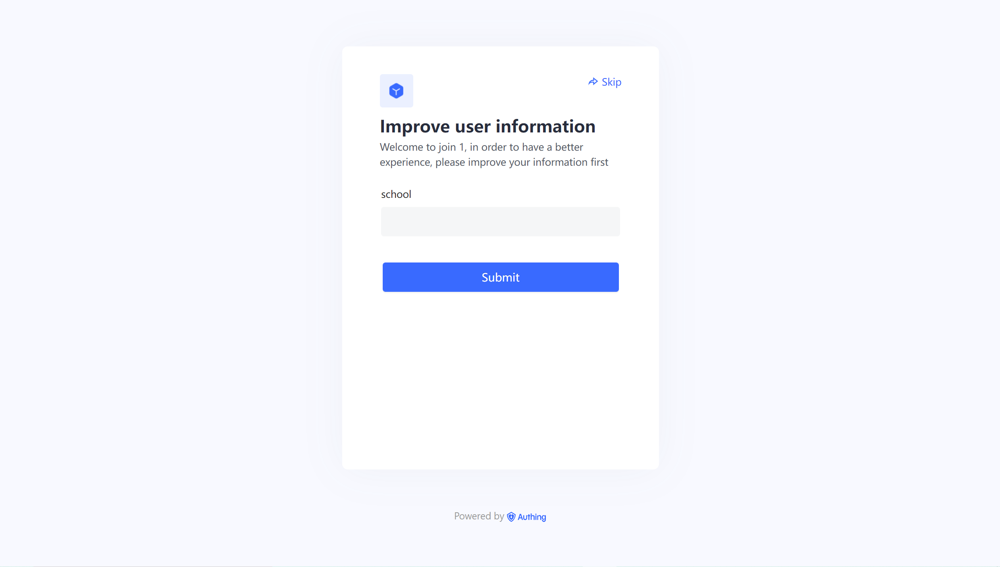

# Manage user-defined fields

<LastUpdated/>

User-defined fields are additional fields that can be added to user objects in addition to the [basic user fields](/guides/user/user-profile.md). Developers can store **a small amount of** business-related data by setting custom fields.

## Configure user-defined fields

You can define the following types of custom fields:

- String;
- Number;
- Date;
- Boolean value;
- Object;

You can configure user-defined fields on the **Settings** -> **Extended Fields** page:

## Open registration information completion

After configuring the custom fields, you can open the registration information completion page of the application to allow users to complete the information in these custom fields.

On the **application details** -> **login registration configuration** page, tick **enable registration information completion**, and then select the custom field just added:

The type of input can be chosen as text, password, number, date, color, Email and picture, which will determine the final display style of the page.

Click Save, and then visit the login page of the app.

After the user clicks to register, it will be redirected to the following registration information completion page:

After the user has successfully registered, you can see the custom value that the user just entered on the user details page:

## Use API & SDK to manage user-defined data

!!!include(en/common/sdk-list.md)!!!

<StackSelector snippet="udf" selectLabel="Language" :order="['java', 'javascript', 'python', 'csharp', 'swift']"/>
