# 用户分组

<LastUpdated/>

进行一组用户的增删改查、分配授权等操作。

## 1.创建分组

导航栏中找到用户管理点击对应菜单进入到用户分组页面

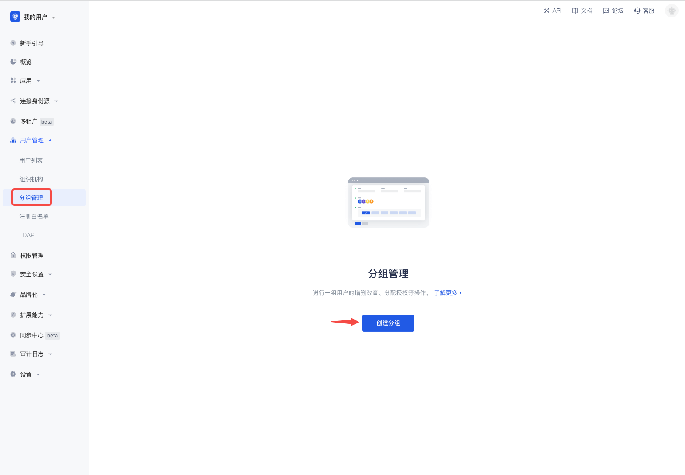

## 2.填写分组信息

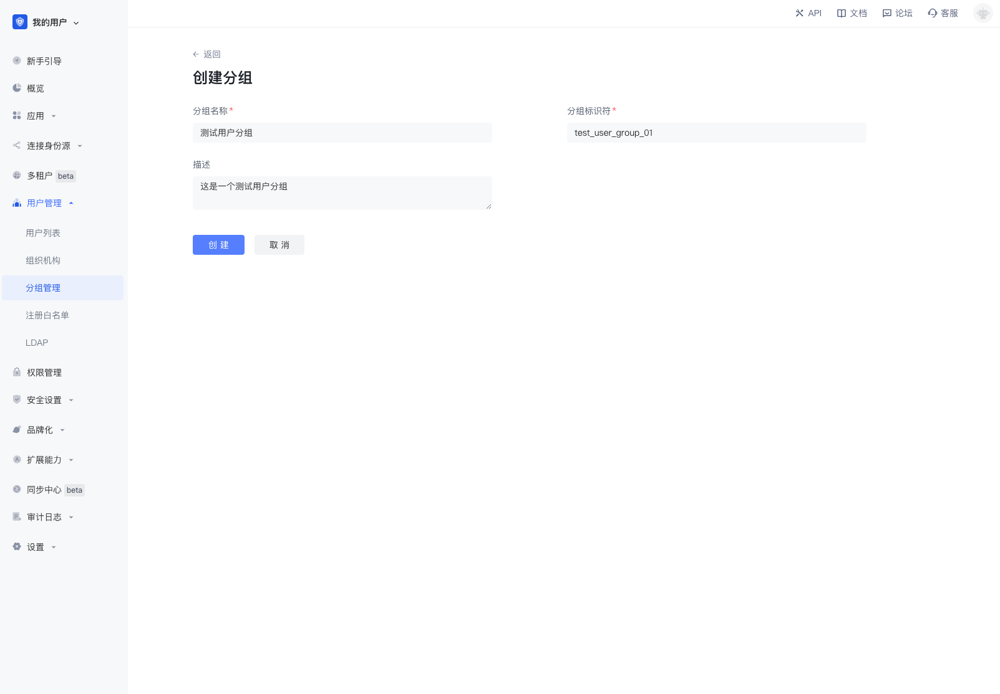

## 3.分组列表

## 4.分组详情

点击添加成员

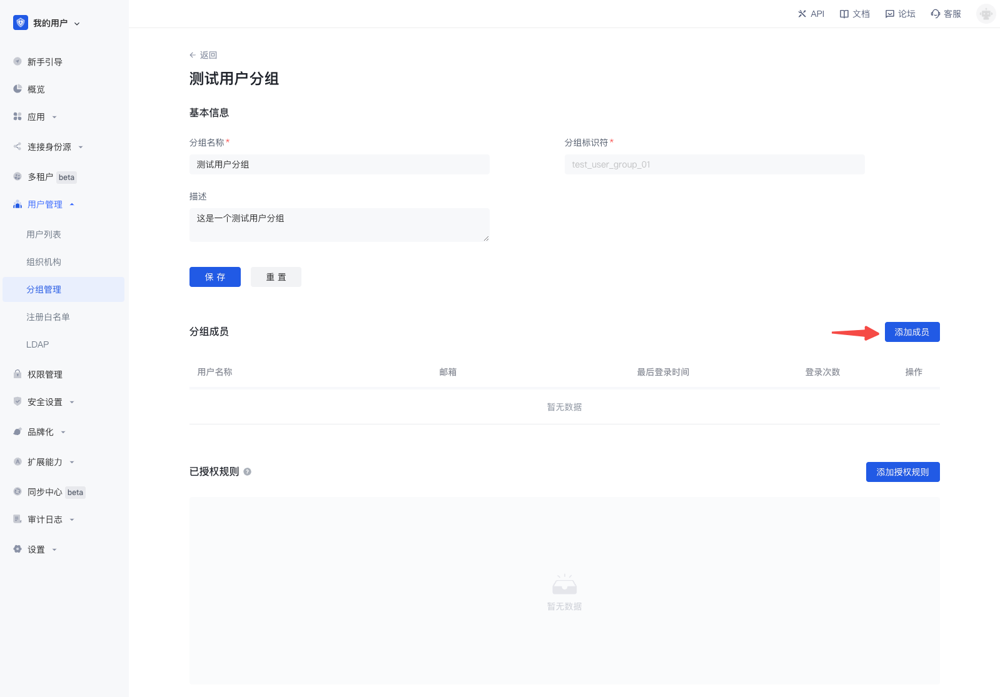

从弹窗组件中选择成员或搜索成员

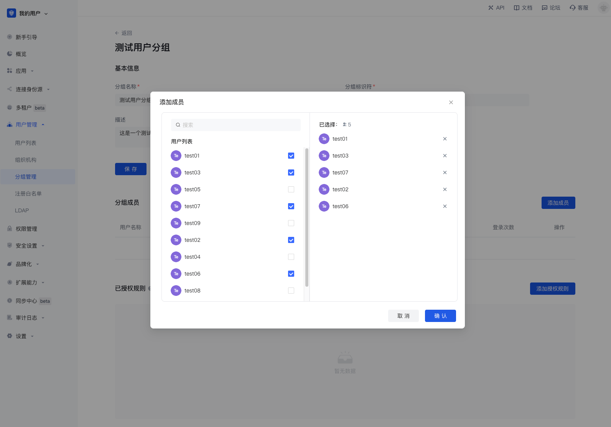

点击确认后添加成功

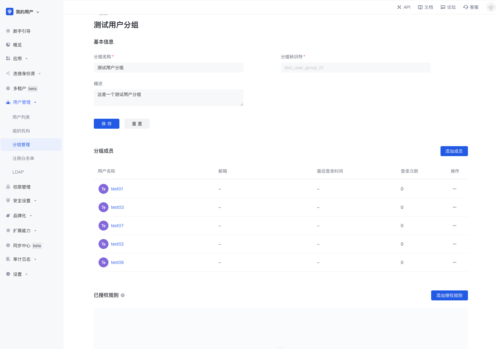

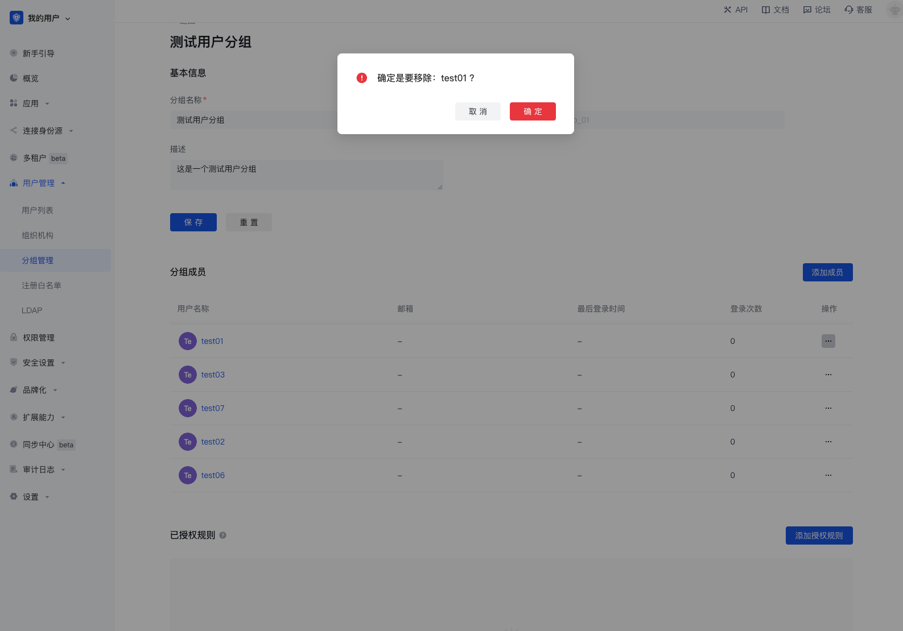

## 5.分配权限

### 5.1 点击添加授权规则

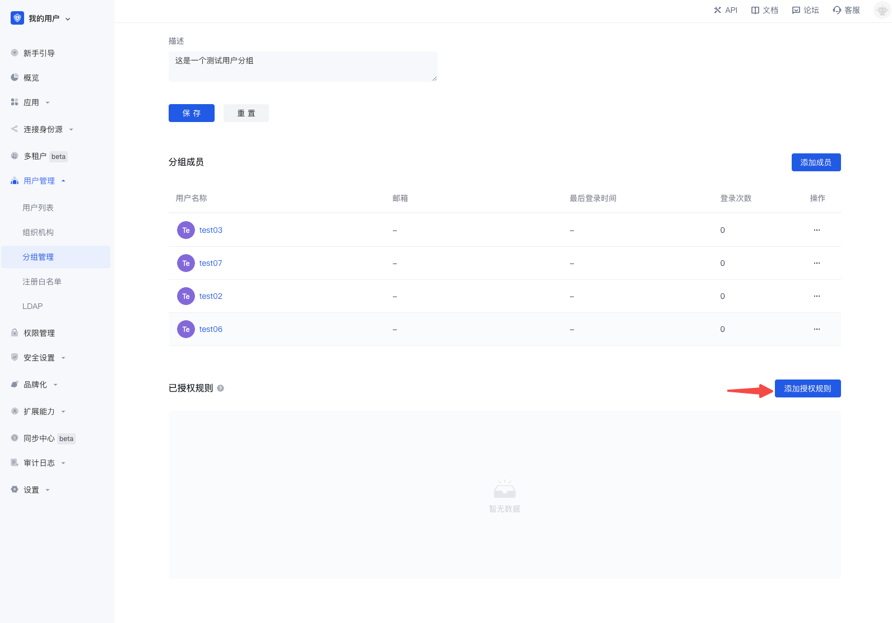

### 5.2 在授权组件中选择资源分组和资源

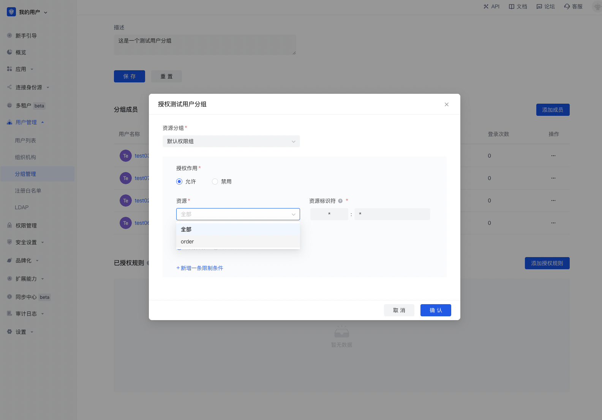

### 5.3 选择特定操作

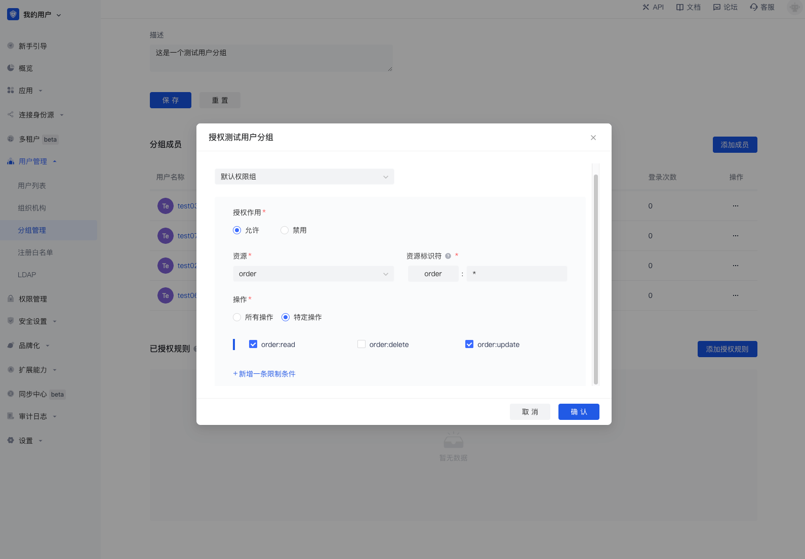

### 5.4 添加限制条件

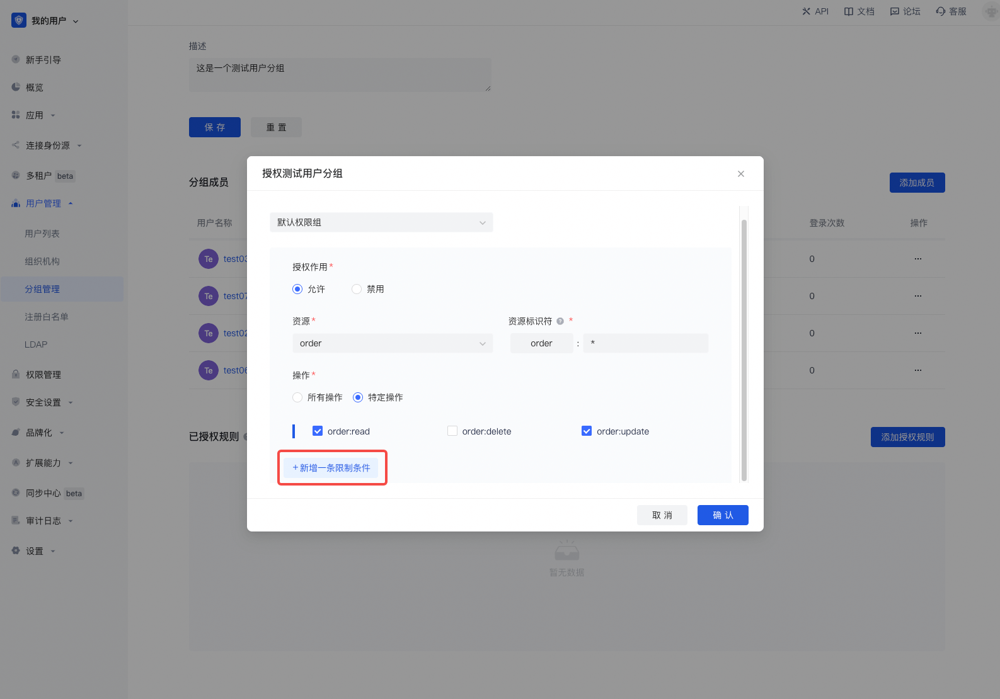

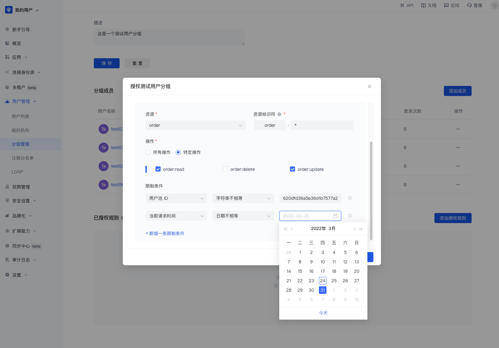

### 5.5 授权成功

### 5.6 取消授权

