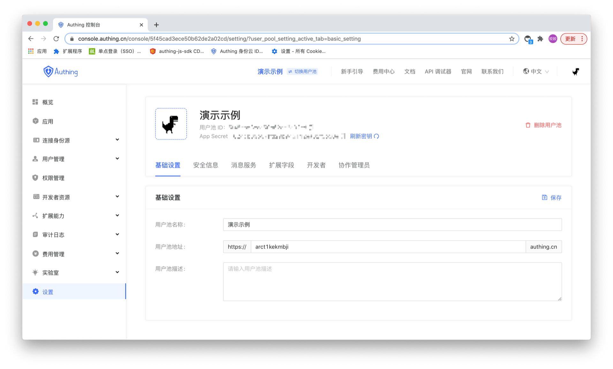

# Configure User Pool Basic Information
Basic user pool settings include: user pool name, user pool address, and user pool description.
Users can modify the user pool information in Settings -> Basic Settings.

