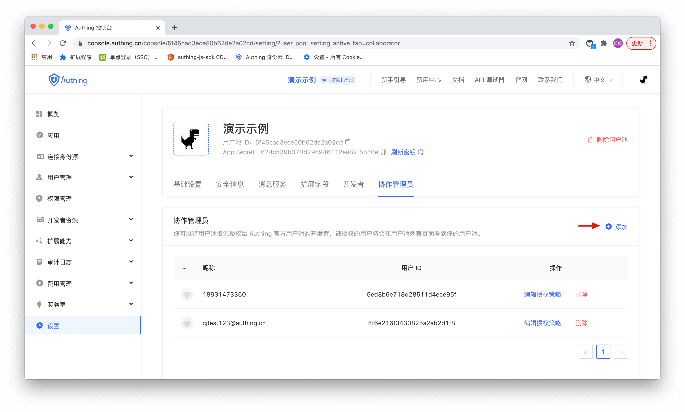
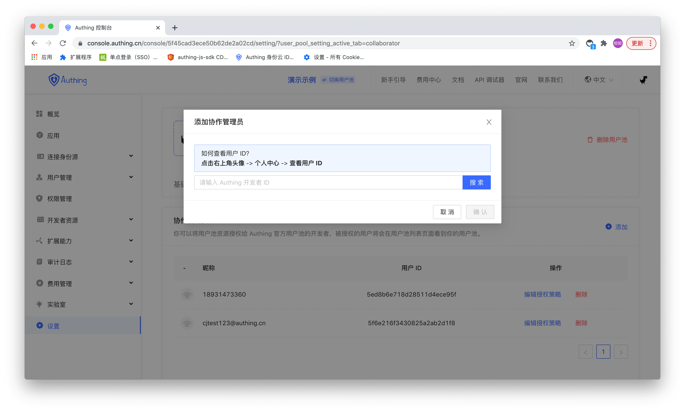

# Add User Pool Collaboration Administrator
You can authorize user pool resources to the developers of Approw official user pool, and authorized users will see your user pool on the user pool list page.
Go to the Settings -> Collaboration Administrator page, click the Add button, and enter the user ID of the collaboration administrator.

