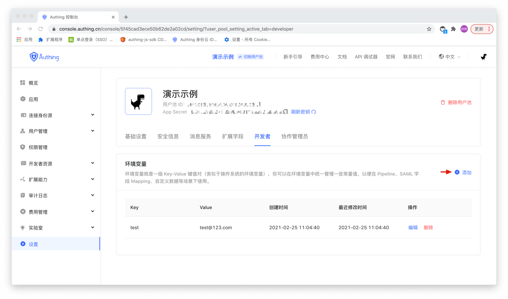

# Developer configuration

Developers can configure environment variables. Environment variables are a set of Key-Value key-value pairs (similar to operating system environment variables). You can configure some constant values in environment variables to facilitate the scinaro of Pipeline, mapping SAML fields and user-defined data.
Go to **Settings -> Developer** page and click the Add button to add environment variables.

