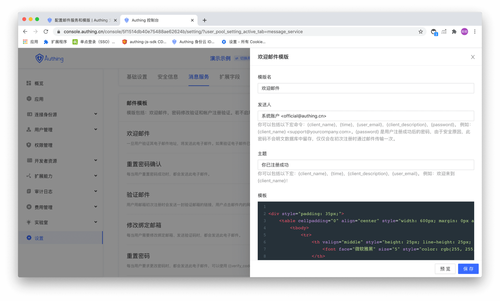

# Configure Mail Services and Templates

<LastUpdated/>

Mail service is provided for users which registered with "Email". After entering any application, click on the button as shown in the figure below to enter the mail management panel:


## Manage email templates

There are six types of email templates that can be configured in the email template:

1. Welcome Email-this email will be sent if the user registers with the email;
2. Reset password confirmation-This email will be sent whenever the user resets the password successfully.；
3. Verification email-The user will send a verification email to the user to verify the email when registering with the email, and the user can click the link in the email to complete the verification;
4. Change the binding email address-this email will be sent whenever the user needs to modify the binding email address and send a verification code;
5. Reset Password-The system will send this password reset email whenever the user forgets the password, with a verification code attached to the email, and the user will be able to reset the password after submitting the verification code and new password;
6. Change of password-This email will be sent whenever the user requests to change the password. A verification code is attached to the email, and the user needs to fill in this verification code to complete the password modification.
   As shown below:



### Mail Variables

Mail variables are used to generate some dynamic content, such as:

```html
<div style="padding: 35px;">
  <table
    cellpadding="0"
    align="center"
    style="width: 600px; margin: 0px auto; text-align: left; position: relative; border-top-left-radius: 5px; border-top-right-radius: 5px; border-bottom-right-radius: 5px; border-bottom-left-radius: 5px; font-size: 14px; font-family:微软雅黑, 黑体; line-height: 1.5; box-shadow: rgb(153, 153, 153) 0px 0px 5px; border-collapse: collapse; background-position: initial initial; background-repeat: initial initial;background:#fff;"
  >
    <tbody>
      <tr>
        <th
          valign="middle"
          style="height: 25px; line-height: 25px; padding: 15px 35px; border-bottom-color: rgba(18, 24, 37, 0.87); background-color: #484f60; border-bottom-color: #C46200; background-color: #484f60; border-top-left-radius: 5px; border-top-right-radius: 5px; border-bottom-right-radius: 0px; border-bottom-left-radius: 0px;"
        >
          <font face="微软雅黑" size="5" style="color: rgb(255, 255, 255); "
            >{{client_name}}
          </font>
        </th>
      </tr>
      <tr>
        <td>
          <div style="padding:25px 35px 40px; background-color:#fff;">
            <h2 style="margin: 5px 0px; ">
              <font color="#333333" style="line-height: 20px; "
                ><font style="line-height: 22px; " size="4"
                  >你好，{{user_email}}</font
                ></font
              >
            </h2>
            <p>欢迎加入 {{client_name}}</p>
            <p>
              {{client_description}}
            </p>
            <p align="right">{{client_name}} 团队</p>
            <p align="right">{{time}}</p>
          </div>
        </td>
      </tr>
    </tbody>
  </table>
</div>
```

This in the message{{CLIENT_NAME}},{{client_description}},{{Time}},{{user_email}} are variable to be parsed, this message will be translated by Authing as the following:


All currently supported variables are shown in the following table:
| Macro command | 作用 |
| :----------------------------------------------------- | :------------------------------------------ |
| <span v-pre>{{client_name}}</span> | The name of the Authing application created |
| <span v-pre>{{time}}</span> | current time |
| <span v-pre>{{user_email}}</span> | Email of current registered user |
| <span v-pre>{{client_description}}</span> | Description of the created Authing application |
| <span v-pre>{{verify_link}}</span> | Verify the verification link in the email (generated by Authing) |
| <span v-pre>{{verify_code}}</span> | The verification code sent before resetting the password |

## Configure third-party mail services

Our built-in mail sending server uses Alibaba Cloud Enterprise Mailbox. If you want to customize the mail server, you can set it up on this page:

Choose mail service providerAli Mail Enterprise Edition

You canconfigure Ali Mail Enterprise Edition in the settings - Message Service

<StackSelector snippet="config-email-provider" selectLabel="Select Mail Provider" :order="['mxhichina', 'exmail', 'sendgrid', 'smtp']"/>
