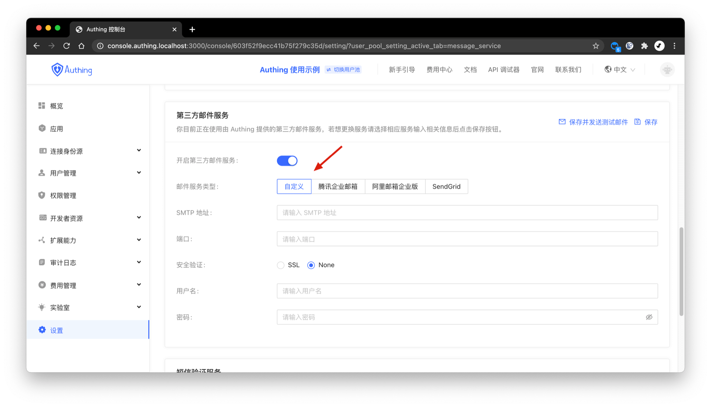

你可以在控制台的**设置**-**消息服务**配置[SMTP 邮件服务](https://en.wikipedia.org/wiki/Simple_Mail_Transfer_Protocol)：

你需要填入以下信息：

- SMTP 地址: SMTP 服务器地址，请联系你的邮件服务器管理员获取；
- 端口: SMTP 服务器端口，请联系你的邮件服务器管理员获取；
- 安全验证: 选择是否启用 SSL；
- 用户名: SMTP 发件人邮箱；
- 密码: SMTP 发件人邮箱密码；

