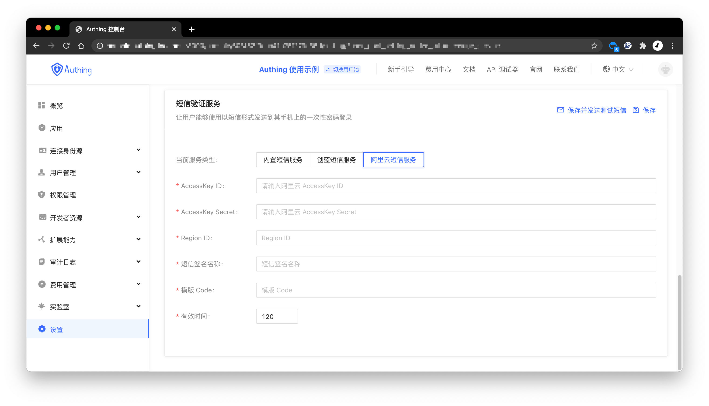

你可以在控制台的**设置**-**消息服务**配置[阿里云短信服务](https://dysms.console.aliyun.com/)：

> 阿里云短信服务官方文档请见：[阿里云短信服务：API 参考](https://help.aliyun.com/document_detail/101300.html)

- AccessKey ID, AccessKey Secret: 这是你访问阿里云 API 的密钥，你需要在 **RAM 访问控制**中创建一个 AccessKey，并确保其具备使用阿里云短信服务 API 的权限；
- Region ID: 短信 API 的 RegionID，填 `cn-hangzhou`；
- 短信签名名称: 短信签名名称。请在控制台国内消息或国际/港澳台消息页面中的签名管理页签下签名名称一列查看；
- 模版 Code: 短信模板 ID。请在控制台国内消息或国际/港澳台消息页面中的模板管理页签下模板CODE一列查看；
- 有效时间: 短信验证码有效时间。

配置好之后，你可以点击左上角的 **保存并发送测试短信** 进行测试。
