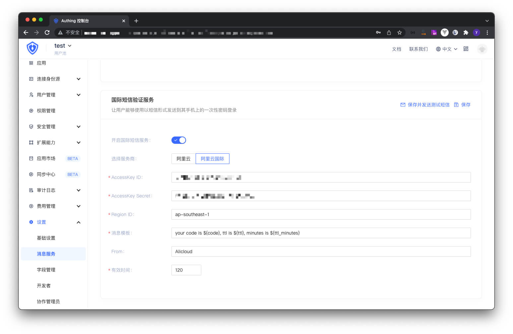

你可以在控制台的**设置**-**消息服务**配置[阿里云国际短信服务](https://sms-intl.console.aliyun.com/)：

> 阿里云国际短信服务官方文档请见：[阿里云国际-国际短信：API 参考](https://www.alibabacloud.com/help/zh/doc-detail/162279.htm)

- AccessKey ID, AccessKey Secret: 这是你访问阿里云 API 的密钥，你需要在 **RAM 访问控制**中创建一个 AccessKey，并确保其具备使用阿里云短信服务 API 的权限；
- Region ID: 短信 API 的 RegionID，填 `ap-southeast-1`；
- 消息模版: 短信模板。自定义发送短信模版。当前支持变量 验证码: ${code} 、有效时间（秒）: ${ttl} 、有效时间（分）: ${ttl_minutes}；
- 有效时间: 短信验证码有效时间。例: your code: ${code}. Valid for ${ttl_minutes} minutes. 

配置好之后，你可以点击左上角的 **保存并发送测试短信** 进行测试。
